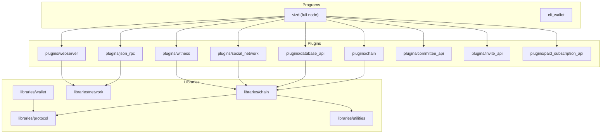
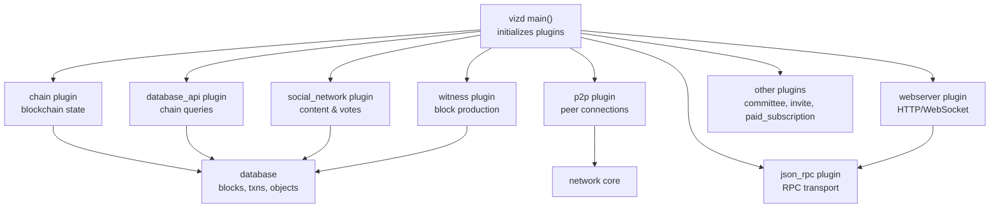
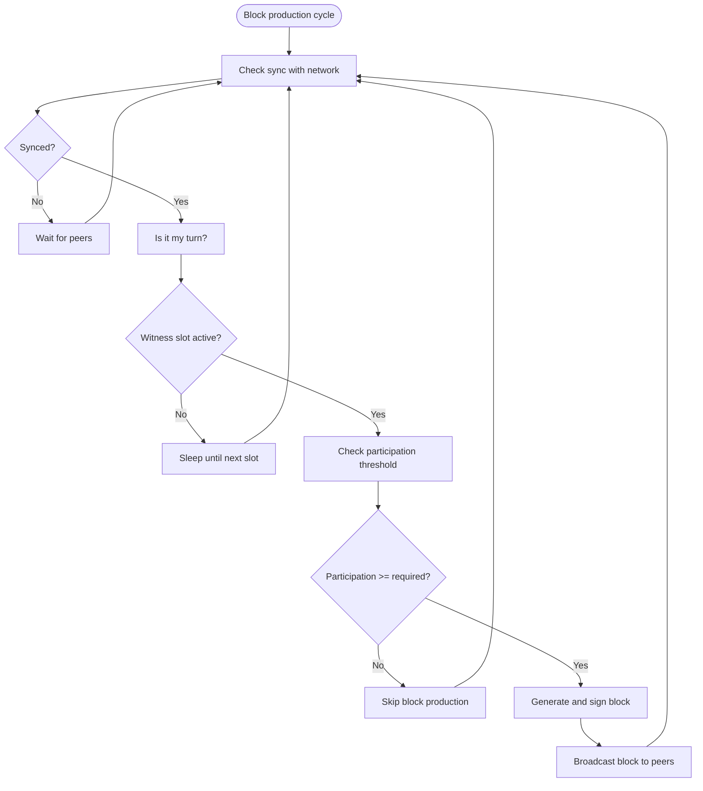
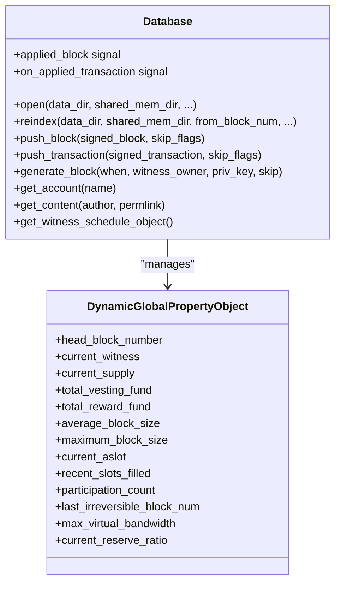
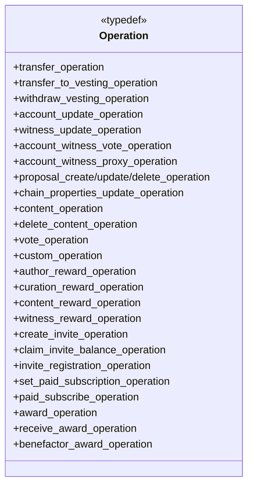
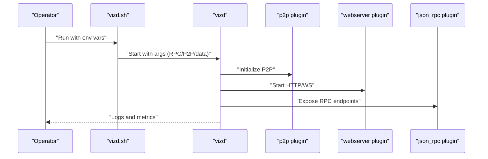
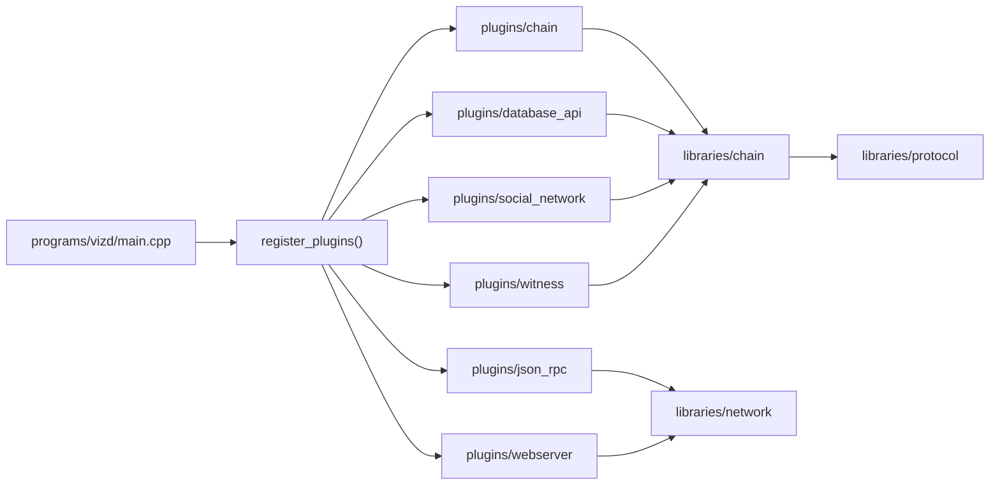

# Project Overview

<cite>
**Referenced Files in This Document**
- [README.md](file://README.md)
- [building.md](file://documentation/building.md)
- [plugin.md](file://documentation/plugin.md)
- [main.cpp](file://programs/vizd/main.cpp)
- [config.ini](file://share/vizd/config/config.ini)
- [config_testnet.ini](file://share/vizd/config/config_testnet.ini)
- [vizd.sh](file://share/vizd/vizd.sh)
- [database.hpp](file://libraries/chain/include/graphene/chain/database.hpp)
- [operations.hpp](file://libraries/protocol/include/graphene/protocol/operations.hpp)
- [witness.hpp](file://plugins/witness/include/graphene/plugins/witness/witness.hpp)
- [social_network.hpp](file://plugins/social_network/include/graphene/plugins/social_network/social_network.hpp)
- [global_property_object.hpp](file://libraries/chain/include/graphene/chain/global_property_object.hpp)
</cite>

## Table of Contents
1. [Introduction](#introduction)
2. [Project Structure](#project-structure)
3. [Core Components](#core-components)
4. [Architecture Overview](#architecture-overview)
5. [Detailed Component Analysis](#detailed-component-analysis)
6. [Dependency Analysis](#dependency-analysis)
7. [Performance Considerations](#performance-considerations)
8. [Troubleshooting Guide](#troubleshooting-guide)
9. [Conclusion](#conclusion)
10. [Appendices](#appendices)

## Introduction
VIZ is a Graphene-based blockchain implementing Fair-DPOS consensus, designed as a full consensus node for the VIZ World platform. It provides a robust, extensible foundation for decentralized applications, social networks, and financial systems with a focus on fairness, transparency, and efficient governance. The project emphasizes:
- Fair-DPOS consensus ensuring equitable witness participation and penalties for missed blocks
- Rich social and content features integrated into the blockchain state
- A modular plugin architecture enabling flexible node configurations for different roles (full node, witness, indexer, etc.)
- Strong developer tooling and operational scripts for building, running, and maintaining nodes

Target audiences:
- Node operators: Run full nodes, seed nodes, and witness nodes with configurable plugins and performance tuning
- Application developers: Build decentralized apps leveraging JSON-RPC APIs and plugin-specific endpoints
- Wallet developers: Integrate with database and chain APIs for account, transaction, and content queries

Key differentiators:
- Fair-DPOS with explicit participation checks and penalties for inactive witnesses
- Integrated social features (content, voting, rewards, invites, subscriptions) in the core chain
- Extensive plugin ecosystem for APIs, indexing, and specialized node roles
- Operational readiness with Docker images, seed nodes, and shell scripts

**Section sources**
- [README.md](file://README.md#L5-L10)
- [building.md](file://documentation/building.md#L1-L20)
- [config.ini](file://share/vizd/config/config.ini#L69-L74)

## Project Structure
At a high level, the repository is organized into:
- Core libraries: Protocol definitions, chain logic, network messaging, utilities, and wallet support
- Plugins: Modular extensions exposing APIs and specialized functionality (e.g., witness, social_network, database_api)
- Programs: Executables (vizd, cli_wallet) and utilities
- Documentation: Build instructions, plugin usage, testnet setup, and API notes
- Share assets: Configurations, Dockerfiles, seed nodes, and shell scripts for deployment

**Diagram sources**
- [main.cpp](file://programs/vizd/main.cpp#L62-L91)
- [config.ini](file://share/vizd/config/config.ini#L69-L74)

**Section sources**
- [main.cpp](file://programs/vizd/main.cpp#L62-L91)
- [config.ini](file://share/vizd/config/config.ini#L69-L74)

## Core Components
- Chain database and consensus engine: Manages blockchain state, fork resolution, block validation, witness scheduling, and reward/cashout mechanics
- Protocol definitions: Enumerates operations (transfers, content, governance, social features) and virtual operations for rewards and payouts
- Plugin architecture: Enables modular APIs (database, social_network, committee, invite, paid_subscription, witness_api) and transport (JSON-RPC, WebServer)
- Witness plugin: Produces blocks according to Fair-DPOS participation thresholds and schedule
- Social network plugin: Exposes content, votes, replies, and governance APIs tailored for VIZ World’s social features
- Configuration and deployment: Comprehensive config files, Docker images, and shell scripts for production and testnet

Practical examples:
- Run a full node: Use the provided Docker image or build from source, configure endpoints and plugins, and start the node
- Develop applications: Consume JSON-RPC endpoints exposed by database_api and social_network plugins
- Operate a witness: Enable the witness plugin, set witness name and private key, and monitor participation metrics

**Section sources**
- [database.hpp](file://libraries/chain/include/graphene/chain/database.hpp#L194-L227)
- [operations.hpp](file://libraries/protocol/include/graphene/protocol/operations.hpp#L13-L102)
- [witness.hpp](file://plugins/witness/include/graphene/plugins/witness/witness.hpp#L34-L65)
- [social_network.hpp](file://plugins/social_network/include/graphene/plugins/social_network/social_network.hpp#L36-L76)
- [config.ini](file://share/vizd/config/config.ini#L1-L130)
- [config_testnet.ini](file://share/vizd/config/config_testnet.ini#L69-L111)
- [vizd.sh](file://share/vizd/vizd.sh#L1-L82)

## Architecture Overview
The node initializes plugins, opens the chain database, and starts P2P networking and webserver services. The chain plugin coordinates block production and validation, while witness plugin enforces Fair-DPOS participation. Social and governance plugins expose APIs for content, voting, and committee operations.

**Diagram sources**
- [main.cpp](file://programs/vizd/main.cpp#L106-L140)
- [config.ini](file://share/vizd/config/config.ini#L69-L74)

**Section sources**
- [main.cpp](file://programs/vizd/main.cpp#L106-L140)
- [config.ini](file://share/vizd/config/config.ini#L69-L74)

## Detailed Component Analysis

### Fair-DPOS Consensus and Witness Production
Fair-DPOS ensures that only participating witnesses produce blocks, with penalties for missed slots. The chain tracks participation and schedules witnesses accordingly. Operators can configure participation thresholds and enable stale production for resilience.

**Diagram sources**
- [witness.hpp](file://plugins/witness/include/graphene/plugins/witness/witness.hpp#L20-L32)
- [config_testnet.ini](file://share/vizd/config/config_testnet.ini#L99-L103)

**Section sources**
- [witness.hpp](file://plugins/witness/include/graphene/plugins/witness/witness.hpp#L20-L32)
- [config_testnet.ini](file://share/vizd/config/config_testnet.ini#L99-L103)

### Database and State Management
The database manages blocks, transactions, and domain objects (accounts, content, proposals, witnesses). It supports validation, push operations, fork resolution, and periodic processing (cashouts, inflation, committee actions).

**Diagram sources**
- [database.hpp](file://libraries/chain/include/graphene/chain/database.hpp#L36-L287)
- [global_property_object.hpp](file://libraries/chain/include/graphene/chain/global_property_object.hpp#L24-L133)

**Section sources**
- [database.hpp](file://libraries/chain/include/graphene/chain/database.hpp#L36-L287)
- [global_property_object.hpp](file://libraries/chain/include/graphene/chain/global_property_object.hpp#L24-L133)

### Protocol Operations and Social Features
The protocol defines operations covering transfers, vesting, governance proposals, and social features such as content creation, voting, rewards, invites, and paid subscriptions. These operations drive the state managed by the chain database.

**Diagram sources**
- [operations.hpp](file://libraries/protocol/include/graphene/protocol/operations.hpp#L13-L102)

**Section sources**
- [operations.hpp](file://libraries/protocol/include/graphene/protocol/operations.hpp#L13-L102)

### Plugin APIs and Deployment
The node enables a wide array of plugins for APIs and transport. Configuration files define endpoints, plugin lists, and witness credentials. Shell scripts and Docker images streamline deployment and seeding.

**Diagram sources**
- [vizd.sh](file://share/vizd/vizd.sh#L74-L81)
- [config.ini](file://share/vizd/config/config.ini#L1-L130)

**Section sources**
- [plugin.md](file://documentation/plugin.md#L11-L28)
- [config.ini](file://share/vizd/config/config.ini#L69-L74)
- [vizd.sh](file://share/vizd/vizd.sh#L1-L82)

## Dependency Analysis
The node composes multiple subsystems:
- Program entry point registers and starts plugins
- Plugins depend on chain library for state and protocol definitions
- Network and transport plugins depend on network core
- Social and governance plugins depend on chain objects and protocol operations

**Diagram sources**
- [main.cpp](file://programs/vizd/main.cpp#L62-L91)

**Section sources**
- [main.cpp](file://programs/vizd/main.cpp#L62-L91)

## Performance Considerations
- Single write thread: Dedicates all write operations to a single thread to reduce lock contention and improve stability under load
- Lock wait tuning: Configurable read/write wait timeouts and retries to balance responsiveness and throughput
- Shared memory sizing: Adjustable initial size, minimum free space, and increment steps to manage storage growth efficiently
- Plugin notifications: Option to disable plugin notifications on push_transaction to reduce overhead
- Participation thresholds: Tuning participation requirements impacts block production frequency and network liveness

Operational tips:
- Use LOW_MEMORY_NODE build option for consensus-only nodes (witnesses/seed nodes)
- Monitor shared memory free space and tune increments based on workload
- Adjust thread pool size for RPC clients to match CPU cores

**Section sources**
- [config.ini](file://share/vizd/config/config.ini#L36-L47)
- [config.ini](file://share/vizd/config/config.ini#L49-L67)
- [building.md](file://documentation/building.md#L11-L15)

## Troubleshooting Guide
Common operational scenarios:
- Node not syncing: Verify P2P endpoints and seed nodes; check logs for connection errors
- RPC lock errors: Increase read/write wait retries or tune single-write-thread behavior
- Memory pressure: Reduce plugin overhead, enable virtual ops skipping, and adjust shared memory parameters
- Witness production issues: Confirm participation thresholds, witness name, and private key configuration

Useful references:
- Logging configuration via config sections for console and file appenders
- Testnet configuration enabling stale production and default witness credentials for development
- Shell script arguments for RPC/P2P endpoints and witness overrides

**Section sources**
- [config.ini](file://share/vizd/config/config.ini#L112-L130)
- [config_testnet.ini](file://share/vizd/config/config_testnet.ini#L99-L111)
- [vizd.sh](file://share/vizd/vizd.sh#L62-L73)

## Conclusion
VIZ delivers a Graphene-based blockchain optimized for fairness and social features, with a modular plugin architecture and strong operational tooling. Its Fair-DPOS consensus, integrated content and governance primitives, and extensive APIs make it suitable for diverse use cases—from full node operations and witness roles to application and wallet development. The combination of comprehensive documentation, Docker images, and shell scripts lowers the barrier to entry while offering deep customization for advanced users.

## Appendices
- Practical examples:
  - Full node: Use Docker image or build from source; configure endpoints and plugins; start with default or testnet config
  - Application development: Consume database_api and social_network endpoints over HTTP/WebSocket
  - Witness operation: Enable witness plugin, set witness name and private key, monitor participation and block production

**Section sources**
- [README.md](file://README.md#L12-L29)
- [building.md](file://documentation/building.md#L1-L20)
- [config.ini](file://share/vizd/config/config.ini#L69-L74)
- [config_testnet.ini](file://share/vizd/config/config_testnet.ini#L69-L111)
- [vizd.sh](file://share/vizd/vizd.sh#L1-L82)