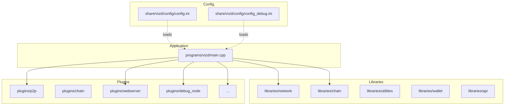
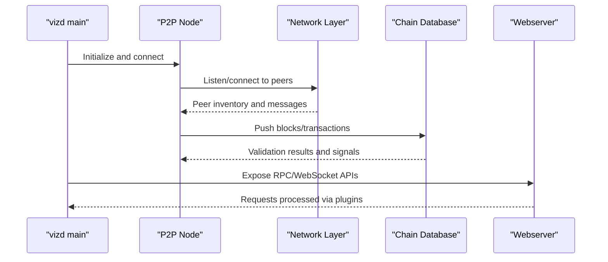
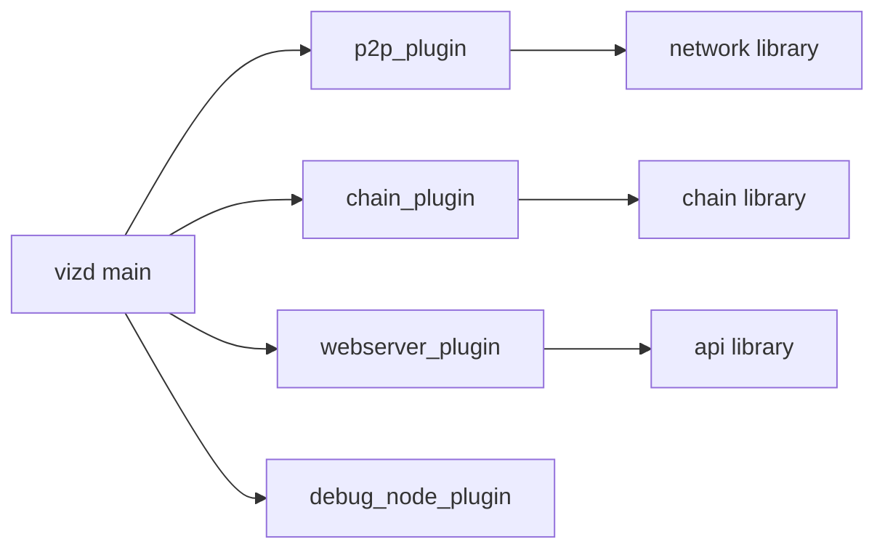

# Troubleshooting and FAQ

<cite>
**Referenced Files in This Document**
- [README.md](file://README.md)
- [documentation/building.md](file://documentation/building.md)
- [documentation/debug_node_plugin.md](file://documentation/debug_node_plugin.md)
- [documentation/api_notes.md](file://documentation/api_notes.md)
- [documentation/testnet.md](file://documentation/testnet.md)
- [share/vizd/config/config.ini](file://share/vizd/config/config.ini)
- [share/vizd/config/config_debug.ini](file://share/vizd/config/config_debug.ini)
- [programs/vizd/main.cpp](file://programs/vizd/main.cpp)
- [libraries/network/include/graphene/network/node.hpp](file://libraries/network/include/graphene/network/node.hpp)
- [libraries/network/node.cpp](file://libraries/network/node.cpp)
- [libraries/network/include/graphene/network/exceptions.hpp](file://libraries/network/include/graphene/network/exceptions.hpp)
- [libraries/chain/include/graphene/chain/database.hpp](file://libraries/chain/include/graphene/chain/database.hpp)
- [libraries/chain/include/graphene/chain/database_exceptions.hpp](file://libraries/chain/include/graphene/chain/database_exceptions.hpp)
- [plugins/debug_node/plugin.cpp](file://plugins/debug_node/plugin.cpp)
</cite>

## Table of Contents
1. [Introduction](#introduction)
2. [Project Structure](#project-structure)
3. [Core Components](#core-components)
4. [Architecture Overview](#architecture-overview)
5. [Detailed Component Analysis](#detailed-component-analysis)
6. [Dependency Analysis](#dependency-analysis)
7. [Performance Considerations](#performance-considerations)
8. [Troubleshooting Guide](#troubleshooting-guide)
9. [Conclusion](#conclusion)
10. [Appendices](#appendices)

## Introduction
This document provides comprehensive troubleshooting and FAQ guidance for the VIZ CPP Node. It focuses on:
- Build issues and dependency problems
- Network connectivity failures and sync issues
- Performance tuning for memory, CPU, and disk I/O
- Interpretation of error messages and diagnostic procedures
- Frequently asked questions about node operation, API usage, plugin development, and integration
- Systematic debugging with the debug_node plugin, log analysis, and diagnostic tools
- Recovery procedures for common failure scenarios

## Project Structure
The VIZ node is organized into libraries (chain, protocol, network, utilities, wallet), plugins (core and optional), and the main application entry point. Configuration is primarily managed via INI files, with logging configured through dedicated sections.

**Diagram sources**
- [programs/vizd/main.cpp](file://programs/vizd/main.cpp#L62-L91)
- [share/vizd/config/config.ini](file://share/vizd/config/config.ini#L69-L73)
- [share/vizd/config/config_debug.ini](file://share/vizd/config/config_debug.ini#L69)

**Section sources**
- [programs/vizd/main.cpp](file://programs/vizd/main.cpp#L62-L91)
- [share/vizd/config/config.ini](file://share/vizd/config/config.ini#L69-L73)
- [share/vizd/config/config_debug.ini](file://share/vizd/config/config_debug.ini#L69)

## Core Components
- Application entry and plugin registration: The main executable registers and initializes core plugins including chain, p2p, webserver, and optional plugins.
- Network layer: Provides peer-to-peer connectivity, message propagation, sync orchestration, and bandwidth monitoring.
- Chain database: Manages blockchain state, block and transaction validation, fork handling, and shared memory sizing.
- Configuration: Centralized via INI files controlling endpoints, RPC/TLS, plugin activation, and performance knobs.
- Logging: Configurable console and file appenders with logger sections.

Key configuration areas:
- P2P endpoints, seed nodes, and connection limits
- RPC endpoints, thread pools, and lock timeouts
- Shared memory sizing and growth thresholds
- Plugin selection and API exposure
- Loggers and appenders

**Section sources**
- [programs/vizd/main.cpp](file://programs/vizd/main.cpp#L62-L91)
- [libraries/network/include/graphene/network/node.hpp](file://libraries/network/include/graphene/network/node.hpp#L190-L304)
- [libraries/chain/include/graphene/chain/database.hpp](file://libraries/chain/include/graphene/chain/database.hpp#L83-L107)
- [share/vizd/config/config.ini](file://share/vizd/config/config.ini#L1-L130)
- [share/vizd/config/config_debug.ini](file://share/vizd/config/config_debug.ini#L1-L126)

## Architecture Overview
High-level runtime flow:
- The application initializes plugins, loads configuration, and starts the P2P and webserver components.
- The P2P node connects to peers, discovers candidates, and synchronizes blocks and transactions.
- The chain database validates and applies blocks and transactions, emitting signals for plugins.
- The webserver exposes JSON-RPC APIs and WebSocket endpoints for clients.

**Diagram sources**
- [programs/vizd/main.cpp](file://programs/vizd/main.cpp#L106-L142)
- [libraries/network/node.cpp](file://libraries/network/node.cpp#L776-L788)
- [libraries/chain/include/graphene/chain/database.hpp](file://libraries/chain/include/graphene/chain/database.hpp#L194-L206)

## Detailed Component Analysis

### Build and Dependency Troubleshooting
Common issues and resolutions:
- Missing system dependencies (Linux): Ensure required packages are installed as documented for your distribution.
- Boost version conflicts (especially on older distributions): Use the documented Boost versions and installation steps.
- Compiler compatibility: GCC and Clang are supported; avoid compilers not used by maintainers unless you can resolve warnings.
- Docker builds: Use provided Dockerfiles for reproducible environments.

Recommended steps:
- Verify all documented dependencies are present.
- Clean build tree and rerun CMake with Release configuration.
- For Docker, use the provided Dockerfiles and tags.

**Section sources**
- [documentation/building.md](file://documentation/building.md#L25-L75)
- [documentation/building.md](file://documentation/building.md#L76-L137)
- [documentation/building.md](file://documentation/building.md#L138-L189)
- [documentation/building.md](file://documentation/building.md#L202-L212)

### Network Connectivity and Sync Issues
Symptoms and diagnostics:
- No peers or slow peer discovery:
  - Confirm P2P endpoint and seed nodes are configured.
  - Clear peer database if stuck due to stale entries.
- Sync stalls or fork errors:
  - Review network exceptions for unlinkable blocks or peers on unreachable forks.
  - Consider checkpoints and shared memory sizing.
- Firewall/NAT:
  - The node can detect firewall status and may require explicit public endpoint configuration.

Actions:
- Adjust p2p-endpoint, p2p-max-connections, and p2p-seed-node.
- Increase read/write lock wait retries and microsecond timeouts if RPC contention is observed.
- Use the debug_node plugin to simulate and validate behavior in isolation.

**Section sources**
- [share/vizd/config/config.ini](file://share/vizd/config/config.ini#L1-L27)
- [libraries/network/include/graphene/network/exceptions.hpp](file://libraries/network/include/graphene/network/exceptions.hpp#L33-L46)
- [libraries/network/node.cpp](file://libraries/network/node.cpp#L788-L796)

### API Access Control and Security
- Bind RPC to localhost for trusted environments.
- Use TLS endpoints for remote access with proper certificates.
- Username/password authentication for specific API sets.

Best practices:
- Keep public-api minimal and ordered.
- Use login_api as the second API for string identifier compatibility.
- Protect sensitive APIs with credentials and TLS.

**Section sources**
- [documentation/api_notes.md](file://documentation/api_notes.md#L56-L121)
- [share/vizd/config/config.ini](file://share/vizd/config/config.ini#L16-L20)

### Performance Tuning
Key levers:
- Single write thread: Reduces lock contention for write-heavy workloads.
- Plugin notifications on push_transaction: Disable to reduce overhead.
- Shared memory sizing: Tune initial size, minimum free space, and increment step.
- RPC thread pool size: Match to CPU cores minus one.
- Skip virtual operations: Reduce memory footprint for non-consensus nodes.

Operational tips:
- Monitor average network read/write speeds exposed by the network layer.
- Adjust block-number-based free-space checks to balance safety and performance.

**Section sources**
- [share/vizd/config/config.ini](file://share/vizd/config/config.ini#L36-L47)
- [share/vizd/config/config.ini](file://share/vizd/config/config.ini#L49-L67)
- [share/vizd/config/config.ini](file://share/vizd/config/config.ini#L13-L14)
- [libraries/network/node.cpp](file://libraries/network/node.cpp#L632-L634)

### Error Message Interpretation and Diagnostics
- Network exceptions:
  - send_queue_overflow, insufficient_relay_fee, already_connected_to_requested_peer, block_older_than_undo_history, peer_is_on_an_unreachable_fork, unlinkable_block_exception.
- Chain exceptions:
  - database_query_exception, block_validate_exception, transaction_exception, operation_validate_exception, operation_evaluate_exception, unlinkable_block_exception, unknown_hardfork_exception, plugin_exception, block_log_exception.

Diagnostic procedure:
- Capture full exception backtraces from logs.
- Correlate timestamps with network and chain events.
- Use debug_node to reproduce and narrow issues in isolation.

**Section sources**
- [libraries/network/include/graphene/network/exceptions.hpp](file://libraries/network/include/graphene/network/exceptions.hpp#L33-L46)
- [libraries/chain/include/graphene/chain/database_exceptions.hpp](file://libraries/chain/include/graphene/chain/database_exceptions.hpp#L67-L117)

### Debugging with the debug_node Plugin
Capabilities:
- Load blocks from a block log or JSON array.
- Generate blocks deterministically for testing.
- Edit chain state for “what-if” experiments.
- Replay and inspect applied operations.

Usage highlights:
- Configure RPC to localhost for security.
- Enable debug_node and required APIs.
- Use curl or WebSocket clients to call debug APIs.

Recovery and isolation:
- Use debug_node to validate assumptions and isolate bugs without affecting live networks.

**Section sources**
- [documentation/debug_node_plugin.md](file://documentation/debug_node_plugin.md#L50-L134)
- [plugins/debug_node/plugin.cpp](file://plugins/debug_node/plugin.cpp#L475-L556)

### Recovery Procedures
- Database corruption or replay issues:
  - Use database reindex/replay capabilities with appropriate skip flags.
  - Adjust shared memory sizing and free-space thresholds.
- Sync desynchronization:
  - Clear peer database and restart sync.
  - Verify checkpoints and hardfork handling.
- Configuration errors:
  - Validate INI sections and logger configurations.
  - Use minimal config to confirm correctness, then re-add options incrementally.

**Section sources**
- [libraries/chain/include/graphene/chain/database.hpp](file://libraries/chain/include/graphene/chain/database.hpp#L91-L92)
- [libraries/chain/include/graphene/chain/database.hpp](file://libraries/chain/include/graphene/chain/database.hpp#L94-L97)
- [libraries/network/node.cpp](file://libraries/network/node.cpp#L288)

### Frequently Asked Questions
- How do I run a testnet?
  - Use the provided Docker images or build locally with the testnet Dockerfile.
- How do I expose APIs securely?
  - Bind RPC to localhost, or use TLS endpoints with certificates.
- How do I limit API access?
  - Use username/password authentication and restrict allowed_apis.
- How do I troubleshoot missing peers?
  - Check p2p-endpoint, p2p-seed-node, and firewall/NAT status.
- How do I improve performance?
  - Tune shared memory sizing, single write thread, plugin notifications, and RPC thread pool.

**Section sources**
- [documentation/testnet.md](file://documentation/testnet.md#L21-L37)
- [documentation/api_notes.md](file://documentation/api_notes.md#L56-L121)
- [share/vizd/config/config.ini](file://share/vizd/config/config.ini#L1-L27)

## Dependency Analysis
The application depends on a layered architecture:
- Application layer registers and orchestrates plugins.
- Network layer handles peer management and synchronization.
- Chain layer validates and applies state transitions.
- Utilities and wallet provide supporting functionality.

**Diagram sources**
- [programs/vizd/main.cpp](file://programs/vizd/main.cpp#L62-L91)
- [libraries/network/include/graphene/network/node.hpp](file://libraries/network/include/graphene/network/node.hpp#L190-L304)
- [libraries/chain/include/graphene/chain/database.hpp](file://libraries/chain/include/graphene/chain/database.hpp#L36-L561)

**Section sources**
- [programs/vizd/main.cpp](file://programs/vizd/main.cpp#L62-L91)

## Performance Considerations
- Memory:
  - Tune shared memory initial size, minimum free space, and increment step.
  - Consider skip-virtual-ops for reduced memory usage.
- CPU:
  - Use single-write-thread to reduce lock contention.
  - Disable plugin notifications on push_transaction for lower overhead.
- Disk I/O:
  - Monitor average network read/write speeds.
  - Adjust block-number-based free-space checks to balance safety and throughput.

**Section sources**
- [share/vizd/config/config.ini](file://share/vizd/config/config.ini#L49-L67)
- [libraries/network/node.cpp](file://libraries/network/node.cpp#L632-L634)

## Troubleshooting Guide

### Build Issues
- Symptoms: CMake fails or compiler errors.
- Checks:
  - Dependencies installed per platform-specific instructions.
  - Boost version matches documented requirements.
  - Compiler is GCC or Clang.
- Actions:
  - Clean build, rerun CMake with Release.
  - Use Docker images for reproducibility.

**Section sources**
- [documentation/building.md](file://documentation/building.md#L25-L75)
- [documentation/building.md](file://documentation/building.md#L76-L137)
- [documentation/building.md](file://documentation/building.md#L138-L189)

### Network Connectivity Problems
- Symptoms: No peers, slow sync, or fork errors.
- Checks:
  - P2P endpoint and seed nodes configured.
  - Firewall/NAT status and public endpoint visibility.
- Actions:
  - Clear peer database if stuck.
  - Increase connection and timeout parameters.
  - Use debug_node to validate behavior.

**Section sources**
- [share/vizd/config/config.ini](file://share/vizd/config/config.ini#L1-L27)
- [libraries/network/include/graphene/network/exceptions.hpp](file://libraries/network/include/graphene/network/exceptions.hpp#L33-L46)
- [libraries/network/node.cpp](file://libraries/network/node.cpp#L788-L796)

### API Access and Security
- Symptoms: Unauthorized access or TLS handshake failures.
- Checks:
  - RPC endpoint binding and TLS configuration.
  - Username/password policies and allowed_apis.
- Actions:
  - Bind RPC to localhost for trusted environments.
  - Configure TLS with matching certificate and client trust.

**Section sources**
- [documentation/api_notes.md](file://documentation/api_notes.md#L56-L121)
- [share/vizd/config/config.ini](file://share/vizd/config/config.ini#L16-L20)

### Performance Bottlenecks
- Symptoms: High lock wait errors, slow RPC, or memory pressure.
- Checks:
  - Read/write lock wait retries and microsecond timeouts.
  - Shared memory sizing and free-space thresholds.
- Actions:
  - Enable single-write-thread and disable plugin notifications on push_transaction.
  - Increase shared memory increments and adjust free-space checks.

**Section sources**
- [share/vizd/config/config.ini](file://share/vizd/config/config.ini#L22-L47)
- [share/vizd/config/config.ini](file://share/vizd/config/config.ini#L49-L67)

### Error Interpretation and Logs
- Use network and chain exception categories to classify issues.
- Capture full backtraces and correlate with timestamps.
- Employ debug_node to reproduce and validate fixes.

**Section sources**
- [libraries/network/include/graphene/network/exceptions.hpp](file://libraries/network/include/graphene/network/exceptions.hpp#L33-L46)
- [libraries/chain/include/graphene/chain/database_exceptions.hpp](file://libraries/chain/include/graphene/chain/database_exceptions.hpp#L67-L117)
- [documentation/debug_node_plugin.md](file://documentation/debug_node_plugin.md#L50-L134)

### Recovery Procedures
- Database issues:
  - Reindex with appropriate skip flags.
  - Resize shared memory and adjust free-space thresholds.
- Sync issues:
  - Clear peer database and restart sync.
  - Verify checkpoints and hardfork handling.
- Configuration errors:
  - Validate INI sections and logger configurations.
  - Gradually reintroduce options.

**Section sources**
- [libraries/chain/include/graphene/chain/database.hpp](file://libraries/chain/include/graphene/chain/database.hpp#L91-L92)
- [libraries/chain/include/graphene/chain/database.hpp](file://libraries/chain/include/graphene/chain/database.hpp#L94-L97)
- [libraries/network/node.cpp](file://libraries/network/node.cpp#L288)

### Systematic Debugging with debug_node
- Isolate issues by loading historical blocks and generating deterministic blocks.
- Edit chain state for “what-if” experiments.
- Use localhost RPC and minimal API exposure for security.

**Section sources**
- [documentation/debug_node_plugin.md](file://documentation/debug_node_plugin.md#L50-L134)
- [plugins/debug_node/plugin.cpp](file://plugins/debug_node/plugin.cpp#L475-L556)

## Conclusion
This guide consolidates practical troubleshooting steps, performance tuning, and debugging techniques for the VIZ CPP Node. By aligning configuration with operational needs, leveraging the debug_node plugin, and interpreting structured error messages, most issues can be diagnosed and resolved efficiently.

## Appendices

### Quick Reference: Key Configuration Areas
- P2P: p2p-endpoint, p2p-max-connections, p2p-seed-node, checkpoint
- RPC: webserver-thread-pool-size, webserver-http-endpoint, webserver-ws-endpoint
- Locks: read-wait-micro, max-read-wait-retries, write-wait-micro, max-write-wait-retries
- Write path: single-write-thread
- Plugins: plugin list and public-api ordering
- Shared memory: shared-file-size, min-free-shared-file-size, inc-shared-file-size, block-num-check-free-size
- Logging: log.console_appender, log.file_appender, logger sections

**Section sources**
- [share/vizd/config/config.ini](file://share/vizd/config/config.ini#L1-L130)

### Testnet Launch
- Use Docker images or build locally with the testnet Dockerfile.
- Inspect snapshot behavior and initial users.

**Section sources**
- [documentation/testnet.md](file://documentation/testnet.md#L21-L37)