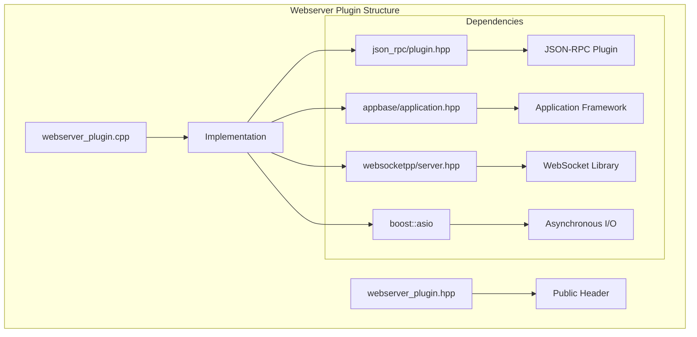
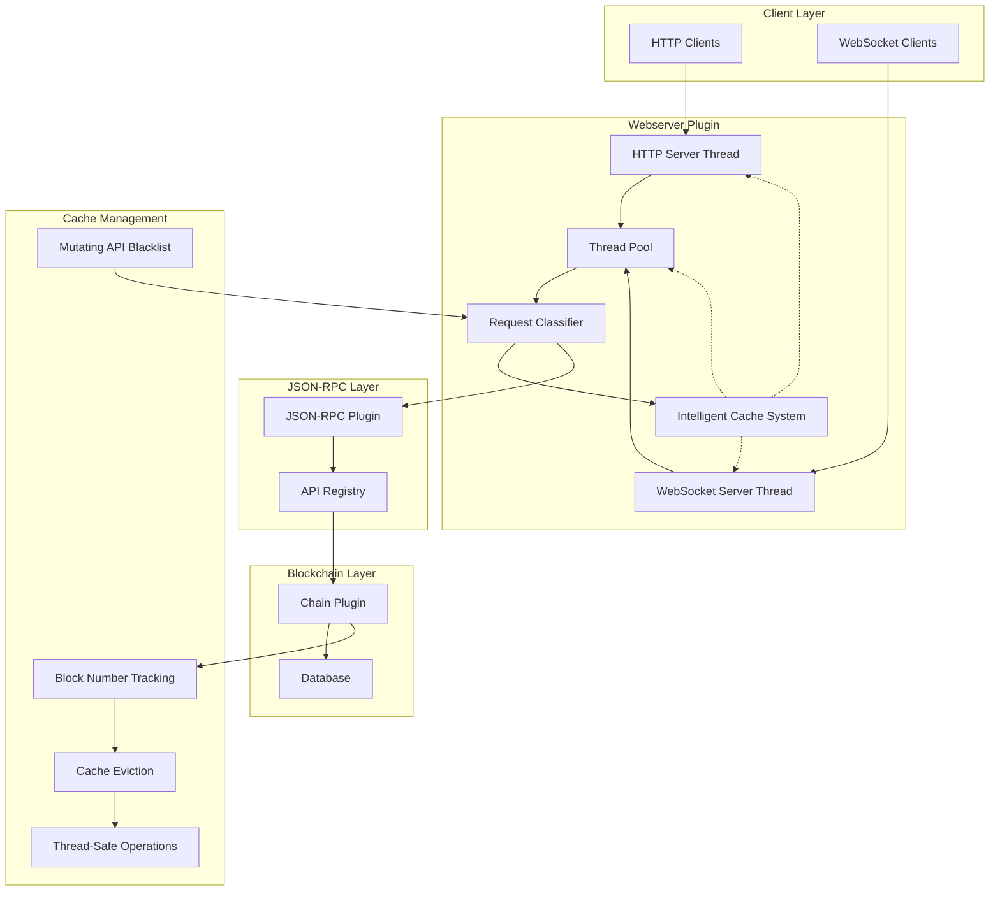
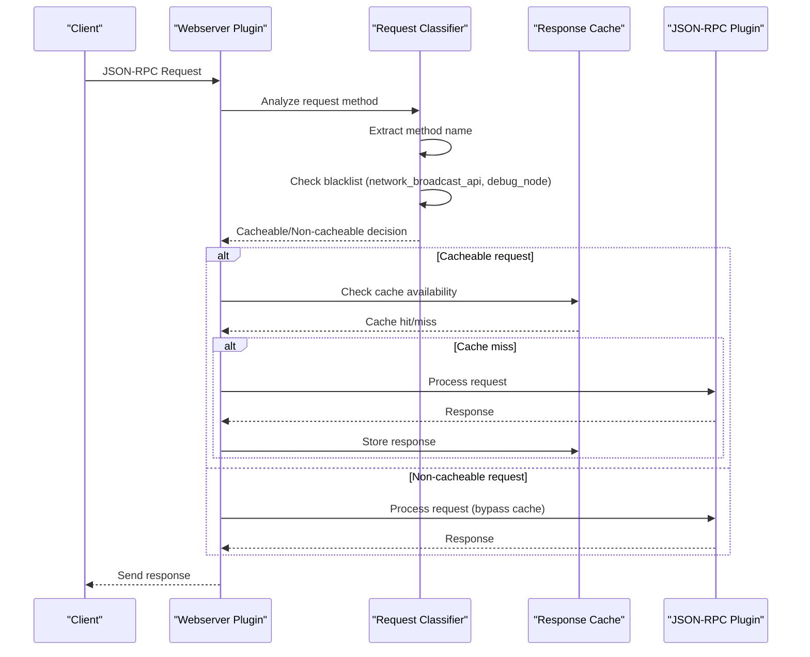
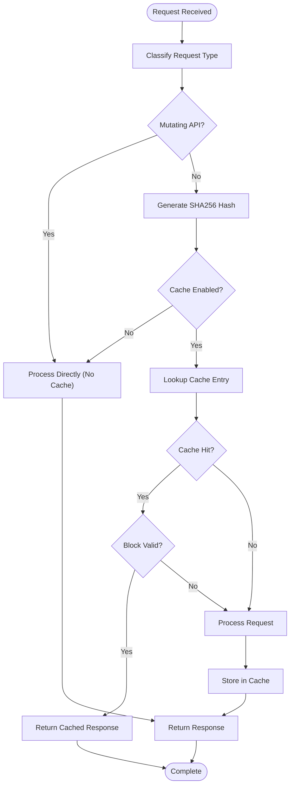
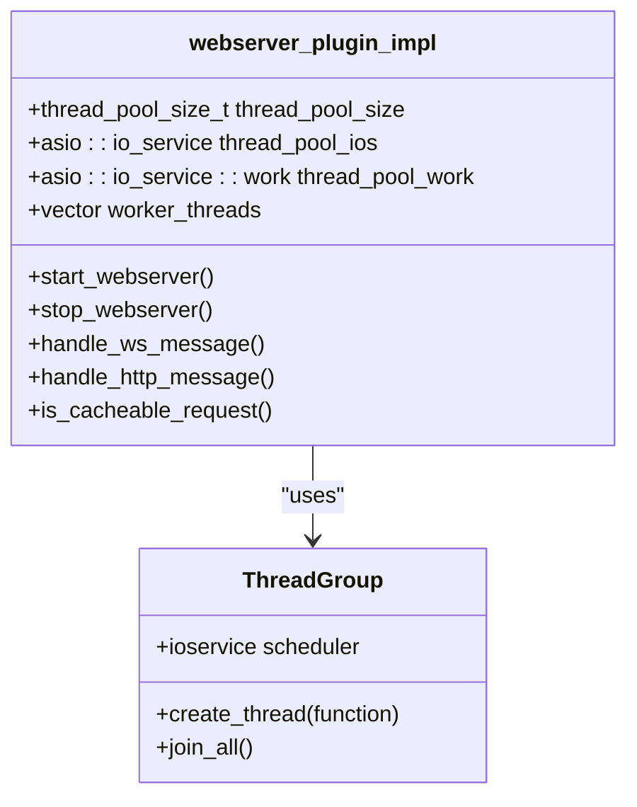
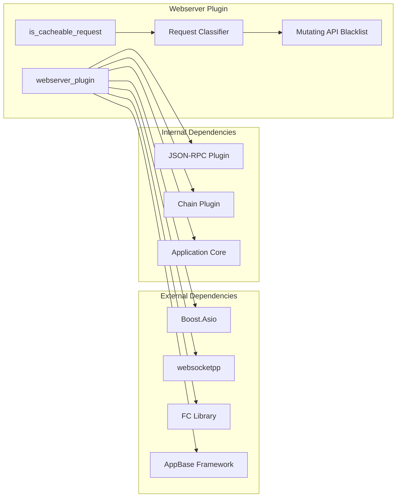
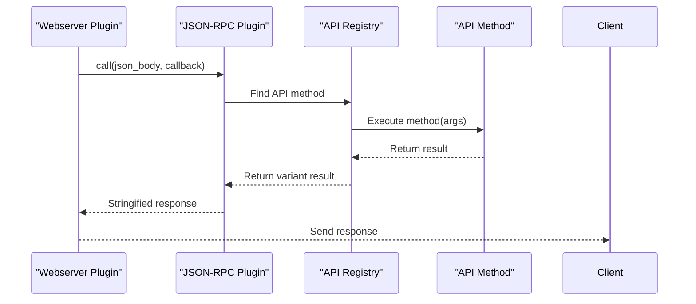
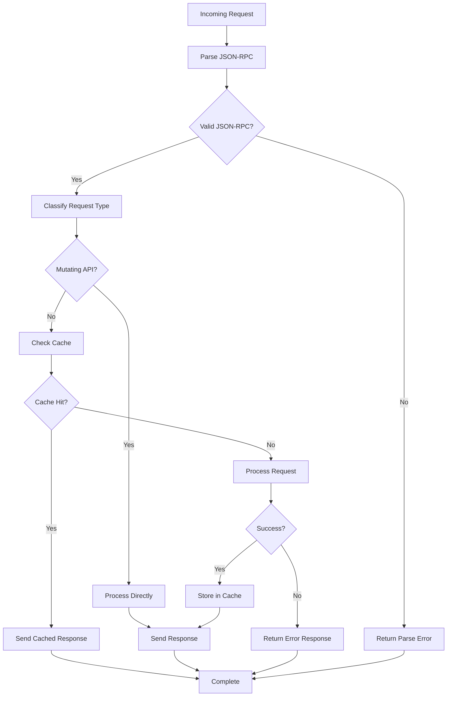

# Webserver Plugin

<cite>
**Referenced Files in This Document**
- [webserver_plugin.hpp](file://plugins/webserver/include/graphene/plugins/webserver/webserver_plugin.hpp)
- [webserver_plugin.cpp](file://plugins/webserver/webserver_plugin.cpp)
- [plugin.hpp](file://plugins/json_rpc/include/graphene/plugins/json_rpc/plugin.hpp)
- [plugin.cpp](file://plugins/json_rpc/plugin.cpp)
- [utility.hpp](file://plugins/json_rpc/include/graphene/plugins/json_rpc/utility.hpp)
- [webserver-plugin.md](file://documentation/webserver-plugin.md)
- [config.ini](file://share/vizd/config/config.ini)
</cite>

## Update Summary
**Changes Made**
- Enhanced caching control system with intelligent request classification for mutating vs non-mutating JSON-RPC API calls
- Added `is_cacheable_request` function for automatic request categorization
- Implemented blacklist for mutating API calls (network_broadcast_api, debug_node)
- Improved WebSocket/HTTP request handling with intelligent caching decisions
- Updated response caching mechanisms with selective caching based on request type
- Enhanced security considerations with mutating API access control

## Table of Contents
1. [Introduction](#introduction)
2. [Project Structure](#project-structure)
3. [Core Components](#core-components)
4. [Architecture Overview](#architecture-overview)
5. [Detailed Component Analysis](#detailed-component-analysis)
6. [Dependency Analysis](#dependency-analysis)
7. [Performance Considerations](#performance-considerations)
8. [Security Considerations](#security-considerations)
9. [Configuration Guide](#configuration-guide)
10. [Troubleshooting Guide](#troubleshooting-guide)
11. [Conclusion](#conclusion)

## Introduction
The Webserver Plugin provides HTTP and WebSocket endpoints for JSON-RPC API access to the VIZ blockchain node. It serves as a bridge between external clients and the internal JSON-RPC system, offering both persistent WebSocket connections for real-time updates and standard HTTP endpoints for traditional API calls. The plugin includes an intelligent caching mechanisms that automatically classifies requests as mutating or non-mutating, optimizing performance for frequently accessed read-only API methods while preventing cache pollution from state-changing operations.

**Updated** Enhanced with intelligent request classification system and selective caching based on API mutability.

## Project Structure
The webserver plugin is organized within the plugins/webserver directory structure, following the standard VIZ plugin architecture pattern:



**Diagram sources**
- [webserver_plugin.hpp:1-62](file://plugins/webserver/include/graphene/plugins/webserver/webserver_plugin.hpp#L1-L62)
- [webserver_plugin.cpp:1-484](file://plugins/webserver/webserver_plugin.cpp#L1-L484)

**Section sources**
- [webserver_plugin.hpp:1-62](file://plugins/webserver/include/graphene/plugins/webserver/webserver_plugin.hpp#L1-L62)
- [webserver_plugin.cpp:1-484](file://plugins/webserver/webserver_plugin.cpp#L1-L484)

## Core Components
The webserver plugin consists of several key components working together to provide HTTP and WebSocket API services:

### Main Plugin Class
The primary interface is the `webserver_plugin` class that inherits from appbase's plugin system, providing lifecycle management and configuration options.

### Implementation Container
The `webserver_plugin_impl` struct contains all the internal state and functionality, including:
- HTTP and WebSocket server instances with separate io_service instances
- Thread pool management for concurrent request processing using appbase scheduler
- Intelligent response caching mechanism with request classification and block-based invalidation
- Connection handling for both HTTP and WebSocket protocols
- Signal connections for blockchain event monitoring and cache management

### JSON-RPC Integration
The plugin integrates with the JSON-RPC plugin to handle API method dispatching and response generation, supporting both individual requests and batch processing with comprehensive error handling.

**Section sources**
- [webserver_plugin.hpp:32-57](file://plugins/webserver/include/graphene/plugins/webserver/webserver_plugin.hpp#L32-L57)
- [webserver_plugin.cpp:113-157](file://plugins/webserver/webserver_plugin.cpp#L113-L157)

## Architecture Overview
The webserver plugin follows a sophisticated multi-threaded architecture designed for high concurrency and reliability with intelligent caching control:



**Diagram sources**
- [webserver_plugin.cpp:84-105](file://plugins/webserver/webserver_plugin.cpp#L84-L105)
- [webserver_plugin.cpp:130-157](file://plugins/webserver/webserver_plugin.cpp#L130-L157)
- [webserver_plugin.cpp:466-474](file://plugins/webserver/webserver_plugin.cpp#L466-L474)

The architecture implements several key design patterns:
- **Separation of Concerns**: HTTP and WebSocket servers run in separate threads with dedicated io_service instances
- **Thread Pool Pattern**: Concurrent request processing with configurable thread count using appbase scheduler
- **Intelligent Caching Pattern**: Request classification system with automatic cache control based on API mutability
- **Observer Pattern**: Chain event subscription for automatic cache management on block application
- **Blacklist Pattern**: Mutating API detection and prevention of cache pollution

**Updated** Enhanced with intelligent request classification and selective caching mechanisms.

## Detailed Component Analysis

### Intelligent Request Classification System
The plugin implements an advanced request classification system that automatically determines whether a JSON-RPC request should be cached based on its API mutability:



**Diagram sources**
- [webserver_plugin.cpp:86-105](file://plugins/webserver/webserver_plugin.cpp#L86-L105)
- [webserver_plugin.cpp:285](file://plugins/webserver/webserver_plugin.cpp#L285)
- [webserver_plugin.cpp:329](file://plugins/webserver/webserver_plugin.cpp#L329)

**Updated** Enhanced with detailed implementation showing the intelligent request classification and selective caching logic.

### Response Caching Mechanism
The caching system provides significant performance improvements for frequently accessed API methods with sophisticated block-based invalidation and intelligent request filtering:



**Diagram sources**
- [webserver_plugin.cpp:239-273](file://plugins/webserver/webserver_plugin.cpp#L239-L273)
- [webserver_plugin.cpp:86-105](file://plugins/webserver/webserver_plugin.cpp#L86-L105)

**Updated** Enhanced with detailed implementation showing the intelligent caching logic and mutating API blacklist integration.

### Thread Pool Management
The plugin uses the appbase scheduler for request processing, providing a dedicated thread pool separate from the main application thread:



**Diagram sources**
- [webserver_plugin.cpp:115](file://plugins/webserver/webserver_plugin.cpp#L115)
- [webserver_plugin.cpp:117-120](file://plugins/webserver/webserver_plugin.cpp#L117-L120)

**Updated** Enhanced with actual thread pool implementation details and the new `is_cacheable_request` method.

**Section sources**
- [webserver_plugin.cpp:113-157](file://plugins/webserver/webserver_plugin.cpp#L113-L157)
- [webserver_plugin.cpp:239-273](file://plugins/webserver/webserver_plugin.cpp#L239-L273)
- [webserver_plugin.cpp:86-105](file://plugins/webserver/webserver_plugin.cpp#L86-L105)

### Configuration and Options
The plugin supports extensive configuration through command-line options and configuration files:

| Option | Default | Description |
|--------|---------|-------------|
| `webserver-http-endpoint` | (none) | HTTP listen endpoint (IP:port) |
| `webserver-ws-endpoint` | (none) | WebSocket listen endpoint (IP:port) |
| `rpc-endpoint` | (none) | Combined HTTP/WS endpoint (deprecated) |
| `webserver-thread-pool-size` | 256 | Number of handler threads |
| `webserver-cache-enabled` | true | Enable response caching |
| `webserver-cache-size` | 10000 | Maximum cached responses |

**Updated** Enhanced with actual implementation details and current default values.

**Section sources**
- [webserver_plugin.cpp:382-396](file://plugins/webserver/webserver_plugin.cpp#L382-L396)
- [webserver-plugin.md:111-124](file://documentation/webserver-plugin.md#L111-L124)

## Dependency Analysis
The webserver plugin has well-defined dependencies that enable its functionality:



**Diagram sources**
- [webserver_plugin.hpp:3-8](file://plugins/webserver/include/graphene/plugins/webserver/webserver_plugin.hpp#L3-L8)
- [webserver_plugin.cpp:12-31](file://plugins/webserver/webserver_plugin.cpp#L12-L31)
- [webserver_plugin.cpp:84-105](file://plugins/webserver/webserver_plugin.cpp#L84-L105)

### JSON-RPC Integration Details
The plugin integrates with the JSON-RPC system through method registration and call delegation:



**Diagram sources**
- [plugin.cpp:180-200](file://plugins/json_rpc/plugin.cpp#L180-L200)
- [webserver_plugin.cpp:303](file://plugins/webserver/webserver_plugin.cpp#L303)
- [webserver_plugin.cpp:347](file://plugins/webserver/webserver_plugin.cpp#L347)

**Updated** Enhanced with actual implementation details showing the method registration and call delegation process.

**Section sources**
- [webserver_plugin.hpp:38](file://plugins/webserver/include/graphene/plugins/webserver/webserver_plugin.hpp#L38)
- [webserver_plugin.cpp:147](file://plugins/webserver/webserver_plugin.cpp#L147)
- [plugin.cpp:159-178](file://plugins/json_rpc/plugin.cpp#L159-L178)

## Performance Considerations
The webserver plugin implements several performance optimization strategies with intelligent caching control:

### Intelligent Caching Strategy
- **Request Classification**: Automatic determination of cacheable vs non-cacheable requests based on API mutability
- **SHA256 Hash Keys**: Unique request identification for cache entries using cryptographic hashing
- **Block-Based Invalidation**: Cache cleared on each new block to prevent stale data through blockchain event subscription
- **Thread-Safe Operations**: Mutex protection for concurrent access across multiple worker threads
- **Eviction Policy**: Automatic cache clearing when maximum size is reached to prevent memory exhaustion
- **Selective Caching**: Prevents cache pollution from mutating API calls (network_broadcast_api, debug_node)

### Concurrency Model
- **Separate IO Services**: HTTP and WebSocket servers use dedicated io_service instances for isolation
- **Configurable Thread Pool**: Adjustable worker thread count based on workload using appbase scheduler
- **Non-blocking Operations**: Async processing prevents thread starvation and improves throughput
- **Connection Pooling**: Efficient WebSocket connection handling with proper resource management

### Memory Management
- **Smart Pointers**: Proper resource management for server instances and cache entries
- **RAII Patterns**: Automatic cleanup on plugin shutdown through destructor implementations
- **Cache Size Limits**: Configurable maximum cache size to prevent unbounded memory growth
- **Blacklist Optimization**: Reduces unnecessary cache storage for mutating API calls

**Updated** Enhanced with detailed implementation showing actual performance optimization strategies and intelligent caching mechanisms.

**Section sources**
- [webserver-plugin.md:29-64](file://documentation/webserver-plugin.md#L29-L64)
- [webserver_plugin.cpp:255-273](file://plugins/webserver/webserver_plugin.cpp#L255-L273)
- [webserver_plugin.cpp:86-105](file://plugins/webserver/webserver_plugin.cpp#L86-L105)

## Security Considerations
The webserver plugin provides multiple layers of security for production deployments with enhanced API access control:

### Network Security
- **Localhost Binding**: Recommended practice for internal services using 127.0.0.1 binding
- **External Access Control**: Use 0.0.0.0 binding only for trusted networks
- **Port Management**: Separate HTTP (8090) and WebSocket (8091) ports for different access patterns

### API Access Control
- **Public API Restriction**: Use `public-api` configuration to limit exposed API surface
- **Authentication**: Implement `api-user` authentication for sensitive operations
- **Rate Limiting**: Consider external rate limiting solutions for public APIs
- **Mutating API Protection**: Automatic blacklist prevents caching of state-changing operations

### Input Validation
- **JSON-RPC Validation**: Built-in validation of JSON-RPC 2.0 compliance
- **Method Whitelisting**: Only registered API methods are callable
- **Parameter Validation**: Type checking and parameter validation for API calls
- **Request Classification**: Automatic detection of potentially malicious mutating requests

### Resource Protection
- **Thread Pool Limits**: Configurable thread pool size prevents resource exhaustion
- **Cache Size Limits**: Configurable cache limits prevent memory abuse
- **Connection Limits**: WebSocket connections managed through proper thread pool utilization
- **Blacklist Enforcement**: Prevents cache poisoning from mutating API calls

**Updated** Enhanced with practical deployment guidance and security best practices including intelligent request classification.

**Section sources**
- [webserver-plugin.md:77-108](file://documentation/webserver-plugin.md#L77-L108)

## Configuration Guide

### Basic Configuration
Enable the webserver plugin in `config.ini`:

```ini
plugin = webserver

# HTTP endpoint (required for HTTP API access)
webserver-http-endpoint = 127.0.0.1:8090

# WebSocket endpoint (required for WebSocket API access)
webserver-ws-endpoint = 127.0.0.1:8091

# Or use a single endpoint for both (deprecated)
# rpc-endpoint = 127.0.0.1:8090
```

### Advanced Configuration
```ini
# Thread pool configuration for high concurrency
webserver-thread-pool-size = 256

# Response caching configuration
webserver-cache-enabled = true
webserver-cache-size = 10000

# API access control
public-api = database_api
public-api = network_broadcast_api

# Authentication
api-user = username:password:database_api
```

### Production Configuration
For production deployments, consider:

```ini
# High performance settings
webserver-thread-pool-size = 512
webserver-cache-size = 50000

# Security settings
webserver-http-endpoint = 127.0.0.1:8090
webserver-ws-endpoint = 127.0.0.1:8091

# API restrictions
public-api = database_api
public-api = account_by_key
```

**Updated** Enhanced with actual implementation details and current configuration options.

**Section sources**
- [webserver-plugin.md:12-27](file://documentation/webserver-plugin.md#L12-L27)
- [webserver-plugin.md:40-48](file://documentation/webserver-plugin.md#L40-L48)
- [webserver-plugin.md:109-125](file://documentation/webserver-plugin.md#L109-L125)

## Troubleshooting Guide

### Common Issues and Solutions

#### Server Binding Failures
**Problem**: Unable to bind to specified endpoints
**Solution**: Verify port availability and network permissions
- Check if ports are already in use
- Ensure proper network interface binding
- Verify firewall configuration

#### High Memory Usage
**Problem**: Excessive memory consumption from caching
**Solution**: Adjust cache configuration
- Reduce `webserver-cache-size` value
- Disable caching for low-traffic scenarios
- Monitor cache hit ratios and memory usage

#### Performance Degradation
**Problem**: Slow response times under load
**Solution**: Optimize thread pool configuration
- Increase `webserver-thread-pool-size`
- Monitor thread utilization and queue lengths
- Consider hardware resource allocation

### Error Handling Patterns
The plugin implements comprehensive error handling with intelligent request classification:



**Diagram sources**
- [webserver_plugin.cpp:285](file://plugins/webserver/webserver_plugin.cpp#L285)
- [webserver_plugin.cpp:329](file://plugins/webserver/webserver_plugin.cpp#L329)
- [webserver_plugin.cpp:303](file://plugins/webserver/webserver_plugin.cpp#L303)

**Updated** Enhanced with actual error handling implementation details and intelligent request classification.

### Debugging and Monitoring
- **Log Levels**: Configure appropriate log levels for debugging
- **Connection Monitoring**: Monitor active WebSocket connections
- **Performance Metrics**: Track cache hit rates and thread pool utilization
- **Error Analysis**: Review error logs for common issues
- **Request Classification**: Monitor which requests are classified as mutating vs non-mutating

**Updated** Enhanced with actual implementation details and monitoring capabilities including request classification metrics.

**Section sources**
- [webserver_plugin.cpp:285](file://plugins/webserver/webserver_plugin.cpp#L285)
- [webserver_plugin.cpp:329](file://plugins/webserver/webserver_plugin.cpp#L329)
- [webserver_plugin.cpp:303](file://plugins/webserver/webserver_plugin.cpp#L303)

## Conclusion
The Webserver Plugin provides a robust, high-performance solution for exposing VIZ blockchain functionality through HTTP and WebSocket interfaces. Its architecture emphasizes scalability through concurrent processing, reliability through comprehensive error handling, and efficiency through intelligent caching mechanisms with request classification. The plugin's modular design and extensive configuration options make it suitable for various deployment scenarios, from development environments to production public API services.

Key strengths of the implementation include:
- **High Concurrency**: Thread pool architecture supporting thousands of concurrent requests
- **Intelligent Caching**: Block-aware cache invalidation with automatic request classification preventing stale data
- **Selective Caching**: Automatic blacklist for mutating API calls (network_broadcast_api, debug_node) preventing cache pollution
- **Flexible Deployment**: Separate HTTP and WebSocket endpoints with independent configuration
- **Production Ready**: Comprehensive error handling and graceful degradation
- **Security Features**: Multiple layers of security including intelligent request classification for mutating APIs
- **Extensible Design**: Clean separation of concerns enabling easy maintenance and enhancement

The plugin serves as an excellent foundation for building applications that require programmatic access to VIZ blockchain data and operations, with performance characteristics suitable for both private deployments and public API services. Its sophisticated caching mechanism with intelligent request classification, multi-threaded architecture, and comprehensive error handling make it a production-ready solution for enterprise-grade blockchain applications.

**Updated** Enhanced conclusion reflecting the expanded implementation details, intelligent request classification system, and selective caching mechanisms.