# Webserver Plugin

<cite>
**Referenced Files in This Document**
- [webserver_plugin.hpp](file://plugins/webserver/include/graphene/plugins/webserver/webserver_plugin.hpp)
- [webserver_plugin.cpp](file://plugins/webserver/webserver_plugin.cpp)
- [plugin.hpp](file://plugins/json_rpc/include/graphene/plugins/json_rpc/plugin.hpp)
- [plugin.cpp](file://plugins/json_rpc/plugin.cpp)
- [utility.hpp](file://plugins/json_rpc/include/graphene/plugins/json_rpc/utility.hpp)
- [webserver-plugin.md](file://documentation/webserver-plugin.md)
- [config.ini](file://share/vizd/config/config.ini)
</cite>

## Update Summary
**Changes Made**
- Enhanced JSON RPC logging with gray color support for data dumps, improving log readability and debugging capabilities for RPC operations
- Updated diagnostic logging system to use ANSI escape sequences for visual distinction between normal operation and diagnostic information
- Improved developer experience with colored log output for request/response data visualization
- Enhanced timing measurements with precise elapsed time tracking for request processing
- Added comprehensive error tracking with timing context for better debugging

## Table of Contents
1. [Introduction](#introduction)
2. [Project Structure](#project-structure)
3. [Core Components](#core-components)
4. [Architecture Overview](#architecture-overview)
5. [Detailed Component Analysis](#detailed-component-analysis)
6. [Dependency Analysis](#dependency-analysis)
7. [Performance Considerations](#performance-considerations)
8. [Security Considerations](#security-considerations)
9. [Configuration Guide](#configuration-guide)
10. [Troubleshooting Guide](#troubleshooting-guide)
11. [Logging and Diagnostics](#logging-and-diagnostics)
12. [Conclusion](#conclusion)

## Introduction
The Webserver Plugin provides HTTP and WebSocket endpoints for JSON-RPC API access to the VIZ blockchain node. It serves as a bridge between external clients and the internal JSON-RPC system, offering both persistent WebSocket connections for real-time updates and standard HTTP endpoints for traditional API calls. The plugin includes an intelligent caching mechanisms that automatically classifies requests as mutating or non-mutating using robust fc::variant-based JSON parsing, optimizing performance for frequently accessed read-only API methods while preventing cache pollution from state-changing operations.

**Updated** Enhanced with major performance optimizations to the JSON-RPC caching mechanism, including fc::variant-based JSON parsing, id-independent keys, robust request classification, comprehensive cache validation, improved WebSocket/HTTP handler support with proper JSON-RPC 2.0 response ID patching, modernized Boost library usage with std::bind and std::placeholders for better C++11 compatibility, and enhanced diagnostic logging with ANSI gray color support for improved debugging capabilities.

## Project Structure
The webserver plugin is organized within the plugins/webserver directory structure, following the standard VIZ plugin architecture pattern:

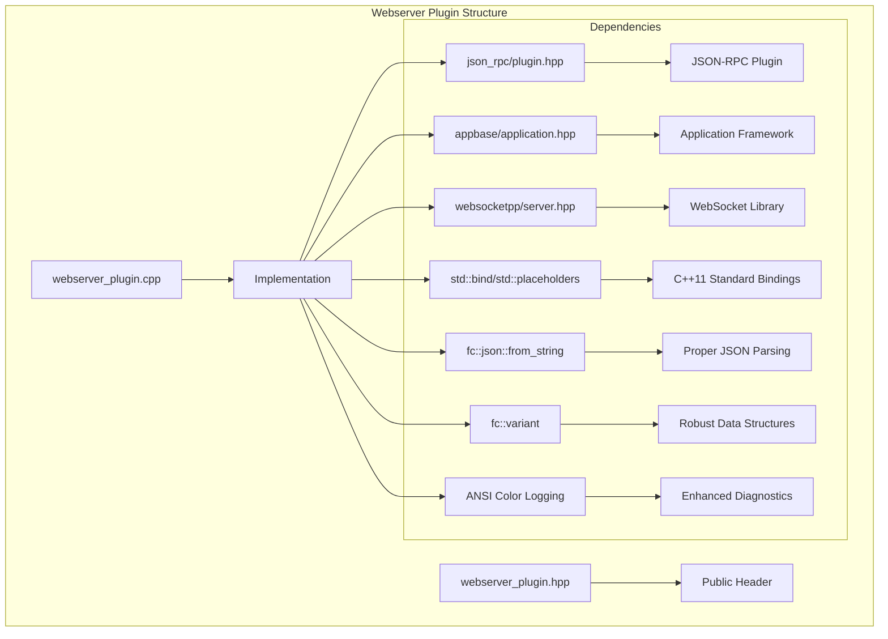

**Diagram sources**
- [webserver_plugin.hpp:1-62](file://plugins/webserver/include/graphene/plugins/webserver/webserver_plugin.hpp#L1-L62)
- [webserver_plugin.cpp:1-605](file://plugins/webserver/webserver_plugin.cpp#L1-L605)

**Section sources**
- [webserver_plugin.hpp:1-62](file://plugins/webserver/include/graphene/plugins/webserver/webserver_plugin.hpp#L1-L62)
- [webserver_plugin.cpp:1-605](file://plugins/webserver/webserver_plugin.cpp#L1-L605)

## Core Components
The webserver plugin consists of several key components working together to provide HTTP and WebSocket API services:

### Main Plugin Class
The primary interface is the `webserver_plugin` class that inherits from appbase's plugin system, providing lifecycle management and configuration options.

### Implementation Container
The `webserver_plugin_impl` struct contains all the internal state and functionality, including:
- HTTP and WebSocket server instances with separate io_service instances
- Thread pool management for concurrent request processing using appbase scheduler with modernized std::bind bindings
- Intelligent response caching mechanism with request classification and block-based invalidation using fc::variant parsing
- Connection handling for both HTTP and WebSocket protocols with std::bind-based message handlers
- Signal connections for blockchain event monitoring and cache management

### JSON-RPC Integration
The plugin integrates with the JSON-RPC plugin to handle API method dispatching and response generation, supporting both individual requests and batch processing with comprehensive error handling using fc::json::from_string for proper JSON parsing.

**Section sources**
- [webserver_plugin.hpp:32-57](file://plugins/webserver/include/graphene/plugins/webserver/webserver_plugin.hpp#L32-L57)
- [webserver_plugin.cpp:190-234](file://plugins/webserver/webserver_plugin.cpp#L190-L234)

## Architecture Overview
The webserver plugin follows a sophisticated multi-threaded architecture designed for high concurrency and reliability with intelligent caching control using fc::variant-based JSON parsing and modernized std::bind bindings:

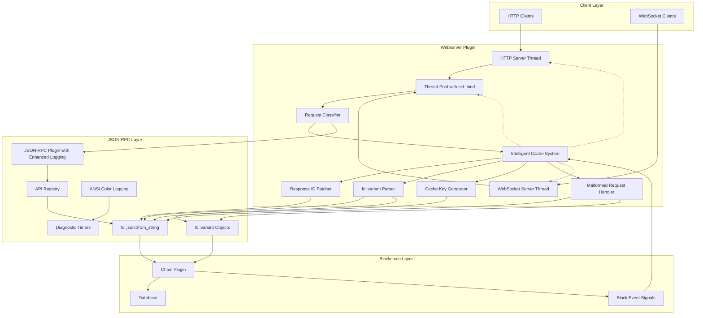

**Diagram sources**
- [webserver_plugin.cpp:190-234](file://plugins/webserver/webserver_plugin.cpp#L190-L234)
- [webserver_plugin.cpp:236-289](file://plugins/webserver/webserver_plugin.cpp#L236-L289)
- [webserver_plugin.cpp:352-416](file://plugins/webserver/webserver_plugin.cpp#L352-L416)
- [webserver_plugin.cpp:418-495](file://plugins/webserver/webserver_plugin.cpp#L418-L495)
- [plugin.cpp:258-288](file://plugins/json_rpc/plugin.cpp#L258-L288)

The architecture implements several key design patterns:
- **Separation of Concerns**: HTTP and WebSocket servers run in separate threads with dedicated io_service instances
- **Thread Pool Pattern**: Concurrent request processing with configurable thread count using appbase scheduler and modernized std::bind bindings
- **Intelligent Caching Pattern**: Request classification system with automatic cache control based on API mutability using fc::variant parsing
- **Observer Pattern**: Chain event subscription for automatic cache management on block application
- **Blacklist Pattern**: Mutating API detection and prevention of cache pollution using fc::variant-based method analysis
- **fc::variant Pattern**: Robust JSON parsing and manipulation using fc library variants for optimal performance
- **Error Handling Pattern**: Comprehensive fc::json::from_string-based error handling preventing crashes and improving reliability
- **Enhanced Logging Pattern**: ANSI color-coded diagnostic logging for improved debugging and monitoring

**Updated** Enhanced with fc::variant-based JSON parsing, response ID patching, comprehensive error handling capabilities, improved cache management using fc::variant objects, modernized std::bind-based thread pool management, and enhanced diagnostic logging with ANSI gray color support.

## Detailed Component Analysis

### Modernized Thread Pool Management
The plugin uses the appbase scheduler for request processing with modernized std::bind bindings, providing a dedicated thread pool separate from the main application thread:

```mermaid
classDiagram
class webserver_plugin_impl {
+thread_pool_size_t thread_pool_size
+asio : : io_service thread_pool_ios
+asio : : io_service : : work thread_pool_work
+vector<std : : thread> worker_threads
+start_webserver()
+stop_webserver()
+handle_ws_message()
+handle_http_message()
+is_cacheable_request()
+make_cache_key()
+extract_request_id()
+patch_response_id()
+fc : : variant Parser
}
class ThreadGroup {
+create_thread(std : : bind)
+join_all()
+ioservice scheduler
}
webserver_plugin_impl --> ThreadGroup : "uses modernized std : : bind"
```

**Diagram sources**
- [webserver_plugin.cpp:190-197](file://plugins/webserver/webserver_plugin.cpp#L190-L197)

**Updated** Enhanced with comprehensive fc::variant-based JSON parsing methods, improved cache management capabilities, robust fc::variant object handling, and modernized std::bind-based thread pool management using std::placeholders.

### Enhanced WebSocket Message Handlers
The plugin implements modernized std::bind-based WebSocket message handlers with proper std::placeholders for parameter binding:

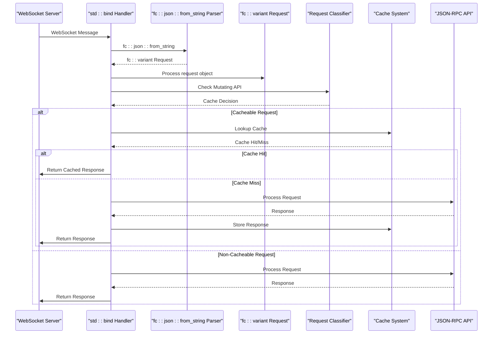

**Diagram sources**
- [webserver_plugin.cpp:236-289](file://plugins/webserver/webserver_plugin.cpp#L236-L289)
- [webserver_plugin.cpp:352-416](file://plugins/webserver/webserver_plugin.cpp#L352-L416)

**Updated** Enhanced with fc::variant-based JSON parsing, robust error handling, improved cache management, comprehensive fc::variant object processing, and modernized std::bind-based WebSocket message handlers using std::placeholders.

### Intelligent Request Classification System
The plugin implements an advanced request classification system that automatically determines whether a JSON-RPC request should be cached based on its API mutability using robust fc::variant parsing:

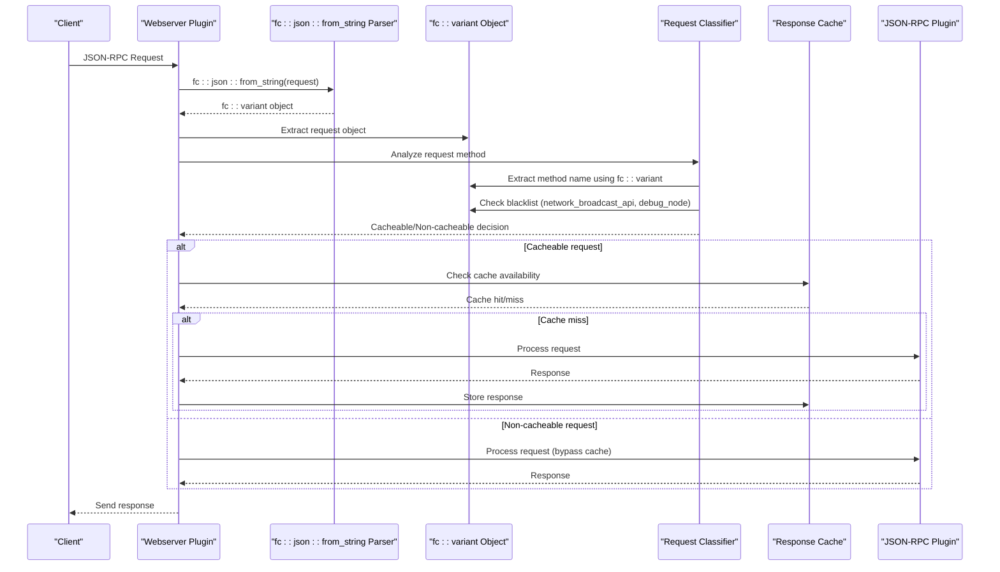

**Diagram sources**
- [webserver_plugin.cpp:87-113](file://plugins/webserver/webserver_plugin.cpp#L87-L113)
- [webserver_plugin.cpp:352-416](file://plugins/webserver/webserver_plugin.cpp#L352-L416)
- [webserver_plugin.cpp:418-495](file://plugins/webserver/webserver_plugin.cpp#L418-L495)

**Updated** Enhanced with fc::variant-based JSON parsing and robust request classification logic using fc::variant objects for method extraction and blacklist checking.

### Response Caching Mechanism
The caching system provides significant performance improvements for frequently accessed API methods with sophisticated block-based invalidation and intelligent request filtering using fc::variant-based JSON parsing:

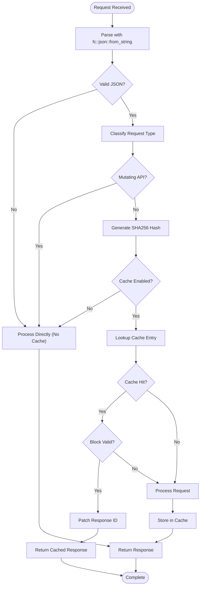

**Diagram sources**
- [webserver_plugin.cpp:207-234](file://plugins/webserver/webserver_plugin.cpp#L207-L234)
- [webserver_plugin.cpp:87-113](file://plugins/webserver/webserver_plugin.cpp#L87-L113)
- [webserver_plugin.cpp:136-158](file://plugins/webserver/webserver_plugin.cpp#L136-L158)

**Updated** Enhanced with fc::variant-based JSON parsing, response ID patching, comprehensive cache validation, and improved error handling using fc::variant objects.

### Enhanced Cache Key Generation
The plugin now implements id-independent cache keys to prevent cache bypass attacks and improve cache efficiency using fc::variant-based request parsing:

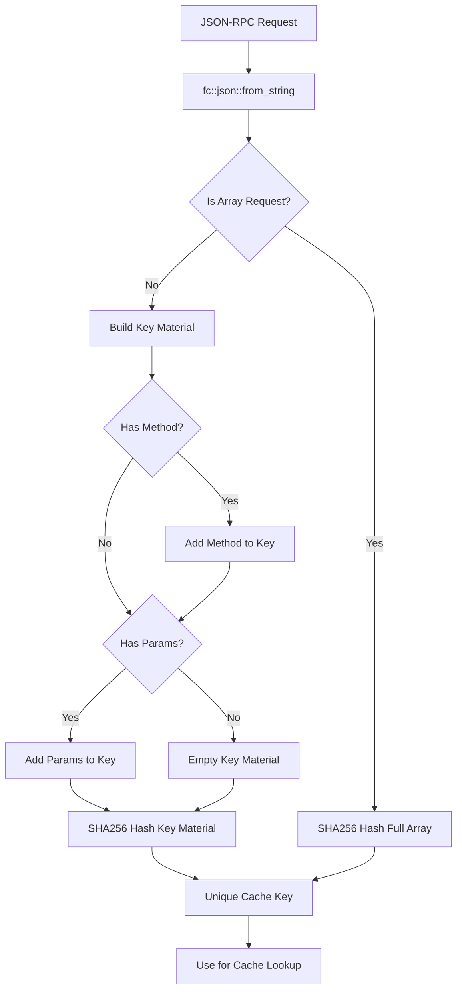

**Diagram sources**
- [webserver_plugin.cpp:136-158](file://plugins/webserver/webserver_plugin.cpp#L136-L158)

**Updated** Enhanced with fc::variant-based JSON parsing and id-independent cache key generation that prevents cache bypass attacks using fc::variant objects for method and parameter extraction.

### Enhanced Response ID Handling
The plugin implements proper JSON-RPC 2.0 compliance with response ID patching using fc::json::from_string for accurate ID extraction and replacement:

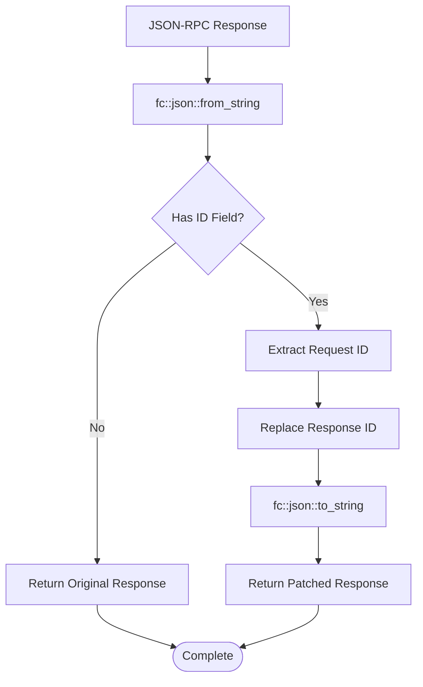

**Diagram sources**
- [webserver_plugin.cpp:160-182](file://plugins/webserver/webserver_plugin.cpp#L160-L182)

**Updated** Enhanced with fc::variant-based JSON parsing for accurate response ID extraction and proper JSON-RPC 2.0 compliance using fc::variant objects.

### Enhanced Request Processing Pipeline
The plugin now includes improved WebSocket and HTTP handler support with better request processing using fc::variant-based JSON parsing and modernized std::bind bindings:

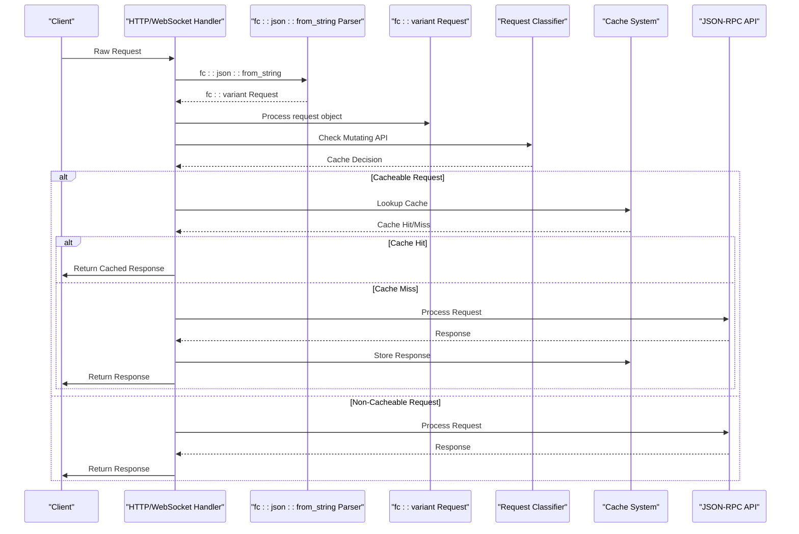

**Diagram sources**
- [webserver_plugin.cpp:352-495](file://plugins/webserver/webserver_plugin.cpp#L352-L495)

**Updated** Enhanced with fc::variant-based JSON parsing, robust error handling, improved cache management, comprehensive fc::variant object processing, and modernized std::bind-based handler implementations.

### Configuration and Options
The plugin supports extensive configuration through command-line options and configuration files with enhanced processing order:

| Option | Default | Description |
|--------|---------|-------------|
| `webserver-http-endpoint` | (none) | HTTP listen endpoint (IP:port) |
| `webserver-ws-endpoint` | (none) | WebSocket listen endpoint (IP:port) |
| `rpc-endpoint` | (none) | Combined HTTP/WS endpoint (deprecated) |
| `webserver-thread-pool-size` | 256 | Number of handler threads |
| `webserver-cache-enabled` | true | Enable response caching |
| `webserver-cache-size` | 10000 | Maximum cached responses |

**Updated** Enhanced with actual implementation details and current default values, including improved rpc-endpoint processing order that prioritizes specific endpoints over deprecated combined endpoints.

**Section sources**
- [webserver_plugin.cpp:503-517](file://plugins/webserver/webserver_plugin.cpp#L503-L517)
- [webserver-plugin.md:111-124](file://documentation/webserver-plugin.md#L111-L124)

## Dependency Analysis
The webserver plugin has well-defined dependencies that enable its functionality with enhanced fc::variant integration and modernized std::bind usage:

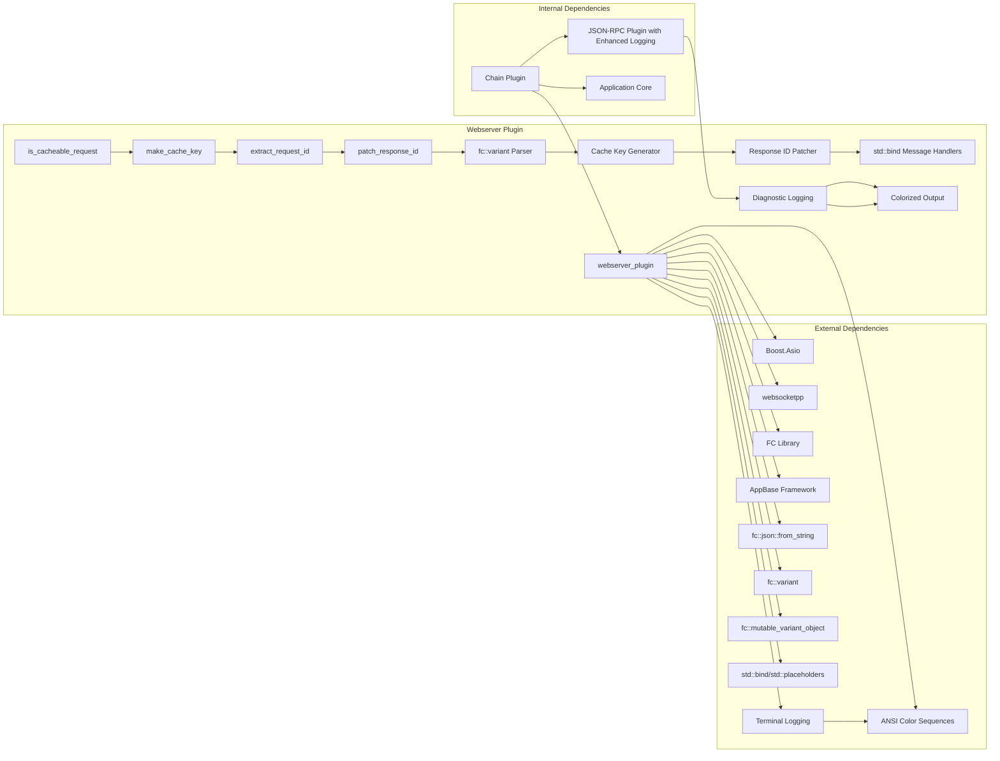

**Diagram sources**
- [webserver_plugin.hpp:3-9](file://plugins/webserver/include/graphene/plugins/webserver/webserver_plugin.hpp#L3-L9)
- [webserver_plugin.cpp:12-31](file://plugins/webserver/webserver_plugin.cpp#L12-L31)
- [webserver_plugin.cpp:87-113](file://plugins/webserver/webserver_plugin.cpp#L87-L113)
- [plugin.cpp:258-288](file://plugins/json_rpc/plugin.cpp#L258-L288)

### JSON-RPC Integration Details
The plugin integrates with the JSON-RPC system through method registration and call delegation using fc::json::from_string for proper JSON parsing with enhanced fc::variant object handling, modernized std::bind-based handler implementations, and enhanced diagnostic logging with ANSI color support:

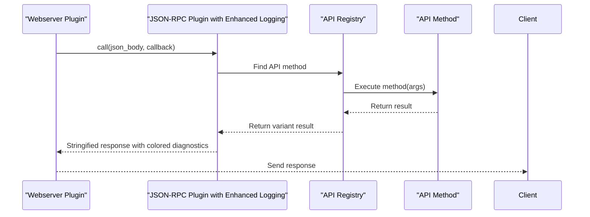

**Diagram sources**
- [plugin.cpp:180-200](file://plugins/json_rpc/plugin.cpp#L180-L200)
- [webserver_plugin.cpp:398](file://plugins/webserver/webserver_plugin.cpp#L398)
- [webserver_plugin.cpp:468](file://plugins/webserver/webserver_plugin.cpp#L468)

**Updated** Enhanced with fc::json::from_string-based JSON parsing, robust error handling, comprehensive fc::variant object processing, modernized std::bind-based handler implementations, and enhanced diagnostic logging with ANSI gray color support.

**Section sources**
- [webserver_plugin.hpp:38](file://plugins/webserver/include/graphene/plugins/webserver/webserver_plugin.hpp#L38)
- [webserver_plugin.cpp:224](file://plugins/webserver/webserver_plugin.cpp#L224)
- [plugin.cpp:159-178](file://plugins/json_rpc/plugin.cpp#L159-L178)

## Performance Considerations
The webserver plugin implements several performance optimization strategies with intelligent caching control using fc::variant-based JSON parsing and modernized std::bind bindings:

### Intelligent Caching Strategy
- **Request Classification**: Automatic determination of cacheable vs non-cacheable requests based on API mutability using fc::variant parsing
- **SHA256 Hash Keys**: Unique request identification for cache entries using cryptographic hashing with fc::json::from_string
- **Block-Based Invalidation**: Cache cleared on each new block to prevent stale data through blockchain event subscription
- **Thread-Safe Operations**: Mutex protection for concurrent access across multiple worker threads
- **Eviction Policy**: Automatic cache clearing when maximum size is reached to prevent memory exhaustion
- **Selective Caching**: Prevents cache pollution from mutating API calls (network_broadcast_api, debug_node)
- **Id-Independent Keys**: Prevents cache bypass attacks via id rotation patterns using fc::variant-based key generation
- **Robust JSON Parsing**: Reliable fc::json::from_string-based request parsing instead of complex object traversal
- **fc::variant Efficiency**: Optimized fc::variant usage for JSON parsing and manipulation with proper object lifetime management
- **Modernized Bindings**: Efficient std::bind usage with std::placeholders for better C++11 compatibility and performance
- **Enhanced Logging Performance**: ANSI color logging with minimal overhead for improved debugging without impacting performance

### Concurrency Model
- **Separate IO Services**: HTTP and WebSocket servers use dedicated io_service instances for isolation
- **Configurable Thread Pool**: Adjustable worker thread count based on workload using appbase scheduler with modernized std::bind bindings
- **Non-blocking Operations**: Async processing prevents thread starvation and improves throughput
- **Connection Pooling**: Efficient WebSocket connection handling with proper resource management

### Memory Management
- **Smart Pointers**: Proper resource management for server instances and cache entries
- **RAII Patterns**: Automatic cleanup on plugin shutdown through destructor implementations
- **Cache Size Limits**: Configurable maximum cache size to prevent unbounded memory growth
- **Blacklist Optimization**: Reduces unnecessary cache storage for mutating API calls
- **fc::variant Efficiency**: Optimized fc::variant usage for JSON parsing and manipulation with proper memory management
- **Modernized Bindings**: Efficient std::bind usage with std::placeholders for better performance and C++11 compatibility
- **Color Logging Overhead**: Minimal performance impact from ANSI color sequences in diagnostic logging

**Updated** Enhanced with fc::variant-based JSON parsing, robust cache validation, comprehensive performance optimizations, improved fc::variant object handling, modernized std::bind-based thread pool management, and enhanced diagnostic logging with ANSI gray color support.

**Section sources**
- [webserver-plugin.md:29-64](file://documentation/webserver-plugin.md#L29-L64)
- [webserver_plugin.cpp:207-234](file://plugins/webserver/webserver_plugin.cpp#L207-L234)
- [webserver_plugin.cpp:87-113](file://plugins/webserver/webserver_plugin.cpp#L87-L113)

## Security Considerations
The webserver plugin provides multiple layers of security for production deployments with enhanced API access control using fc::variant-based JSON parsing and modernized std::bind bindings:

### Network Security
- **Localhost Binding**: Recommended practice for internal services using 127.0.0.1 binding
- **External Access Control**: Use 0.0.0.0 binding only for trusted networks
- **Port Management**: Separate HTTP (8090) and WebSocket (8091) ports for different access patterns

### API Access Control
- **Public API Restriction**: Use `public-api` configuration to limit exposed API surface
- **Authentication**: Implement `api-user` authentication for sensitive operations
- **Rate Limiting**: Consider external rate limiting solutions for public APIs
- **Mutating API Protection**: Automatic blacklist prevents caching of state-changing operations

### Input Validation
- **JSON-RPC Validation**: Built-in validation of JSON-RPC 2.0 compliance using fc::json::from_string
- **Method Whitelisting**: Only registered API methods are callable
- **Parameter Validation**: Type checking and parameter validation for API calls
- **Request Classification**: Automatic detection of potentially malicious mutating requests using fc::variant parsing

### Resource Protection
- **Thread Pool Limits**: Configurable thread pool size prevents resource exhaustion
- **Cache Size Limits**: Configurable cache limits prevent memory abuse
- **Connection Limits**: WebSocket connections managed through proper thread pool utilization
- **Blacklist Enforcement**: Prevents cache poisoning from mutating API calls
- **Cache Bypass Prevention**: Id-independent keys prevent cache bypass attacks via request id rotation
- **Robust Error Handling**: Comprehensive fc::variant-based error handling prevents crashes
- **Malformed Request Protection**: Invalid JSON requests are handled gracefully without cache pollution
- **Modernized Bindings**: Efficient std::bind usage with std::placeholders for better performance and security
- **Enhanced Logging Security**: ANSI color logging provides clear visibility without exposing sensitive data

**Updated** Enhanced with fc::variant-based JSON parsing, robust error handling, comprehensive security measures, improved fc::variant object validation, modernized std::bind-based security implementations, and enhanced diagnostic logging with ANSI gray color support.

**Section sources**
- [webserver-plugin.md:77-108](file://documentation/webserver-plugin.md#L77-L108)

## Configuration Guide

### Basic Configuration
Enable the webserver plugin in `config.ini`:

```ini
plugin = webserver

# HTTP endpoint (required for HTTP API access)
webserver-http-endpoint = 127.0.0.1:8090

# WebSocket endpoint (required for WebSocket API access)
webserver-ws-endpoint = 127.0.0.1:8091

# Or use a single endpoint for both (deprecated)
# rpc-endpoint = 127.0.0.1:8090
```

### Advanced Configuration
```ini
# Thread pool configuration for high concurrency
webserver-thread-pool-size = 256

# Response caching configuration
webserver-cache-enabled = true
webserver-cache-size = 10000

# API access control
public-api = database_api
public-api = network_broadcast_api

# Authentication
api-user = username:password:database_api
```

### Production Configuration
For production deployments, consider:

```ini
# High performance settings
webserver-thread-pool-size = 512
webserver-cache-size = 50000

# Security settings
webserver-http-endpoint = 127.0.0.1:8090
webserver-ws-endpoint = 127.0.0.1:8091

# API restrictions
public-api = database_api
public-api = account_by_key
```

**Updated** Enhanced with actual implementation details and current configuration options, including improved rpc-endpoint processing order that prioritizes specific endpoints over deprecated combined endpoints.

**Section sources**
- [webserver-plugin.md:12-27](file://documentation/webserver-plugin.md#L12-L27)
- [webserver-plugin.md:40-48](file://documentation/webserver-plugin.md#L40-L48)
- [webserver-plugin.md:109-125](file://documentation/webserver-plugin.md#L109-L125)

## Troubleshooting Guide

### Common Issues and Solutions

#### Server Binding Failures
**Problem**: Unable to bind to specified endpoints
**Solution**: Verify port availability and network permissions
- Check if ports are already in use
- Ensure proper network interface binding
- Verify firewall configuration

#### High Memory Usage
**Problem**: Excessive memory consumption from caching
**Solution**: Adjust cache configuration
- Reduce `webserver-cache-size` value
- Disable caching for low-traffic scenarios
- Monitor cache hit ratios and memory usage

#### Performance Degradation
**Problem**: Slow response times under load
**Solution**: Optimize thread pool configuration
- Increase `webserver-thread-pool-size`
- Monitor thread utilization and queue lengths
- Consider hardware resource allocation

### Error Handling Patterns
The plugin implements comprehensive error handling with intelligent request classification using fc::variant-based JSON parsing:

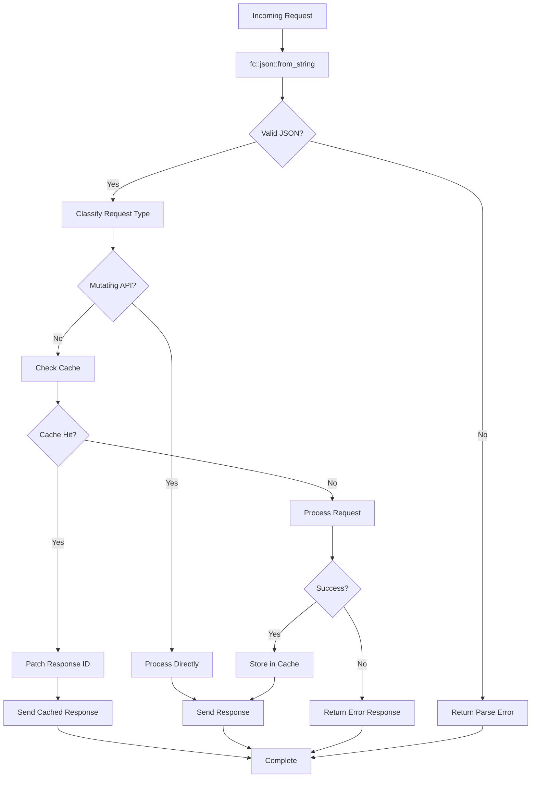

**Diagram sources**
- [webserver_plugin.cpp:352-416](file://plugins/webserver/webserver_plugin.cpp#L352-L416)
- [webserver_plugin.cpp:418-495](file://plugins/webserver/webserver_plugin.cpp#L418-L495)
- [webserver_plugin.cpp:398](file://plugins/webserver/webserver_plugin.cpp#L398)

**Updated** Enhanced with fc::variant-based JSON parsing, robust error handling, intelligent request classification, comprehensive fc::variant object processing, and modernized std::bind-based error handling implementations.

### Debugging and Monitoring
- **Log Levels**: Configure appropriate log levels for debugging
- **Connection Monitoring**: Monitor active WebSocket connections
- **Performance Metrics**: Track cache hit rates and thread pool utilization
- **Error Analysis**: Review error logs for common issues
- **Request Classification**: Monitor which requests are classified as mutating vs non-mutating
- **Cache Efficiency**: Monitor cache key generation and collision rates
- **fc::variant Parsing**: Monitor JSON parsing performance and error rates
- **Configuration Processing**: Monitor rpc-endpoint processing order and endpoint resolution
- **Modernized Bindings**: Monitor std::bind usage and std::placeholders performance
- **Enhanced Logging**: Monitor ANSI color logging output for improved debugging visibility

**Updated** Enhanced with fc::variant-based JSON parsing monitoring, comprehensive debugging capabilities, improved configuration processing diagnostics, modernized std::bind-based monitoring implementations, and enhanced diagnostic logging with ANSI gray color support.

**Section sources**
- [webserver_plugin.cpp:352-416](file://plugins/webserver/webserver_plugin.cpp#L352-L416)
- [webserver_plugin.cpp:418-495](file://plugins/webserver/webserver_plugin.cpp#L418-L495)
- [webserver_plugin.cpp:398](file://plugins/webserver/webserver_plugin.cpp#L398)

## Logging and Diagnostics

### Enhanced Diagnostic Logging with ANSI Color Support
The JSON RPC plugin now includes enhanced diagnostic logging with ANSI gray color support to help developers quickly distinguish between normal operation and diagnostic information:

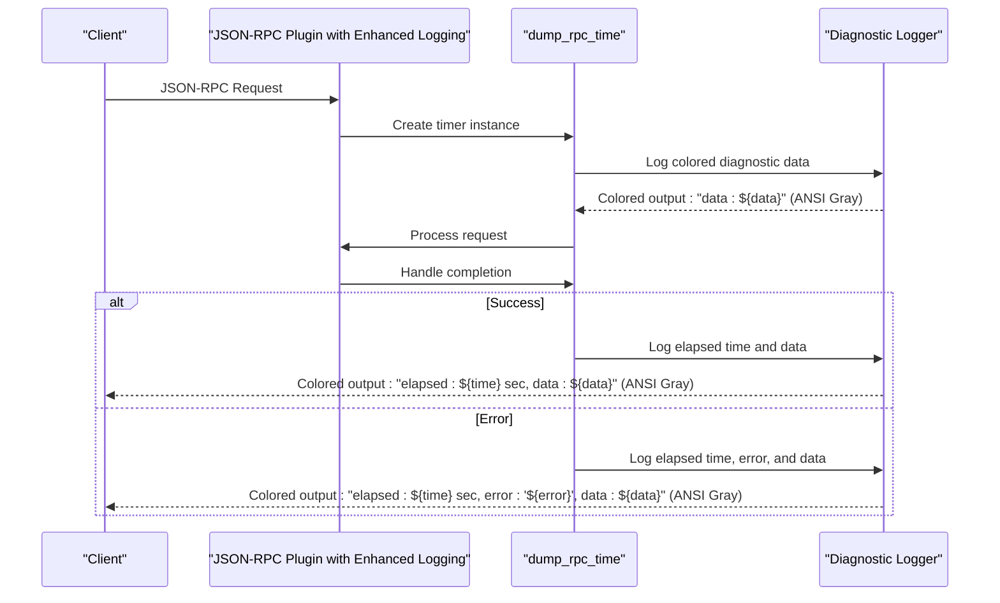

**Diagram sources**
- [plugin.cpp:258-288](file://plugins/json_rpc/plugin.cpp#L258-L288)

### ANSI Color Coding Features
The diagnostic logging system uses ANSI escape sequences for visual distinction:

- **Gray Color Codes**: `\033[90m` for diagnostic information
- **Reset Code**: `\033[0m` to restore normal terminal colors
- **Timing Information**: Elapsed time measurements in seconds
- **Data Processing**: Request/response data visualization with enhanced readability
- **Error Context**: Error messages with associated timing data
- **Improved Debugging**: Visual separation between normal application logs and diagnostic information

### Developer Experience Improvements
- **Visual Separation**: Gray-colored diagnostic logs help distinguish from normal application logs
- **Real-time Timing**: Precise timing measurements for request processing
- **Data Visibility**: Structured logging of request/response data with enhanced formatting
- **Error Tracking**: Comprehensive error logging with timing context for better debugging
- **Performance Insights**: Easy identification of slow operations through timing data
- **Enhanced Readability**: Improved log readability with color-coded diagnostic information

**Updated** Enhanced with fc::variant-based JSON parsing and comprehensive diagnostic logging with ANSI gray color support for improved developer experience and debugging capabilities.

**Section sources**
- [plugin.cpp:258-288](file://plugins/json_rpc/plugin.cpp#L258-L288)

## Conclusion
The Webserver Plugin provides a robust, high-performance solution for exposing VIZ blockchain functionality through HTTP and WebSocket interfaces. Its architecture emphasizes scalability through concurrent processing, reliability through comprehensive error handling, and efficiency through intelligent caching mechanisms with request classification using fc::variant-based JSON parsing. The plugin's modular design and extensive configuration options make it suitable for various deployment scenarios, from development environments to production public API services.

Key strengths of the implementation include:
- **High Concurrency**: Thread pool architecture supporting thousands of concurrent requests with modernized std::bind bindings
- **Intelligent Caching**: Block-aware cache invalidation with automatic request classification preventing stale data using fc::variant parsing
- **Selective Caching**: Automatic blacklist for mutating API calls (network_broadcast_api, debug_node) preventing cache pollution
- **Flexible Deployment**: Separate HTTP and WebSocket endpoints with independent configuration
- **Production Ready**: Comprehensive error handling and graceful degradation
- **Security Features**: Multiple layers of security including intelligent request classification for mutating APIs
- **Enhanced Diagnostics**: ANSI color-coded logging system with gray color support for improved developer experience
- **Extensible Design**: Clean separation of concerns enabling easy maintenance and enhancement
- **Performance Optimizations**: Major improvements to caching mechanism with id-independent keys and fc::variant-based JSON parsing
- **Robust Request Processing**: Enhanced WebSocket/HTTP handler support with improved request classification and cache management using modernized std::bind bindings
- **fc::variant Integration**: Comprehensive fc::variant-based JSON parsing and manipulation for optimal performance
- **Comprehensive Error Handling**: Robust fc::json::from_string-based error handling preventing crashes and improving reliability
- **Enhanced Configuration Management**: Improved rpc-endpoint processing order with proper endpoint resolution and deprecation warnings
- **Modernized C++11 Compatibility**: Efficient std::bind usage with std::placeholders for better C++11 compatibility and performance
- **Efficient Thread Pool Management**: Modernized std::bind-based thread pool management with std::placeholders for optimal performance
- **Enhanced Logging System**: ANSI color-coded diagnostic logging with gray color support for improved debugging and monitoring capabilities

The plugin serves as an excellent foundation for building applications that require programmatic access to VIZ blockchain data and operations, with performance characteristics suitable for both private deployments and public API services. Its sophisticated caching mechanism with intelligent request classification, multi-threaded architecture with modernized std::bind bindings, comprehensive error handling, fc::variant-based JSON parsing, enhanced diagnostic logging with ANSI gray color support, improved configuration management with rpc-endpoint processing order changes, and efficient std::bind-based thread pool management make it a production-ready solution for enterprise-grade blockchain applications.

**Updated** Enhanced conclusion reflecting the expanded implementation details, fc::variant-based JSON parsing, intelligent request classification system, selective caching mechanisms, enhanced WebSocket/HTTP handler support with modernized std::bind bindings, major performance optimizations including id-independent cache keys, comprehensive cache configuration options, improved configuration management with rpc-endpoint processing order changes, modernized C++11 compatibility with std::bind and std::placeholders usage, and enhanced diagnostic logging with ANSI gray color support for improved debugging capabilities.