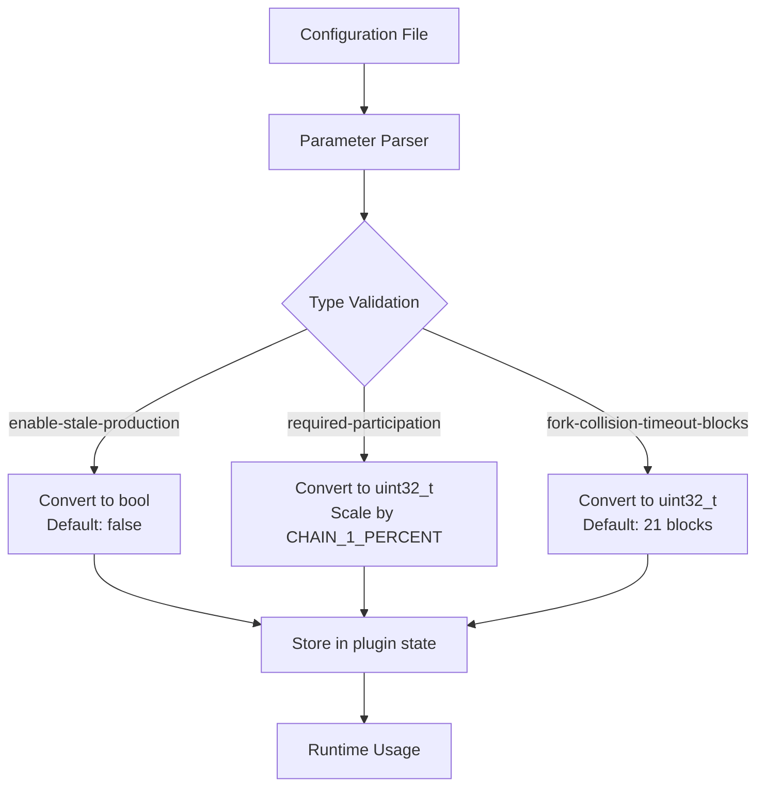
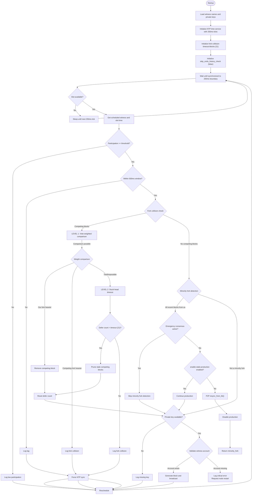
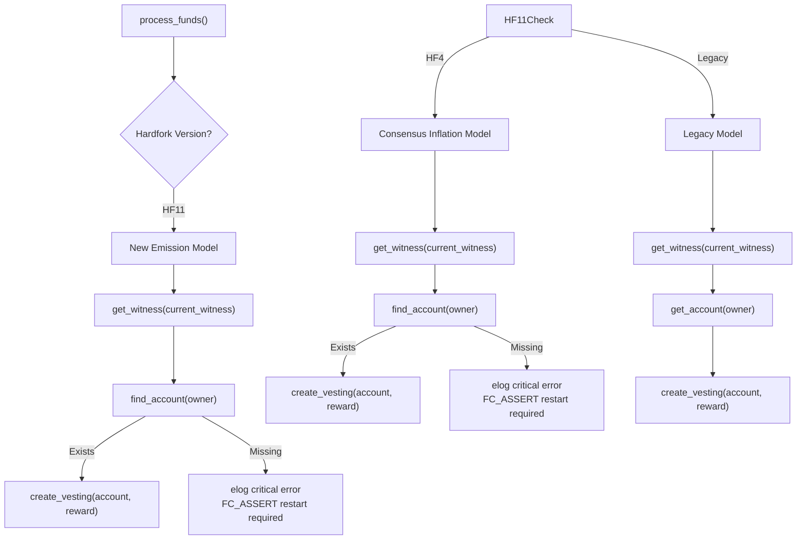
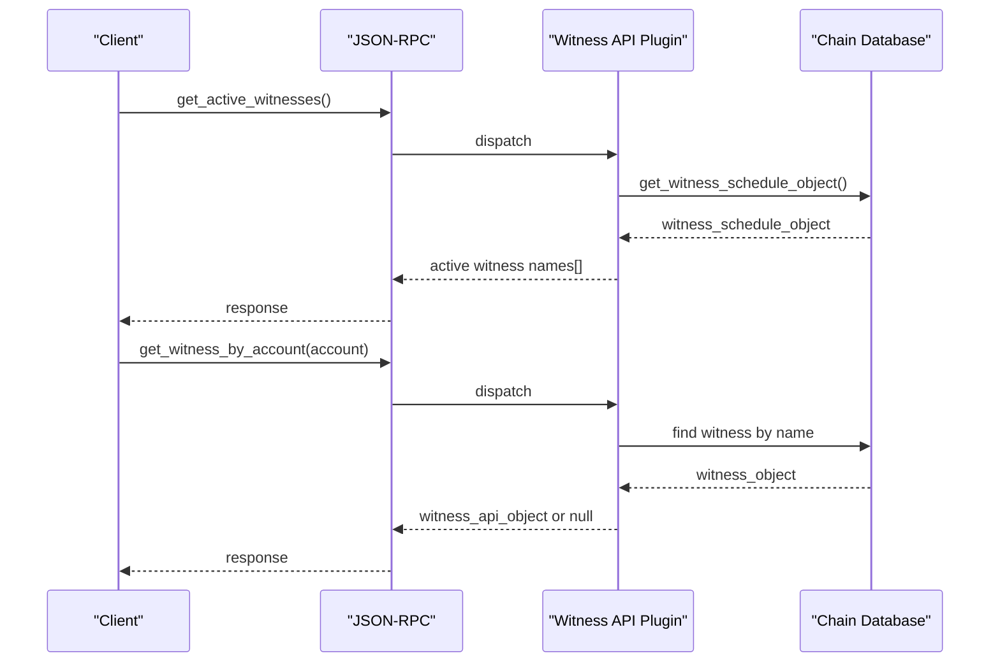
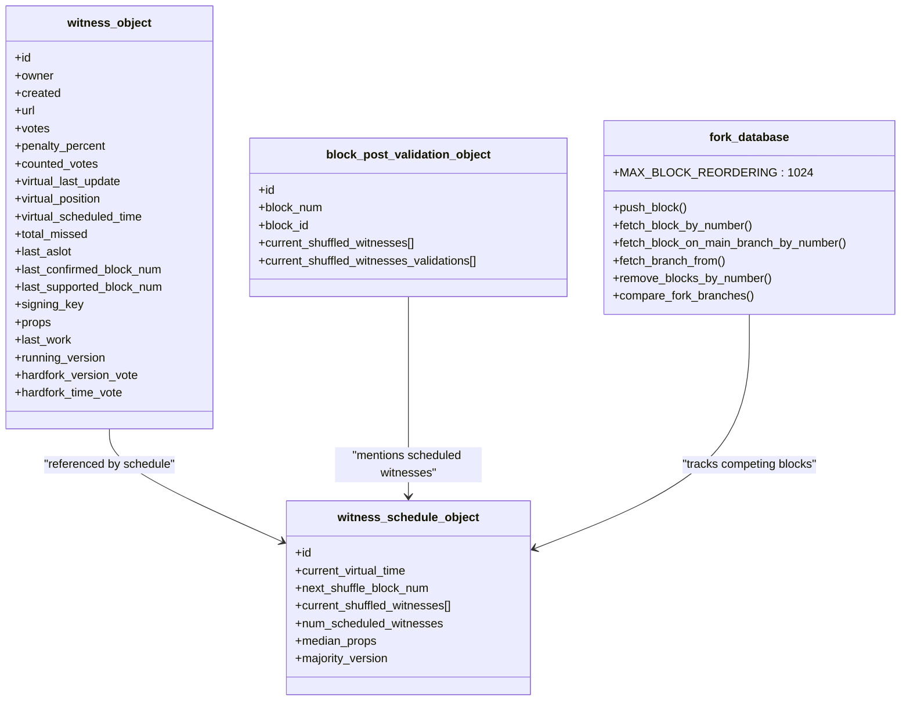
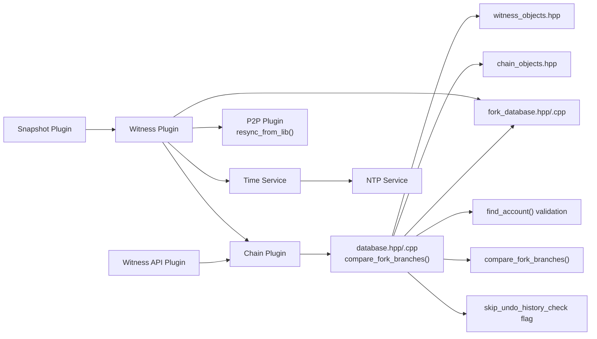

# Witness

<cite>
**Referenced Files in This Document**
- [witness.hpp](file://plugins/witness/include/graphene/plugins/witness/witness.hpp)
- [witness.cpp](file://plugins/witness/witness.cpp)
- [witness_api_plugin.hpp](file://plugins/witness_api/include/graphene/plugins/witness_api/plugin.hpp)
- [witness_api_plugin.cpp](file://plugins/witness_api/plugin.cpp)
- [witness_objects.hpp](file://libraries/chain/include/graphene/chain/witness_objects.hpp)
- [chain_objects.hpp](file://libraries/chain/include/graphene/chain/chain_objects.hpp)
- [database.hpp](file://libraries/chain/include/graphene/chain/database.hpp)
- [database.cpp](file://libraries/chain/database.cpp)
- [fork_database.hpp](file://libraries/chain/include/graphene/chain/fork_database.hpp)
- [fork_database.cpp](file://libraries/chain/fork_database.cpp)
- [time.hpp](file://libraries/time/time.hpp)
- [time.cpp](file://libraries/time/time.cpp)
- [ntp.cpp](file://thirdparty/fc/src/network/ntp.cpp)
- [main.cpp](file://programs/vizd/main.cpp)
- [snapshot_plugin.cpp](file://plugins/snapshot/plugin.cpp)
- [config.hpp](file://libraries/protocol/include/graphene/protocol/config.hpp)
- [config.ini](file://share/vizd/config/config.ini)
- [config_witness.ini](file://share/vizd/config/config_witness.ini)
- [p2p_plugin.hpp](file://plugins/p2p/include/graphene/plugins/p2p/p2p_plugin.hpp)
</cite>

## Update Summary
**Changes Made**
- Added new minority fork detection capabilities with automatic recovery mechanisms
- Enhanced block production logic to handle minority fork scenarios with skip_undo_history_check flag
- Added new minority_fork enumeration value (10) to block_production_condition_enum
- Implemented automatic recovery through resync_from_lib() method when minority fork is detected
- Enhanced emergency consensus mode integration with minority fork detection
- Updated configuration parameter processing with improved type safety and scaling

## Table of Contents
1. [Introduction](#introduction)
2. [Project Structure](#project-structure)
3. [Core Components](#core-components)
4. [Architecture Overview](#architecture-overview)
5. [Configuration Parameters](#configuration-parameters)
6. [Detailed Component Analysis](#detailed-component-analysis)
7. [Dependency Analysis](#dependency-analysis)
8. [Performance Considerations](#performance-considerations)
9. [Troubleshooting Guide](#troubleshooting-guide)
10. [Conclusion](#conclusion)

## Introduction
This document explains the Witness subsystem of the VIZ node implementation. It covers how witnesses are scheduled, how blocks are produced, how witness participation is monitored, and how the witness-related APIs expose information to clients. The focus is on the witness plugin (block production), the witness API plugin (read-only queries), and the underlying chain database that maintains witness state and schedules.

**Updated** Enhanced with improved witness block production timing featuring 250ms interval optimization, deterministic slot time alignment, comprehensive fork collision detection, crash-safe NTP synchronization, strengthened witness reward creation validation with find_account() checks, new fork collision timeout configuration, two-level fork resolution system, enhanced fork database integration with compare_fork_branches() function, automatic stale fork pruning capabilities, **NEW**: comprehensive minority fork detection system with automatic recovery mechanisms, **NEW**: enhanced emergency consensus mode integration, **NEW**: skip_undo_history_check flag for controlled production during recovery scenarios.

## Project Structure
The Witness functionality spans three primary areas:
- Witness plugin: Produces blocks and validates blocks posted by other witnesses with optimized timing.
- Witness API plugin: Exposes witness-related read-only queries via JSON-RPC.
- Chain database: Maintains witness objects, voting, scheduling, and participation metrics.

```mermaid
graph TB
subgraph "Node Binary"
VIZD["vizd main<br/>registers plugins"]
end
subgraph "Plugins"
WITNESS["Witness Plugin<br/>optimized block production<br/>fork collision timeout: 21 blocks<br/>minority fork detection"]
WAPI["Witness API Plugin<br/>JSON-RPC queries"]
SNAPSHOT["Snapshot Plugin<br/>coordinated operations"]
P2P["P2P Plugin<br/>broadcast<br/>resync_from_lib()"]
CHAIN["Chain Plugin<br/>database access"]
end
subgraph "Chain Database"
DB["database.hpp/.cpp<br/>compare_fork_branches()"]
WITNESS_OBJ["witness_objects.hpp"]
BPV_OBJ["chain_objects.hpp<br/>block_post_validation_object"]
FORK_DB["fork_database.hpp/.cpp<br/>enhanced fork collision detection<br/>automatic stale pruning"]
end
subgraph "Time Synchronization"
TIME["Time Service<br/>NTP synchronization with 250ms ticks"]
END
VIZD --> WITNESS
VIZD --> WAPI
VIZD --> SNAPSHOT
VIZD --> P2P
VIZD --> CHAIN
WITNESS --> P2P
WITNESS --> CHAIN
WITNESS --> TIME
CHAIN --> DB
DB --> WITNESS_OBJ
DB --> BPV_OBJ
DB --> FORK_DB
WAPI --> CHAIN
CHAIN --> DB
SNAPSHOT --> WITNESS
```

**Diagram sources**
- [main.cpp:63-92](file://programs/vizd/main.cpp#L63-L92)
- [witness.hpp:34-68](file://plugins/witness/include/graphene/plugins/witness/witness.hpp#L34-L68)
- [witness.cpp:59-118](file://plugins/witness/witness.cpp#L59-L118)
- [witness_api_plugin.hpp:56-98](file://plugins/witness_api/include/graphene/plugins/witness_api/plugin.hpp#L56-L98)
- [witness_api_plugin.cpp:13-28](file://plugins/witness_api/plugin.cpp#L13-L28)
- [database.hpp:37-83](file://libraries/chain/include/graphene/chain/database.hpp#L37-L83)
- [witness_objects.hpp:27-132](file://libraries/chain/include/graphene/chain/witness_objects.hpp#L27-L132)
- [chain_objects.hpp:174-201](file://libraries/chain/include/graphene/chain/chain_objects.hpp#L174-L201)
- [fork_database.hpp:53-81](file://libraries/chain/include/graphene/chain/fork_database.hpp#L53-L81)
- [time.cpp:13-53](file://libraries/time/time.cpp#L13-L53)
- [snapshot_plugin.cpp:1267-1276](file://plugins/snapshot/plugin.cpp#L1267-1276)
- [p2p_plugin.hpp:50-55](file://plugins/p2p/include/graphene/plugins/p2p/p2p_plugin.hpp#L50-L55)

**Section sources**
- [main.cpp:63-92](file://programs/vizd/main.cpp#L63-L92)

## Core Components
- Witness Plugin
  - Provides optimized block production loop synchronized to 250ms intervals for deterministic slot time alignment.
  - Validates whether it is time to produce a block, checks participation thresholds, and signs blocks with configured private keys.
  - Broadcasts blocks and block post validations via the P2P plugin.
  - **Enhanced**: Implements forced NTP synchronization when timing issues are detected during block production attempts.
  - **Enhanced**: Implements comprehensive fork collision detection to prevent competing blocks at the same height.
  - **Enhanced**: **NEW**: Implements comprehensive minority fork detection system to identify when all recent blocks were produced by local witnesses only.
  - **Enhanced**: **NEW**: Provides automatic recovery through resync_from_lib() when minority fork is detected.
  - **Enhanced**: **NEW**: Integrates with skip_undo_history_check flag to control production during recovery scenarios.
  - **New**: Provides `is_witness_scheduled_soon()` method to check if any locally-controlled witnesses are scheduled to produce blocks in the upcoming 4 slots.
  - **New**: Implements two-level fork collision resolution system with configurable timeout blocks parameter (--fork-collision-timeout-blocks).
  - **New**: Integrates with enhanced fork database for automatic stale fork pruning after successful block application.
- Witness API Plugin
  - Exposes read-only queries for active witnesses, schedule, individual witnesses, and counts.
  - Returns API-friendly objects derived from chain witness data.
- Chain Database
  - Stores witness objects, schedules, participation metrics, and supports witness scheduling and participation computations.
  - Manages block post validation objects and updates last irreversible block computation based on witness confirmations.
  - **Enhanced**: Provides enhanced fork database access with comprehensive querying capabilities for fork collision detection.
  - **Enhanced**: Implements comprehensive witness reward creation with find_account() validation to prevent crashes from missing account objects.
  - **Enhanced**: **NEW**: Integrates with skip_undo_history_check flag for controlled production during recovery scenarios.
  - **New**: Implements compare_fork_branches() function for intelligent fork weight comparison with +10% longer-chain bonus.
  - **New**: Provides automatic stale fork pruning mechanism to remove competing blocks from dead forks.

**Updated** Added comprehensive error handling and validation for witness reward creation, including find_account() checks before creating vesting rewards, crash prevention mechanisms, clear recovery procedures for database corruption scenarios, new fork collision timeout configuration, two-level fork resolution system with vote-weighted comparison and stuck-head timeout, enhanced fork database querying capabilities, automatic stale fork pruning after successful block application, **NEW**: comprehensive minority fork detection system with automatic recovery mechanisms, **NEW**: enhanced emergency consensus mode integration, **NEW**: skip_undo_history_check flag for controlled production during recovery scenarios.

**Section sources**
- [witness.hpp:34-68](file://plugins/witness/include/graphene/plugins/witness/witness.hpp#L34-L68)
- [witness.cpp:59-118](file://plugins/witness/witness.cpp#L59-L118)
- [witness.cpp:206-249](file://plugins/witness/witness.cpp#L206-L249)
- [witness_api_plugin.hpp:56-98](file://plugins/witness_api/include/graphene/plugins/witness_api/plugin.hpp#L56-L98)
- [witness_api_plugin.cpp:13-28](file://plugins/witness_api/plugin.cpp#L13-L28)
- [database.hpp:37-83](file://libraries/chain/include/graphene/chain/database.hpp#L37-L83)

## Architecture Overview
The Witness subsystem integrates tightly with the chain database and P2P layer. The witness plugin periodically evaluates conditions to produce a block using optimized 250ms interval scheduling, consults the database for witness scheduling and participation, and broadcasts the resulting block. The witness API plugin reads from the database to serve JSON-RPC queries. **New**: Other plugins can now coordinate with witness scheduling using the `is_witness_scheduled_soon()` method to avoid conflicts during critical operations.

**Enhanced** The architecture now includes robust NTP time synchronization with automatic fallback mechanisms, crash-safe shutdown procedures, plugin coordination capabilities through the new scheduling method, comprehensive fork collision detection system with two-level resolution, enhanced fork database querying capabilities, automatic stale fork pruning, enhanced witness reward creation with comprehensive validation and error handling, **NEW**: comprehensive minority fork detection system with automatic recovery mechanisms, **NEW**: enhanced emergency consensus mode integration, **NEW**: skip_undo_history_check flag for controlled production during recovery scenarios.

```mermaid
sequenceDiagram
participant Timer as "Witness Impl<br/>schedule_production_loop (250ms ticks)"
participant NTP as "NTP Service<br/>time synchronization"
participant DB as "Chain Database"
participant ForkDB as "Fork Database<br/>collision detection<br/>stale pruning"
participant P2P as "P2P Plugin"
participant Net as "Network"
participant Snapshot as "Snapshot Plugin<br/>coordination"
Timer->>NTP : check_time_sync()
NTP-->>Timer : synchronized status
alt timing issues detected
Timer->>NTP : force_sync()
NTP-->>Timer : updated time
end
Timer->>Timer : compute next 250ms boundary
Timer->>DB : get_slot_at_time(now + 250ms)
DB-->>Timer : slot
alt slot available
Timer->>DB : get_scheduled_witness(slot)
Timer->>DB : get_slot_time(slot)
Timer->>DB : witness_participation_rate()
alt conditions met
alt fork collision check
Timer->>ForkDB : fetch_block_by_number(head_block_num + 1)
ForkDB-->>Timer : existing blocks at height
alt competing blocks exist
alt LEVEL 1 : Vote-weighted comparison
Timer->>DB : compare_fork_branches(competing_id, head_id)
DB-->>Timer : weight comparison result
alt weight comparison possible
alt competing fork heavier
Timer->>NTP : force_sync() on fork collision
Timer->>Timer : log fork collision and defer
else our fork heavier
Timer->>ForkDB : remove(competing_id)
Timer->>Timer : reset defer count
else tied/comparison impossible
alt LEVEL 2 : Stuck-head timeout
Timer->>Timer : fork_collision_defer_count++
alt timeout exceeded (21 blocks)
Timer->>ForkDB : remove_blocks_by_number(head_block_num + 1)
Timer->>Timer : reset defer count
Timer->>Timer : fall through to produce
else timeout not exceeded
Timer->>NTP : force_sync() on fork collision
Timer->>Timer : log fork collision and defer
end
else no competing blocks
alt minority fork detection
Timer->>ForkDB : check last CHAIN_MAX_WITNESSES blocks
alt all from our witnesses
alt emergency consensus active
Timer->>Timer : skip minority fork detection
else enable-stale-production enabled
Timer->>Timer : continue production
else enable-stale-production disabled
Timer->>P2P : resync_from_lib()
Timer->>Timer : production disabled
Timer->>Timer : return minority_fork
else not a minority fork
alt witness reward creation
Timer->>DB : get_witness(current_witness)
Timer->>DB : find_account(witness.owner)
alt account exists
Timer->>DB : create_vesting(account, reward)
Timer->>DB : push_virtual_operation(witness_reward)
else account missing
Timer->>DB : log critical error
Timer->>DB : FC_ASSERT restart required
end
Timer->>P2P : broadcast_block(block)
P2P->>Net : transmit block
end
else conditions not met
Timer->>NTP : update_ntp_time() on lag
Timer->>Timer : log reason (sync, participation, key, lag)
end
else no slot
Timer->>Timer : wait until next 250ms tick
end
Timer->>Timer : reschedule for next 250ms tick
Note over Snapshot : Check if witness scheduled soon<br/>to coordinate operations
Snapshot->>Timer : is_witness_scheduled_soon()
Timer-->>Snapshot : true/false
```

**Diagram sources**
- [witness.cpp:206-276](file://plugins/witness/witness.cpp#L206-L276)
- [witness.cpp:278-423](file://plugins/witness/witness.cpp#L278-L423)
- [witness.cpp:447-471](file://plugins/witness/witness.cpp#L447-L471)
- [witness.cpp:590-695](file://plugins/witness/witness.cpp#L590-L695)
- [witness.cpp:263-266](file://plugins/witness/witness.cpp#L263-L266)
- [witness.cpp:206-249](file://plugins/witness/witness.cpp#L206-L249)
- [database.cpp:4317-4332](file://libraries/chain/database.cpp#L4317-L4332)
- [time.cpp:74-76](file://libraries/time/time.cpp#L74-L76)
- [snapshot_plugin.cpp:1267-1276](file://plugins/snapshot/plugin.cpp#L1267-1276)
- [database.cpp:2824-2839](file://libraries/chain/database.cpp#L2824-L2839)
- [database.cpp:2871-2886](file://libraries/chain/database.cpp#L2871-L2886)
- [database.cpp:1223-1267](file://libraries/chain/database.cpp#L1223-L1267)
- [p2p_plugin.hpp:50-55](file://plugins/p2p/include/graphene/plugins/p2p/p2p_plugin.hpp#L50-L55)

## Configuration Parameters

### Parameter Types and Scaling

The witness plugin configuration parameters have been updated with improved type safety and scaling:

- **enable-stale-production**: Boolean parameter controlling whether block production continues when the chain is stale
  - Type: `bool` (previously `int`)
  - Default: `false` (changed from `true`)
  - Purpose: Allows production even when the node is behind the chain head
  - Command line: `--enable-stale-production`
  - Config file: `enable-stale-production`

- **required-participation**: Integer parameter specifying minimum witness participation percentage
  - Type: `uint32_t` (changed from `int`)
  - Scale: Multiplied by `CHAIN_1_PERCENT` (100 units = 1%)
  - Range: 0-99% (0-9900 units)
  - Default: 33% (3300 units)
  - Command line: `--required-participation`
  - Config file: `required-participation`

- **fork-collision-timeout-blocks**: New parameter controlling fork collision timeout behavior
  - Type: `uint32_t`
  - Default: 21 blocks (one full witness round, 63 seconds)
  - Purpose: Number of consecutive fork-collision deferrals before forcing production
  - Command line: `--fork-collision-timeout-blocks`
  - Config file: `fork-collision-timeout-blocks`

### Configuration Defaults

**Updated** The default values have been corrected for production stability:

- **enable-stale-production**: Now defaults to `false` to improve network stability and prevent minority fork propagation
- **required-participation**: Defaults to 33% participation threshold for balanced security/performance
- **fork-collision-timeout-blocks**: Defaults to 21 blocks to match one full witness schedule round

### Configuration Processing

The configuration parameters are processed during plugin initialization:



**Diagram sources**
- [witness.cpp:125-133](file://plugins/witness/witness.cpp#L125-L133)
- [witness.cpp:149-155](file://plugins/witness/witness.cpp#L149-L155)
- [witness.cpp:222-224](file://plugins/witness/witness.cpp#L222-L224)
- [config.hpp:57-58](file://libraries/protocol/include/graphene/protocol/config.hpp#L57-L58)

**Section sources**
- [witness.cpp:125-133](file://plugins/witness/witness.cpp#L125-L133)
- [witness.cpp:149-155](file://plugins/witness/witness.cpp#L149-L155)
- [witness.cpp:222-224](file://plugins/witness/witness.cpp#L222-L224)
- [config.hpp:57-58](file://libraries/protocol/include/graphene/protocol/config.hpp#L57-L58)
- [config.ini:99-103](file://share/vizd/config/config.ini#L99-L103)
- [config_witness.ini:76-80](file://share/vizd/config/config_witness.ini#L76-L80)

## Detailed Component Analysis

### Witness Plugin
Responsibilities:
- Parse configuration for witness names and private keys.
- Initialize NTP time synchronization with 250ms interval optimization.
- Run a production loop that:
  - Waits until synchronized to the next 250ms boundary for deterministic slot alignment.
  - Checks participation thresholds and scheduling eligibility.
  - **Enhanced**: Performs comprehensive fork collision detection before block generation.
  - **Enhanced**: **NEW**: Implements comprehensive minority fork detection to identify when all recent blocks were produced by local witnesses only.
  - **Enhanced**: **NEW**: Provides automatic recovery through resync_from_lib() when minority fork is detected.
  - **Enhanced**: **NEW**: Integrates with skip_undo_history_check flag for controlled production during recovery scenarios.
  - **New**: Implements two-level fork collision resolution system with configurable timeout.
  - Generates and broadcasts blocks when eligible.
  - Signs and broadcasts block post validations when available.
  - **Enhanced**: Forces NTP synchronization when timing issues or fork collisions are detected during production attempts.
  - **New**: Provides `is_witness_scheduled_soon()` method for external coordination.

Key behaviors:
- Participation threshold enforcement via witness participation rate.
- Graceful handling of missing private keys, low participation, and timing lags.
- Optional allowance for stale production during initial sync.
- **Enhanced**: Automatic NTP synchronization on lag detection and fork collision to prevent timing-related production failures.
- **Enhanced**: Comprehensive fork collision detection prevents competing blocks at the same height.
- **Enhanced**: **NEW**: Minority fork detection identifies when all recent blocks were produced by local witnesses only.
- **Enhanced**: **NEW**: Automatic recovery through P2P resynchronization when minority fork is detected.
- **Enhanced**: **NEW**: Controlled production during recovery scenarios using skip_undo_history_check flag.
- **New**: Efficient slot checking across 4 upcoming slots to detect witness scheduling conflicts.
- **New**: Two-level fork collision resolution with vote-weighted comparison and stuck-head timeout mechanism.
- **New**: Configurable fork collision timeout blocks parameter for fine-tuning fork resolution behavior.



**Diagram sources**
- [witness.cpp:206-276](file://plugins/witness/witness.cpp#L206-L276)
- [witness.cpp:278-423](file://plugins/witness/witness.cpp#L278-L423)
- [witness.cpp:447-471](file://plugins/witness/witness.cpp#L447-L471)
- [witness.cpp:590-695](file://plugins/witness/witness.cpp#L590-L695)
- [witness.cpp:263-266](file://plugins/witness/witness.cpp#L263-L266)
- [witness.cpp:509-555](file://plugins/witness/witness.cpp#L509-L555)
- [p2p_plugin.hpp:50-55](file://plugins/p2p/include/graphene/plugins/p2p/p2p_plugin.hpp#L50-L55)

**Section sources**
- [witness.hpp:34-68](file://plugins/witness/include/graphene/plugins/witness/witness.hpp#L34-L68)
- [witness.cpp:120-169](file://plugins/witness/witness.cpp#L120-L169)
- [witness.cpp:171-192](file://plugins/witness/witness.cpp#L171-L192)
- [witness.cpp:206-276](file://plugins/witness/witness.cpp#L206-L276)
- [witness.cpp:278-423](file://plugins/witness/witness.cpp#L278-L423)
- [witness.cpp:447-471](file://plugins/witness/witness.cpp#L447-L471)
- [witness.cpp:590-695](file://plugins/witness/witness.cpp#L590-L695)
- [witness.cpp:206-249](file://plugins/witness/witness.cpp#L206-L249)
- [witness.cpp:509-555](file://plugins/witness/witness.cpp#L509-L555)

### New: Enhanced Minoriy Fork Detection System
The witness plugin now implements a comprehensive minority fork detection system to identify when all recent blocks were produced by local witnesses only, indicating a potential minority fork scenario.

**Detection Logic**:
- Checks the last CHAIN_MAX_WITNESSES (21) blocks in the fork database
- Verifies that all blocks were produced by configured local witnesses
- Skips detection during emergency consensus mode to prevent false positives
- Integrates with skip_undo_history_check flag for controlled production during recovery

**Recovery Mechanisms**:
- **Automatic Recovery**: Calls P2P resync_from_lib() to reset sync from last irreversible block
- **Production Control**: Disables production temporarily during recovery
- **Flag Management**: Uses skip_undo_history_check to control production flags during recovery
- **Emergency Mode Protection**: Skips detection when emergency consensus is active

**Implementation Details**:
- Uses `db.get_fork_db().head()` to access the fork database head
- Iterates backwards through CHAIN_MAX_WITNESSES blocks to verify witness ownership
- Checks `_witnesses.find(current->data.witness) == _witnesses.end()` to detect foreign witnesses
- Calls `p2p().resync_from_lib()` for automatic recovery
- Returns `block_production_condition::minority_fork` to signal recovery state
- Integrates with emergency consensus detection via `dgp.emergency_consensus_active`

**Section sources**
- [witness.cpp:509-555](file://plugins/witness/witness.cpp#L509-L555)
- [witness.hpp:31](file://plugins/witness/include/graphene/plugins/witness/witness.hpp#L31)
- [database.hpp:88](file://libraries/chain/include/graphene/chain/database.hpp#L88)

### New: Enhanced Fork Collision Detection System
The witness plugin now implements a comprehensive fork collision detection system to prevent competing blocks at the same height.

**Detection Logic**:
- Queries the fork database for all blocks at the next height level (head_block_num + 1)
- Identifies competing blocks produced by different witnesses with different parent blocks
- Prevents block production when fork collision is detected
- Automatically triggers NTP synchronization to resolve timing issues

**Two-Level Resolution System**:
- **LEVEL 1: Vote-weighted comparison** (HF12+)
  - Uses compare_fork_branches() function to calculate vote weights for both forks
  - Applies +10% bonus to longer chain for fairness
  - Removes losing fork or defers production based on weight comparison
- **LEVEL 2: Stuck-head timeout** (All versions)
  - Tracks consecutive deferral count for fork collisions
  - Forces production after timeout exceeds configured blocks (default: 21)
  - Removes all competing blocks at the target height after timeout

**Implementation Details**:
- Uses `db.get_fork_db().fetch_block_by_number(db.head_block_num() + 1)` to query all blocks at the target height
- Analyzes each existing block to determine if it was produced by a different witness with a different parent
- Captures detailed information including height and scheduled witness for logging
- Returns `block_production_condition::fork_collision` to defer production
- Integrates with compare_fork_branches() function for intelligent fork switching decisions

**Section sources**
- [witness.cpp:447-471](file://plugins/witness/witness.cpp#L447-L471)
- [witness.cpp:590-695](file://plugins/witness/witness.cpp#L590-L695)
- [fork_database.hpp:73](file://libraries/chain/include/graphene/chain/fork_database.hpp#L73)
- [fork_database.cpp:151-166](file://libraries/chain/fork_database.cpp#L151-166)
- [database.cpp:1223-1267](file://libraries/chain/database.cpp#L1223-L1267)

### New: Enhanced Fork Database Integration with Automatic Stale Pruning
The fork database now includes automatic stale fork pruning capabilities to maintain database efficiency and prevent memory bloat.

**Automatic Stale Pruning Mechanism**:
- Executes after successful block application in _push_block() method
- Identifies competing blocks at the same height that are no longer part of the active chain
- Removes blocks whose parent is no longer in fork_db (indicating dead fork)
- Prevents accumulation of stale competing blocks in the fork database

**Pruning Logic**:
- Called after new block is successfully applied
- Fetches all competing blocks at new_block.block_num()
- Checks if competing block has unknown parent (not in fork_db)
- Removes stale competing blocks with log messages for debugging
- Preserves legitimate fork switching scenarios by only removing truly dead forks

**Integration Points**:
- Triggered in database::_push_block() after successful block application
- Works in conjunction with fork collision detection system
- Supports both HF12+ vote-weighted comparisons and pre-HF12 longest-chain rules
- Maintains fork database integrity and performance

**Section sources**
- [database.cpp:1456-1471](file://libraries/chain/database.cpp#L1456-L1471)
- [fork_database.cpp:269-274](file://libraries/chain/fork_database.cpp#L269-L274)

### New: Enhanced compare_fork_branches() Function
The database now includes a sophisticated compare_fork_branches() function that intelligently evaluates fork weight and chain length for decision-making.

**Function Capabilities**:
- Calculates total vote weight for each fork branch using witness objects
- Excludes emergency witness account from weight calculations
- Applies +10% bonus to longer chain to encourage network support
- Handles tied scenarios and comparison impossibility gracefully
- Returns 1 (branch_a heavier), -1 (branch_b heavier), or 0 (tied/impossible)

**Weight Calculation Algorithm**:
- Iterates through branch items to accumulate witness vote weights
- Uses flat_set to avoid counting the same witness multiple times
- Skips emergency witness account for fairness
- Handles exceptions during witness lookup gracefully
- Returns 0 when comparison cannot be performed

**Integration with Fork Resolution**:
- Used by witness plugin for vote-weighted fork comparisons
- Supports HF12+ consensus rules with longer-chain bonus
- Provides fallback for pre-HF12 longest-chain scenarios
- Enables intelligent fork switching decisions

**Section sources**
- [database.cpp:1223-1267](file://libraries/chain/database.cpp#L1223-L1267)

### New: is_witness_scheduled_soon() Method
The `is_witness_scheduled_soon()` method provides a crucial coordination mechanism for other plugins to avoid conflicts during critical operations.

**Method Signature**: `bool is_witness_scheduled_soon() const`

**Purpose**: Checks if any locally-controlled witnesses are scheduled to produce blocks in the upcoming 4 slots, enabling other plugins to coordinate and avoid conflicts during critical operations like snapshot creation.

**Implementation Details**:
- Validates that the witness plugin has been initialized with witnesses and private keys
- Calculates the current slot based on synchronized time plus 250ms buffer for deterministic alignment
- Iterates through slots 0-3 positions ahead to check for scheduled witnesses
- Verifies that the scheduled witness belongs to the locally-controlled set
- Confirms the witness has a valid signing key (not disabled)
- Ensures the plugin has the corresponding private key for block signing

**Usage Pattern**: Other plugins can use this method to defer operations when witness production is imminent, particularly useful for snapshot creation which requires exclusive access to the blockchain state.

**Section sources**
- [witness.cpp:206-249](file://plugins/witness/witness.cpp#L206-L249)

### Enhanced: Witness Reward Creation Process
The witness reward creation process has been significantly enhanced with comprehensive error handling and validation to prevent crashes when witness account objects are missing from the database.

**Enhanced Reward Creation Logic**:
- **Pre-validation**: Uses `find_account()` to check if the witness account exists before attempting reward creation
- **Crash Prevention**: Implements comprehensive validation to prevent crashes from shared memory corruption
- **Clear Recovery Guidance**: Provides explicit instructions for recovery procedures when accounts are missing
- **Multi-hardfork Support**: Applies validation across all hardfork versions (HF4, HF11, and legacy models)

**Implementation Details**:
- **HF11 Model**: Validates witness account before creating vesting rewards for new emission model
- **HF4 Model**: Comprehensive validation for consensus inflation model with detailed error logging
- **Legacy Model**: Falls back to `get_account()` with clear error messaging for older models
- **Critical Error Handling**: Logs detailed witness information (signing key, missed blocks, penalties) for debugging

**Error Handling Features**:
- Detailed logging with witness metadata (signing key, missed blocks, penalties, last confirmed block)
- Clear FC_ASSERT messages directing users to restart with replay
- Account index size reporting for diagnostic purposes
- Prevention of crashes during witness reward distribution



**Diagram sources**
- [database.cpp:2807-2839](file://libraries/chain/database.cpp#L2807-L2839)
- [database.cpp:2871-2886](file://libraries/chain/database.cpp#L2871-L2886)
- [database.cpp:2897-2914](file://libraries/chain/database.cpp#L2897-L2914)

**Section sources**
- [database.cpp:2807-2839](file://libraries/chain/database.cpp#L2807-L2839)
- [database.cpp:2871-2886](file://libraries/chain/database.cpp#L2871-L2886)
- [database.cpp:2897-2914](file://libraries/chain/database.cpp#L2897-L2914)
- [database.cpp:1294-1311](file://libraries/chain/database.cpp#L1294-L1311)

### Witness API Plugin
Responsibilities:
- Expose JSON-RPC endpoints for:
  - Active witnesses in the current schedule.
  - Full witness schedule object.
  - Witnesses by ID, by account, by votes, by counted votes.
  - Count of witnesses.
  - Lookup of witness accounts by name range.

Implementation highlights:
- Uses weak read locks around database queries.
- Enforces limits on returned sets (e.g., max 100 for vote-based lists).
- Converts chain witness objects to API-friendly structures.



**Diagram sources**
- [witness_api_plugin.cpp:30-49](file://plugins/witness_api/plugin.cpp#L30-L49)
- [witness_api_plugin.cpp:75-91](file://plugins/witness_api/plugin.cpp#L75-L91)
- [witness_api_plugin.cpp:102-125](file://plugins/witness_api/plugin.cpp#L102-L125)
- [witness_api_plugin.cpp:127-159](file://plugins/witness_api/plugin.cpp#L127-L159)
- [witness_api_plugin.cpp:161-169](file://plugins/witness_api/plugin.cpp#L161-L169)
- [witness_api_plugin.cpp:171-203](file://plugins/witness_api/plugin.cpp#L171-L203)

**Section sources**
- [witness_api_plugin.hpp:56-98](file://plugins/witness_api/include/graphene/plugins/witness_api/plugin.hpp#L56-L98)
- [witness_api_plugin.cpp:13-28](file://plugins/witness_api/plugin.cpp#L13-L28)
- [witness_api_plugin.cpp:30-49](file://plugins/witness_api/plugin.cpp#L30-L49)
- [witness_api_plugin.cpp:75-91](file://plugins/witness_api/plugin.cpp#L75-L91)
- [witness_api_plugin.cpp:102-159](file://plugins/witness_api/plugin.cpp#L102-L159)
- [witness_api_plugin.cpp:161-203](file://plugins/witness_api/plugin.cpp#L161-L203)

### Chain Database: Enhanced Fork Database Integration
The database maintains:
- Witness objects with voting, signing keys, virtual scheduling fields, and participation counters.
- Witness schedule object with shuffled witnesses, current virtual time, and majority version.
- Block post validation objects used to coordinate cross-witness validation.
- **Enhanced**: Direct fork database access through `get_fork_db()` method for comprehensive fork collision detection.
- **Enhanced**: Comprehensive witness reward creation with find_account() validation to prevent crashes from missing account objects.
- **Enhanced**: **NEW**: Integration with skip_undo_history_check flag for controlled production during recovery scenarios.
- **New**: Enhanced fork database with automatic stale fork pruning after successful block application.
- **New**: Sophisticated compare_fork_branches() function for intelligent fork weight comparison.

Behavior highlights:
- Computes witness participation rate and enforces minimum participation thresholds.
- Updates last irreversible block (LIB) based on witness confirmations and thresholds.
- Recomputes witness schedule and shuffles according to virtual time and votes.
- **Enhanced**: Provides comprehensive fork database querying capabilities for fork collision detection.
- **Enhanced**: Implements comprehensive validation for witness reward creation across all hardfork versions.
- **New**: Automatic stale fork pruning removes competing blocks from dead forks to maintain database efficiency.
- **New**: Intelligent fork comparison with vote-weighted calculations and longer-chain bonuses.

**Enhanced Fork Database Capabilities**:
- `fetch_block_by_number()`: Retrieves all blocks at a specific height (handles multiple forks)
- `fetch_block_on_main_branch_by_number()`: Resolves ambiguity between competing blocks
- `fetch_branch_from()`: Provides branch comparison for fork resolution
- **New**: `remove_blocks_by_number()`: Removes all blocks at a specific height for stale fork pruning
- **New**: `compare_fork_branches()`: Intelligent fork weight comparison with +10% longer-chain bonus



**Diagram sources**
- [witness_objects.hpp:27-132](file://libraries/chain/include/graphene/chain/witness_objects.hpp#L27-L132)
- [witness_objects.hpp:104-171](file://libraries/chain/include/graphene/chain/witness_objects.hpp#L104-L171)
- [chain_objects.hpp:174-201](file://libraries/chain/include/graphene/chain/chain_objects.hpp#L174-L201)
- [fork_database.hpp:53-81](file://libraries/chain/include/graphene/chain/fork_database.hpp#L53-L81)
- [fork_database.hpp:90-95](file://libraries/chain/include/graphene/chain/fork_database.hpp#L90-L95)
- [fork_database.cpp:269-274](file://libraries/chain/fork_database.cpp#L269-L274)
- [database.cpp:1223-1267](file://libraries/chain/database.cpp#L1223-L1267)

**Section sources**
- [witness_objects.hpp:27-132](file://libraries/chain/include/graphene/chain/witness_objects.hpp#L27-L132)
- [witness_objects.hpp:104-171](file://libraries/chain/include/graphene/chain/witness_objects.hpp#L104-L171)
- [chain_objects.hpp:174-201](file://libraries/chain/include/graphene/chain/chain_objects.hpp#L174-L201)
- [database.cpp:1626-1805](file://libraries/chain/database.cpp#L1626-L1805)
- [database.cpp:4317-4332](file://libraries/chain/database.cpp#L4317-L4332)
- [database.cpp:4334-4463](file://libraries/chain/database.cpp#L4334-L4463)
- [database.hpp:492-499](file://libraries/chain/include/graphene/chain/database.hpp#L492-L499)
- [fork_database.hpp:73](file://libraries/chain/include/graphene/chain/fork_database.hpp#L73)
- [fork_database.cpp:151-166](file://libraries/chain/fork_database.cpp#L151-166)
- [fork_database.cpp:269-274](file://libraries/chain/fork_database.cpp#L269-L274)
- [database.cpp:1223-1267](file://libraries/chain/database.cpp#L1223-L1267)

### Enhanced Time Synchronization Service
**New Section** The witness system now includes robust time synchronization capabilities managed through the time service layer with enhanced logging for fork collision detection and comprehensive error handling for witness reward creation.

Responsibilities:
- Provide precise wall-clock time synchronization using NTP with 250ms interval optimization.
- Handle crash-safe shutdown procedures for NTP services.
- Monitor and report significant time synchronization changes.
- Enable forced synchronization on timing issues and fork collisions.
- **Enhanced**: Comprehensive delta change monitoring with 100ms threshold detection.
- **Enhanced**: Comprehensive error handling for witness reward creation with find_account() validation.

Key behaviors:
- Thread-safe NTP service initialization and management with 250ms tick scheduling.
- Automatic fallback mechanisms for NTP server failures.
- Significant delta change detection (100ms threshold) for monitoring.
- Graceful shutdown with proper resource cleanup.
- **Enhanced**: Automatic NTP synchronization triggered by fork collision detection.
- **Enhanced**: Comprehensive validation and error handling for witness reward distribution.

**Section sources**
- [time.cpp:13-53](file://libraries/time/time.cpp#L13-L53)
- [time.cpp:36-39](file://libraries/time/time.cpp#L36-L39)
- [time.cpp:74-76](file://libraries/time/time.cpp#L74-L76)
- [ntp.cpp:184-201](file://thirdparty/fc/src/network/ntp.cpp#L184-L201)
- [ntp.cpp:236-266](file://thirdparty/fc/src/network/ntp.cpp#L236-L266)

## Dependency Analysis
- The witness plugin depends on:
  - Chain plugin for database access and block generation.
  - P2P plugin for broadcasting blocks and block post validations.
  - **Enhanced**: NTP time service for precise 250ms slot alignment and timing validation.
  - **Enhanced**: Fork database for comprehensive fork collision detection and stale pruning.
  - **Enhanced**: **NEW**: P2P resync_from_lib() method for automatic recovery from minority forks.
  - **New**: External plugins can depend on the `is_witness_scheduled_soon()` method for coordination.
  - **New**: Enhanced fork database with compare_fork_branches() function for intelligent fork switching.
- The witness API plugin depends on:
  - Chain plugin for read-only queries.
  - JSON-RPC plugin for transport.
- The chain database depends on:
  - Witness objects and schedule indices.
  - Block post validation objects for cross-witness coordination.
  - **Enhanced**: Fork database for tracking competing blocks and fork resolution.
  - **Enhanced**: Comprehensive validation for witness reward creation with find_account() checks.
  - **Enhanced**: **NEW**: skip_undo_history_check flag for controlled production during recovery scenarios.
  - **New**: Automatic stale fork pruning mechanism for database efficiency.
  - **New**: Enhanced fork comparison functions for intelligent chain selection.



**Diagram sources**
- [witness.hpp:34-68](file://plugins/witness/include/graphene/plugins/witness/witness.hpp#L34-L68)
- [witness.cpp:59-118](file://plugins/witness/witness.cpp#L59-L118)
- [witness_api_plugin.hpp:56-98](file://plugins/witness_api/include/graphene/plugins/witness_api/plugin.hpp#L56-L98)
- [database.hpp:37-83](file://libraries/chain/include/graphene/chain/database.hpp#L37-L83)
- [witness_objects.hpp:27-132](file://libraries/chain/include/graphene/chain/witness_objects.hpp#L27-L132)
- [chain_objects.hpp:174-201](file://libraries/chain/include/graphene/chain/chain_objects.hpp#L174-L201)
- [fork_database.hpp:53-81](file://libraries/chain/include/graphene/chain/fork_database.hpp#L53-L81)
- [time.cpp:13-53](file://libraries/time/time.cpp#L13-L53)
- [snapshot_plugin.cpp:1267-1276](file://plugins/snapshot/plugin.cpp#L1267-1276)
- [database.cpp:1223-1267](file://libraries/chain/database.cpp#L1223-L1267)
- [p2p_plugin.hpp:50-55](file://plugins/p2p/include/graphene/plugins/p2p/p2p_plugin.hpp#L50-L55)

**Section sources**
- [witness.cpp:59-118](file://plugins/witness/witness.cpp#L59-L118)
- [witness_api_plugin.cpp:13-28](file://plugins/witness_api/plugin.cpp#L13-L28)
- [database.hpp:37-83](file://libraries/chain/include/graphene/chain/database.hpp#L37-L83)

## Performance Considerations
- Production loop alignment: The loop waits until the next 250ms boundary and sleeps for at least 50ms to avoid excessive polling, reducing CPU overhead and providing deterministic slot time alignment.
- Retry on block generation failures: On exceptions during block generation, pending transactions are cleared and the generation is retried once to mitigate transient issues.
- Participation threshold: Ensures sufficient witness participation before producing blocks, preventing premature production on minority forks.
- Virtual scheduling: Uses virtual time and votes to fairly distribute block production slots among witnesses, avoiding hot-spotting and ensuring proportional representation.
- **Enhanced**: Forced NTP synchronization reduces timing-related production failures and improves system reliability during clock drift scenarios.
- **Enhanced**: Comprehensive fork collision detection adds minimal overhead while preventing costly fork resolution failures.
- **Enhanced**: **NEW**: Minority fork detection adds minimal overhead while preventing network fragmentation and minority fork propagation.
- **Enhanced**: **NEW**: Automatic recovery through P2P resynchronization is efficient and prevents prolonged network instability.
- **New**: Efficient slot checking in `is_witness_scheduled_soon()` method performs minimal database operations across 4 slots to detect scheduling conflicts quickly.
- **Updated**: Improved configuration parameter processing with type safety and proper scaling for better performance and reliability.
- **Enhanced**: Fork database querying uses efficient multi-index containers for fast block lookup and competition detection.
- **Enhanced**: find_account() validation adds minimal overhead while providing comprehensive protection against database corruption scenarios.
- **Enhanced**: Comprehensive error handling in witness reward creation prevents crashes and ensures graceful degradation during critical failures.
- **New**: 250ms interval optimization provides precise timing alignment for deterministic consensus maintenance.
- **New**: Deterministic slot time calculation ensures consistent block production timing across all witness nodes.
- **New**: Two-level fork collision resolution system provides intelligent fork switching decisions with configurable timeout behavior.
- **New**: Automatic stale fork pruning prevents database bloat and maintains fork database efficiency.
- **New**: Enhanced compare_fork_branches() function provides intelligent fork weight comparison with +10% longer-chain bonus.
- **New**: Configurable fork collision timeout blocks parameter allows fine-tuning of fork resolution behavior for different network conditions.
- **New**: skip_undo_history_check flag provides controlled production during recovery scenarios without disrupting normal operations.

**Updated** Added performance considerations for the corrected configuration parameter types, fork collision detection system, enhanced fork database querying capabilities, comprehensive witness reward creation validation, 250ms interval optimization, deterministic slot time alignment, new fork collision timeout configuration, two-level fork resolution system with intelligent decision-making, automatic stale fork pruning, enhanced fork comparison functions, configurable timeout parameters for optimal network performance, **NEW**: minority fork detection system with minimal overhead, **NEW**: automatic recovery mechanisms through P2P resynchronization, **NEW**: skip_undo_history_check flag for controlled production during recovery scenarios.

## Troubleshooting Guide
Common issues and resolutions:
- No witnesses configured
  - Symptom: Startup logs indicate no witnesses configured.
  - Resolution: Add witness names and private keys to configuration.
- Low participation
  - Symptom: Blocks not produced due to insufficient witness participation.
  - Resolution: Ensure enough witnesses are online and participating per configured threshold.
- Missing private key
  - Symptom: Logs indicate inability to sign block due to missing private key.
  - Resolution: Verify private key is provided in the correct WIF format and matches the witness signing key.
- Timing lag
  - Symptom: Blocks not produced due to waking up outside the 500ms window.
  - Resolution: Improve system clock accuracy and reduce latency; consider enabling stale production only during initial sync.
  - **Enhanced**: System automatically forces NTP synchronization when timing issues are detected.
- Consecutive block production disabled
  - Symptom: Blocks not produced because the last block was generated by the same witness.
  - Resolution: Investigate connectivity issues; disable consecutive production only as a temporary workaround.
- **New**: Fork collision detection issues
  - Symptom: Blocks not produced despite good participation and timing, frequent "deferred block production due to fork collision" messages.
  - Resolution: Check network connectivity and witness coordination; verify fork database integrity; monitor NTP synchronization quality.
  - **New**: Check fork-collision-timeout-blocks configuration (default: 21 blocks) for appropriate timeout settings.
  - **New**: Monitor fork collision deferral count and timeout behavior for proper fork resolution.
- **New**: Two-level fork collision resolution problems
  - Symptom: Fork collision handling not working as expected with vote-weighted comparisons.
  - Resolution: Verify HF12+ compatibility for vote-weighted comparisons; check compare_fork_branches() function behavior; ensure fork database has both forks for comparison.
- **New**: Stale fork pruning issues
  - Symptom: Memory usage growing or fork database becoming bloated with competing blocks.
  - Resolution: Verify automatic stale fork pruning is working; check fork database remove_blocks_by_number() function; ensure proper parent-child relationships in fork database.
- **New**: Witness scheduling conflicts
  - Symptom: Other plugins experience conflicts with witness operations.
  - Resolution: Use `is_witness_scheduled_soon()` method to coordinate operations and defer critical tasks until witness production is complete.
- **New**: NTP synchronization issues
  - Symptom: Frequent timing-related warnings or blocks not produced despite good participation.
  - Resolution: Check NTP server connectivity and system clock accuracy; verify NTP service is running properly; monitor delta change logs.
- **New**: Crash race conditions
  - Symptom: Witness plugin fails to shut down cleanly or leaves NTP service in inconsistent state.
  - Resolution: Ensure proper shutdown sequence; the system now handles crash-safe NTP service cleanup.
- **New**: Configuration parameter type errors
  - Symptom: Errors indicating incorrect parameter types or values.
  - Resolution: Verify configuration parameters use correct types:
    - `enable-stale-production`: boolean value (`true`/`false`)
    - `required-participation`: integer value scaled by `CHAIN_1_PERCENT` (e.g., 33 for 33%)
    - `fork-collision-timeout-blocks`: integer value (default: 21 blocks)
    - Check configuration files for proper syntax and values
- **Enhanced**: Fork collision detection logging
  - Symptom: Frequent fork collision warnings with "Collision parents at block" messages.
  - Resolution: Monitor fork database for competing blocks; check witness coordination; verify network stability; ensure proper NTP synchronization.
  - **New**: Check fork collision deferral count and timeout behavior for proper resolution.
- **New**: Enhanced fork comparison failures
  - Symptom: compare_fork_branches() function returning 0 (cannot compare) frequently.
  - Resolution: Verify both fork tips are in fork database; check witness objects availability; ensure proper fork database state.
- **New**: Automatic stale pruning not working
  - Symptom: Fork database grows with stale competing blocks.
  - Resolution: Verify _push_block() method is calling stale pruning; check fork database state; ensure proper parent-child relationships.
- **New**: Database corruption detection
  - Symptom: Multiple critical error messages during witness reward processing with account validation failures.
  - Resolution:
    - Immediate restart with replay to rebuild database from genesis
    - Check disk space and file system integrity
    - Verify database backup and recovery procedures
    - Monitor for hardware issues affecting shared memory
    - Review system logs for memory corruption indicators
- **New**: 250ms interval timing issues
  - Symptom: Blocks not produced at expected 250ms boundaries or inconsistent timing.
  - Resolution: Verify system clock precision; check for high system load causing timing delays; ensure NTP service is functioning properly; review system resources for adequate performance.
- **New**: Configurable timeout parameter issues
  - Symptom: Fork collision timeout not triggering as expected or triggering too frequently.
  - Resolution: Adjust fork-collision-timeout-blocks parameter based on network conditions; monitor fork collision deferral count; verify timeout logic is working correctly.
- **New**: Minority fork detection false positives
  - Symptom: Frequent minority fork detection warnings or unexpected recovery behavior.
  - Resolution: Verify emergency consensus mode is not active; check skip_undo_history_check flag state; ensure proper network connectivity; verify witness configuration is correct.
- **New**: Recovery mechanism issues
  - Symptom: Automatic recovery not working or taking too long to complete.
  - Resolution: Check P2P plugin connectivity; verify resync_from_lib() method is functioning; monitor network synchronization progress; ensure sufficient peer connections.
- **New**: skip_undo_history_check flag problems
  - Symptom: Production not behaving as expected during recovery scenarios.
  - Resolution: Verify flag state during recovery; check enable-stale-production configuration; ensure proper flag management during minority fork detection and recovery.

**Updated** Added troubleshooting information for fork collision detection, witness scheduling conflicts, the new coordination mechanisms, configuration parameter type issues, comprehensive witness reward creation validation, database corruption scenarios with clear recovery procedures, 250ms interval timing optimization issues, new fork collision timeout configuration, two-level fork resolution system, automatic stale fork pruning, enhanced fork comparison functions, configurable timeout parameters for optimal network behavior, **NEW**: comprehensive minority fork detection system with automatic recovery mechanisms, **NEW**: recovery mechanism issues through P2P resynchronization, **NEW**: skip_undo_history_check flag management during recovery scenarios.

**Section sources**
- [witness.cpp:171-192](file://plugins/witness/witness.cpp#L171-L192)
- [witness.cpp:255-271](file://plugins/witness/witness.cpp#L255-L271)
- [witness.cpp:387-396](file://plugins/witness/witness.cpp#L387-L396)
- [witness.cpp:263-266](file://plugins/witness/witness.cpp#L263-L266)
- [witness.cpp:206-249](file://plugins/witness/witness.cpp#L206-L249)
- [witness.cpp:447-471](file://plugins/witness/witness.cpp#L447-L471)
- [witness.cpp:590-695](file://plugins/witness/witness.cpp#L590-L695)
- [time.cpp:36-39](file://libraries/time/time.cpp#L36-L39)
- [database.cpp:2826-2836](file://libraries/chain/database.cpp#L2826-L2836)
- [database.cpp:2873-2883](file://libraries/chain/database.cpp#L2873-L2883)
- [database.cpp:1456-1471](file://libraries/chain/database.cpp#L1456-L1471)
- [database.cpp:1223-1267](file://libraries/chain/database.cpp#L1223-L1267)
- [witness.cpp:509-555](file://plugins/witness/witness.cpp#L509-L555)
- [p2p_plugin.hpp:50-55](file://plugins/p2p/include/graphene/plugins/p2p/p2p_plugin.hpp#L50-L55)

## Conclusion
The Witness subsystem integrates tightly with the chain database and P2P layer to ensure timely, secure, and fair block production. The witness plugin manages production loops, participation thresholds, and broadcasting, while the witness API plugin exposes essential read-only data to clients.

**Enhanced** The system now includes robust NTP time synchronization with automatic fallback mechanisms, crash-safe shutdown procedures, strengthened timing-related production failure prevention, comprehensive fork collision detection system with two-level resolution, and enhanced fork database querying capabilities. **New** The addition of the `is_witness_scheduled_soon()` method enables sophisticated plugin coordination, allowing other plugins to avoid conflicts during critical operations like snapshot creation. **Updated** The configuration parameter system has been improved with corrected defaults and proper type handling for better reliability and performance. **Enhanced** The witness reward creation process has been significantly strengthened with comprehensive error handling, find_account() validation, crash prevention mechanisms, and clear recovery procedures for database corruption scenarios. **New** The 250ms interval optimization provides precise timing alignment for deterministic consensus maintenance, while the enhanced performance characteristics ensure better system responsiveness and consensus stability. **New** The two-level fork collision resolution system with configurable timeout provides intelligent fork switching decisions, automatic stale fork pruning maintains database efficiency, enhanced fork comparison functions enable sophisticated chain selection, and configurable timeout parameters allow fine-tuning for different network conditions. **NEW** The comprehensive minority fork detection system with automatic recovery mechanisms prevents network fragmentation and ensures proper consensus maintenance, while the enhanced emergency consensus mode integration provides seamless operation during network distress scenarios. **NEW** The skip_undo_history_check flag provides controlled production during recovery scenarios, and the P2P resynchronization mechanism ensures efficient network recovery without disrupting normal operations. This enhancement makes the witness system more resilient to various operational challenges while providing better integration points for the broader VIZ ecosystem, comprehensive protection against shared memory corruption, robust validation mechanisms for witness reward distribution across all hardfork versions, optimized timing for improved consensus maintenance, intelligent fork resolution with configurable behavior, automatic database maintenance for optimal performance, **NEW**: comprehensive minority fork detection and recovery mechanisms for network stability, **NEW**: enhanced emergency consensus mode integration for seamless operation during network distress, **NEW**: controlled production during recovery scenarios through skip_undo_history_check flag management, and **NEW**: efficient automatic recovery through P2P resynchronization for rapid network stabilization.

Together, they form a robust foundation for witness operations in the VIZ node, with improved time synchronization, crash handling capabilities, enhanced plugin coordination features, comprehensive fork collision detection, reliable configuration parameter processing, strengthened fork database querying for detecting competing blocks at the same height, comprehensive witness reward creation validation with crash prevention and recovery procedures, 250ms interval optimization for deterministic slot time alignment, enhanced performance characteristics for better consensus maintenance, intelligent fork resolution system, automatic stale fork pruning, configurable timeout parameters for optimal network behavior, **NEW**: comprehensive minority fork detection system with automatic recovery mechanisms, **NEW**: enhanced emergency consensus mode integration, **NEW**: controlled production during recovery scenarios, and **NEW**: efficient automatic recovery through P2P resynchronization for network stability.