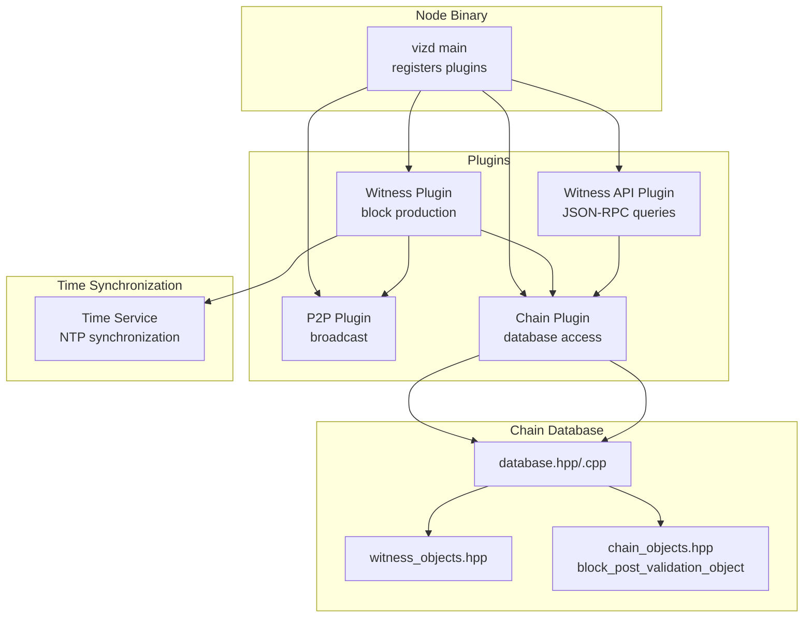
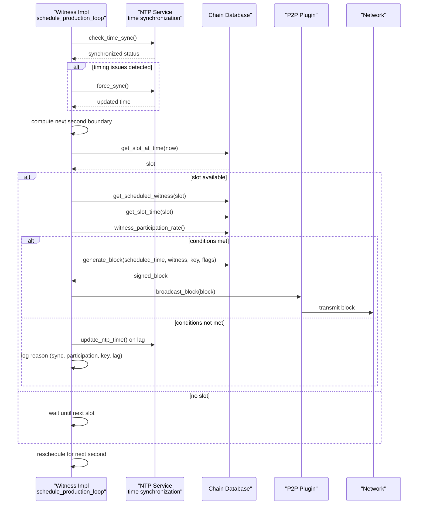
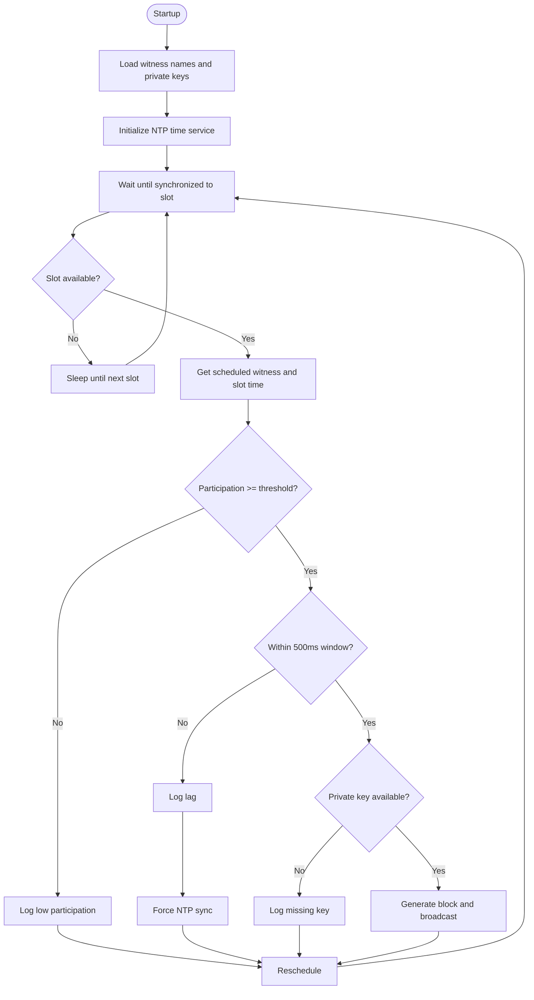
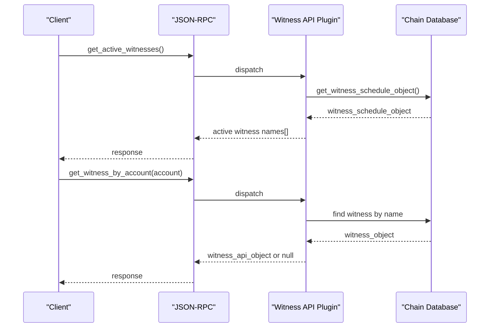
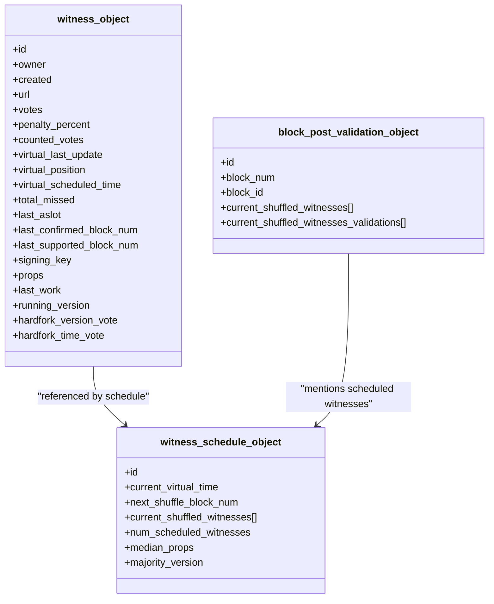
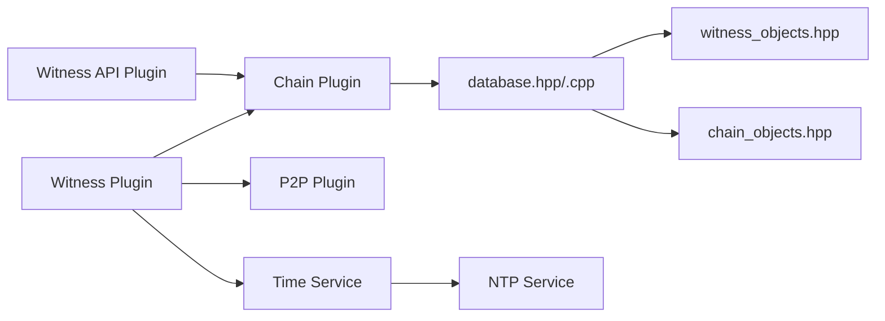

# Witness

<cite>
**Referenced Files in This Document**
- [witness.hpp](file://plugins/witness/include/graphene/plugins/witness/witness.hpp)
- [witness.cpp](file://plugins/witness/witness.cpp)
- [witness_api_plugin.hpp](file://plugins/witness_api/include/graphene/plugins/witness_api/plugin.hpp)
- [witness_api_plugin.cpp](file://plugins/witness_api/plugin.cpp)
- [witness_objects.hpp](file://libraries/chain/include/graphene/chain/witness_objects.hpp)
- [chain_objects.hpp](file://libraries/chain/include/graphene/chain/chain_objects.hpp)
- [database.hpp](file://libraries/chain/include/graphene/chain/database.hpp)
- [database.cpp](file://libraries/chain/database.cpp)
- [time.hpp](file://libraries/time/time.hpp)
- [time.cpp](file://libraries/time/time.cpp)
- [ntp.cpp](file://thirdparty/fc/src/network/ntp.cpp)
- [main.cpp](file://programs/vizd/main.cpp)
</cite>

## Update Summary
**Changes Made**
- Enhanced NTP time synchronization section to reflect forced time sync on block production lag conditions
- Added crash race condition handling improvements during potential crashes
- Strengthened timing-related production failure prevention mechanisms
- Updated troubleshooting guide with new timing-related diagnostic information

## Table of Contents
1. [Introduction](#introduction)
2. [Project Structure](#project-structure)
3. [Core Components](#core-components)
4. [Architecture Overview](#architecture-overview)
5. [Detailed Component Analysis](#detailed-component-analysis)
6. [Dependency Analysis](#dependency-analysis)
7. [Performance Considerations](#performance-considerations)
8. [Troubleshooting Guide](#troubleshooting-guide)
9. [Conclusion](#conclusion)

## Introduction
This document explains the Witness subsystem of the VIZ node implementation. It covers how witnesses are scheduled, how blocks are produced, how witness participation is monitored, and how the witness-related APIs expose information to clients. The focus is on the witness plugin (block production), the witness API plugin (read-only queries), and the underlying chain database that maintains witness state and schedules.

**Updated** Enhanced with improved NTP time synchronization, crash race condition handling, and strengthened timing-related production failure prevention mechanisms.

## Project Structure
The Witness functionality spans three primary areas:
- Witness plugin: Produces blocks and validates blocks posted by other witnesses.
- Witness API plugin: Exposes witness-related read-only queries via JSON-RPC.
- Chain database: Maintains witness objects, voting, scheduling, and participation metrics.

**Diagram sources**
- [main.cpp:63-92](file://programs/vizd/main.cpp#L63-L92)
- [witness.hpp:34-65](file://plugins/witness/include/graphene/plugins/witness/witness.hpp#L34-L65)
- [witness.cpp:59-118](file://plugins/witness/witness.cpp#L59-L118)
- [witness_api_plugin.hpp:56-98](file://plugins/witness_api/include/graphene/plugins/witness_api/plugin.hpp#L56-L98)
- [witness_api_plugin.cpp:13-28](file://plugins/witness_api/plugin.cpp#L13-L28)
- [database.hpp:37-83](file://libraries/chain/include/graphene/chain/database.hpp#L37-L83)
- [witness_objects.hpp:27-132](file://libraries/chain/include/graphene/chain/witness_objects.hpp#L27-L132)
- [chain_objects.hpp:174-201](file://libraries/chain/include/graphene/chain/chain_objects.hpp#L174-L201)
- [time.cpp:13-53](file://libraries/time/time.cpp#L13-L53)

**Section sources**
- [main.cpp:63-92](file://programs/vizd/main.cpp#L63-L92)

## Core Components
- Witness Plugin
  - Provides block production loop synchronized to wall-clock seconds.
  - Validates whether it is time to produce a block, checks participation thresholds, and signs blocks with configured private keys.
  - Broadcasts blocks and block post validations via the P2P plugin.
  - **Enhanced**: Implements forced NTP synchronization when timing issues are detected during block production attempts.
- Witness API Plugin
  - Exposes read-only queries for active witnesses, schedule, individual witnesses, and counts.
  - Returns API-friendly objects derived from chain witness data.
- Chain Database
  - Stores witness objects, schedules, participation metrics, and supports witness scheduling and participation computations.
  - Manages block post validation objects and updates last irreversible block computation based on witness confirmations.

**Updated** Added forced NTP synchronization capability for timing-related production failure prevention.

**Section sources**
- [witness.hpp:34-65](file://plugins/witness/include/graphene/plugins/witness/witness.hpp#L34-L65)
- [witness.cpp:59-118](file://plugins/witness/witness.cpp#L59-L118)
- [witness_api_plugin.hpp:56-98](file://plugins/witness_api/include/graphene/plugins/witness_api/plugin.hpp#L56-L98)
- [witness_api_plugin.cpp:13-28](file://plugins/witness_api/plugin.cpp#L13-L28)
- [database.hpp:37-83](file://libraries/chain/include/graphene/chain/database.hpp#L37-L83)

## Architecture Overview
The Witness subsystem integrates tightly with the chain database and P2P layer. The witness plugin periodically evaluates conditions to produce a block, consults the database for witness scheduling and participation, and broadcasts the resulting block. The witness API plugin reads from the database to serve JSON-RPC queries.

**Enhanced** The architecture now includes robust NTP time synchronization with automatic fallback mechanisms and crash-safe shutdown procedures.

**Diagram sources**
- [witness.cpp:206-276](file://plugins/witness/witness.cpp#L206-L276)
- [witness.cpp:278-423](file://plugins/witness/witness.cpp#L278-L423)
- [witness.cpp:263-266](file://plugins/witness/witness.cpp#L263-L266)
- [database.cpp:4317-4332](file://libraries/chain/database.cpp#L4317-L4332)
- [time.cpp:74-76](file://libraries/time/time.cpp#L74-L76)

## Detailed Component Analysis

### Witness Plugin
Responsibilities:
- Parse configuration for witness names and private keys.
- Initialize NTP time synchronization.
- Run a production loop that:
  - Waits until synchronized to the next second boundary.
  - Checks participation thresholds and scheduling eligibility.
  - Generates and broadcasts blocks when eligible.
  - Signs and broadcasts block post validations when available.
  - **Enhanced**: Forces NTP synchronization when timing issues are detected during production attempts.

Key behaviors:
- Participation threshold enforcement via witness participation rate.
- Graceful handling of missing private keys, low participation, and timing lags.
- Optional allowance for stale production during initial sync.
- **Enhanced**: Automatic NTP synchronization on lag detection to prevent timing-related production failures.

**Diagram sources**
- [witness.cpp:206-276](file://plugins/witness/witness.cpp#L206-L276)
- [witness.cpp:278-423](file://plugins/witness/witness.cpp#L278-L423)
- [witness.cpp:263-266](file://plugins/witness/witness.cpp#L263-L266)

**Section sources**
- [witness.hpp:34-65](file://plugins/witness/include/graphene/plugins/witness/witness.hpp#L34-L65)
- [witness.cpp:120-169](file://plugins/witness/witness.cpp#L120-L169)
- [witness.cpp:171-192](file://plugins/witness/witness.cpp#L171-L192)
- [witness.cpp:206-276](file://plugins/witness/witness.cpp#L206-L276)
- [witness.cpp:278-423](file://plugins/witness/witness.cpp#L278-L423)

### Witness API Plugin
Responsibilities:
- Expose JSON-RPC endpoints for:
  - Active witnesses in the current schedule.
  - Full witness schedule object.
  - Witnesses by ID, by account, by votes, by counted votes.
  - Count of witnesses.
  - Lookup of witness accounts by name range.

Implementation highlights:
- Uses weak read locks around database queries.
- Enforces limits on returned sets (e.g., max 100 for vote-based lists).
- Converts chain witness objects to API-friendly structures.

**Diagram sources**
- [witness_api_plugin.cpp:30-49](file://plugins/witness_api/plugin.cpp#L30-L49)
- [witness_api_plugin.cpp:75-91](file://plugins/witness_api/plugin.cpp#L75-L91)
- [witness_api_plugin.cpp:102-125](file://plugins/witness_api/plugin.cpp#L102-L125)
- [witness_api_plugin.cpp:127-159](file://plugins/witness_api/plugin.cpp#L127-L159)
- [witness_api_plugin.cpp:161-169](file://plugins/witness_api/plugin.cpp#L161-L169)
- [witness_api_plugin.cpp:171-203](file://plugins/witness_api/plugin.cpp#L171-L203)

**Section sources**
- [witness_api_plugin.hpp:56-98](file://plugins/witness_api/include/graphene/plugins/witness_api/plugin.hpp#L56-L98)
- [witness_api_plugin.cpp:13-28](file://plugins/witness_api/plugin.cpp#L13-L28)
- [witness_api_plugin.cpp:30-49](file://plugins/witness_api/plugin.cpp#L30-L49)
- [witness_api_plugin.cpp:75-91](file://plugins/witness_api/plugin.cpp#L75-L91)
- [witness_api_plugin.cpp:102-159](file://plugins/witness_api/plugin.cpp#L102-L159)
- [witness_api_plugin.cpp:161-203](file://plugins/witness_api/plugin.cpp#L161-L203)

### Chain Database: Witness Objects and Scheduling
The database maintains:
- Witness objects with voting, signing keys, virtual scheduling fields, and participation counters.
- Witness schedule object with shuffled witnesses, current virtual time, and majority version.
- Block post validation objects used to coordinate cross-witness validation.

Behavior highlights:
- Computes witness participation rate and enforces minimum participation thresholds.
- Updates last irreversible block (LIB) based on witness confirmations and thresholds.
- Recomputes witness schedule and shuffles according to virtual time and votes.

**Diagram sources**
- [witness_objects.hpp:27-132](file://libraries/chain/include/graphene/chain/witness_objects.hpp#L27-L132)
- [witness_objects.hpp:104-171](file://libraries/chain/include/graphene/chain/witness_objects.hpp#L104-L171)
- [chain_objects.hpp:174-201](file://libraries/chain/include/graphene/chain/chain_objects.hpp#L174-L201)

**Section sources**
- [witness_objects.hpp:27-132](file://libraries/chain/include/graphene/chain/witness_objects.hpp#L27-L132)
- [witness_objects.hpp:104-171](file://libraries/chain/include/graphene/chain/witness_objects.hpp#L104-L171)
- [chain_objects.hpp:174-201](file://libraries/chain/include/graphene/chain/chain_objects.hpp#L174-L201)
- [database.cpp:1626-1805](file://libraries/chain/database.cpp#L1626-L1805)
- [database.cpp:4317-4332](file://libraries/chain/database.cpp#L4317-L4332)
- [database.cpp:4334-4463](file://libraries/chain/database.cpp#L4334-L4463)

### Time Synchronization Service
**New Section** The witness system now includes robust time synchronization capabilities managed through the time service layer.

Responsibilities:
- Provide precise wall-clock time synchronization using NTP.
- Handle crash-safe shutdown procedures for NTP services.
- Monitor and report significant time synchronization changes.
- Enable forced synchronization on timing issues.

Key behaviors:
- Thread-safe NTP service initialization and management.
- Automatic fallback mechanisms for NTP server failures.
- Significant delta change detection (100ms threshold) for monitoring.
- Graceful shutdown with proper resource cleanup.

**Section sources**
- [time.cpp:13-53](file://libraries/time/time.cpp#L13-L53)
- [time.cpp:36-39](file://libraries/time/time.cpp#L36-L39)
- [time.cpp:74-76](file://libraries/time/time.cpp#L74-L76)
- [ntp.cpp:184-201](file://thirdparty/fc/src/network/ntp.cpp#L184-L201)
- [ntp.cpp:236-266](file://thirdparty/fc/src/network/ntp.cpp#L236-L266)

## Dependency Analysis
- The witness plugin depends on:
  - Chain plugin for database access and block generation.
  - P2P plugin for broadcasting blocks and block post validations.
  - **Enhanced**: NTP time service for precise slot alignment and timing validation.
- The witness API plugin depends on:
  - Chain plugin for read-only queries.
  - JSON-RPC plugin for transport.
- The chain database depends on:
  - Witness objects and schedule indices.
  - Block post validation objects for cross-witness coordination.

**Diagram sources**
- [witness.hpp:34-65](file://plugins/witness/include/graphene/plugins/witness/witness.hpp#L34-L65)
- [witness.cpp:59-118](file://plugins/witness/witness.cpp#L59-L118)
- [witness_api_plugin.hpp:56-98](file://plugins/witness_api/include/graphene/plugins/witness_api/plugin.hpp#L56-L98)
- [database.hpp:37-83](file://libraries/chain/include/graphene/chain/database.hpp#L37-L83)
- [witness_objects.hpp:27-132](file://libraries/chain/include/graphene/chain/witness_objects.hpp#L27-L132)
- [chain_objects.hpp:174-201](file://libraries/chain/include/graphene/chain/chain_objects.hpp#L174-L201)
- [time.cpp:13-53](file://libraries/time/time.cpp#L13-L53)

**Section sources**
- [witness.cpp:59-118](file://plugins/witness/witness.cpp#L59-L118)
- [witness_api_plugin.cpp:13-28](file://plugins/witness_api/plugin.cpp#L13-L28)
- [database.hpp:37-83](file://libraries/chain/include/graphene/chain/database.hpp#L37-L83)

## Performance Considerations
- Production loop alignment: The loop waits until the next second boundary and sleeps for at least 50 ms to avoid excessive polling, reducing CPU overhead.
- Retry on block generation failures: On exceptions during block generation, pending transactions are cleared and the generation is retried once to mitigate transient issues.
- Participation threshold: Ensures sufficient witness participation before producing blocks, preventing premature production on minority forks.
- Virtual scheduling: Uses virtual time and votes to fairly distribute block production slots among witnesses, avoiding hot-spotting and ensuring proportional representation.
- **Enhanced**: Forced NTP synchronization reduces timing-related production failures and improves system reliability during clock drift scenarios.

**Updated** Added forced NTP synchronization consideration for timing-related production failure prevention.

## Troubleshooting Guide
Common issues and resolutions:
- No witnesses configured
  - Symptom: Startup logs indicate no witnesses configured.
  - Resolution: Add witness names and private keys to configuration.
- Low participation
  - Symptom: Blocks not produced due to insufficient witness participation.
  - Resolution: Ensure enough witnesses are online and participating per configured threshold.
- Missing private key
  - Symptom: Logs indicate inability to sign block due to missing private key.
  - Resolution: Verify private key is provided in the correct WIF format and matches the witness signing key.
- Timing lag
  - Symptom: Blocks not produced due to waking up outside the 500 ms window.
  - Resolution: Improve system clock accuracy and reduce latency; consider enabling stale production only during initial sync.
  - **Enhanced**: System automatically forces NTP synchronization when timing issues are detected.
- Consecutive block production disabled
  - Symptom: Blocks not produced because the last block was generated by the same witness.
  - Resolution: Investigate connectivity issues; disable consecutive production only as a temporary workaround.
- **New**: NTP synchronization issues
  - Symptom: Frequent timing-related warnings or blocks not produced despite good participation.
  - Resolution: Check NTP server connectivity and system clock accuracy; verify NTP service is running properly.
- **New**: Crash race conditions
  - Symptom: Witness plugin fails to shut down cleanly or leaves NTP service in inconsistent state.
  - Resolution: Ensure proper shutdown sequence; the system now handles crash-safe NTP service cleanup.

**Updated** Added NTP synchronization and crash race condition handling troubleshooting information.

**Section sources**
- [witness.cpp:171-192](file://plugins/witness/witness.cpp#L171-L192)
- [witness.cpp:255-271](file://plugins/witness/witness.cpp#L255-L271)
- [witness.cpp:387-396](file://plugins/witness/witness.cpp#L387-L396)
- [witness.cpp:263-266](file://plugins/witness/witness.cpp#L263-L266)
- [time.cpp:36-39](file://libraries/time/time.cpp#L36-L39)

## Conclusion
The Witness subsystem integrates tightly with the chain database and P2P layer to ensure timely, secure, and fair block production. The witness plugin manages production loops, participation thresholds, and broadcasting, while the witness API plugin exposes essential read-only data to clients. 

**Enhanced** The system now includes robust NTP time synchronization with automatic fallback mechanisms, crash-safe shutdown procedures, and strengthened timing-related production failure prevention. These enhancements improve system reliability and reduce the likelihood of timing-related production failures, making the witness system more resilient to various operational challenges.

Together, they form a robust foundation for witness operations in the VIZ node, with improved time synchronization and crash handling capabilities.