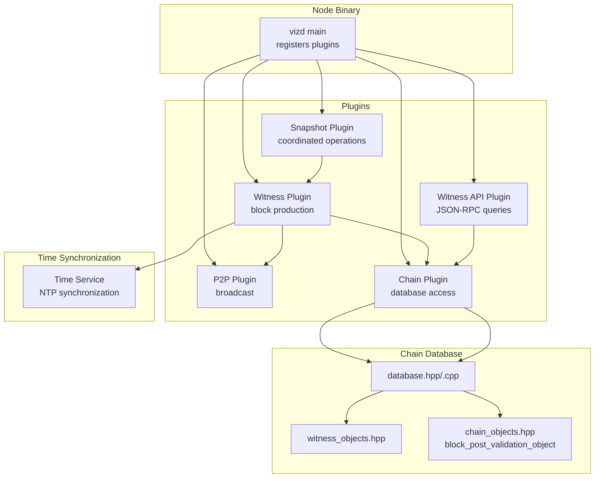
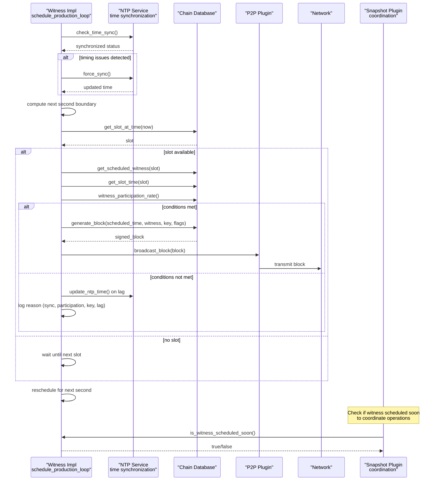
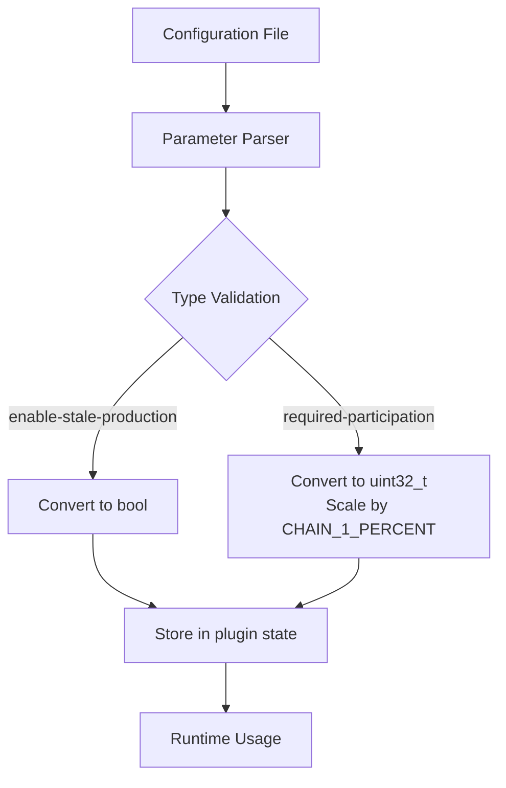
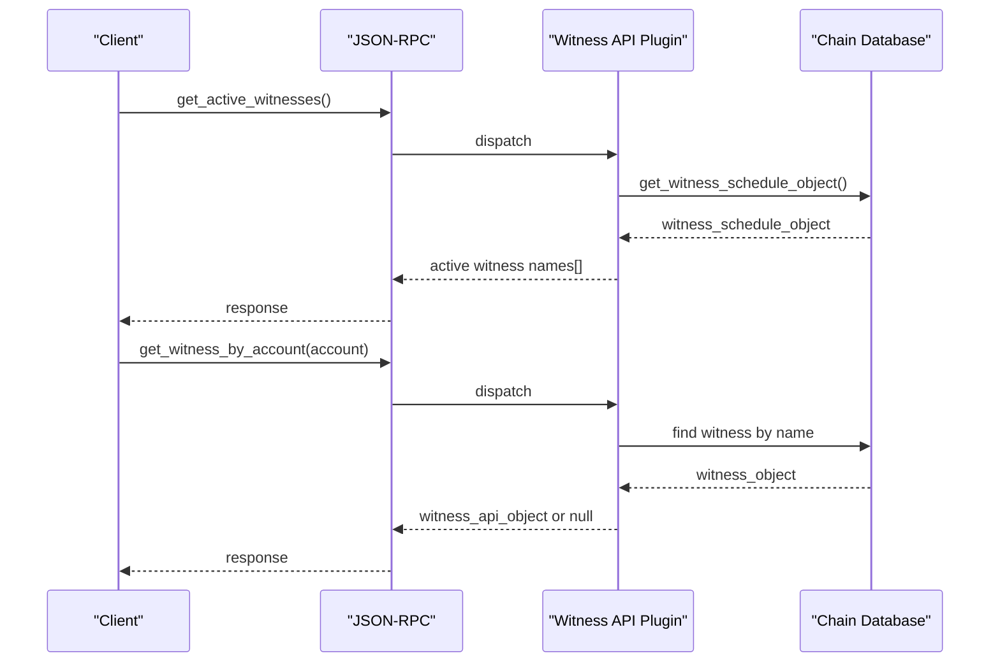
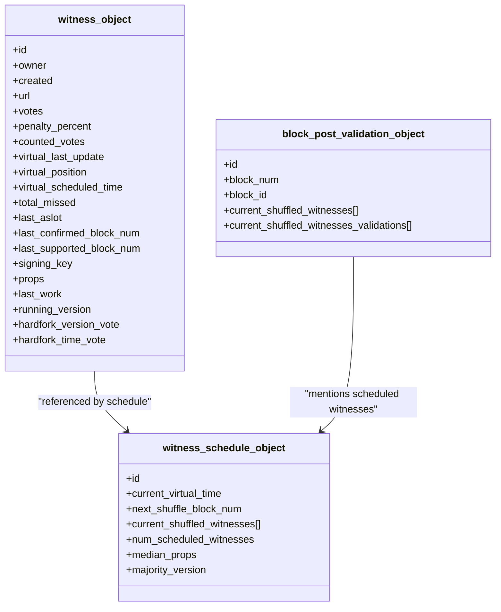
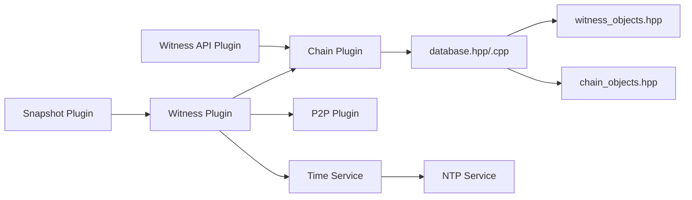

# Witness

<cite>
**Referenced Files in This Document**
- [witness.hpp](file://plugins/witness/include/graphene/plugins/witness/witness.hpp)
- [witness.cpp](file://plugins/witness/witness.cpp)
- [witness_api_plugin.hpp](file://plugins/witness_api/include/graphene/plugins/witness_api/plugin.hpp)
- [witness_api_plugin.cpp](file://plugins/witness_api/plugin.cpp)
- [witness_objects.hpp](file://libraries/chain/include/graphene/chain/witness_objects.hpp)
- [chain_objects.hpp](file://libraries/chain/include/graphene/chain/chain_objects.hpp)
- [database.hpp](file://libraries/chain/include/graphene/chain/database.hpp)
- [database.cpp](file://libraries/chain/database.cpp)
- [time.hpp](file://libraries/time/time.hpp)
- [time.cpp](file://libraries/time/time.cpp)
- [ntp.cpp](file://thirdparty/fc/src/network/ntp.cpp)
- [main.cpp](file://programs/vizd/main.cpp)
- [snapshot_plugin.cpp](file://plugins/snapshot/plugin.cpp)
- [config.hpp](file://libraries/protocol/include/graphene/protocol/config.hpp)
- [config.ini](file://share/vizd/config/config.ini)
- [config_witness.ini](file://share/vizd/config/config_witness.ini)
</cite>

## Update Summary
**Changes Made**
- Updated Configuration Parameters section to reflect corrected default values for enable-stale-production (changed from false to true) and required-participation parameter type (changed from int to uint32_t with CHAIN_1_PERCENT scaling)
- Enhanced Troubleshooting Guide with information about configuration parameter types and scaling factors
- Updated Architecture Overview to show how configuration parameters are processed and validated

## Table of Contents
1. [Introduction](#introduction)
2. [Project Structure](#project-structure)
3. [Core Components](#core-components)
4. [Architecture Overview](#architecture-overview)
5. [Configuration Parameters](#configuration-parameters)
6. [Detailed Component Analysis](#detailed-component-analysis)
7. [Dependency Analysis](#dependency-analysis)
8. [Performance Considerations](#performance-considerations)
9. [Troubleshooting Guide](#troubleshooting-guide)
10. [Conclusion](#conclusion)

## Introduction
This document explains the Witness subsystem of the VIZ node implementation. It covers how witnesses are scheduled, how blocks are produced, how witness participation is monitored, and how the witness-related APIs expose information to clients. The focus is on the witness plugin (block production), the witness API plugin (read-only queries), and the underlying chain database that maintains witness state and schedules.

**Updated** Enhanced with improved NTP time synchronization, crash race condition handling, strengthened timing-related production failure prevention mechanisms, the new `is_witness_scheduled_soon()` method for plugin coordination, and corrected configuration parameter defaults.

## Project Structure
The Witness functionality spans three primary areas:
- Witness plugin: Produces blocks and validates blocks posted by other witnesses.
- Witness API plugin: Exposes witness-related read-only queries via JSON-RPC.
- Chain database: Maintains witness objects, voting, scheduling, and participation metrics.

**Diagram sources**
- [main.cpp:63-92](file://programs/vizd/main.cpp#L63-L92)
- [witness.hpp:34-68](file://plugins/witness/include/graphene/plugins/witness/witness.hpp#L34-L68)
- [witness.cpp:59-118](file://plugins/witness/witness.cpp#L59-L118)
- [witness_api_plugin.hpp:56-98](file://plugins/witness_api/include/graphene/plugins/witness_api/plugin.hpp#L56-L98)
- [witness_api_plugin.cpp:13-28](file://plugins/witness_api/plugin.cpp#L13-L28)
- [database.hpp:37-83](file://libraries/chain/include/graphene/chain/database.hpp#L37-L83)
- [witness_objects.hpp:27-132](file://libraries/chain/include/graphene/chain/witness_objects.hpp#L27-L132)
- [chain_objects.hpp:174-201](file://libraries/chain/include/graphene/chain/chain_objects.hpp#L174-L201)
- [time.cpp:13-53](file://libraries/time/time.cpp#L13-L53)
- [snapshot_plugin.cpp:1267-1276](file://plugins/snapshot/plugin.cpp#L1267-1276)

**Section sources**
- [main.cpp:63-92](file://programs/vizd/main.cpp#L63-L92)

## Core Components
- Witness Plugin
  - Provides block production loop synchronized to wall-clock seconds.
  - Validates whether it is time to produce a block, checks participation thresholds, and signs blocks with configured private keys.
  - Broadcasts blocks and block post validations via the P2P plugin.
  - **Enhanced**: Implements forced NTP synchronization when timing issues are detected during block production attempts.
  - **New**: Provides `is_witness_scheduled_soon()` method to check if any locally-controlled witnesses are scheduled to produce blocks in the upcoming 4 slots.
- Witness API Plugin
  - Exposes read-only queries for active witnesses, schedule, individual witnesses, and counts.
  - Returns API-friendly objects derived from chain witness data.
- Chain Database
  - Stores witness objects, schedules, participation metrics, and supports witness scheduling and participation computations.
  - Manages block post validation objects and updates last irreversible block computation based on witness confirmations.

**Updated** Added forced NTP synchronization capability for timing-related production failure prevention and the new `is_witness_scheduled_soon()` method for plugin coordination.

**Section sources**
- [witness.hpp:34-68](file://plugins/witness/include/graphene/plugins/witness/witness.hpp#L34-L68)
- [witness.cpp:59-118](file://plugins/witness/witness.cpp#L59-L118)
- [witness.cpp:206-249](file://plugins/witness/witness.cpp#L206-L249)
- [witness_api_plugin.hpp:56-98](file://plugins/witness_api/include/graphene/plugins/witness_api/plugin.hpp#L56-L98)
- [witness_api_plugin.cpp:13-28](file://plugins/witness_api/plugin.cpp#L13-L28)
- [database.hpp:37-83](file://libraries/chain/include/graphene/chain/database.hpp#L37-L83)

## Architecture Overview
The Witness subsystem integrates tightly with the chain database and P2P layer. The witness plugin periodically evaluates conditions to produce a block, consults the database for witness scheduling and participation, and broadcasts the resulting block. The witness API plugin reads from the database to serve JSON-RPC queries. **New**: Other plugins can now coordinate with witness scheduling using the `is_witness_scheduled_soon()` method to avoid conflicts during critical operations.

**Enhanced** The architecture now includes robust NTP time synchronization with automatic fallback mechanisms, crash-safe shutdown procedures, and plugin coordination capabilities through the new scheduling method.

**Diagram sources**
- [witness.cpp:206-276](file://plugins/witness/witness.cpp#L206-L276)
- [witness.cpp:278-423](file://plugins/witness/witness.cpp#L278-L423)
- [witness.cpp:263-266](file://plugins/witness/witness.cpp#L263-L266)
- [witness.cpp:206-249](file://plugins/witness/witness.cpp#L206-L249)
- [database.cpp:4317-4332](file://libraries/chain/database.cpp#L4317-L4332)
- [time.cpp:74-76](file://libraries/time/time.cpp#L74-L76)
- [snapshot_plugin.cpp:1267-1276](file://plugins/snapshot/plugin.cpp#L1267-1276)

## Configuration Parameters

### Parameter Types and Scaling

The witness plugin configuration parameters have been updated with improved type safety and scaling:

- **enable-stale-production**: Boolean parameter controlling whether block production continues when the chain is stale
  - Type: `bool` (previously `int`)
  - Default: `true` (changed from `false`)
  - Purpose: Allows production even when the node is behind the chain head
  - Command line: `--enable-stale-production`
  - Config file: `enable-stale-production`

- **required-participation**: Integer parameter specifying minimum witness participation percentage
  - Type: `uint32_t` (changed from `int`)
  - Scale: Multiplied by `CHAIN_1_PERCENT` (100 units = 1%)
  - Range: 0-99% (0-9900 units)
  - Default: 33% (3300 units)
  - Command line: `--required-participation`
  - Config file: `required-participation`

### Configuration Defaults

**Updated** The default values have been corrected for production stability:

- **enable-stale-production**: Now defaults to `true` to improve node resilience during initial sync
- **required-participation**: Defaults to 33% participation threshold for balanced security/performance

### Configuration Processing

The configuration parameters are processed during plugin initialization:

**Diagram sources**
- [witness.cpp:125-133](file://plugins/witness/witness.cpp#L125-L133)
- [witness.cpp:149-155](file://plugins/witness/witness.cpp#L149-L155)
- [config.hpp:57-58](file://libraries/protocol/include/graphene/protocol/config.hpp#L57-L58)

**Section sources**
- [witness.cpp:125-133](file://plugins/witness/witness.cpp#L125-L133)
- [witness.cpp:149-155](file://plugins/witness/witness.cpp#L149-L155)
- [config.hpp:57-58](file://libraries/protocol/include/graphene/protocol/config.hpp#L57-L58)
- [config.ini:99-103](file://share/vizd/config/config.ini#L99-L103)
- [config_witness.ini:76-80](file://share/vizd/config/config_witness.ini#L76-L80)

## Detailed Component Analysis

### Witness Plugin
Responsibilities:
- Parse configuration for witness names and private keys.
- Initialize NTP time synchronization.
- Run a production loop that:
  - Waits until synchronized to the next second boundary.
  - Checks participation thresholds and scheduling eligibility.
  - Generates and broadcasts blocks when eligible.
  - Signs and broadcasts block post validations when available.
  - **Enhanced**: Forces NTP synchronization when timing issues are detected during production attempts.
  - **New**: Provides `is_witness_scheduled_soon()` method for external coordination.

Key behaviors:
- Participation threshold enforcement via witness participation rate.
- Graceful handling of missing private keys, low participation, and timing lags.
- Optional allowance for stale production during initial sync.
- **Enhanced**: Automatic NTP synchronization on lag detection to prevent timing-related production failures.
- **New**: Efficient slot checking across 4 upcoming slots to detect witness scheduling conflicts.

**Diagram sources**
- [witness.cpp:206-276](file://plugins/witness/witness.cpp#L206-L276)
- [witness.cpp:278-423](file://plugins/witness/witness.cpp#L278-L423)
- [witness.cpp:263-266](file://plugins/witness/witness.cpp#L263-L266)

**Section sources**
- [witness.hpp:34-68](file://plugins/witness/include/graphene/plugins/witness/witness.hpp#L34-L68)
- [witness.cpp:120-169](file://plugins/witness/witness.cpp#L120-L169)
- [witness.cpp:171-192](file://plugins/witness/witness.cpp#L171-L192)
- [witness.cpp:206-276](file://plugins/witness/witness.cpp#L206-L276)
- [witness.cpp:278-423](file://plugins/witness/witness.cpp#L278-L423)
- [witness.cpp:206-249](file://plugins/witness/witness.cpp#L206-L249)

### New: is_witness_scheduled_soon() Method
The `is_witness_scheduled_soon()` method provides a crucial coordination mechanism for other plugins to avoid conflicts during critical operations.

**Method Signature**: `bool is_witness_scheduled_soon() const`

**Purpose**: Checks if any locally-controlled witnesses are scheduled to produce blocks in the upcoming 4 slots, enabling other plugins to coordinate and avoid conflicts during critical operations like snapshot creation.

**Implementation Details**:
- Validates that the witness plugin has been initialized with witnesses and private keys
- Calculates the current slot based on synchronized time plus 500ms buffer
- Iterates through slots 0-3 positions ahead to check for scheduled witnesses
- Verifies that the scheduled witness belongs to the locally-controlled set
- Confirms the witness has a valid signing key (not disabled)
- Ensures the plugin has the corresponding private key for block signing

**Usage Pattern**: Other plugins can use this method to defer operations when witness production is imminent, particularly useful for snapshot creation which requires exclusive access to the blockchain state.

**Section sources**
- [witness.cpp:206-249](file://plugins/witness/witness.cpp#L206-L249)

### Witness API Plugin
Responsibilities:
- Expose JSON-RPC endpoints for:
  - Active witnesses in the current schedule.
  - Full witness schedule object.
  - Witnesses by ID, by account, by votes, by counted votes.
  - Count of witnesses.
  - Lookup of witness accounts by name range.

Implementation highlights:
- Uses weak read locks around database queries.
- Enforces limits on returned sets (e.g., max 100 for vote-based lists).
- Converts chain witness objects to API-friendly structures.

**Diagram sources**
- [witness_api_plugin.cpp:30-49](file://plugins/witness_api/plugin.cpp#L30-L49)
- [witness_api_plugin.cpp:75-91](file://plugins/witness_api/plugin.cpp#L75-L91)
- [witness_api_plugin.cpp:102-125](file://plugins/witness_api/plugin.cpp#L102-L125)
- [witness_api_plugin.cpp:127-159](file://plugins/witness_api/plugin.cpp#L127-L159)
- [witness_api_plugin.cpp:161-169](file://plugins/witness_api/plugin.cpp#L161-L169)
- [witness_api_plugin.cpp:171-203](file://plugins/witness_api/plugin.cpp#L171-L203)

**Section sources**
- [witness_api_plugin.hpp:56-98](file://plugins/witness_api/include/graphene/plugins/witness_api/plugin.hpp#L56-L98)
- [witness_api_plugin.cpp:13-28](file://plugins/witness_api/plugin.cpp#L13-L28)
- [witness_api_plugin.cpp:30-49](file://plugins/witness_api/plugin.cpp#L30-L49)
- [witness_api_plugin.cpp:75-91](file://plugins/witness_api/plugin.cpp#L75-L91)
- [witness_api_plugin.cpp:102-159](file://plugins/witness_api/plugin.cpp#L102-L159)
- [witness_api_plugin.cpp:161-203](file://plugins/witness_api/plugin.cpp#L161-L203)

### Chain Database: Witness Objects and Scheduling
The database maintains:
- Witness objects with voting, signing keys, virtual scheduling fields, and participation counters.
- Witness schedule object with shuffled witnesses, current virtual time, and majority version.
- Block post validation objects used to coordinate cross-witness validation.

Behavior highlights:
- Computes witness participation rate and enforces minimum participation thresholds.
- Updates last irreversible block (LIB) based on witness confirmations and thresholds.
- Recomputes witness schedule and shuffles according to virtual time and votes.

**Diagram sources**
- [witness_objects.hpp:27-132](file://libraries/chain/include/graphene/chain/witness_objects.hpp#L27-L132)
- [witness_objects.hpp:104-171](file://libraries/chain/include/graphene/chain/witness_objects.hpp#L104-L171)
- [chain_objects.hpp:174-201](file://libraries/chain/include/graphene/chain/chain_objects.hpp#L174-L201)

**Section sources**
- [witness_objects.hpp:27-132](file://libraries/chain/include/graphene/chain/witness_objects.hpp#L27-L132)
- [witness_objects.hpp:104-171](file://libraries/chain/include/graphene/chain/witness_objects.hpp#L104-L171)
- [chain_objects.hpp:174-201](file://libraries/chain/include/graphene/chain/chain_objects.hpp#L174-L201)
- [database.cpp:1626-1805](file://libraries/chain/database.cpp#L1626-L1805)
- [database.cpp:4317-4332](file://libraries/chain/database.cpp#L4317-L4332)
- [database.cpp:4334-4463](file://libraries/chain/database.cpp#L4334-L4463)

### Time Synchronization Service
**New Section** The witness system now includes robust time synchronization capabilities managed through the time service layer.

Responsibilities:
- Provide precise wall-clock time synchronization using NTP.
- Handle crash-safe shutdown procedures for NTP services.
- Monitor and report significant time synchronization changes.
- Enable forced synchronization on timing issues.

Key behaviors:
- Thread-safe NTP service initialization and management.
- Automatic fallback mechanisms for NTP server failures.
- Significant delta change detection (100ms threshold) for monitoring.
- Graceful shutdown with proper resource cleanup.

**Section sources**
- [time.cpp:13-53](file://libraries/time/time.cpp#L13-L53)
- [time.cpp:36-39](file://libraries/time/time.cpp#L36-L39)
- [time.cpp:74-76](file://libraries/time/time.cpp#L74-L76)
- [ntp.cpp:184-201](file://thirdparty/fc/src/network/ntp.cpp#L184-L201)
- [ntp.cpp:236-266](file://thirdparty/fc/src/network/ntp.cpp#L236-L266)

## Dependency Analysis
- The witness plugin depends on:
  - Chain plugin for database access and block generation.
  - P2P plugin for broadcasting blocks and block post validations.
  - **Enhanced**: NTP time service for precise slot alignment and timing validation.
  - **New**: External plugins can depend on the `is_witness_scheduled_soon()` method for coordination.
- The witness API plugin depends on:
  - Chain plugin for read-only queries.
  - JSON-RPC plugin for transport.
- The chain database depends on:
  - Witness objects and schedule indices.
  - Block post validation objects for cross-witness coordination.

**Diagram sources**
- [witness.hpp:34-68](file://plugins/witness/include/graphene/plugins/witness/witness.hpp#L34-L68)
- [witness.cpp:59-118](file://plugins/witness/witness.cpp#L59-L118)
- [witness_api_plugin.hpp:56-98](file://plugins/witness_api/include/graphene/plugins/witness_api/plugin.hpp#L56-L98)
- [database.hpp:37-83](file://libraries/chain/include/graphene/chain/database.hpp#L37-L83)
- [witness_objects.hpp:27-132](file://libraries/chain/include/graphene/chain/witness_objects.hpp#L27-L132)
- [chain_objects.hpp:174-201](file://libraries/chain/include/graphene/chain/chain_objects.hpp#L174-L201)
- [time.cpp:13-53](file://libraries/time/time.cpp#L13-L53)
- [snapshot_plugin.cpp:1267-1276](file://plugins/snapshot/plugin.cpp#L1267-1276)

**Section sources**
- [witness.cpp:59-118](file://plugins/witness/witness.cpp#L59-L118)
- [witness_api_plugin.cpp:13-28](file://plugins/witness_api/plugin.cpp#L13-L28)
- [database.hpp:37-83](file://libraries/chain/include/graphene/chain/database.hpp#L37-L83)

## Performance Considerations
- Production loop alignment: The loop waits until the next second boundary and sleeps for at least 50 ms to avoid excessive polling, reducing CPU overhead.
- Retry on block generation failures: On exceptions during block generation, pending transactions are cleared and the generation is retried once to mitigate transient issues.
- Participation threshold: Ensures sufficient witness participation before producing blocks, preventing premature production on minority forks.
- Virtual scheduling: Uses virtual time and votes to fairly distribute block production slots among witnesses, avoiding hot-spotting and ensuring proportional representation.
- **Enhanced**: Forced NTP synchronization reduces timing-related production failures and improves system reliability during clock drift scenarios.
- **New**: Efficient slot checking in `is_witness_scheduled_soon()` method performs minimal database operations across 4 slots to detect scheduling conflicts quickly.
- **Updated**: Improved configuration parameter processing with type safety and proper scaling for better performance and reliability.

**Updated** Added performance considerations for the corrected configuration parameter types and processing.

## Troubleshooting Guide
Common issues and resolutions:
- No witnesses configured
  - Symptom: Startup logs indicate no witnesses configured.
  - Resolution: Add witness names and private keys to configuration.
- Low participation
  - Symptom: Blocks not produced due to insufficient witness participation.
  - Resolution: Ensure enough witnesses are online and participating per configured threshold.
- Missing private key
  - Symptom: Logs indicate inability to sign block due to missing private key.
  - Resolution: Verify private key is provided in the correct WIF format and matches the witness signing key.
- Timing lag
  - Symptom: Blocks not produced due to waking up outside the 500 ms window.
  - Resolution: Improve system clock accuracy and reduce latency; consider enabling stale production only during initial sync.
  - **Enhanced**: System automatically forces NTP synchronization when timing issues are detected.
- Consecutive block production disabled
  - Symptom: Blocks not produced because the last block was generated by the same witness.
  - Resolution: Investigate connectivity issues; disable consecutive production only as a temporary workaround.
- **New**: Witness scheduling conflicts
  - Symptom: Other plugins experience conflicts with witness operations.
  - Resolution: Use `is_witness_scheduled_soon()` method to coordinate operations and defer critical tasks until witness production is complete.
- **New**: NTP synchronization issues
  - Symptom: Frequent timing-related warnings or blocks not produced despite good participation.
  - Resolution: Check NTP server connectivity and system clock accuracy; verify NTP service is running properly.
- **New**: Crash race conditions
  - Symptom: Witness plugin fails to shut down cleanly or leaves NTP service in inconsistent state.
  - Resolution: Ensure proper shutdown sequence; the system now handles crash-safe NTP service cleanup.
- **New**: Configuration parameter type errors
  - Symptom: Errors indicating incorrect parameter types or values.
  - Resolution: Verify configuration parameters use correct types:
    - `enable-stale-production`: boolean value (`true`/`false`)
    - `required-participation`: integer value scaled by `CHAIN_1_PERCENT` (e.g., 33 for 33%)
    - Check configuration files for proper syntax and values

**Updated** Added troubleshooting information for witness scheduling conflicts, the new coordination mechanisms, and configuration parameter type issues.

**Section sources**
- [witness.cpp:171-192](file://plugins/witness/witness.cpp#L171-L192)
- [witness.cpp:255-271](file://plugins/witness/witness.cpp#L255-L271)
- [witness.cpp:387-396](file://plugins/witness/witness.cpp#L387-L396)
- [witness.cpp:263-266](file://plugins/witness/witness.cpp#L263-L266)
- [witness.cpp:206-249](file://plugins/witness/witness.cpp#L206-L249)
- [time.cpp:36-39](file://libraries/time/time.cpp#L36-L39)

## Conclusion
The Witness subsystem integrates tightly with the chain database and P2P layer to ensure timely, secure, and fair block production. The witness plugin manages production loops, participation thresholds, and broadcasting, while the witness API plugin exposes essential read-only data to clients. 

**Enhanced** The system now includes robust NTP time synchronization with automatic fallback mechanisms, crash-safe shutdown procedures, and strengthened timing-related production failure prevention. **New** The addition of the `is_witness_scheduled_soon()` method enables sophisticated plugin coordination, allowing other plugins to avoid conflicts during critical operations like snapshot creation. **Updated** The configuration parameter system has been improved with corrected defaults and proper type handling for better reliability and performance. This enhancement makes the witness system more resilient to various operational challenges while providing better integration points for the broader VIZ ecosystem.

Together, they form a robust foundation for witness operations in the VIZ node, with improved time synchronization, crash handling capabilities, enhanced plugin coordination features, and reliable configuration parameter processing.