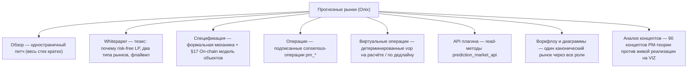

# Прогнозные рынки на VIZ

VIZ Ledger исполняет прогнозные рынки как **операции консенсуса первого класса** (`pm_*`), live с HF14.
Два имени, которые встречаются повсюду:

- **Onix** — **протокол**: on-chain движок рынка (CPMM binary + LMSR multi, parimutuel zero-sum
  расчёт, bonded-оракулы, lazy-пул, опциональное плечо, batch / commit-reveal ставки).
- **Forecaster** — **тонкий клиент** к этому протоколу в VIZ Ledger. Это headless, платформонезависимый
  фронтенд, позволяющий **людям со всего мира участвовать в on-chain прогнозном рынке** — создавать
  рынки, ставить, давать ликвидность, быть оракулом и оспаривать — подписывая операции `pm_*` напрямую
  против публичных узлов VIZ. Протокол нейтрален; Forecaster (и любой юрисдикционный клиент,
  построенный так же) — это слой доступа.

## Карта документации

## С чего начать

| Страница | Что это |
|------|-----------|
| [Обзор](./onix) | Одностраничное позиционирование: parimutuel с AMM-ценой и структурно безрисковой ликвидностью. |
| [Whitepaper](./whitepaper) | Индустриальный тезис — гарантия LP, Onix Binary (CPMM) + Onix Multi (LMSR), оракулы, lazy-пул, плечо, управление. |
| [Спецификация](./specification) | Формальная спека: параметры, машина состояний, ценообразование, расчёт, споры, lazy-пул, плечо и **[On-chain модель объектов](./specification)** (каждый `pm_*_object` и его индекс поиска). |
| [Операции](../protocol/operations/prediction-markets) | 21 подписанная consensus-операция (`pm_create_market`, `pm_place_bet`, …). |
| [Виртуальные операции](../protocol/virtual-operations) | Детерминированные vop (`pm_payout`, `pm_market_accepted`, `pm_leverage_resolve`, `pm_batch_settle`, …). |
| [API плагина](../plugins/prediction-market-api) | `prediction_market_api` — read-доступ к рынкам, ставкам, оракулам, спорам, lazy-пулу и медиана-голосуемым параметрам. |
| [Воркфлоу и диаграммы](./workflows) | Один канонический бинарный рынок через всех участников, с zero-sum мастер-леджером для нормального и спорного разрешения. |
| [Анализ концептов (Onix против 90)](./concepts-analysis) | Как on-chain реализация ложится на атлас теории прогнозных рынков — что решено, имманентно, не нужно или в роадмапе. |

## Управление

Все экономические параметры делегат-**медиана-голосуемы** и живут в структуре `chain_properties_pm` —
см. [Параметры цепи → Параметры прогнозных рынков](../governance/chain-properties#pm-parameters).
Хардфорк для настройки комиссий, штрафов, lazy-пула, плеча или тайминга batch/commit-reveal не нужен; три
живых kill-switch (`pm_commit_reveal_enabled`, `pm_lazy_pool_enabled`, `pm_leverage_enabled`) позволяют
медиане валидаторов отключить целую подсистему без форка.
