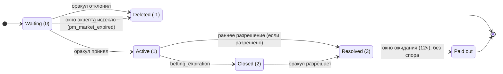

# Спецификация Onix Protocol

**Версия:** 2.0 (on-chain / HF14)
**Статус:** Формальная техническая спецификация — реализована как операции консенсуса на VIZ DLT

---

> **On-chain (HF14).** Реализовано как операции консенсуса первого класса (`pm_*`) на VIZ DLT и проверено
> в `consensus_sim`. **Все проценты — базисные пункты (bp): 10000 = 100.00%**; все длительности —
> governance-параметры в **секундах / блоках**. Медиана-голосуемые параметры живут в структуре
> `chain_properties_pm` (§3); per-market поля — операция `pm_create_market`; всё состояние — в
> chainbase-объектах §17. Комиссии оракула — offer→quote (потолок создателя → оракул фиксирует котировку
> при акцепте, эмитя `pm_market_accepted`). У споров два режима — комитет (`dispute_mode = 0`, по
> умолчанию: stake-weighted **публичный** `pm_dispute_vote`, изменяем до закрытия, стейк Lazy-Pool
> считается) и аккаунт (`dispute_mode = 1`: именованный `dispute_resolver`).

## Оглавление

1. Определения и роли
2. Валюта и точность
3. Системные параметры
4. Машина состояний рынка
5. Onix Binary: Constant Product Market Maker
6. Onix Multi: LMSR с parimutuel-расчётом
7. Структура комиссий
8. Time penalty для поздних ставок
9. Предоставление ликвидности
10. Резолюция и выплаты
11. Отмена ставки
12. Система споров
13. Штраф оракула за пропуск резолюции
14. Скоринг репутации оракула
15. Трансфер позиций
16. Lazy-пул ликвидности
16a. Опциональное плечо
16b. Batch / Commit-Reveal ставки
17. On-chain модель объектов

---

## 1. Определения и роли

| Роль | Определение |
|------|-----------|
| **Создатель рынка** | Платит `pm_market_creation_fee` (`pm_create_market`); задаёт вопрос, исходы, ликвидность, потолки комиссий и параметры тайминга |
| **Оракул** | Регистрируется (комиссия: `pm_oracle_registration_fee`), вносит страховку (мин.: `pm_min_oracle_insurance`), котирует свои условия комиссии в **базисных пунктах** (≤ потолка создателя) + фиксированную комиссию при акцепте, принимает/отклоняет рынки, даёт решения по исходам |
| **Беттер** | Ставит на исходы; получает токены пропорционально стейку и текущим резервам |
| **Поставщик ликвидности (LP)** | Поставляет капитал в пулы рынка; зарабатывает time-weighted долю комиссий ликвидности + штрафной пул |
| **Поставщик Lazy Pool** | Вносит VIZ в Lazy-пул ликвидности с lock-периодом; пул авто-аллоцирует в рынки и распределяет награды через аккумулятор `reward_per_share` |
| **Резолвер споров** | Только режим аккаунта (`dispute_mode = 1`): per-market аккаунт `dispute_resolver` арбитрирует. Режим комитета (`dispute_mode = 0`) резолвера не использует — голосует электорат SHARES |
| **Фонд DAO / комитета** | Существующий фонд комитета цепи. Получает `pm_market_creation_fee` и доп. штрафы оракулов |

---

## 2. Валюта и точность

Все суммы хранятся как целые с точностью = 1/1000 (милли-VIZ). `1000` внутренних единиц = 1.000 VIZ.

Значения time penalty используют точность = 1/1 000 000 (микро-единицы).

---

## 3. Системные параметры

### Медиана-голосуемые параметры (`chain_properties_pm`)

Все экономические параметры голосуются медианой делегатов (без хардфорка для настройки) и живут в on-chain
структуре `chain_properties_pm`. Каждый делегат публикует свои предпочтительные значения через стандартную
**`versioned_chain_properties_update_operation`** (op ID 46) — `chain_properties_pm` является текущей
(v5, HF14) версией этой versioned-структуры — а сеть применяет **медиану по каждому полю** активных
делегатов. Две ручки риск-покрытия (`pm_listing_min_coverage_percent`, `pm_betting_min_coverage_percent`)
входят в ту же v5-структуру и настраиваются ровно так же. **Все проценты — базисные пункты
(bp, 10000 = 100.00%); длительности — в секундах или блоках** — за исключением двух ручек покрытия, которые
измеряются в проценте от объёма (100 = 1.0×). Точные дефолты и диапазоны — в
[Chain Properties](../governance/chain-properties#pm-parameters); авторитетный источник — сама структура.

| Группа | Параметры |
|---|---|
| Регистрация и полы | `pm_oracle_registration_fee`, `pm_min_oracle_insurance`, `pm_market_creation_fee`, `pm_min_liquidity`, `pm_max_outcomes`, `pm_max_market_duration` |
| Комиссии и штрафы (bp) | `pm_max_oracle_fee_percent`, `pm_oracle_penalty_percent`, `pm_no_contest_penalty_percent`, `pm_default_time_penalty_percent`, `pm_max_time_penalty` |
| Окно акцепта | `pm_oracle_accept_window_sec` (по умолчанию 3600 = 1 ч; пендинг-рынки, не принятые/отклонённые в этот срок, аннулируются кроном — сид возвращён, комиссия за создание удержана) |
| Риск / покрытие (% от объёма) | `pm_listing_min_coverage_percent` (250 = 2.5×; рынки с покрытием ниже этого скрыты из каталога по умолчанию, показываются через `show_risky`), `pm_betting_min_coverage_percent` (150 = 1.5×; рекомендательный клиентский порог подтверждения риска, `≤` листингового, on-chain не навязывается) |
| Споры | `pm_dispute_fee`, `pm_dispute_grace_sec`, `pm_oracle_dispute_response_sec`, `pm_dispute_vote_period_sec`, `pm_dispute_auto_close_sec`, `pm_dispute_approve_min_percent` (bp), `pm_dispute_reward_multiplier` (bp) |
| Lazy-пул | `pm_lazy_pool_enabled`, `pm_lazy_alloc_percent`, `pm_lazy_max_total_alloc_percent`, `pm_lazy_recall_step_percent`, `pm_lazy_lock_sec`, `pm_lazy_emergency_penalty_percent`, `pm_lazy_min_liquidity_fee_percent` (по умолчанию 200 = 2%; пул пропускает рынки, чей `liquidity_fee_percent` ниже этого порога вознаграждения) |
| Плечо | `pm_leverage_enabled`, `pm_leverage_fund_percent`, `pm_leverage_max_per_position_bp`, `pm_leverage_max_position_ratio_percent`, `pm_leverage_min_market_liquidity`, `pm_leverage_safety_margin_percent`, `pm_leverage_max_slippage_percent`, `pm_leverage_m_factor_percent`, `pm_leverage_pool_profit_percent`, `pm_leverage_expiration_buffer_sec`, `pm_conversion_profit_cost_percent` |
| Batch / commit-reveal | `pm_commit_reveal_enabled`, `pm_batch_epoch_blocks`, `pm_reveal_window_blocks`, `pm_commit_no_reveal_penalty_percent` (bp), `pm_min_batch_bet` |
| Обработка | `pm_processing_cap_per_block` |

Получатель `pm_market_creation_fee` и доп. штрафов оракулов — существующий фонд комитета/DAO цепи, а не
отдельный PM-аккаунт.

### Per-market параметры (операция `pm_create_market`)

Задаются создателем при создании; поля комиссии оракула — это **потолок**, против которого оракул котирует
при акцепте (offer→quote). Полный референс полей: [Операции прогнозных рынков](../protocol/operations/prediction-markets).

| Поле | Описание |
|---|---|
| `oracle`, `market_type` (0 binary / 1 multi), `outcomes`, `url` | определение рынка |
| `oracle_fee_percent`, `oracle_fixed_fee` | **потолок** комиссии оракула (bp + фикс.); оракул фиксирует котировку ≤ него (и ≤ медианного `pm_max_oracle_fee_percent`) при акцепте |
| `creator_fee_percent`, `liquidity_fee_percent` | комиссии создателя и LP (bp от пула проигравших) |
| `liquidity`, `lmsr_b` | сид-ликвидность; `lmsr_b` для мульти-рынков |
| `betting_expiration`, `result_expiration` | таймеры |
| `time_penalty_type`, `time_penalty_value`, `penalty_curve_type` | форма штрафа за поздние ставки |
| `allow_early_resolution`, `allow_cancellation` | переключатели |
| `allow_batch`, `allow_instant_bet` | режимы ставок (бинарные) |
| `endogeneity_tier` | 1 эконом-данные / 2 спорт / 3 политика (подсказка отображения/риска) |
| `dispute_mode` (0 комитет / 1 аккаунт), `dispute_resolver` | маршрутизация споров |
| `dispute_penalty_percent` | политика штрафа оракула при удовлетворённом споре (bp, со знаком) |
| `metadata` | свободный клиентский JSON (консенсус-непрозрачен; парсится off-chain) |

---

## 4. Машина состояний рынка

### Состояния

| Status | Имя | Описание |
|--------|------|-------------|
| -1 | Deleted | Оракул отклонил **или** истекло окно акцепта (`pm_oracle_accept_window_sec`); сид-ликвидность возвращена создателю (комиссия за создание удержана) |
| 0 | Waiting | Ожидает проверки оракула |
| 1 | Active | Принимает ставки до `betting_expiration` |
| 2 | Closed | Приём ставок закончен, ожидает резолюции оракула |
| 3 | Resolved | Исход определён, выплаты рассчитаны |

### Состояния выплат

| payout_status | Имя | Описание |
|---------------|------|-------------|
| 0 | Not calculated | До резолюции |
| 1 | Calculated | Выплаты ожидают (grace-период активен) |
| 2 | Paid | Все выплаты обработаны |
| 3 | Disputed | Подан спор, выплаты заморожены |

### Переходы



**Предусловия:**

| Переход | Предусловия |
|-----------|---------------|
| 0 → 1 | Страховка оракула ≥ `min_oracle_insurance`; оракул принимает |
| 0 → 1 (self-oracle) | Создатель = оракул; проверка страховки; авто-одобрение при создании |
| 0 → -1 | Оракул отклоняет; сид-ликвидность возвращена создателю |
| 0 → -1 (экспирация) | `now ≥ created_time + pm_oracle_accept_window_sec` без действия оракула; крон аннулирует рынок, возвращает сид (комиссия за создание удержана), эмитит `pm_market_expired` |
| 1 → 3 | Оракул подаёт резолюцию с исходом (0, 1 или -1 для no-contest); `allow_early_resolution=1` или `time ≥ betting_expiration` |
| 2 → 3 | Оракул подаёт резолюцию; `time ≤ result_expiration` |
| 3 → paid | Grace-период прошёл без спора; крон обрабатывает выплаты |

### Флоу создания рынка

1. Списать `market_creation_fee` с создателя → фонд DAO (невозвратно)
2. Записать `oracle_fixed_fee` из профиля оракула на рынок
3. Заблокировать `liquidity` с баланса создателя
4. Инициализировать резервы: `reserve_a = floor(liquidity/2)`, `reserve_b = liquidity − reserve_a`
5. Вычислить `k = reserve_a × reserve_b`
6. Если self-oracle: авто-одобрение до status=1 с проверкой страховки
7. Если внешний оракул: войти в status=0 и установить `accept_deadline = created_time + pm_oracle_accept_window_sec`

### Флоу акцепта оракула

Пендинг-рынок должен быть разрешён своим оракулом в течение окна акцепта
(`pm_oracle_accept_window_sec`, по умолчанию 1 ч). Три исхода:

- **Принятие** (status 0 → 1): (1) перевести `oracle_fixed_fee` с баланса создателя на баланс оракула
  (пропускается для self-oracle); (2) инкремент `markets_accepted`; (3) обновить `last_active_time`;
  (4) запуск авто-аллокации Lazy Pool (если у пула есть свободный баланс **и** `liquidity_fee_percent
  рынка ≥ pm_lazy_min_liquidity_fee_percent`).
- **Отклонение** (status 0 → -1): сид-ликвидность возвращена создателю; без vop.
- **Экспирация** (status 0 → -1): если ничего не произошло к `accept_deadline`, крон каждого блока
  аннулирует рынок, возвращает сид-ликвидность (**не** комиссию за создание) и эмитит `pm_market_expired`.

### Audit Trail

Каждое state-changing действие — это операция консенсуса или виртуальная операция, навсегда записываемая в
block log и запрашиваемая через `account_history`. Ставки, отмены, добавление/вывод ликвидности,
accept/reject, резолюция, спор, разрешение спора, выплата и штраф появляются как `pm_*`-операции/vop,
вместе с резервами рынка, которых они касаются.

---

## 5. Onix Binary: Constant Product Market Maker

### Инвариант

```
k = reserve_a × reserve_b
```

`k` меняется только при операциях добавления/вывода ликвидности.

### Размещение ставки (сторона A)

```
new_reserve_b = reserve_b + amount
new_reserve_a = floor(k / new_reserve_b)
tokens_received = reserve_a − new_reserve_a
price = amount × 1,000,000 / tokens_received
```

Симметрично для стороны B (поменять a/b).

### Защита от слиппеджа

Опциональный параметр `min_tokens` в `place-bet`. Если `tokens_received < min_tokens`, транзакция
отвергается.

### Инициализация рынка

```
reserve_a = floor(liquidity / 2)
reserve_b = liquidity − reserve_a
k = reserve_a × reserve_b
```

Минимальная начальная ликвидность: 100,000 mVIZ (100 VIZ).

### Семантика веса (токена)

- `weight` = число токенов исхода, полученных беттером (задаётся CPMM на момент ставки)
- `weight` — это **относительная претензия**, не выплата в VIZ. Расчёт **parimutuel** (идентично Onix
  Multi): победители получают назад стейк плюс пропорциональную долю пула проигравших, по весу.
- Если ставка на сторону A и выигрывает исход A: `payout = bet_amount + (weight / total_winning_weight) × winners_pool − time_penalty_on_profit`
- Если исход A проигрывает: payout = 0 (стейк форфейтится в пул победителей)

CPMM — это **движок ценообразования** (вероятность + назначение веса); он больше не гейтит выплату. Это
заставляет два типа рынков разделять одну модель расчёта: *AMM назначает веса (CPMM для бинарных, LMSR
для мульти); проигравшие финансируют победителей пропорционально весу.*

### Отображение цены

```
implied_probability_A = reserve_b / (reserve_a + reserve_b) × 100%
implied_probability_B = reserve_a / (reserve_a + reserve_b) × 100%
```

### Гарантия принципала LP (доказательство)

При parimutuel-расчёте гарантия точна и не опирается на геометрию кривой:

```
Money OUT = L (LP principal) + Σ(winning bet_amount) + winners_pool + fees
          = L + winning_bets + (losers_sum − fees) + fees
          = L + winning_bets + losing_bets = L + all_bets = Money IN
```

Суммарная выплата ограничена `losers_sum` независимо от весов, поэтому принципал LP `L` возвращается
безусловно, а победители фондируются целиком проигравшими. (Легаси AM-GM граница
`reserve_a + reserve_b ≥ L` больше не нужна для платёжеспособности; она остаётся свойством ценовой
кривой.)

---

## 6. Onix Multi: LMSR с parimutuel-расчётом

### Функция цены (softmax)

Для N исходов с параметрами количества q_1, ..., q_N и параметром ликвидности b:

```
price(i) = exp(q_i / b) / Σ_j exp(q_j / b)
```

**Инвариант:** `Σ_i price(i) = 1` (по определению softmax).

### Функция стоимости

```
C(q) = b × ln(Σ_j exp(q_j / b))
```

Стоимость покупки Δ токенов на исход i:

```
cost = C(q + Δ·e_i) − C(q)
     = b × [ln(Σ_j exp(q'_j / b)) − ln(Σ_j exp(q_j / b))]
where q'_i = q_i + Δ, all other q'_j = q_j
```

Численная устойчивость (трюк log-sum-exp):

```
ln(Σ exp(x_j)) = max(x) + ln(Σ exp(x_j − max(x)))
```

### Параметр ликвидности

```
b = S / ln(N)
```

где S = депозит субсидии LP, N = число исходов.

### Расчёт (на резолюции)

```
1. Oracle declares winning outcome
2. losers_sum = Σ bet_amount for all non-winning bets
3. oracle_fee  = floor(losers_sum × oracle_fee_percent / 10000)
4. creator_fee = floor(losers_sum × creator_fee_percent / 10000)
5. liq_fee     = floor(losers_sum × liquidity_fee_percent / 10000)
6. winners_pool = losers_sum − oracle_fee − creator_fee − liq_fee
7. For each winning bettor:
   payout = bet_amount + (their_tokens / total_winning_tokens × winners_pool) − time_penalty
8. LP subsidy returned unconditionally
9. LP earns time-weighted share of liq_fee
```

### Гарантия принципала LP (доказательство)

1. LP вносит S VIZ как субсидию. Это задаёт b = S / ln(N).
2. Во время ставок пользователи платят VIZ → получают токены. VIZ накапливается как пул ставок.
3. На резолюции: проигравшие форфейтят 100% → `losers_sum`. Победителям платят из `losers_sum` (не из
   субсидии).
4. Субсидия LP S возвращается **безусловно** — она архитектурно отделена от потока выплат.

### Граничные случаи

| Сценарий | Исход |
|----------|---------|
| Все ставки на выигрышный исход | `losers_sum=0`, `winners_pool=0`. Каждый беттер получает назад `bet_amount`. Субсидия LP возвращена. |
| Нет ставок на выигрышный исход | `losers_sum=total_bets`. Нераспределённый `winners_pool` → бонус LP. |
| Рынок с нулевым объёмом | Субсидия LP возвращена. Ни комиссий, ни выплат. |
| Выигрывает единственный беттер | Беттер получает `bet_amount + winners_pool`. Субсидия LP возвращена. |

### Операции

| Операция | Описание |
|-----------|-------------|
| `pm_create_market_multi { oracle, outcomes, liquidity, fees, ... }` | Создать рынок с N исходами |
| `pm_place_bet_multi { market, outcome_index, amount, min_tokens }` | Купить токены исхода |
| `pm_cancel_bet_multi { bet_id, min_return }` | Продать токены назад через reverse LMSR |
| `pm_add_liquidity_multi { market, amount }` | Добавить субсидию LP (увеличивает b) |
| `pm_withdraw_liquidity_multi { liquidity_id }` | Вывести субсидию LP (мин. floor навязан) |
| `pm_resolve_multi { market, winning_outcome }` | Оракул объявляет победителя, запускает расчёт |

Бинарные рынки (N=2) используют Onix Binary (CPMM). LMSR используется только для N > 2.

---

## 7. Структура комиссий

### Вычисление комиссий на момент резолюции

Все процентные комиссии считаются на резолюции от **общего объёма проигравшей стороны**:

```
losers_sum = Σ bet_amount for all losing bets

oracle_fee   = floor(losers_sum × oracle_fee_percent / 10000)
creator_fee  = floor(losers_sum × creator_fee_percent / 10000)
liquidity_fee = floor(losers_sum × liquidity_fee_percent / 10000)
winners_pool = losers_sum − oracle_fee − creator_fee − liquidity_fee
```

Комиссии НЕ удерживаются со ставок при размещении. Полная сумма ставки входит в резервы CPMM/LMSR.

### Фиксированная комиссия оракула

Разовая комиссия на рынок. Задаётся оракулом в профиле. Платится создателем оракулу при акцепте рынка.
Полностью пропускается для self-oracle рынков (балансовой операции не происходит).

### Поля учёта комиссий

- `oracle_fee_earned` — не используется на резолюции; комиссия считается из losers_sum
- `liquidity_fee_earned` — накопленные комиссии LP, уже выплаченные рано вышедшим LP; на резолюции: `LP fee pool = max(0, floor(losers_sum × liquidity_fee_percent / 10000) − liquidity_fee_earned) + penalty_pool`
- Per-bet `oracle_fee` и `liquidity_fee` записываются для аудита; не аккумулируются на рынке

### Округление

Все вычисления используют `floor()`. Нераспределённый dust (< 1 mVIZ) отправляется в фонд DAO при
финальной выплате.

---

## 8. Time penalty для поздних ставок

### Окно штрафа

| Тип | Вычисление окна |
|------|-------------------|
| Fixed (type=0) | `penalty_window = time_penalty_value` секунд до экспирации |
| Percentage (type=1) | `penalty_window = time_penalty_value / 100 × (betting_expiration − market_creation_time)` |

### Вычисление штрафа

```
time_to_expiration = betting_expiration − current_time

if time_to_expiration < penalty_window:
    ratio = 1 − (time_to_expiration / penalty_window)

    if penalty_curve_type == 1:    // quadratic
        penalty_ratio = ratio × ratio
    else:                          // linear
        penalty_ratio = ratio

    time_penalty = floor(penalty_ratio × max_time_penalty)
else:
    time_penalty = 0
```

### Применение при выплате (только к прибыли)

```
profit = floor(winners_pool × weight / total_winning_weight)   // parimutuel share of losers' pool
penalty_deduction = floor(profit × time_penalty / 1,000,000)
net_payout = bet_amount + profit − penalty_deduction
```

**Инвариант:** `net_payout ≥ bet_amount` — штраф применяется только к доле прибыли, поэтому победители
всегда получают не меньше принципала. (Идентично для Onix Binary и Onix Multi.)

---

## 9. Предоставление ликвидности

### Добавление ликвидности

```
add_a = amount × reserve_a / (reserve_a + reserve_b)
add_b = amount − add_a
new_reserve_a = reserve_a + add_a
new_reserve_b = reserve_b + add_b
new_k = new_reserve_a × new_reserve_b
```

Записывает `sec_to_expiration = betting_expiration − current_time` на момент депозита.

### Time-weighted распределение комиссий (на резолюции)

```
fee_pool = remaining_liquidity_fee + total_penalty_pool

weight_i = amount_i × max(1, sec_to_expiration_i)
total_weight = Σ weight_i
fee_share_i = floor(fee_pool × weight_i / total_weight)
lp_payout_i = principal_i + fee_share_i
```

Каждый депозит — независимая позиция. Несколько депозитов одного пользователя отслеживаются раздельно.

### Ранний вывод

**Предусловия:** market status=1, `time < betting_expiration`, `resulting liquidity_sum ≥ 100,000 mVIZ`.

```
// Fractional withdrawal
fraction = withdraw_amount / lp_amount
withdraw_weight_a = floor(weight_a × fraction)
withdraw_weight_b = floor(weight_b × fraction)

// Reverse reserves
new_reserve_a = reserve_a − withdraw_weight_a
new_reserve_b = reserve_b − withdraw_weight_b
new_k = new_reserve_a × new_reserve_b

// Time-ratio discount
time_served = current_time − lp_deposit_time
market_duration = betting_expiration − market_creation_time
time_ratio = min(1, time_served / market_duration)

// Fee share (conservative: min of both sides)
fee_from_a = floor(a_bets_sum × liquidity_fee_percent / 10000)
fee_from_b = floor(b_bets_sum × liquidity_fee_percent / 10000)
estimated_pool = min(fee_from_a, fee_from_b) − already_paid_to_early_lps
lp_tw = withdraw_amount × max(1, sec_to_expiration)
total_tw = Σ (active LP time-weights)
raw_fee_share = floor(estimated_pool × lp_tw / total_tw)
fee_share = floor(raw_fee_share × time_ratio)

returned = withdraw_amount + fee_share
```

**Post-expiration lock:** Вывод LP блокируется при `time ≥ betting_expiration`. Все позиции LP заблокированы
до резолюции.

### Безопасность принципала при раннем выводе

Вывод вычитает исходные `weight_a` и `weight_b` (не пропорциональную долю текущих резервов). Если
`reserve_a < weight_a` или `reserve_b < weight_b`, вывод **блокируется**.

### Создатель как первый LP

Создатель рынка автоматически первый LP. Его `sec_to_expiration` равен полной длительности рынка, давая
максимальный time-weight.

---

## 10. Резолюция и выплаты

### Приоритет выплат

| Приоритет | Тип | Получатель | Сумма |
|----------|------|-----------|--------|
| 1 | Oracle fee (2) | Оракул | `floor(losers_sum × oracle_fee_percent / 10000)` |
| 1.5 | Creator fee (7) | Создатель | `floor(losers_sum × creator_fee_percent / 10000)` |
| 2 | Creator LP (1) | Создатель | `principal + time-weighted fee share` |
| 3 | LP return (1) | LP | `principal + time-weighted fee share` |
| 4 | Winner bets (0) | Победители | `bet_amount + floor(winners_pool × weight / total_winning_weight) − penalty_deduction` (parimutuel) |
| 5 | Dispute refund (5) | Участники спора | (если применимо) |
| 6 | Oracle penalty bonus (6) | Все участники | (если оракул оштрафован) |

### Проигравшая сторона

Выплата = 0. Стейки поглощены в резервный пул.

### Рынки с нулевым объёмом

LP получают полный принципал. Оракул получает фикс. комиссию (если есть). Все аккумуляторы комиссий
остаются 0.

---

## 11. Отмена ставки

### Предусловия

| Условие | Проверка |
|-----------|-------|
| Ставка активна | `bet.status == 0` |
| Пользователь владеет ставкой | `bet.user == current_user.id` |
| Рынок активен | `market.status == 1` |
| Приём открыт | `current_time < market.betting_expiration` |
| Отмена разрешена | `market.allow_cancellation == 1` |

### Механика reverse CPMM

Для ставки на сторону A (side=0):

```
new_reserve_a = reserve_a + tokens
new_reserve_b = floor(k / new_reserve_a)
amount_returned = reserve_b − new_reserve_b
if amount_returned <= 0: amount_returned = 0
```

Симметрично для стороны B.

### Защита от слиппеджа

Опциональный параметр `min_return`. Если `amount_returned < min_return`, транзакция отвергается.

### Изменения состояния (атомарно)

1. Статус ставки → 1 (отменена), записан `returned_amount`
2. Резервы рынка обновлены
3. Суммы ставок рынка уменьшены на исходную сумму ставки
4. Баланс пользователя увеличен на `amount_returned`, `bets_balance` уменьшен
5. Запись истории (type=4)
6. Запись market log с резервами до/после

---

## 12. Система споров

### Предусловия подачи

- Подающий разместил ставку на рынке
- В течение `pm_dispute_grace_sec` после резолюции
- Маршрутизация по режиму: **комитет** (`dispute_mode = 0`) — аккаунт-резолвер не нужен, электорат SHARES голосует через `pm_dispute_vote` (публично, изменяемо до `voting_end_time`, вес = `effective_vesting_shares` + стейк Lazy-Pool→shares), подсчёт кроном `pm_dispute_finalize`; **аккаунт** (`dispute_mode = 1`) — именованный `dispute_resolver` рынка выносит `pm_dispute_resolve`
- Нет открытого спора на рынке
- Подающий платит `pm_dispute_fee`

### Ответ оракула

Обязателен в течение `pm_oracle_dispute_response_sec`. При пропуске `pm_dispute_fee` авто-слешится из
страховки и записывается на объект оракула.

Оракул публикует свой контраргумент через **`pm_dispute_oracle_respond`** (op ID 98). Поскольку спор — это
открытое публичное слушание, текст хранится **на объекте спора** (`oracle_response` + `oracle_response_time`,
читается через `get_dispute`), чтобы каждый голосующий комитета или аккаунт-резолвер мог взвесить его перед
решением. Отвечать может только оракул рынка, только пока спор открыт и `now ≤ oracle_response_deadline`;
повторная публикация перезаписывает предыдущий ответ.

### Жизненный цикл спора

```
Resolution (T=0) → Grace period (T to T+12h) → Dispute filed (T≤12h)
  → Oracle response (12h window) → Resolver decision (up to 14 days)
  → After verdict: recalculate or unfreeze → Auto-payout after new grace period
  → Auto-close fallback (T+14 days): full refund + oracle penalty
```

### Спор удовлетворён (оракул неправ — переворот)

Награда диспутёру — carve-out из слэша; **остаток слэша финансирует победивших бетторов** (через
`forfeit_pool`), не резолвера и не ДАО. **Ни голосующие комитета, ни аккаунт-резолвер не оплачиваются.**

```
reward_target = floor(dispute_fee × pm_dispute_reward_multiplier / 10000)   // bp; 30000 = ×3
bonus         = max(0, reward_target − dispute_fee), ограничен слэшем

1. Disputer ← dispute_fee (escrow назад) + bonus     // bonus берётся из слешнутой страховки
2. forfeit_pool += (slash − bonus)                   // → победителям, через winners_pool на сеттлменте
```

Размер слэша: режим комитета масштабирует `dispute_penalty_percent` оракула на `consensus_strength`;
режим аккаунта берёт `penalty_amount` резолвера (оба ограничены остатком страховки).

### Спор отклонён (оракул прав — подтверждён)

```
Disputer отдаёт всю dispute_fee → оракулу (100%, компенсация).   // без 50/50 резолвер/ДАО
```

### Процесс пересчёта (оракул неправ)

1. Валидировать штраф (ограничен оставшейся страховкой)
2. Выплачена награда диспутёру (fee + bonus); остаток слэша → `forfeit_pool` (победителям)
3. Слешинг страховки оракула
5. Применены баны (если запрошены)
6. Удалить все существующие невыплаченные payouts
7. Перевернуть выигрышный исход (A↔B)
8. Заново сгенерировать выплаты с исправленным исходом
9. Записан audit trail

### Полномочия резолвера — баны это compliance/регуляторная функция (только режим аккаунта)

Санкции ниже — это поля **аккаунт-режимной** `pm_dispute_resolve` (op ID 80), выносимой именованным
`dispute_resolver` рынка. Когда этот резолвер — **регулятор или лицензированный арбитр**, именно так он
принуждает к off-chain-правилам: одним вердиктом он может слешить страховку **и забанить как оракула, так и
создателя рынка** на платформе, временно или навсегда. **Режим комитета/DAO (`dispute_mode = 0`) по замыслу
не имеет полномочий бана** — публичное слушание только слешит страховку (масштабируемую силой консенсуса) и
корректирует репутацию через `pm_dispute_finalize`; оно никогда не банит.

| Параметр | Тип | Описание |
|-----------|------|-------------|
| `penalty_amount` | mVIZ | Дополнительный слеш страховки (0 до остатка) → фонд DAO |
| `ban_oracle` | 0/1 | Забанить оракула |
| `ban_oracle_until` | unix ts / 0 | 0=навсегда, >0=истекает |
| `ban_creator` | 0/1 | Забанить создателя |
| `ban_creator_until` | unix ts / 0 | 0=навсегда, >0=истекает |

Бан записывает выносящего `resolver` в поле `banned_by` цели. **Снятие бана:** тот же резолвер может снять
его **досрочно** через **`pm_unban`** (op ID 99, `unban_oracle` / `unban_creator`); иначе он просто истекает
на `banned_until`, после чего per-block крон очищает его и эмитит виртуальную операцию **`pm_ban_expired`**
(ID 100), чтобы история/индексаторы наблюдали снятие.

### Авто-закрытие (14-дневный fallback)

| Действие | Описание |
|--------|-------------|
| Истец | Dispute fee возвращена |
| Оракул | `dispute_fee` слешится из страховки |
| Ставки | Все возвращены (исходные суммы) |
| LP | Все возвращены (только принципал) |
| Распределение штрафа | Слешнутая сумма распределена пропорционально всем участникам |
| Статус спора | Установлен в 3 (авто-закрыт) |

### Объявление No-Contest

Оракул вызывает `oracle-no-contest` с `market_id` и `reason`.

1. Все ставки → pending refund payouts (полная исходная сумма)
2. Все позиции LP → pending refund payouts (только принципал)
3. Штраф: `oracle_no_contest_penalty_percent`% от `dispute_fee` из страховки
4. Штраф распределён пропорционально участникам
5. Рынок: `resolved_outcome = -1`, `payout_status = 1`
6. Стартует grace-период (оспариваемый)

### Резолюция с 3 исходами (спор no-contest)

Резолвер выбирает одно из:
- `correct_outcome = 0` — A побеждает (пересчёт выплат)
- `correct_outcome = 1` — B побеждает (пересчёт выплат)
- `correct_outcome = -1` — Подтвердить no-contest (сохранить refund-выплаты)

Если оракул неправ: pending refund payouts удаляются, заменяются корректными выплатами победителям.
Применяются стандартные штрафы спора.

---

## 13. Штраф оракула за пропуск резолюции

Если оракул не разрешает к `result_expiration`:

```
penalty_amount = floor(oracle_insurance × oracle_penalty_percent / 100)
```

### Распределение

```
stakes[user_id] += bet_amount       (for each active bet)
stakes[user_id] += liquidity_amount (for each active LP position)
total_stakes = Σ stakes[user_id]

bonus_i = floor(penalty_amount × stakes[user_id] / total_stakes)
```

Каждый участник получает: полный рефанд (принципал) + пропорциональный бонус.

Рынок финализирован: status=3, payout_status=2.

---

## 14. Скоринг репутации оракула

### Сырые метрики (14 счётчиков на оракула)

| Метрика | Тип | Источник |
|--------|------|--------|
| `markets_accepted` | counter | oracle-accept-market |
| `markets_resolved` | counter | resolve-market |
| `markets_no_contest` | counter | oracle-no-contest |
| `markets_missed` | counter | cron (missed deadline) |
| `disputes_received` | counter | create-dispute |
| `disputes_lost` | counter | resolve-dispute (status=1) |
| `disputes_won` | counter | resolve-dispute (status=2) |
| `disputes_auto_closed` | counter | cron (14-day auto-close) |
| `dispute_responses_missed` | counter | cron (12h response deadline) |
| `total_volume_resolved` | mVIZ | resolve-market (сумма bets_sum) |
| `total_insurance_slashed` | mVIZ | все события штрафов |
| `avg_resolution_time` | seconds | resolve-market |
| `bans_received` | counter | resolve-dispute |
| `active_since` | timestamp | register-oracle |
| `last_active_time` | timestamp | accept/resolve/no-contest |

### Производные доли

Знаменатель: `total_outcomes = markets_resolved + markets_no_contest + markets_missed`

| Доля | Формула |
|------|---------|
| `resolution_rate` | `markets_resolved / total_outcomes` |
| `dispute_loss_rate` | `disputes_lost / disputes_received` |
| `no_contest_rate` | `markets_no_contest / total_outcomes` |
| `deadline_miss_rate` | `markets_missed / total_outcomes` |
| `dispute_response_rate` | `1 − (dispute_responses_missed / disputes_received)` |

### Reliability Score (0–100)

```
reliability_score = clamp(0, 100,
    BASE_SCORE
    − W_DISPUTE_LOSS   × dispute_loss_rate    × 100
    − W_NO_CONTEST     × excess_no_contest    × 100
    − W_DEADLINE_MISS   × deadline_miss_rate   × 100
    − W_NO_RESPONSE     × (1 − dispute_response_rate) × 100
    + W_VOLUME_BONUS    × volume_tier
    + W_EXPERIENCE      × experience_tier × freshness_multiplier
    − W_BAN_PENALTY     × bans_received
)
```

Где `excess_no_contest = max(0, no_contest_rate − 0.10)`.

### Веса по умолчанию

| Вес | Значение |
|--------|-------|
| BASE_SCORE | 50 |
| W_DISPUTE_LOSS | 0.40 |
| W_NO_CONTEST | 0.10 |
| W_DEADLINE_MISS | 0.20 |
| W_NO_RESPONSE | 0.15 |
| W_VOLUME_BONUS | 0–25 (тиры: ≥10K→+5, ≥100K→+10, ≥500K→+15, ≥1M→+20, ≥5M→+25) |
| W_EXPERIENCE | 0–25 (тиры: ≥7d→+5, ≥30d→+10, ≥90d→+15, ≥180d→+20, ≥365d→+25) |
| W_BAN_PENALTY | 15 за бан |

### Freshness Decay

| Дней с последней активности | Множитель |
|----------------------|-----------|
| ≤ 30 | 1.00 |
| 31–90 | 0.75 |
| 91–180 | 0.50 |
| > 180 | 0.25 |

### Composite Trust Score

```
trust_score = reliability_score × risk_factor
```

| Risk score (страховка/ставки) | risk_factor |
|---------------------------|-------------|
| ≥ 3.0× | 1.00 |
| ≥ 2.0× | 0.95 |
| ≥ 1.0× | 0.85 |
| < 1.0× | 0.70 |

### Детекция нового оракула

`total_outcomes < 5` → `is_new = true`. Отдельный бейдж в UI.

Score считается на чтение через `compute_oracle_reliability_score()`, не хранится.

---

## 15. Трансфер позиций

### Операция

```
pm_transfer_position { bet_id, to_user, amount, memo }
```

- Перевести все или часть токенов ставки на другой аккаунт
- Переведённые токены сохраняют исходный рынок и исход
- Выплата идёт текущему держателю на резолюции
- Без слиппеджа, без рыночного влияния — чистая переуступка записи
- Работает и для позиций Onix Binary, и Onix Multi

### Модель приватности memo

| Режим | Формат | Видимость |
|------|--------|------------|
| Plaintext | Строка, не начинающаяся с `#` | Публично on-chain |
| Encrypted | Строка, начинающаяся с `#` | Приватно — расшифровать могут только отправитель и получатель |

Шифрование: ECIES shared-secret `ECDH(sender_memo_private, recipient_memo_public)` с использованием
memo-ключей аккаунтов VIZ (стандартная модель Graphene). Шифрование/расшифровка на стороне клиента.

---

## 16. Lazy-пул ликвидности

### Параметры

| Медиана-голосуемый параметр | Роль |
|---------|-------------|
| `pm_lazy_pool_enabled` | kill-switch пула |
| `pm_lazy_alloc_percent` | доля свободного баланса, аллоцируемая на рынок (bp) |
| `pm_lazy_max_total_alloc_percent` | кап доли пула на активных рынках (bp) |
| `pm_lazy_recall_step_percent` | шаг graduated-recall на простаивающих рынках (bp) |
| `pm_lazy_lock_sec` | lock-период депозита (секунды) |
| `pm_lazy_emergency_penalty_percent` | штраф на заблокированную прибыль при экстренном выводе (bp) |
| `pm_lazy_min_liquidity_fee_percent` | минимальный `liquidity_fee_percent` рынка (bp) для аллокации пула; ниже него рынок не получает ликвидности пула (порог вознаграждения) |
| `pm_min_liquidity` | мин. аллокация на рынок (он же пол сида рынка) |

### Депозит

- Первый депозитор: `shares = amount`
- Последующие: `new_shares = amount × total_shares / free_balance`
- Таймер блокировки: `unlock_time = now + pm_lazy_lock_sec`
- Расчёт наград перед вычислением долей: `pending += shares × (pool.rps − user.snapshot) / PRECISION`

### Авто-аллокация

На активации рынка (status → 1):

```
alloc_amount = free_balance × allocation_percent / 100
× (1 − active_market_penalty_pct / 100) ^ oracle_active_market_count
× (1 − fault_penalty_pct / 100) ^ oracle_active_fault_stamps
```

Гейт порога вознаграждения (проверяется первым): если у рынка `liquidity_fee_percent <
pm_lazy_min_liquidity_fee_percent`, пул не аллоцирует **ничего** — он субсидирует только рынки, чья
LP-комиссия платит ему достаточно. Единственной ликвидностью остаётся собственный сид создателя.

Проверки: `alloc_amount ≥ min_market_allocation`, `allocated + alloc_amount ≤ total × max_total_allocation / 100`.

Pool LP вставляется с `user=0`. Участвует идентично в time-weighted распределении комиссий.

### Распределение наград (ленивый учёт)

На резолюции рынка с прибылью pool LP:

```
profit = lp_return − allocation_amount
if profit > 0 AND total_shares > 0:
    pool.reward_per_share += profit × PRECISION / total_shares
```

Награда пользователя (считается на чтение):

```
live_reward = pending_rewards + shares × (pool.rps − user.snapshot) / PRECISION
```

### Плановый вывод

Из консолидированной разблокированной записи (полный или частичный):

```
1. Run unlock consolidation
2. Settle rewards: pending += shares × (rps − snapshot) / PRECISION
3. Share value = shares_to_burn × free_balance / total_shares
4. Reward portion = pending_rewards × withdraw_percent / 100
5. Total payout = share value + reward portion
```

### Экстренный вывод

Все депозиты (locked + unlocked):

```
1. Settle rewards
2. total_value = shares × free_balance / total_shares + pending_rewards
3. profit = total_value − principal_deposited
4. if profit > 0: penalty = profit × (locked_shares / total_shares) × emergency_penalty / 100
5. Penalty → pool reward_per_share
6. User receives: total_value − penalty
```

### Защита от opportunity-cost

> **Governance vs хардкод.** Медиана-голосуется только **размер шага** отзыва —
> `pm_lazy_recall_step_percent`. Остальное **захардкожено** (нужен хардфорк): деление на **10 шагов**
> (`window/10`, `check_step ≥ 10`), критерий простоя (шаг простаивает, если *нет новых ставок* с
> прошлой проверки — `bets_sum ≤ bets_sum_at_check`) и **штраф 5% за активный рынок** (`alloc × 95/100`).
> Штраф fault-штампа и его окно истечения тоже захардкожены.

**A. Graduated Recall:** Длительность рынка делится на **10 фиксированных шагов**. На каждом шаге, если с
прошлой проверки **не пришло новых ставок**, отозвать `pm_lazy_recall_step_percent` (bp, governance)
текущей аллокации в пул.

**B. Active Market Penalty:** `factor = (1 − 5%) ^ active_market_count` — захардкоженное рекурсивное
снижение на 5% за каждый одновременный активный рынок того же оракула.

**C. Fault Stamps:** При плохих исходах рынка (no-contest, пропуск дедлайна, нулевой объём, проигрыш
спора, отсутствие ответа, авто-закрытие) оракул получает fault-штамп, авто-истекающий после фиксированного
окна чистой работы; каждый активный штамп дополнительно снижает аллокацию. (Размер штрафа и окно — хардкод.)

---

## 16a. Опциональное плечо (фондируется Lazy-пулом)

Live с HF14; опционально, управляется медианным kill-switch `pm_leverage_enabled` (по умолчанию off).

- **Open** (`pm_leverage_open`) — беттер вносит collateral; Lazy-пул **выдаёт займ** маржи из
  `free_balance` (ограничено `leverage_fund_used`; проверяется против `pm_leverage_fund_percent`,
  `…_max_per_position_bp`, `…_max_position_ratio_percent`, `…_min_market_liquidity` на момент открытия).
  Без эмиссии токенов — позиция полностью обеспечена с точки зрения системы. Открытие с плечом **не**
  создаёт `pm_bet`; вес кривой держится на `pm_leverage_position_object`.
- **Liquidation** — идёт по **pre-bet резервам**, поэтому пул возвращает `min(cancel_value,
  obligation) ≥ loan`: opposing-bet каскад (`pm_place_bet`) и settlement force-close всегда
  full-recovery (заём + проценты → пул); **единственный** ограниченный путь bad-debt — same-side
  `pm_cancel_bet` (Case B). Каскад **не** гейтится `pm_leverage_enabled` (флаг блокирует только новые
  открытия), поэтому выключение плеча никогда не снимает защиту с открытых позиций.
- **Виртуальные операции** — `pm_leverage_resolve` (force-close на расчёте, с исходом + плечом),
  `pm_leverage_liquidate` (mid-market, `reason` 0 opposing / 1 cancel).
- **Governance-вес** — депозитчики Lazy-пула сохраняют вес голоса в PM-спорах и DAO-комитете (NAV пула →
  vesting-shares через `get_vesting_share_price`, гейт HF14).

API: `get_account_leverage_positions`, `get_market_leverage_positions`, `get_lazy_pool`.

## 16b. Batch / Commit-Reveal ставки (анти-MEV)

Live с HF14 для **бинарных** рынков (мульти форсит `allow_instant_bet`, пока не появится LMSR-батч);
опционально per-market (`allow_batch` / `allow_instant_bet`), медианный kill-switch
`pm_commit_reveal_enabled`.

- `pm_place_bet` с `mode = 1` ставит **batch**-ставку в очередь; `pm_commit_bet` (commitment hash +
  escrow) → `pm_reveal_bet` запускает **commit-reveal** флоу. Нераскрытые commitments форфейтят
  `pm_commit_no_reveal_penalty_percent` (bp) через `pm_commit_forfeit`.
- На каждой границе эпохи (`pm_batch_epoch_blocks`, reveal-окно `pm_reveal_window_blocks`) ставки из
  очереди сеттлятся по **единой цене** через крон `pm_batch_settle` — AMM двигает только нетто-остаток,
  поэтому внутрибатчевый порядок не даёт преимущества, а инвариант `Σ reserve ≥ L` сохраняется.

## 17. On-chain модель объектов

Всё состояние живёт в **chainbase-объектах**, зарегистрированных как core-индексы на HF14 — никакой SQL-БД
нет. Определения полей живут в заголовках операций/объектов и доступны
на чтение через [плагин `prediction_market_api`](../plugins/prediction-market-api). Счётчики репутации,
которые прототип держал в `users` table, теперь поля на `pm_oracle_object`.

| Объект (индекс) | Хранит | Ищется по |
|---|---|---|
| `pm_oracle_object` | регистрацию оракула, страховку, 14 счётчиков репутации, fault-штампы, бан (`banned_until` + `banned_by`) | owner |
| `pm_market_object` | конфиг рынка, CPMM-резервы (`reserve_a/b`, `k`), `*_fee_percent` (bp), `status` / `payout_status`, таймеры, `dispute_mode`, `a_bets_sum` / `b_bets_sum`, заявление оракула о разрешении (`decision_url` / `decision_reason`) | id / creator / oracle / result_expiration |
| `pm_outcome_object` | per-outcome LMSR `q`, `bets_sum`, `bets_count` (мульти-рынки) | market + outcome |
| `pm_bet_object` | ставку — account, `side` / `outcome_index`, `amount`, вес кривой `weight`, `time_penalty`, `status`, `mode` | market / account |
| `pm_liquidity_object` | позицию LP — принципал, время депозита, time-weight; `provider` пуст ⇒ lazy-pool LP | market |
| `pm_commit_object` | commitment-хэш + escrow (batch / commit-reveal) | market / account |
| `pm_dispute_object` | спор — disputer, `proposed_outcome`, escrow комиссии, таймеры, `status`, `dispute_mode`, контраргумент оракула (`oracle_response` / `oracle_response_time`) | market |
| `pm_dispute_vote_object` | один бюллетень комитета — voter, `vote_outcome`, `vote_percent` (изменяем до закрытия) | market + voter |
| `pm_lazy_pool_object` | синглтон-пул — `free_balance` / `allocated_balance` / `earned_balance`, `reward_per_share`, `leverage_fund_used`, `total_shares` | синглтон (id 0) |
| `pm_lazy_deposit_object` | депозитчика — shares, snapshot наград, unlock time | account |
| `pm_lazy_allocation_object` | тихую LP-аллокацию пула в один рынок + состояние graduated-recall (`bets_sum_at_check`, `check_step`, `recalled_amount`) | market |
| `pm_leverage_position_object` | открытую позицию с плечом — collateral, loan, obligation, вес кривой, `status` | account / market + status |
| `pm_creator_ban_object` | забаненного создателя — `banned_until`, `ban_count`, `banned_by` | ban account |

Метрики репутации считаются на чтение (`compute_oracle_reliability_score()` — §14), не хранятся. Все
процентные поля — базисные пункты (`*_percent`, bp). Аллокации lazy-пула на рынок и состояние
graduated-recall живут на `pm_lazy_allocation_object`; fault-штампы и счётчики репутации оракула — на
`pm_oracle_object`.

**Только в плагине (не консенсус):** `pm_market_meta_object` — off-chain распарсенные метаданные рынка
(категория / теги / запрещённые юрисдикции) для discovery и фильтрации по юрисдикции; строится плагином
[`prediction_market_api`](../plugins/prediction-market-api) из непрозрачной строки `metadata` рынка и
никогда не участвует в консенсусе.

Полные определения полей этих объектов см. в
[Операциях прогнозных рынков](../protocol/operations/prediction-markets).
