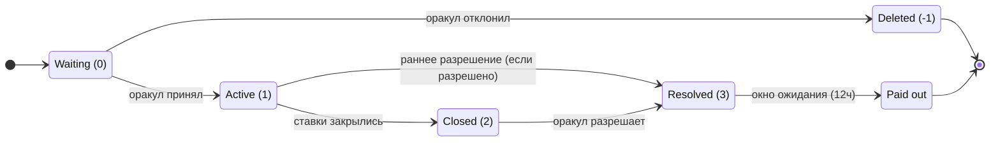
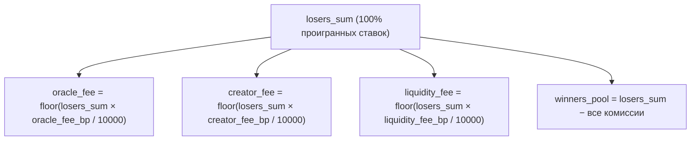

# Onix Protocol: прогнозные рынки с гарантией LP на VIZ DLT

**Индустриальный whitepaper**

*Анатолий Пискунов (On1x)*
*Версия 2.0 — июнь 2026 (on-chain / HF14)*

---

> **On-chain статус (HF14).** Этот документ изначально писался против централизованного прототипа.
> Теперь протокол работает как **операции консенсуса первого класса (`pm_*`) на VIZ DLT**, проверено в
> `consensus_sim`. Live с HF14: оба типа рынков (CPMM binary + LMSR multi), parimutuel zero-sum
> расчёт, **Lazy Pool**, опциональный сабсистем **плеча**, опциональные **batch / commit-reveal
> ставки** (бинарные), bonded-оракулы и двухрежимная система споров (комитет / аккаунт). Все
> процентные параметры — в **базисных пунктах (bp): 10000 = 100.00%** (прототип использовал permille).
> Разделы ниже снабжены пометками там, где живой дизайн отличается от исходного текста прототипа.

## Аннотация

Прогнозные рынки агрегируют рассеянную информацию в цены, давая оценки вероятностей, которые стабильно
превосходят опросы, экспертные панели и статистические модели. Но внедрение упирается в одну структурную
проблему: **поставщики ликвидности теряют деньги.**

LP в Uniswap v3 страдают от impermanent loss. Маркет-мейкеры LMSR рискуют всей своей субсидией.
Маркет-мейкеры CLOB сталкиваются с adverse selection. Каждая существующая модель просит поставщиков
капитала принять downside-риск в обмен на неопределённую доходность — и данные показывают, что
большинство из них теряет.

**Onix Protocol** устраняет риск LP полностью. Это архитектура прогнозного рынка, где принципал LP
**структурно гарантирован** — не страховкой, не хеджированием, а самой механикой выплат. Победителям
платят исключительно из проигранных ставок. Капитал LP даёт глубину рынка, но никогда не используется для
расчёта по ставкам.

Документ описывает два типа рынков Onix — **Onix Binary** (Constant Product Market Maker) и **Onix Multi**
(LMSR-ценообразование с parimutuel-расчётом) — а также архитектуру рынка, систему оракулов и разрешения
споров, lazy-пул ликвидности, опциональное плечо, модель управления и реализацию на VIZ DLT как операций
уровня консенсуса.

---

## 1. Проблема: риск LP в прогнозных рынках

Любому прогнозному рынку нужна ликвидность. Без неё цены бессмысленны — ставка, двигающая рынок на 20%,
раскрывает капитал беттера, а не мудрость толпы. Фундаментальный вопрос: **кто даёт эту ликвидность и чем
рискует?**

### 1.1 Текущий ландшафт

| Платформа | Модель LP | Риск LP | Источник дохода |
|----------|----------|---------|-------------|
| **Uniswap v3** | Концентрированный AMM | Impermanent loss (часто >5% годовых; >50% LP v3 проигрывают buy-and-hold) | Торговые комиссии |
| **Aave / Compound** | Lending-пул | Риск смарт-контракта, каскады ликвидаций | Проценты заёмщика |
| **Curve** | Stableswap AMM | Низкий IL для привязанных активов, риск смарт-контракта | Комиссии + эмиссия CRV |
| **Standard LMSR** | Субсидия маркет-мейкера | Убыток до `b × ln(N)` — вся субсидия | Bid-ask спред |
| **Polymarket (CLOB)** | Активный маркет-мейкинг | Инвентарный риск, adverse selection | Bid-ask спред |
| **Kalshi** | Концепции LP нет | N/A (биржевая модель) | N/A |

Закономерность очевидна: предоставление ликвидности прогнозным рынкам требует либо навыка активного
управления (CLOB), либо терпимости к потере капитала (LMSR), либо принятия impermanent loss (AMM). Ни
одно из этого не подходит ритейл-участникам.

### 1.2 Почему это важно

Прогнозные рынки работают лучше всего, когда они глубокие и ликвидные. Глубокие рынки дают точные цены,
привлекают информированных трейдеров и генерируют информационную ценность, делающую прогнозные рынки
полезными как общественное благо. Но глубина требует капитала, а капитал требует компенсации за риск.

Результат — проблема курицы и яйца:
- Тонкие рынки → высокий слиппедж → плохой UX → мало бетторов → низкие комиссии → нет стимула для LP → тонкие рынки

Чтобы разорвать этот цикл, нужно убрать риск со стороны LP. Если предоставление ликвидности безрисковое,
барьер входа падает до нуля, и маховик может раскрутиться.

---

## 2. Onix Protocol

### 2.1 Принципы дизайна

Onix Protocol построен на трёх архитектурных инвариантах:

1. **Принципал LP структурно безопасен.** Это не стратегия снижения риска — это свойство архитектуры
   выплат. Капитал LP и расчёт по ставкам берутся из физически раздельных пулов.

2. **Проигравшие финансируют победителей.** Все выплаты (прибыль победителей, комиссии оракула, комиссии
   создателя, комиссии LP) берутся исключительно из проигранных ставок. Комиссии считаются на резолюции
   как `floor(losers_sum × fee_bp / 10000)` (bp: 10000 = 100.00%), никогда не удерживаются при ставке.

3. **Два типа рынков, одна гарантия.** Бинарные рынки (Onix Binary) и мульти-исходные рынки (Onix Multi)
   используют разные формулы ценообразования, но разделяют одну модель расчёта и одну гарантию LP.

### 2.2 Onix Binary (CPMM + parimutuel-расчёт)

Onix Binary использует формулу Constant Product Market Maker — тот же инвариант `x * y = k`, что и
Uniswap — как **движок ценообразования** для бинарных исходов, с **parimutuel-расчётом** (проигравшие
финансируют победителей пропорционально весу), той же моделью расчёта, что и в Onix Multi.

**Механика:**

Рынок поддерживает два резерва, `reserve_a` и `reserve_b`, с постоянным произведением `k`:

```
k = reserve_a × reserve_b
```

Когда пользователь ставит `amount` на исход A (в реализации side 0 → `reserve_a`), стейк входит в резерв
этой стороны, а токены берутся из **противоположного** резерва:

```
new_reserve_a = reserve_a + amount
new_reserve_b = floor(k / new_reserve_a)
tokens_received = reserve_b − new_reserve_b
```

`tokens_received` (называемые `weight`) — это **относительная претензия** пользователя на пул победителей,
если выигрывает исход A (расчёт parimutuel — см. ниже, идентично Onix Multi). Подразумеваемая вероятность
растёт для той стороны, на которую ставят (больше денег на A → `reserve_a` растёт → `P(A)` растёт):

```
P(A) = reserve_a / (reserve_a + reserve_b)
P(B) = reserve_b / (reserve_a + reserve_b)
```

**Расчёт и доказательство безопасности LP (parimutuel):**

На резолюции победители получают назад свой стейк плюс пропорциональную долю пула проигравших, по весу
(идентично Onix Multi):

```
winners_pool = losers_sum − fees
payout = bet_amount + (weight / total_winning_weight) × winners_pool − time_penalty_on_profit
```

Принципал LP `L` возвращается безусловно, и гарантия точна:

```
Money OUT = L + winning_bets + winners_pool + fees = L + winning_bets + losing_bets = L + all_bets = Money IN
```

Суммарная выплата ограничена `losers_sum` независимо от весов, поэтому капитал LP никогда не используется
для расчёта по ставкам. CPMM — это **движок ценообразования** (вероятность + вес); он не гейтит выплату.
(Соотношение AM-GM `reserve_a + reserve_b ≥ 2√k = L` по-прежнему держится для ценовой кривой, но на него
больше не опираются для платёжеспособности.)

**Разобранный пример:**

```
Setup: 200 VIZ liquidity → reserve_a = 100, reserve_b = 100, k = 10,000
Fees (bp): oracle 50 (0.5%), creator 50 (0.5%), liquidity 100 (1%)

Alice bets 50 VIZ on A → receives weight 33.33 (price moves from 50% to 69%)
Bob bets 80 VIZ on B   → receives weight 81.82

Resolution: A wins
  Losers (Bob): 80 VIZ forfeited → losers_sum = 80
  oracle_fee   = floor(80 × 50/10000)  = 0.4 VIZ
  creator_fee  = floor(80 × 50/10000)  = 0.4 VIZ
  liq_fee      = floor(80 × 100/10000) = 0.8 VIZ
  winners_pool = 80 − 1.6 = 78.4 VIZ

  Alice (only winner, weight 33.33 of 33.33):
    payout = 50 (stake) + 78.4 × (33.33/33.33) = 128.4 VIZ (minus any time penalty on profit)
  LP return: 200 VIZ principal + share of 0.8 VIZ fee pool
```

### 2.3 Onix Multi (LMSR + parimutuel-расчёт)

Onix Multi — инновация протокола для рынков с 3–10 исходами. Он сочетает Logarithmic Market Scoring Rule
Хэнсона (LMSR, 2003) для ценообразования в реальном времени с parimutuel-расчётом ради безопасности LP.

**Ценообразование (LMSR softmax):**

Для рынка с исходами {1, 2, ..., N}, каждый со своим параметром количества `q_i`:

```
price(i) = exp(q_i / b) / Σ_j exp(q_j / b)
```

Это функция softmax — цены всегда суммируются ровно в 1.0 by construction. Никакого механизма арбитража
или операции split/merge не нужно.

Стоимость покупки Δ токенов на исход i:

```
C(q) = b × ln(Σ_j exp(q_j / b))

cost = C(q + Δ·e_i) − C(q)
```

Параметр `b` управляет чувствительностью цены (выше b = меньше price impact на ставку). Он фондируется
субсидией LP: `b = S / ln(N)`, где S — суммарная субсидия.

**Инновация — parimutuel-расчёт:**

В **стандартном LMSR** маркет-мейкер — контрагент всех ставок. Если толпа верно предсказывает исход,
маркет-мейкер теряет до `b × ln(N)` — потенциально всю субсидию. Именно поэтому LMSR мало внедряли вне
корпоративных прогнозных рынков (Microsoft, Inkling), где оператор поглощает убыток.

**Onix Multi меняет источник выплат.** На резолюции:

```
1. Oracle declares the winning outcome
2. Losers forfeit 100% → losers_sum
3. Fees deducted from losers_sum (bp; 10000 = 100.00%):
     oracle_fee  = floor(losers_sum × oracle_fee_bp / 10000)
     creator_fee = floor(losers_sum × creator_fee_bp / 10000)
     liq_fee     = floor(losers_sum × liquidity_fee_bp / 10000)
     winners_pool = losers_sum − fees
4. Winners receive:
     payout = bet_amount + (tokens / total_winning_tokens × winners_pool) − time_penalty
5. LP subsidy returned unconditionally
```

Победителям платят проигравшие, а не LP. Субсидия архитектурно отделена от потока расчёта.

**Доказательство гарантии принципала LP:**

1. LP вносит `S` VIZ как субсидию, которая фондирует глубину рынка.
2. Во время ставок пользователи платят VIZ → получают токены исходов. VIZ накапливается как пул ставок.
3. На резолюции проигранные ставки фондируют выплаты победителям и комиссии. Субсидия `S` никогда не была
   в платёжном пуле.
4. Субсидия возвращается LP безусловно, независимо от исхода.

**Сравнение:**

| Измерение | Standard LMSR | Onix Multi |
|-----------|---------------|------------|
| Роль LP | Контрагент всех ставок | Депозит глубины (не контрагент) |
| Макс. убыток LP | `b × ln(N)` (вся субсидия) | **Ноль** |
| Выплата победителю | 1 токен = 1 единица валюты | Токен = пропорциональная претензия на пул проигравших |
| Нужен ли CTF split/merge? | Да (обеспечить сумму цен = 1) | Нет (softmax гарантирует это) |

**Разобранный пример (выборы с 3 исходами):**

```
Setup: b = 1000, outcomes = [A, B, C], subsidy = 1000 VIZ
Initial: price(A) = price(B) = price(C) = 33.3%

Alice bets 50 VIZ on A → ~47 tokens (price: 33% → ~38%)
Bob bets 100 VIZ on B   → ~88 tokens
Carol bets 30 VIZ on C  → ~29 tokens

Resolution: A wins
  Losers: Bob (100) + Carol (30) = 130 VIZ
  Fees (200 bp = 2% total): 2.6 VIZ
  winners_pool = 127.4 VIZ

  Alice: 50 + (47/47 × 127.4) = 177.4 VIZ
  LP: 1000 VIZ returned in full + share of liquidity fees
```

### 2.4 Граничные случаи

| Сценарий | Исход |
|----------|---------|
| Все ставки на победителя | `losers_sum = 0` → каждый беттер получает назад ровно свою ставку. Субсидия LP возвращена. Zero-sum. |
| Нет ставок на победителя | Весь пул проигравших нераспределён → бонус LP. LP в максимальном плюсе. |
| Рынок с нулевым объёмом | Субсидия LP возвращена полностью. Ни комиссий, ни выплат. |
| Выигрывает единственный беттер | Этот беттер получает `bet_amount + winners_pool`. Субсидия LP возвращена. |

---

## 3. Архитектура рынка

### 3.1 Жизненный цикл рынка



Рынки создаёт создатель рынка, проверяет и принимает оракул (ставящий страховку), они открыты для ставок,
разрешаются исходом и выплачиваются после grace-периода для споров.

### 3.2 Модель комиссий (извлечение только из проигравших)

Отличительная черта Onix Protocol — **комиссии не удерживаются при ставке**. Полная сумма ставки входит в
резервы рынка. Комиссии считаются только на резолюции, исключительно из проигранных ставок:



Это даёт структурную гарантию: комиссии и выплаты победителям берутся из совершенно раздельных источников.
Извлечение комиссий никогда не конкурирует с обязательствами перед победителями.

**Условия комиссии оракула фиксируются при акцепте (offer→quote).** Создатель публикует *максимум*,
который оракул может взять (потолок `oracle_fee_percent` в bp + потолок `oracle_fixed_fee`); при акцепте
оракул котирует свои фактические условия (≤ потолка создателя и ≤ медианного governance-капа
`pm_max_oracle_fee_percent`), которые замораживаются на рынке, и эмитится виртуальная операция
`pm_market_accepted`. Self-оракул фиксирует условия при создании. **Фиксированная комиссия оракула**
(на рынок) выплачивается из остатка пула проигравших (никогда не печатается). **Комиссия за создание
рынка** идёт в фонд DAO как защита от спама.

### 3.3 Time-weighted распределение LP

Доли комиссий LP распределяются пропорционально `amount × max(1, seconds_to_expiration)`:

```
weight_i = amount_i × max(1, sec_to_expiration_i)
fee_share_i = floor(total_fee_pool × weight_i / Σ weight_j)
```

Ранние LP зарабатывают драматически больше на единицу капитала, чем поздние. В 48-часовом рынке LP,
внёсший на 1-м часу, зарабатывает ~2400× больше на VIZ, чем внёсший на 47-м.

Каждый депозит отслеживается как независимая позиция — несколько депозитов одного пользователя взвешиваются
и оплачиваются раздельно. Принципал LP всегда возвращается полностью, независимо от исхода рынка.

### 3.4 Time penalty для поздних ставок

Чтобы дестимулировать ставки в последнюю минуту (несущие меньше риска неопределённости), к ставкам близ
экспирации применяется настраиваемый time penalty:

```
if time_to_expiration < penalty_window:
    ratio = 1 − (time_to_expiration / penalty_window)
    penalty_ratio = ratio²           // quadratic (default)
    time_penalty = floor(penalty_ratio × max_penalty)
```

Штраф применяется **только к прибыли**, никогда к принципалу. Победивший беттер всегда получает не меньше
своей исходной ставки. Квадратичная кривая мягкая в начале окна штрафа и крутая в конце, награждая
«немного поздно» над «очень поздно».

### 3.5 Трансфер позиций

Позиции переводимы между аккаунтами через нативную операцию протокола:

```
pm_transfer_position { bet_id, to_user, amount, memo }
```

Без слиппеджа, без рыночного влияния — чистая переуступка записи. Поле `memo` поддерживает и открытый, и
зашифрованный режим (ECIES через memo-ключи аккаунтов VIZ), позволяя P2P-сделки, OTC-торговлю и приватные
аннотации.

Это единственная фича композируемости из Conditional Tokens Framework (Polymarket/Gnosis), дающая реальную
пользу. CTF split/merge архитектурно не нужен — формулы ценообразования Onix гарантируют когерентность цен
by construction.

---

## 4. Оракул и разрешение споров

### 4.1 Модель bonded-оракула

Оракулы в Onix Protocol не доверены по умолчанию — они **bonded**. Каждый оракул обязан:

- Зарегистрироваться с разовой комиссией (по умолчанию 10 VIZ)
- Внести страховку (минимум 5000 VIZ)
- Явно принимать рынки (ставя свою страховку на каждый акцепт)
- Разрешать рынки исходом и подтверждающими доказательствами (decision URL)

Страховой бонд создаёт подотчётность: оракулы, которые неверно разрешают, пропускают дедлайны или
проигрывают споры, теряют часть страховки (slashing). Бонд должен превышать потенциальную прибыль
манипуляции оракула, чтобы модель экономической безопасности держалась.

Доход оракула из двух источников:
1. **Фиксированная комиссия** (на рынок) — компенсирует ставку страховки и предоставление резолюции
2. **Процентная комиссия** (из пула проигравших на резолюции) — масштабируется с объёмом рынка

### 4.2 Арбитраж споров

Любой беттер может оспорить резолюцию в течение grace-периода, заплатив dispute fee. Во время споров все
выплаты заморожены.

Разрешение идёт в одном из **двух per-market режимов**, выбираемом при создании:

- **Режим комитета (`dispute_mode = 0`, по умолчанию)** — *весь электорат SHARES* решает
  **stake-weighted голосованием** (`pm_dispute_vote`), детерминированно подсчитываемым кроном
  `pm_dispute_finalize` на `voting_end_time`. Это **открытые публичные слушания**: живой тали
  запрашиваем, и голоса **не** скрыты за commit-reveal (намеренный, постоянный выбор — DAO разрешает
  споры максимально прозрачно). Поскольку по ходу слушаний всплывают новые доводы, **бюллетень изменяем**
  до закрытия (повторный голос перезаписывает прежний). Вес голосующего — его `effective_vesting_shares`
  **плюс стейк Lazy-Pool, конвертированный в vesting-shares**, поэтому участники DAO, паркующие VIZ в
  пуле, сохраняют свой вес в управлении.
- **Режим аккаунта (`dispute_mode = 1`)** — единственный именованный `dispute_resolver`
  (рекомендуется multisig) выносит вердикт (`pm_dispute_resolve`).

Логика вердикта в любом режиме:

**Если оракул был неправ (переворот):**
- Применяется верный исход, выплаты пересчитываются.
- Диспутёр получает назад свою fee **плюс carve-out награды** из слешнутой страховки, размером
  `dispute_fee × pm_dispute_reward_multiplier` (bp; напр. 30000 = ×3), ограниченный слэшем.
- **Остаток слэша добавляется в пул победителей** (через `forfeit_pool`) — он идёт выигравшим бетторам,
  **не** резолверу и **не** в ДАО. Ни голосующие комитета, ни аккаунт-резолвер награды **не получают**
  (голосование комитета — неоплачиваемая governance-обязанность).
- Страховка оракула слешится (масштаб — по силе консенсуса в режиме комитета или по `penalty_amount`
  резолвера в режиме аккаунта), с опциональным баном.

**Если оракул был прав (подтверждён):**
- Диспутёр **отдаёт всю dispute fee оракулу** (компенсация за недобросовестное оспаривание).
- Исходные выплаты идут без изменений.

**Предотвращение denial-of-resolution:** Если резолвер не действует в течение 14 дней, споры
авто-закрываются: все ставки и LP возвращаются, оракул штрафуется, fee диспутёра возвращается. Это
гарантирует, что средства никогда не заморожены бессрочно.

### 4.3 Скоринг репутации оракула

Протокол отслеживает 14 on-chain метрик на оракула и считает reliability score (0–100):

```
reliability_score = clamp(0, 100,
    50 (base)
    − 0.40 × dispute_loss_rate × 100
    − 0.10 × excess_no_contest × 100
    − 0.20 × deadline_miss_rate × 100
    − 0.15 × (1 − dispute_response_rate) × 100
    + volume_bonus (0–25)
    + experience_bonus × freshness_multiplier (0–25)
    − 15 × bans_received
)
```

Ключевые дизайн-решения:
- **Доли, а не счётчики** — 1 проигранный спор из 100 (1%) лучше, чем 1 из 2 (50%)
- **Нейтральный старт на 50** — новые оракулы должны заработать репутацию, а не стартовать со 100
- **Freshness decay** — неактивные оракулы со временем теряют experience-бонус
- **Тиры объёма** — высокообъёмные оракулы получают бонусные очки за доказанный track record

Reliability score сочетается с risk factor (отношение страховки к ставкам), давая **composite trust
score** — основную метрику, показываемую пользователям.

### 4.4 No-contest и резолюция с 3 исходами

Оракул, который не может верифицировать исход, может добровольно объявить **no-contest**, запуская
рефанды с пониженным штрафом (50% dispute fee из страховки — гораздо дешевле, чем проиграть спор). Это
создаёт градиент стимулов:

| Сценарий | Стоимость для оракула | Риск бана |
|----------|------------|----------|
| Добровольный no-contest | 500 VIZ | Нет |
| Проигрыш спора | 1000+ VIZ + доп. штраф | Постоянный или временный |
| Пропущенный дедлайн | 250 VIZ (авто-штраф) | Нет (но урон репутации) |

Если пользователи считают, что оракул злоупотребил no-contest, они могут это оспорить. Тогда резолвер
выбирает из **трёх** возможных верных исходов: побеждает A, побеждает B или подтвердить no-contest. Это
не даёт оракулам использовать no-contest, чтобы избежать выплат победившим бетторам.

---

## 5. Lazy-пул ликвидности

### 5.1 Проблема развёртывания капитала

Индивидуальное предоставление LP требует активного выбора рынков. Большинство пользователей не станут
вручную оценивать конкретные рынки и вкладываться в них. Итог: большинство рынков стартует только с
начальной ликвидностью создателя, давая тонкие книги и высокий слиппедж.

### 5.2 Авто-аллокация пул→рынок

Lazy-пул ликвидности решает это, принимая депозиты и **автоматически аллоцируя** процент свободного
баланса пула в каждый новый рынок при его активации:

```
alloc_amount = free_balance × allocation_percent / 100
```

Аллокации считаются от текущего свободного баланса (не от исходной суммы), создавая геометрический спад —
пул никогда нельзя полностью истощить:

```
After 50 markets (2% allocation each): ~357 VIZ free from original 1,000
After 100 markets: ~133 VIZ still free
```

Максимальный кап суммарной аллокации (по умолчанию 70%) даёт дополнительную безопасность.

### 5.3 Распределение наград (один общий аккумулятор)

Проблема: когда рынок разрешается с прибылью пула, эту прибыль надо разделить между **всеми** текущими
вкладчиками пропорционально их долям — но проходить по каждому вкладчику на каждом рынке было бы O(N) и
неограниченно. Пул избегает этого **одним глобальным бегущим итогом** `reward_per_share` («rps»):

```
// When a market resolves with pool LP profit, the per-share value of the pool rises once:
pool.reward_per_share += profit × PRECISION / total_shares

// A depositor's earnings = their shares × how much rps has risen since they last touched the pool:
live_reward = pending + shares × (pool.reward_per_share − user.snapshot) / PRECISION
```

Простыми словами: каждый вкладчик «владеет» долей каждого роста `reward_per_share`, и его награда =
`доли × (текущий rps − rps на момент его последнего депозита/вывода)`. Запись самого вкладчика трогается
**только когда он действует** (депозит/вывод); до тех пор его право копится тихо в глобальном числе. Поэтому
раздача прибыли тысячам вкладчиков — **O(1)** (одно сложение), и ничего не выплачивается до клейма. Это
известный паттерн-аккумулятор из
[контракта MasterChef SushiSwap](https://github.com/sushiswap/masterchef/blob/master/contracts/MasterChef.sol)
(и индекса cToken у Compound); `PRECISION` (1e9) держит целочисленное деление точным.

### 5.4 Защита от opportunity-cost

Пул авто-аллоцирует в каждый рынок, создавая вектор атаки: вредоносный оракул мог бы создавать длинные
рынки с нулевым объёмом, чтобы запереть капитал пула. Это адресуют три механизма:

**Graduated Early Recall:** Длительность рынка делится на 10 шагов. На каждом шаге, если объём ставок ниже
порога (1% аллокации), 10% текущей аллокации отзывается в пул. Полностью простаивающий 30-дневный рынок
теряет ~60% своей аллокации.

**Active Market Penalty:** Каждый дополнительный активный рынок того же оракула снижает его аллокацию на
5% (рекурсивно). Оракул с 10 активными рынками получает ~60% базовой аллокации на рынок, стимулируя
качество над количеством.

**Fault Penalty Stamps:** Плохие исходы (пропущенные дедлайны, проигранные споры, резолюции с нулевым
объёмом) генерируют штрафные штампы, дополнительно снижающие будущие аллокации. Штампы авто-истекают после
10 дней чистой работы.

### 5.5 Опциональное плечо (фондируется Lazy-пулом)

Lazy-пул играет **две роли из одного `free_balance`**: тихие market-LP аллокации *и* фондирование
сабсистемы **опционального плеча**. Беттер может открыть позицию с плечом (`pm_leverage_open`), где маржа
— это **займ из пула**: без эмиссии токенов, позиция остаётся полностью обеспеченной с точки зрения
системы. Бинарный «jump risk», ломающий liquidation-движки CLOB, решается **ликвидацией по pre-bet
резервам**: opposing-bet или settlement force-close возвращает `min(cancel_value, obligation) ≥ loan`,
поэтому пул получает назад заём плюс проценты; единственный ограниченный путь bad-debt — same-side
`pm_cancel_bet`. Медианный kill-switch (`pm_leverage_enabled`, по умолчанию off) блокирует *новые*
открытия, но защитный каскад ликвидации намеренно **не** гейтится им — выключение плеча никогда не снимает
защиту с открытых позиций. Пул зарабатывает проценты по плечу вдобавок к LP-доходности, учёт тем же
способом MasterChef. Расчёт по займам пула эмитит `pm_leverage_resolve` / `pm_leverage_liquidate`.

---

## 6. Управление

### 6.1 Делегат-голосуемые параметры цепи

VIZ использует консенсус Delegated Proof of Stake (DPoS), где избранные делегаты (валидаторы) управляют
параметрами цепи через механизм медианного голоса:

1. Каждый делегат публикует предпочитаемые значения всех параметров
2. Сеть вычисляет **медиану** голосов всех активных делегатов
3. Параметры меняются автоматически при сдвиге медианы — без хардфорка, без деплоя

Все параметры прогнозных рынков (комиссии, штрафы, требования к страховке, окна споров, настройки
lazy-пула, ручки плеча, тайминг batch/commit-reveal) делегат-голосуемы. Все процентные параметры — в
**базисных пунктах (bp), 10000 = 100.00%**:

| Примеры | Управление |
|----------|-----------|
| `pm_dispute_fee`, `pm_max_oracle_fee_percent` (bp) | Медианный голос делегатов |
| `pm_dispute_grace_sec`, `pm_dispute_vote_period_sec` | Медианный голос делегатов |
| `pm_dispute_approve_min_percent`, `pm_dispute_reward_multiplier` (bp) | Медианный голос делегатов |
| `pm_lazy_*` аллокация/recall, `pm_leverage_*` (enabled, fund %, max position) | Медианный голос делегатов |
| `pm_commit_reveal_enabled`, `pm_batch_epoch_blocks`, `pm_reveal_window_blocks` | Медианный голос делегатов |

Хардфорки нужны только для структурных изменений (новые типы операций, изменения формул), не для
экономической настройки. Kill-switches (`pm_leverage_enabled`, `pm_commit_reveal_enabled`) позволяют
управлению отключить целую подсистему медианным голосом без форка.

### 6.2 Модель юрисдикционного клиента

VIZ DLT — инфраструктура, не оператор — аналогично тому, как Bitcoin это леджер, а не money transmitter.
Протокол нейтрален и permissionless. Правовые обязательства привязаны к **клиентским приложениям**, не к
алгоритму консенсуса.

Любая юрисдикция может построить compliant-клиент на VIZ DLT:

| Компонент клиента | Реализация |
|-----------------|---------------|
| Предодобренные оракулы | Whitelist клиента из лицензированных, KYC-верифицированных оракулов |
| Предодобренные резолверы | Госорганы разрешения споров |
| KYC/AML | Идентификация на уровне клиента |
| Маршрутизация комиссий как налоговый доход | `dao_fund_account_id` → счёт госказны |
| Ограничения рынков | Клиент фильтрует по разрешённым категориям |
| Лимиты ставок | Лимиты на пользователя, навязанные клиентом |

Те же операции протокола (`pm_place_bet`, `pm_resolve`, `pm_dispute`) работают одинаково для
permissionless и регулируемых клиентов. Разница целиком на слое клиента.

---

## 7. Конкурентный ландшафт

### 7.1 Сравнение платформ

| Измерение | Onix (Forecaster) | Polymarket | Kalshi | Standard LMSR |
|-----------|-------------------|------------|--------|---------------|
| **Ценообразование** | CPMM (binary) / LMSR softmax (multi) | CLOB | CLOB | LMSR |
| **Риск LP** | **Ноль** (структурная гарантия) | Инвентарный риск | N/A | До `b × ln(N)` |
| **Знания LP** | Низкие (внёс и зарабатывай) | Высокие (управляй ордерами) | N/A | Средние |
| **Модель комиссий** | % пула проигравших на резолюции | Bid-ask спред | Биржевые комиссии (1-7%) | Спред |
| **Оракул** | Per-market bonded + диспут комитета | UMA Optimistic Oracle | Kalshi (регулятор CFTC) | Оператор |
| **Штраф за поздние ставки** | Квадратичный, настраиваемый | Нет | Нет | Нет |
| **Трансфер позиций** | Нативная операция + зашифрованное memo | CTF (ERC-1155) | Нет | Нет |
| **Управление** | Делегат-голосуемые параметры | Multisig команды | Процесс CFTC | Оператор |
| **Инфраструктура** | VIZ DLT (уровень консенсуса) | Polygon (смарт-контракты) | Проприетарные серверы | Разное |

### 7.2 Почему CTF split/merge не нужен

Polymarket использует Gnosis Conditional Tokens Framework (CTF), где позиции — это ERC-1155 токены,
которые можно split и merge для обеспечения когерентности цен (сумма цен = $1).

В Onix Protocol этот механизм архитектурно не нужен:

- **Onix Binary (CPMM):** `price(A) + price(B) = reserve_b/(reserve_a+reserve_b) + reserve_a/(reserve_a+reserve_b) = 1` — по определению
- **Onix Multi (LMSR softmax):** `Σ price(i) = Σ exp(q_i/b) / Σ exp(q_j/b) = 1` — по определению softmax

Механизм арбитража не нужен. Когерентность цен — математическое свойство формул, а не внешний слой
энфорсмента.

### 7.3 Маховик

```
Risk-free LP → lower barrier for retail LPs
  → more liquidity deposited
    → deeper markets, less slippage
      → better UX for bettors
        → more volume
          → more fees for LPs
            → attracts even more LPs
```

«Пассивная доходность без impermanent loss» — ценностное предложение, которого Uniswap, Balancer и Curve
дать не могут. Для crypto-native аудитории это убедительный нарратив: зарабатывай доход, предоставляя
ликвидность прогнозным рынкам, с нулевым риском для принципала.

---

## 8. VIZ DLT: от прототипа к протоколу

### 8.1 Текущее состояние

Протокол начинался как Telegram WebApp с централизованным бэкендом (вся логика рынка на сервере) —
рабочий прототип с известными ограничениями: нет sybil-устойчивости сверх Telegram-аккаунтов, нет
цензуроустойчивости, нет композируемости. **Эта миграция теперь выполнена:** полная логика рынка работает
**на VIZ DLT как consensus-validated операции `pm_*`** (HF14), отработана end-to-end в `consensus_sim`.
Остаток раздела описывает эту on-chain архитектуру, теперь реализованную.

### 8.2 Архитектура миграции

VIZ DLT — Distributed Ledger Technology с ~3-секундными блоками, DPoS-консенсусом, именованными аккаунтами
(в стиле Graphene) и без general-purpose смарт-контрактов. Операции прогнозного рынка реализованы как
**операции консенсуса первого класса** — не смарт-контракты, не `custom_json`-нагрузки.

| Слой | Примеры | Validated консенсусом? |
|-------|---------|---------------------|
| **Операции протокола** | `pm_create_market`, `pm_oracle_accept_market`, `pm_place_bet`, `pm_commit_bet`/`pm_reveal_bet`, `pm_resolve_market`, `pm_dispute_create`/`pm_dispute_vote`/`pm_dispute_resolve`, `pm_lazy_deposit`/`pm_lazy_withdraw`, `pm_leverage_open`/`pm_leverage_close`/`pm_leverage_convert` | Да — валидирует каждый узел |
| **Виртуальные операции** | `pm_payout` (на беттера), `pm_auto_payout`, `pm_market_accepted`, `pm_dispute_finalize`, `pm_dispute_auto_close`, `pm_oracle_missed_penalty`, `pm_lazy_recall`, `pm_batch_settle`, `pm_commit_forfeit`, `pm_leverage_resolve`/`pm_leverage_liquidate` | Да — детерминированы, генерируются на этапе блока |
| **metadata / custom_json** | Комментарии споров, описания рынков, UI-метаданные | Нет — только отображение/индексация |

Каждое финансовое действие (ставки, добавление ликвидности, резолюция рынков, изъятие страховки)
валидируется каждым валидатором. Невалидные операции отвергаются до включения в блок. Никакого Solidity,
оценки газа, деплоя байткода.

Фронтенд — **полностью headless web-клиент** — без бэкенд-сервера, без БД, без сессий. Приватные ключи в
браузере (зашифрованы), транзакции подписываются локально и вещаются на публичные узлы VIZ. Нет зависимости
от Telegram; ядро приложения платформонезависимо.

### 8.3 Реализовано с момента прототипа и оставшаяся дорожная карта

**Реализовано on-chain (HF14):**

| Фича | Статус |
|---------|--------|
| Commit-reveal + batch ставки (бинарные, опциональные, медианный kill-switch) | ✅ Live |
| Опциональное плечо (фондируется Lazy-пулом, ликвидация по pre-bet резервам) | ✅ Live |
| Lazy Pool (авто-аллокация, graduated recall, MasterChef-учёт) | ✅ Live |
| Виртуальные операции расчёта на беттера / плечо + API плагина | ✅ Live |
| Стейк lazy-пула как governance-вес (PM-споры + заявки DAO) | ✅ Live |

**Оставшаяся дорожная карта:**

| Приоритет | Фича | Влияние |
|----------|---------|--------|
| Высокий | Shared liquidity pools (category-level AMMs) | Решает фрагментацию ликвидности на уровне архитектуры |
| Высокий | Automated data oracles (экзогенные фиды) | Устраняет манипуляцию для объективных рынков |
| Средний | Тиры окон споров (малые vs крупные рынки) | Лучшая калибровка UX |
| Средний | LMSR batch settlement (расширить batch/commit-reveal на multi) | Multi-рынки сейчас форсят instant-ставки |
| — | Commit-reveal голосование в **спорах** | **Намеренно отклонено** — споры остаются публичными слушаниями (см. §4.2) |

---

## 9. Что Onix НЕ заявляет

Честное раскрытие компромиссов и ограничений:

- **Прибыль LP не гарантирована.** Если у рынка ноль проигранных ставок, комиссий для распределения нет.
  LP получает назад принципал, но не зарабатывает ничего.

- **Платформенный риск существует.** Баги, эксплойты и атаки на управление отделены от модели
  маркет-мейкера. Гарантия LP структурна (архитектура выплат), не застрахована (нет внешнего гарантийного
  фонда).

- **Токены Onix Multi — не инструменты фиксированной стоимости.** В стандартном LMSR 1 выигрышный токен =
  1 единица валюты. В Onix Multi токены — пропорциональные претензии на пул проигравших. Если все беттеры
  выбрали победителя, все выходят в ноль.

- **Доходность LP зависит от объёма, не от глубины.** Рынок с субсидией 100 000 VIZ и рынок с 1000 VIZ
  заработают одинаковую абсолютную комиссию, если у обоих идентичные объём ставок и ставки комиссий.
  Субсидия даёт глубину, не доходность.

- **У DPoS-управления есть известные компромиссы.** Меньше валидаторов, чем у PoW/PoS, риски концентрации
  делегатов, token-weighted голосование. Это присуще модели DPoS (общей с EOS, Hive, Tron), не специфично
  для VIZ.

- **Ликвидность токена VIZ сейчас низкая.** Экономические гарантии (страховые бонды, dispute fee)
  масштабируются с ценой токена. Протокол предполагает, что полезность со временем создаёт спрос — та же
  ставка, что делает любой protocol-native токен-проект.

---

## 10. Заключение

Onix Protocol адресует фундаментальный барьер внедрения прогнозных рынков: риск LP. Структурно отделяя
капитал LP от расчёта по ставкам — и в бинарных (CPMM), и в мульти-исходных (LMSR + parimutuel) рынках —
Onix делает предоставление ликвидности безрисковым и доступным для ритейл-участников.

Ключевые инновации:

1. **Гарантия принципала LP** как архитектурный инвариант, а не страховка
2. **Проигравшие-финансируют-победителей** расчёт, устраняющий конкуренцию комиссий с выплатами
3. **LMSR-ценообразование с parimutuel-расчётом** (Onix Multi) — сочетание проверенного price discovery
   с безопасностью LP
4. **Time-weighted распределение LP**, награждающее раннюю фиксацию капитала
5. **Квадратичный time penalty** на прибыль (никогда принципал) для поздних ставок
6. **Lazy-пул ликвидности** с авто-аллокацией, graduated recall и MasterChef-учётом — также фондирующий
   сабсистему **плеча** (маржа из пула, ликвидация по pre-bet резервам, нет bad-debt вне ограниченного
   cancel-bet пути)
7. **Модель bonded-оракула** со скорингом репутации, offer→quote заморозкой комиссии и двухрежимной
   системой споров — диспуты комитета это **публичные слушания** с изменяемыми, lazy-pool-взвешенными
   голосами
8. **Опциональный анти-MEV** — batch / commit-reveal ставки (бинарные) с медианным kill-switch
9. **Реализация на уровне консенсуса** на VIZ DLT — без смарт-контрактов, газа и внешних keeper'ов;
   строго **zero-sum** (протокол никогда не печатает токен)

Ставка проста: если безрисковый LP привлекает капитал, капитал создаёт глубину, глубина улучшает цены, а
цены привлекают бетторов — то Onix Protocol решает проблему ликвидности прогнозных рынков. Механика
протокола математически проверяема. Экономическую гипотезу проверит рынок.

---

## 11. Автор и раскрытие

### Автор

**Анатолий Пискунов** (On1x) — российский IT-инноватор, Web3/DLT-разработчик, создатель блокчейна VIZ.
Его работа охватывает distributed ledger technology, децентрализованные социальные протоколы и
экономические модели цифровых сообществ.

Ключевые вклады: VIZ Blockchain (Fair DPoS, примитивы социального капитала), Onix Protocol (прогнозные
рынки с гарантией LP), Voice Protocol (цензуроустойчивый обмен сообщениями) и обширные публикации по
экономике блокчейна и Web3-архитектуре.

Полный список публикаций и проектов: [https://on1x.com](https://on1x.com)

### Раскрытие

Автор Forecaster и Onix Protocol также создатель VIZ DLT. Дорожная карта миграции предлагает перенести
платформу на блокчейн, спроектированный и построенный автором.

Это раскрыто заранее. Это также норма: Polymarket зависит от инфраструктуры Polygon Labs, Kalshi работает
на своих серверах, Augur спроектировал токен REP, на котором работает. Каждая платформа аргументирует за
свою инфраструктуру. Вопрос не в том, есть ли у автора интерес — он всегда есть — а в том, фальсифицируемы
ли технические заявления. Каждая формула, доказательство и механизм в этом документе математически
проверяемы, а кодовая база — открытая.

---

## 12. Ссылки

1. Hanson, R. (2003). *Combinatorial Information Market Design.* Information Systems Frontiers, 5(1), 107–119. — Logarithmic Market Scoring Rule (LMSR).

2. Adams, H., Zinsmeister, N., Robinson, D. (2020). *Uniswap v2 Core.* — Constant Product Market Maker (`x * y = k`).

3. Adams, H., et al. (2021). *Uniswap v3 Core.* — Концентрированная ликвидность и анализ impermanent loss.

4. Gnosis. *Conditional Tokens Framework (CTF) Documentation.* https://docs.gnosis.io/conditionaltokens/ — ERC-1155 позиции прогнозного рынка.

5. UMA Protocol. *Optimistic Oracle Documentation.* — Механизм эскалации споров, используемый Polymarket.

6. Leshner, R., Hayes, G. (2019). *Compound: The Money Market Protocol.* — Паттерн аккумулятора cToken (основа для reward_per_share).

7. SushiSwap. *MasterChef Contract.* — Паттерн ленивого учёта для распределения наград.

8. Piskunov, A. (2019). *VIZ blockchain system: technical description.* — Архитектура VIZ DLT, DPoS-консенсус, именованные аккаунты.

9. Piskunov, A. (2019). *What is Fair DPoS.* — Инновация управления в delegated proof of stake.

10. Piskunov, A. (2023). *VIZ as a Digital Representative Self-Governing State.* — Рамка для блокчейн-систем как цифровых государств.
