# Воркфлоу и диаграммы взаимодействия

Один **канонический сценарий**, прослеженный через каждого участника. Каждая роль отправляет конкретные
**подписанные операции**, её затрагивают конкретные **виртуальные операции**, и всё завершается таблицей
**отправлено / получено токенов** для двух исходов:

- **Нормальное разрешение** — оракул резолвит, проходит grace, `pm_auto_payout` рассчитывает. Без спора.
- **Спорное разрешение** — оракул резолвит **A**, спор **переворачивает на B**, затем идёт расчёт.

Все суммы — абстрактные **VIZ**. Все проценты — **bp** (10000 = 100.00%). Расчёт строго **zero-sum** —
токены никогда не печатаются, `current_supply` не трогается:

```
Σ winner_payout + oracle_take + creator_take + lp_bonus + LP_principal
        == Σ all bet amounts + LP_principal + forfeit_pool   (+ insurance slash, в споре)
```

## Канонический рынок **M** (binary CPMM, A vs B)

| Параметр | Значение |
|------|-------|
| Движок | binary CPMM (`x·y=k`), `weight = tokens_out` |
| Сид-ликвидность (marketmaker) | **2000** → резервы A=1000 / B=1000 |
| `oracle_fee_percent` (котировка оракула) | **1000** (10%) |
| `creator_fee_percent` | **500** (5%) |
| `liquidity_fee_percent` | **500** (5%) |
| `oracle_fixed_fee` (котировка оракула) | **10** |
| `dispute_penalty_percent` | **+10000** (слеш до 100% страховки ×consensus) |

Иллюстративные chain props: `pm_market_creation_fee` 5, `pm_oracle_registration_fee` 10,
`pm_min_oracle_insurance` 5000, `pm_dispute_fee` 1000, `pm_dispute_reward_multiplier` 30000 (**3×**),
`pm_no_contest_penalty_percent` 5000, `pm_oracle_penalty_percent` 500, `pm_lazy_emergency_penalty_percent`
5000, `pm_leverage_pool_profit_percent` **R = 10%**, `pm_lazy_alloc_percent` 2000 (20%).

### Состав

| Актор | Роль | Стейк / действие |
|-------|------|----------------|
| **maker** | создатель + первый LP | сид 2000 ликвидности |
| **orac** | внешний оракул | страховка 5000; котирует 10% + фикс 10 |
| **LP1** | поставщик ликвидности в рынке | добавляет 1000 |
| **A** | беттор — победитель | 100 на **A**, рано; вес 100 |
| **C** | беттор — поздний победитель | 100 на **A** при T+85%; вес 100; time-penalty **50%** |
| **B** | беттор — проигравший | 200 на **B**; вес 200 |
| **D** | leverage **×10** победитель | collateral 10 + loan 90 (рынок **L**) |
| **E** | leverage **×5** ликвидирован | collateral 20 + loan 80 (рынок **L**) |
| **LZ1** | депозитчик lazy-пула | вносит 1000 |
| **disp** | диспутёр | escrow dispute fee 1000 |

> Веса кривой (100 / 100 / 200) выписаны явно, чтобы арифметика parimutuel читалась; реальный CPMM выдаёт
> чуть меньше веса по мере сдвига резервов.

## Диаграммы взаимодействия

**Жизненный цикл рынка.**

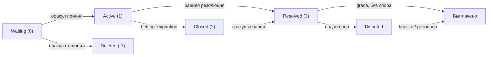

**Расчёт — НОРМАЛЬНО (побеждает A).** Проигравшие финансируют победителей; принципал LP не тронут (zero-sum).

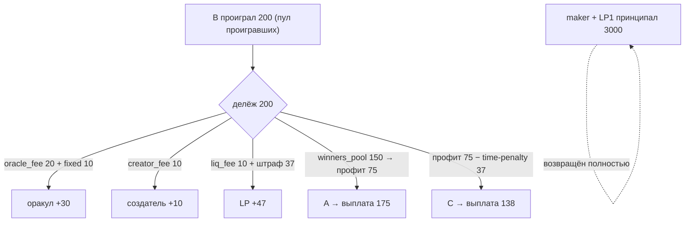

**Спор — оракул сказал A, перевёрнуто на B.** Наказание — это слеш страховки (отдельные деньги).

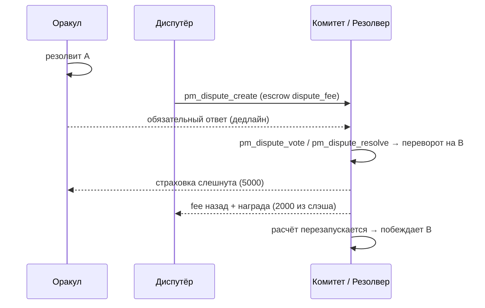

## Мастер-леджер — НОРМАЛЬНОЕ разрешение (A побеждает)

`losers_sum = 200` (B). Комиссии с пула проигравших:
`oracle_fee = 200×10% = 20`, `creator_fee = 200×5% = 10`, `liq_fee = 200×5% = 10`, `oracle_fixed = 10`.
`winners_pool = 200 − 20 − 10 − 10 − 10 = 150`. `Σ выигрышного веса = 200` (A 100 + C 100).

- **A**: профит `150×100/200 = 75`, штраф 0 → **выплата 175**.
- **C**: профит 75, time-penalty `75×50% = 37` (→ LP) → **выплата 138**.
- **LP-бонус** = `liq_fee 10 + штрафы 37 = 47`, делёж по времени в рынке: **maker ~31 / LP1 ~16**.
- **oracle_take** = `oracle_fee 20 + fixed 10 = 30`. **creator_take** = `creator_fee 10`.

| Актор | отправил | получил | нетто (этот рынок) |
|-------|-------|----------|-------------------|
| maker | 2000 ликвидности + 5 creation-fee | 2000 принципал + 10 creator-fee + 31 LP-бонус | **+36** |
| orac | (10 reg-fee, 5000 страховка заблок.) | 30 oracle-take | **+30** |
| LP1 | 1000 ликвидности | 1000 принципал + 16 LP-бонус | **+16** |
| A | 100 | 175 | **+75** |
| C | 100 | 138 | **+38** |
| B | 200 | 0 | **−200** |

**Zero-sum:** in `= ставки 400 + LP принципал 3000 = 3400`; out `= 175+138+0 + 30 + 10 + 47 + 3000 = 3400`. ✔
5 creation-fee + 10 reg-fee уходят в **фонд DAO** (не часть пула рынка).

## Мастер-леджер — СПОРНОЕ разрешение (оракул сказал A → перевёрнуто на B)

`disp` эскроит `dispute_fee 1000`. Вердикт переворачивает на **B**; оракула слешат.
При `dispute_penalty_percent = 10000` и силе консенсуса **100%**: `slash = 5000×100%×100% = 5000`.
Carve-out награды: `reward_target = fee×3 = 3000` → `bonus = 3000 − 1000 = 2000` (≤ slash). Диспутёр
получает `fee 1000 + bonus 2000 = 3000`. Остаток `slash − bonus = 3000 → forfeit_pool`.

Теперь **B побеждает**. `losers_sum = 200` (A 100 + C 100). Комиссии 20/10/10 + fixed 10.
`winners_pool = 200 − 50 + forfeit 3000 = 3150`. `Σ выигрышного веса = 200` (B).
- **B**: профит `3150×200/200 = 3150` → **выплата 3350**.
- **oracle_take** всё ещё `30` (*рыночная* комиссия платится из замороженной конфигурации даже при
  перевороте — наказание это **слеш страховки**, отдельные деньги). **creator_take** 10. **LP-бонус** = liq 10.

| Актор | отправил | получил | нетто (этот рынок) |
|-------|-------|----------|-------------------|
| maker | 2000 + 5 | 2000 принципал + 10 creator-fee + ~6 LP-бонус | **+11** |
| orac | страховка −**5000** слешнута | 30 oracle-take | **−4970** |
| LP1 | 1000 | 1000 принципал + ~4 LP-бонус | **+4** |
| A | 100 | 0 | **−100** |
| C | 100 | 0 | **−100** |
| B | 200 | 3350 | **+3150** |
| disp | 1000 dispute-fee | 3000 (fee назад + 2000 награда) | **+2000** |

**Zero-sum:** in `= ставки 400 + LP принципал 3000 + dispute_fee 1000 + слеш 5000 = 9400`;
out `= B 3350 + оракул 30 + создатель 10 + lp_bonus 10 + LP принципал 3000 + диспутёр 3000 = 9400`. ✔
Слеш 5000 делится на бонус диспутёра 2000 + forfeit 3000 (→ B через пул победителей).

## Статус реализации (сверено с кодом)

**Обычные операции — все 21 присутствуют** в variant `operation` (`operations.hpp`), валидируются +
оцениваются в `pm_evaluator.cpp`:
`pm_oracle_register`, `pm_oracle_update`, `pm_create_market`, `pm_oracle_accept_market`, `pm_place_bet`,
`pm_commit_bet`, `pm_reveal_bet`, `pm_cancel_bet`, `pm_add_liquidity`, `pm_withdraw_liquidity`,
`pm_resolve_market`, `pm_no_contest`, `pm_dispute_create`, `pm_dispute_vote`, `pm_dispute_resolve`,
`pm_transfer_position`, `pm_lazy_deposit`, `pm_lazy_withdraw`, `pm_leverage_open`, `pm_leverage_close`,
`pm_leverage_convert`. ✔

**Виртуальные операции** — эмитятся `database::process_pm_markets()` / эвалюаторами:

| Виртуальная op | Фаерится? | Триггер (код) |
|------------|--------|----------------|
| `pm_market_accepted` | ✔ | при `pm_oracle_accept_market` **и** self-oracle `pm_create_market` |
| `pm_payout` | ✔ | **на каждую активную ставку** при расчёте — несёт `account`, `market_id`, `bet_id`, `side`/`outcome_index`, `amount` (стейк), `payout` (**0 при проигрыше**) |
| `pm_auto_payout` | ✔ | **раз на рынок** при расчёте — сводный маркер (`bets_sum`) рядом с per-bet `pm_payout` |
| `pm_commit_forfeit` | ✔ | нераскрытый commit после `reveal_deadline` |
| `pm_dispute_finalize` | ✔ | `voting_end_time` комитета |
| `pm_dispute_auto_close` | ✔ | `auto_close_time` (анти-фриз) |
| `pm_oracle_missed_penalty` | ✔ | оракул пропустил `result_expiration` |
| `pm_lazy_recall` | ✔ | шаг graduated recall простаивающей аллокации |
| `pm_batch_settle` | ✔ | граница эпохи |
| `pm_leverage_liquidate` | ✔ | mid-market ликвидация: reason **0** opposing-bet, **1** cancel-bet (`cascade_liquidate`) |
| `pm_leverage_resolve` | ✔ | **расчёт** leverage-позиции: несёт `market_id`, `outcome_index`, `won`, `pool_received`/`bettor_received`, `leverage` (= `total_bet/collateral`) |

См. [API плагина](../plugins/prediction-market-api) для read-методов
(`get_account_leverage_positions`, `get_market_leverage_positions`, `get_creator_ban`, `get_dispute_votes`, …);
per-bettor результаты (`pm_payout`) и расчёты плеча (`pm_leverage_resolve`) видны и в `account_history`.

## Роли в каноническом сценарии

Каждый участник прослежен через рынок **M** (и leverage-подрынок **L**): его диаграмма взаимодействия,
**подписанные** операции, **виртуальные** операции, которые его касаются, леджер
**отправлено / получено** для обоих исходов и указатель на проверку в коде. Каждый леджер по роли —
срез двух мастер-леджеров выше.

### Маркет-мейкер (создатель + первый LP)

Мейкер создаёт рынок M, вносит **2000** ликвидности (становясь первым `pm_liquidity_object`) и
предлагает **потолок-оферту** оракула. Он **не** разрешает (это делает оракул).

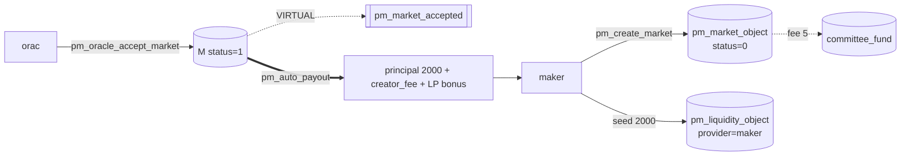

- **Отправляет:** `pm_create_market` (задаёт `oracle_fee_percent`/`oracle_fixed_fee` как **потолок-оферту**
  плюс свои `creator_fee_percent` 5% и `liquidity_fee_percent` 5%; платит `pm_market_creation_fee` 5 → DAO,
  блокирует `liquidity` 2000); опц. `pm_add_liquidity` / `pm_withdraw_liquidity` (принципал-сейф, заблокирован
  от `betting_expiration` до резолюции).
- **Касаются:** `pm_market_accepted` (оракул акцептует, либо self-oracle при создании); `pm_auto_payout`
  (возвращает принципал LP + взвешенную по времени долю LP-бонуса).

| исход | отправляет | получает | нетто |
|-------|------------|----------|-------|
| нормальный (A) | 2000 ликвидности + 5 fee-создания (→DAO) | 2000 принципала + **creator_fee 10** + **LP-бонус ~31** | **+36** |
| спорный (→B) | 2000 + 5 | 2000 принципала + creator_fee 10 + LP-бонус ~6 | **+11** |

Creator fee **всё равно платится** из замороженной конфигурации рынка при перевороте — спор наказывает
**оракула** (слеш страховки), а не мейкера. Принципал LP возвращается безусловно.

- **Self-oracle:** `oracle == creator` → активен при создании, `pm_market_accepted` с `self_oracle=true`,
  и мейкер дополнительно получает `oracle_take`.
- **Проверка:** `pm_create_market_evaluator`; LP через `settle_liquidity`; `committee_fund += pm_market_creation_fee`.
  **Наблюдать:** `get_market`, `list_markets_by_creator`, `get_market_liquidity` (`earned_fee`), `get_market_meta`.

### Оракул (регистрация → акцепт-котировка → резолюция)

Внешний оракул **orac** вносит страховку, **котирует** свою fee при акцепте (≤ оферты мейкера и ≤
`pm_max_oracle_fee_percent`) и разрешает. Его рыночная fee платится из пула проигравших; бонд под риском
только при пропуске дедлайна или проигранном споре.

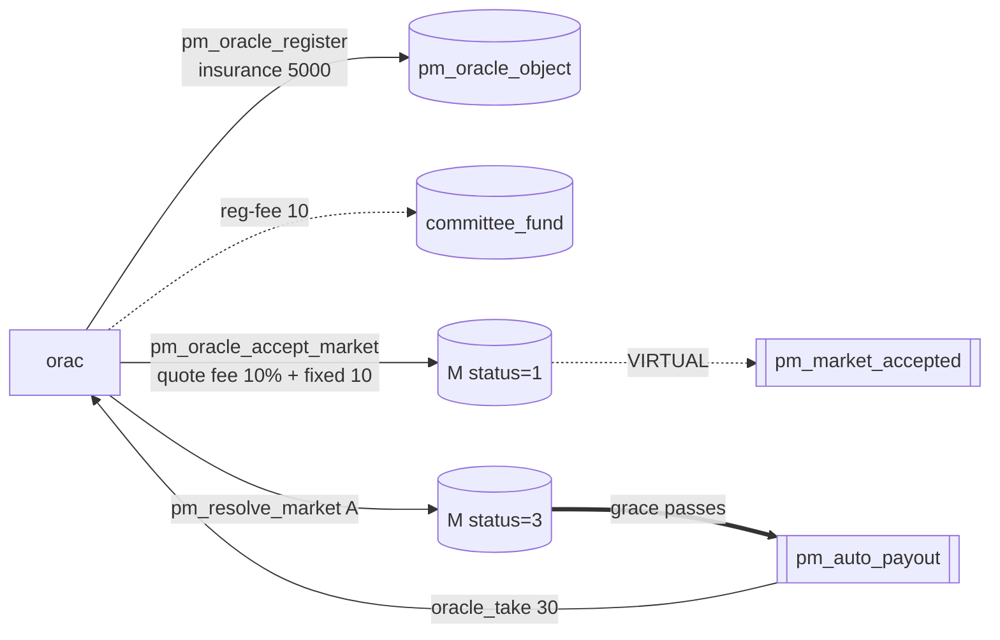

- **Отправляет:** `pm_oracle_register` (блокирует страховку 5000, платит reg-fee 10 → DAO, задаёт advisory
  прайс-лист); `pm_oracle_accept_market` (**котирует** fee 10% + fixed 10, каждое ≤ оферты создателя и ≤
  медианного кэпа; замораживает на M); `pm_resolve_market` (задаёт `winning_outcome`, открывает grace);
  опц. `pm_oracle_update` / `pm_no_contest`. Стоячий прайс-лист также может авто-акцептовать рынки live
  при создании — см. документ операций оракула.
- **Касаются:** `pm_market_accepted`; `pm_auto_payout` (зачисляет `oracle_take`); `pm_oracle_missed_penalty`
  (не разрешил → слеш `pm_oracle_penalty_percent` страховки → DAO, возврат всех ставок).

| исход | отправляет | получает | нетто |
|-------|------------|----------|-------|
| нормальный (A) | страховка 5000 (заблокир.) + reg-fee 10 (→DAO) | **oracle_take 30** = fee 20 + fixed 10 | **+30** |
| спорный (→B) | страховка −**5000 слеш** | oracle_take 30 | **−4970** |

Даже при перевороте оракул сохраняет небольшую **рыночную fee** (замороженный конфиг); наказание — это
**слеш страховки**, разбиваемый на награду диспутёра и `forfeit_pool` победителей. Котировать **ниже**
оферты можно (цена = репутация); **выше** — отклоняется.

- **Проверка:** `pm_oracle_register_evaluator`, `pm_oracle_accept_market_evaluator` (≤ оферты, ≤ кэпа,
  заморозка), скан пропущенного дедлайна в `process_pm_markets`. **Наблюдать:** `get_oracle`, `list_oracles`,
  `get_market` (замороженные условия).

### Оракул — поддержан в споре (победитель спора)

Оракул разрешил **A**; диспутёр оспорил, но вердикт **поддерживает** A. Оракул сохраняет рыночную fee
**и** забирает потерянный `dispute_fee`; страховка нетронута, `disputes_won++`.

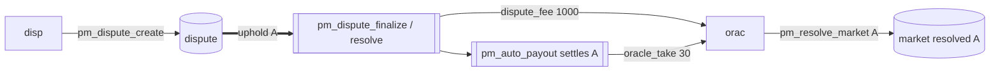

| исход | отправляет | получает | нетто |
|-------|------------|----------|-------|
| спор, поддержан | страховка 5000 (**не** слеш) | oracle_take 30 + **dispute_fee 1000** | **+1030** |
| нормальный (без спора) | страховка 5000 (заблокир.) | oracle_take 30 | **+30** |

Оспаривание оборачивается против диспутёра и **платит оракулу**. Рынок «доброй воли»
(`dispute_penalty_percent < 0`) может даже выдать оракулу бонус к fee при смене исхода — признавая честную
ошибку. **Проверка:** ветка uphold в `pm_dispute_finalize` / `pm_dispute_resolve`. **Наблюдать:**
`get_oracle` (`disputes_won`), `get_dispute`.

### Оракул — перевёрнут + слеш (проигравший спор)

Оракул разрешил **A**; спор **переворачивает на B**, страховка **слешится**. Он всё ещё забирает
крошечную замороженную рыночную fee (fee и наказание — разные деньги), но теряет большую долю бонда и
репутацию.

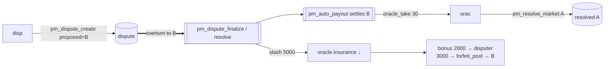

`slash = страховка 5000 × dispute_penalty_percent (100%) × consensus_strength (100%) = 5000`,
**перераспределяется**, не сжигается: `bonus 2000 →` диспутёр, `3000 → forfeit_pool →` новые победители (B).
Нетто **−4970** против **+30** без спора. Слеш масштабируется с **силой консенсуса** (`winning_rshares /
max_rshares`); `dispute_penalty_percent < 0` (добрая воля) → **нет** слеша. Слешнутый оракул часто ещё и
**забанен** (следующая роль). **Проверка:** ветка overturn `pm_dispute_finalize` / `pm_dispute_resolve`;
fee по-прежнему из `mkt.oracle_fee_percent`. **Наблюдать:** `get_oracle` (`total_insurance_slashed`,
`banned_until`), `get_dispute`.

### Забаненный оракул (и забаненный создатель)

Бан — это **статус**, а не перевод: `pm_oracle_object.banned_until` (а для создателей —
`pm_creator_ban_object`) блокирует актора от **новых** рынков, пока не пройдёт таймстамп. Обычно идёт вместе
со слешем переворота, но сам по себе токены не двигает.

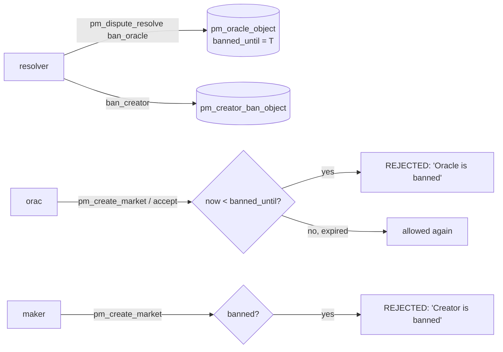

- **Кто ставит:** account-режим → `pm_dispute_resolve` (`ban_oracle`/`ban_creator` + `…_until`);
  committee-режим → `pm_dispute_finalize` масштабирует бан по консенсусу при перевороте. `banned_until =
  time_point_sec::maximum()` ⇒ **перманентный**.
- **Токены:** сам бан — **0** (чистый статус); сопутствующий слеш — это случай переворота выше. Страховка
  остаётся заблокированной, возвратна после снятия бана и при отсутствии активных рынков.
- Баны переживают снапшоты и ключуются по аккаунту — повторная регистрация бан не стирает. **Проверка:**
  `pm_create_market_evaluator` (`"Oracle is banned"` / `"Creator is banned"`). **Наблюдать:** `get_oracle`
  (`banned_until`, `bans_received`), **`get_creator_ban(account)`**.

### Беттор A — ранний победитель

**A** ставит **100 на сторону A рано** (без штрафа за время) и выигрывает, когда M разрешается в A.
Выплата = ставка + взвешенная по весу доля пула победителей.

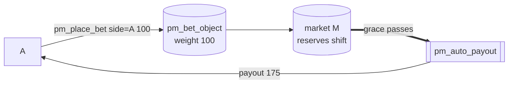

| исход | отправляет | получает | нетто |
|-------|------------|----------|-------|
| нормальный (A) | 100 | **175** | **+75** |
| спорный (→B) | 100 | **0** | **−100** |

`profit = winners_pool 150 × weight 100 / Σweight 200 = 75`; без штрафа → выплата `100 + 75`. Переворот
делает A **проигравшей** стороной. Выигрыши идут **только** из ставок проигравших (+ forfeit), никогда из
эмиссии. **Отправляет:** `pm_place_bet` (`side=0`, instant); опц. `pm_transfer_position` / `pm_cancel_bet`.
**Проверка:** `pm_place_bet_evaluator`, `settle_market`. **Наблюдать:** `get_account_positions`
(`expected_payout`), `get_market_weight_sums`; реализованный `pm_payout` в `account_history`.

### Беттор B — проигравший

**B** ставит **200 на сторону B**. Когда M разрешается в **A**, ставка B финансирует победителей, а B не
получает ничего. В спорном пути B становится победителем.

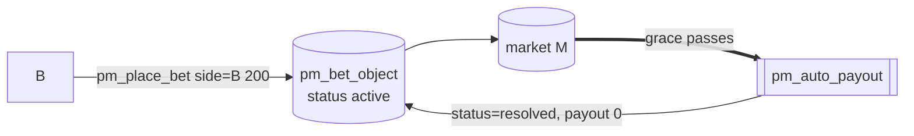

| исход | отправляет | получает | нетто |
|-------|------------|----------|-------|
| нормальный (A) | 200 | **0** | **−200** |
| спорный (→B) | 200 | **3350** | **+3150** |

200 от B **и есть** `losers_sum` (платит 40 fee + 150 пул победителей + LP-бонус) — паримутюэль-правило
«проигравшие финансируют победителей». При перевороте B выигрывает, и forfeit оракула 3000 вливается в пул
B (`payout = 200 + 3150`). Проигравшая ставка тоже фиксируется через `pm_payout` с **payout=0**.
**Проверка:** ветка проигравшего в `settle_market`. **Наблюдать:** `get_account_positions`,
`get_market_bets`, `get_dispute`.

### Беттор C — поздний победитель (штраф за время)

**C** ставит **100 на сторону A**, но **поздно** (T+85% окна ставок), поэтому **штраф за время** урезает
*только прибыль* (не принципал). Тот же вес, что у A, но получает меньше; урезанное идёт LP.

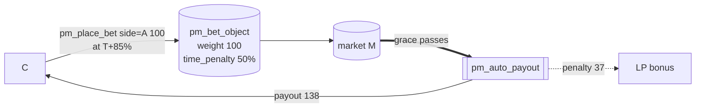

| исход | отправляет | получает | нетто |
|-------|------------|----------|-------|
| нормальный (A) | 100 | **138** | **+38** |
| спорный (→B) | 100 | **0** | **−100** |

`profit = 75`; `penalty = 75 × 50% = 37` (→ LP); `payout = 100 + 75 − 37 = 138` — **−37** против +75 у A
при том же весе. Узел штампует `time_penalty` при размещении из штрафной кривой рынка
(`time_penalty_type/value`, `penalty_curve_type`). Это сдерживает снайпинг в последнюю секунду и
субсидирует ликвидность, а не протокол. **Проверка:** `pm_place_bet_evaluator` (eval кривой),
`compute_settlement`. **Наблюдать:** `get_account_positions` (`time_penalty`), `get_market_bets`.

### Беттор D — leverage ×10 победитель

**D** открывает позицию **×10**: **10 коллатерала + 90 займа** из lazy-пула = **100** на стороне A, в
изолированном leverage-рынке **L** (`pm_leverage_enabled=true`, `R = 10%`). Когда A выигрывает, D
сохраняет апсайд на всей сотне после погашения займа + процентов.
`pool_profit = loan 90 × R 10% = 9`; `obligation = 90 × 1.10 = 99`.

```mermaid
flowchart LR
  D -->|pm_leverage_open<br/>collateral 10 + loan 90| POS[(pm_leverage_position<br/>total_bet 100, obligation 99)]
  POOL[(lazy pool)] -.loan 90.-> POS
  POS --> L[(market L, side A)]
  L ==>|settle: force_close at cancel_value| VR[[pm_leverage_resolve won=true, leverage=10]]
  VR -->|min(cv,obligation) 99| POOL
  VR -->|cv 200 − 99 = 101| D
```

| исход | отправляет | получает | нетто |
|-------|------------|----------|-------|
| нормальный (A) | коллатерал **10** | cancel_value 200 − obligation 99 = **101** | **+91** |
| спорный (→B) | коллатерал 10 | 0 | **−10** |

Прибыльная позиция закрывается по `cancel_value`; пул забирает `obligation 99` (заём 90 + **9 процентов**),
D оставляет остаток на своих 10 → **+91** (пул **+9**). Leverage рассчитывается ликвидацией, **никогда** не
через `pm_auto_payout`. Zero-sum (L): in `10 + 90 + 100 = 200`; out `101 + 99 = 200`. **Отправляет:**
`pm_leverage_open`; опц. `pm_leverage_close` (только при `cv ≥ obligation`) / `pm_leverage_convert`.
**Касается:** `pm_leverage_resolve` (force-close при расчёте, `reason=expiration`). **Проверка:**
`force_close_positions` → `liquidate_position(reason=2)`. **Наблюдать:**
**`get_account_leverage_positions`** / **`get_market_leverage_positions`**, `get_lazy_pool`.

### Беттор E — leverage ×5 ликвидирован

**E** открывает позицию **×5**: **20 коллатерала + 80 займа** = **100** на стороне B (рынок **L**,
`R = 10%`). До резолюции **встречная ставка** двигает кривую против B; **каскадная ликвидация** принудительно
закрывает позицию. **E теряет коллатерал, но пул всегда остаётся целым.** `obligation = 80 × 1.10 = 88`.

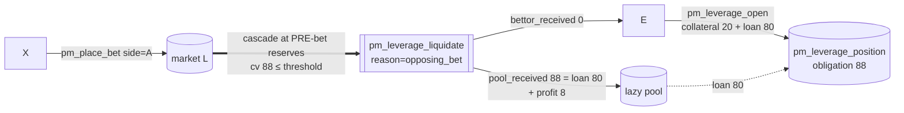

E ликвидируется **до** резолюции, поэтому финальный результат A/B (спорный или нет) на неё не влияет:

| актор | отправляет | получает | нетто |
|-------|------------|----------|-------|
| **E** | коллатерал **20** | **0** | **−20** |
| **пул** | заём 80 | **88** (заём 80 + R% 8) | **+8** |

Ликвидации по встречной ставке идут на **до-ставочных** резервах, где `cancel_value ≥ loan`, поэтому
`pool_received = min(cv, obligation)` возвращает как минимум заём — пул **никогда** не теряет.

> **Единственный путь в минус** — same-side **`pm_cancel_bet` (Case B)**: отмена разворачивает *прежнюю,
> крупную* ставку той же стороны (за пределами per-bet слиппедж-кэпа) и ради честности к отменителю
> исполняется **первой** по его цене — так каскад может оказаться `cancel_value < loan`:
> `shortfall = obligation − cancel_value`, `lazy_pool.free_balance −= shortfall`. Этот **bad debt**
> **ограничен** (`≤ cancel_value_before × SL%`) и **редок** (R% пула со всех прочих позиций его перекрывает).
> Покрыт тестом `leverage_cancel_bet_cascade_bad_debt`.

Защита пула структурна (`max_per_position`, `max_position_ratio`, `safety_margin`, слиппедж-кэп,
`expiration_buffer`). `pm_leverage_enabled=false` блокирует **только новые** открытия — каскад ликвидации
**не** гейтится флагом, поэтому управление не может снять защиту пула на лету
(`leverage_disabled_keeps_liquidation_protection`). **Проверка:** `pm_place_bet` →
`cascade_liquidate(reason=0)`; `pm_cancel_bet` → `cascade_liquidate(reason=1)`; `liquidate_position`.
**Наблюдать:** **`get_account_leverage_positions`** (`status=1`, `pool_received`, `bettor_received`),
`get_lazy_pool`.

### Поставщик ликвидности в рынке (LP1)

**LP1** добавляет **1000** ликвидности в активный M (после сида мейкера). Принципал **всегда** возвращается;
сверху он зарабатывает **взвешенную по времени** долю LP-бонуса (liquidity fee + штрафы за время + пыль).
Отличается от поставщика lazy-пула, который депонирует один раз и авто-аллоцируется по многим рынкам.

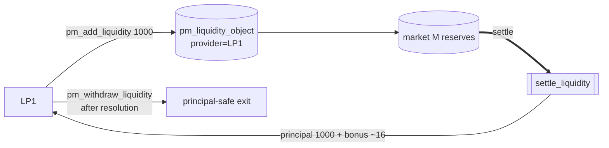

| исход | отправляет | получает | нетто |
|-------|------------|----------|-------|
| нормальный (A) | 1000 | **1000 принципала + ~16 бонуса** | **+16** |
| спорный (→B) | 1000 | 1000 принципала + ~4 бонуса | **+4** |

Пул LP-бонуса = `liq_fee 10 + штрафы 37 = 47`, делится по `principal × секунды-в-рынке` (ранний мейкер ~31,
поздний LP1 ~16). **Гарантия принципала** архитектурна — сид возвращается до выплаты любому победителю; LP
может лишь недополучить бонус, но не потерять принципал. Вывод заблокирован от `betting_expiration` до
резолюции. **Проверка:** `pm_add_liquidity_evaluator` (фиксирует `deposit_time`), `settle_liquidity` →
`distribute_lp`. **Наблюдать:** `get_market_liquidity` (`earned_fee`), `get_market_weight_sums`.

### Lazy-пул ликвидности (системный объект)

**Синглтон** `pm_lazy_pool_object` — не аккаунт. Депозитчики финансируют его один раз; пул
**авто-аллоцирует** долю в каждый акцептованный рынок как молчаливый LP (`pm_liquidity_object` с пустым
`provider`), **финансирует leverage-займы** и **отзывает** простаивающие аллокации. Зарабатывает LP-доход +
проценты по плечу, учёт в стиле MasterChef (один глобальный `reward_per_share`, O(1) — см. белую бумагу).
Поля: `total_shares`, `free_balance`, `allocated_balance`, `earned_balance`, `reward_per_share`,
`leverage_fund_used`.

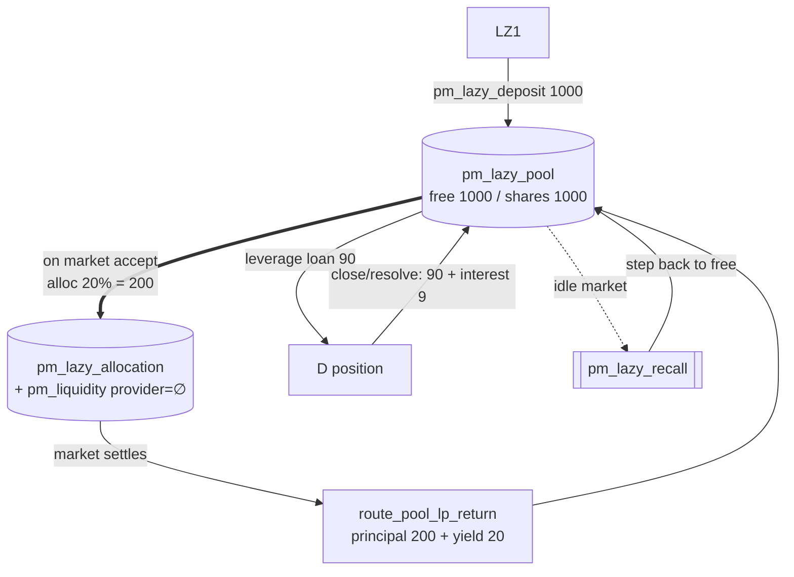

| денежный поток пула | эффект |
|---------------------|--------|
| `pm_lazy_deposit` | `free_balance += amount`, минт shares |
| авто-аллокация (при акцепте) | `free → allocated` (молчаливый LP) |
| рынок рассчитывается | `route_pool_lp_return`: принципал + доход → `free`; доход → `earned` & `reward_per_share` |
| leverage open (D/E) | `free −= loan`, `leverage_fund_used += loan` |
| leverage close / resolve / ликвидация по встречной ставке | `min(cv, obligation) → free`; `cv ≥ loan` ⇒ **никогда не убыток** |
| ликвидация cancel-bet (только Case B) | возвращает `cv`, который **может быть < loan** → ограниченный **bad debt** |
| `pm_lazy_recall` (простой рынок) | один шаг 10% простаивающей аллокации → `free` |
| `pm_lazy_withdraw` | сжечь shares → принципал + pending; emergency-штраф остаётся в пуле |

За канонический сценарий пул в нетто **+37 earned** (доход рынка M +20, проценты leverage D +9, возврат по
встречной ставке leverage E +8). Как рыночный LP принципал возвращается безусловно; с диспутом меняется лишь
*бонусный* доход.

> Пул выполняет **обе** роли из единого `free_balance`: рыночные LP-аллокации (`maybe_allocate_lazy`) и
> leverage-займы (`leverage_fund_used` ограничивает последние). Все leverage-параметры проверяются **в момент
> `pm_leverage_open`** против текущей медианы, поэтому позднейшие изменения свойств влияют лишь на *новые*
> открытия, а не на уже выданные займы.

VIZ в пуле **ликвидны**, не vested → **нет** веса для планирования валидаторов или committee-request.
**Исключение (HF14):** для **PM-споров комитета** стейк депозитчика в пуле **учитывается** — конвертируется в
vesting-shares через `get_vesting_share_price()` и добавляется к весу его `pm_dispute_vote` (см. резолвер-
комитет ниже). **Проверка:** `apply_hardfork(CHAIN_HARDFORK_14)` (синглтон), `maybe_allocate_lazy`,
`route_pool_lp_return`. **Наблюдать:** `get_lazy_pool`.

### Поставщик ликвидности в lazy-пуле (LZ1)

**LZ1** депонирует **1000** в пул **один раз** и даёт ему распределить по рынкам + leverage-займам. Он
зарабатывает долю агрегированного дохода пула (`reward_per_share`), а не исход одного рынка. Два выхода:
**плановый** (после лока) и **аварийный** (до лока, со штрафом на *прибыль*).

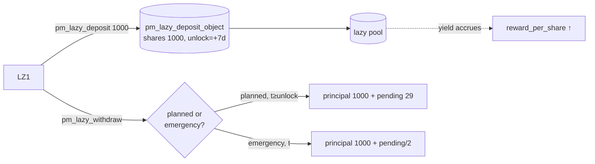

| выход | отправляет | получает | нетто |
|-------|------------|----------|-------|
| плановый (после лока) | 1000 депозита | **1000 принципала + ~29 pending** | **+29** |
| аварийный (до лока) | 1000 депозита | 1000 принципала + (29 − **штраф 14**) | **+15** |

`pending = shares × reward_per_share / 1e9`; `penalty = pending × pm_lazy_emergency_penalty_percent 50%`,
который **остаётся в пуле** (добавляется к `reward_per_share` остальным). Принципал никогда не штрафуется.
**Нет** действий по рынкам — аллокация/отзыв/leverage автоматичны. Стейк в пуле также считается в
**PM-спорах комитета** (конверсия в vesting-shares). **Проверка:** `pm_lazy_deposit_evaluator`,
`pm_lazy_withdraw_evaluator` (аварийная ветка). **Наблюдать:** `get_lazy_deposit` (`shares`, `principal`,
`pending_rewards`, `unlock_time`), `get_lazy_pool`.

### Диспутёр — оправдан (оракул перевёрнут)

**disp** считает, что **A** оракула неверно, подаёт спор с предложением **B**, эскроует `pm_dispute_fee
1000`, и вердикт **переворачивает на B**. disp получает свою fee назад **плюс** награду из слешнутой
страховки оракула.

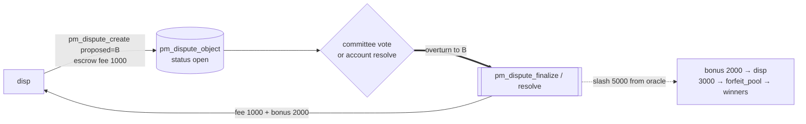

| исход | отправляет | получает | нетто |
|-------|------------|----------|-------|
| спор, перевёрнут («победа») | dispute_fee **1000** | fee 1000 назад + **bonus 2000** | **+2000** |

`reward_target = fee × pm_dispute_reward_multiplier (3×) = 3000` → `bonus = 3000 − 1000 = 2000`, **ограничен
фактическим слешем**; остаток (3000) → `forfeit_pool` → новые победители. disp рисковал 1000, уходит
**+2000**. (Committee-режим: disp **не** голосует сам — это делает электорат SHARES.) **Проверка:**
`pm_dispute_create_evaluator`, ветка overturn `pm_dispute_finalize`/`pm_dispute_resolve`. **Наблюдать:**
`get_dispute`, `get_dispute_votes`.

### Диспутёр — fee потеряна (оракул поддержан)

**disp** оспаривает **A** оракула, но вердикт **поддерживает оракула**. Эскроу-fee **переходит оракулу** как
компенсация, а рынок рассчитывается как изначально (A выигрывает).

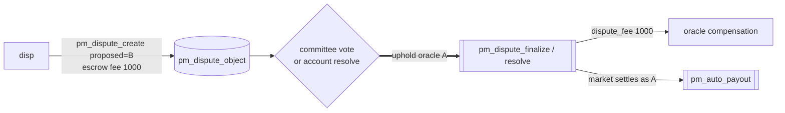

| исход | отправляет | получает | нетто |
|-------|------------|----------|-------|
| спор, поддержан («проигрыш») | dispute_fee **1000** | **0** | **−1000** |

Fee — это skin-in-the-game диспутёра: неверный/легкомысленный спор платит оракулу. Эта асимметрия (потерять
fee при ошибке, выиграть кратное при правоте) держит канал честным. Спор, который так и **не решён** (оракул
молчит / нет кворума), принудительно закрывается, а fee **возвращается** (нетто 0) — см. авто-закрытие спора
ниже, что отличается от проигрыша по существу. **Проверка:** ветка uphold
`pm_dispute_finalize`/`pm_dispute_resolve`. **Наблюдать:** `get_dispute`, `get_oracle` (получает fee,
`disputes_won++`).

### Резолвер — комитет (взвешенный по стейку, dispute_mode = 0)

*Весь электорат SHARES* решает **взвешенным по стейку голосованием**; единого резолвер-аккаунта нет. Вердикт
детерминированно подсчитывается `pm_dispute_finalize` в `voting_end_time`.

**Вес голоса** = живые **`effective_vesting_shares`** (`vesting − delegated + received`) **плюс стейк
lazy-пула, сконвертированный в vesting-shares**, поскольку многие члены DAO держат VIZ в пуле (где они
ликвидны):

```
pool_claim_viz = pool_NAV × deposit.shares / pool.total_shares
pool_weight    = pool_claim_viz × get_vesting_share_price()
voter_weight   = effective_vesting_shares + pool_weight
```

Знаменатель кворума участия — `total_vesting_shares + (pool_NAV → vesting-shares)`. 7-дневный лок депозита
предотвращает игру депозит-голос-вывод.

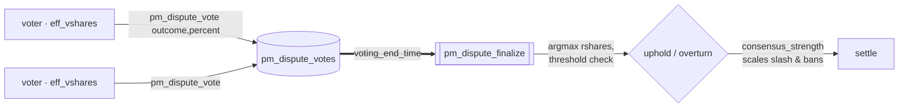

- **Отправляют (голосующие):** `pm_dispute_vote` — **auth `regular`**. `vote_outcome = -1` поддерживает,
  иначе предлагает верный исход; `vote_percent ∈ [-10000, 10000]`. Голосующий может **пересматривать**
  бюллетень сколько угодно раз, пока голосование открыто — повторный голос **перезаписывает** прежний
  (побеждает последний, без «Already voted»).
- **Без commit-reveal — намеренно, меняться НЕ будет.** Спор комитета — **открытое публичное слушание**:
  текущий подсчёт виден (`get_dispute_votes`), голоса не скрыты. Ценность DAO — разрешать споры максимально
  правдиво и прозрачно; новые аргументы всплывают в ходе голосования, и голосующие *должны* обновляться; а
  голосующим **не платят** за совпадение с большинством, поэтому обычный анти-стадный довод (beauty contest)
  для commit-reveal здесь неприменим.

| актор | отправляет | получает |
|-------|------------|----------|
| каждый голосующий | 0 | **0** — голосование это управленческий долг, не оплачиваемое действие |

Голосующие никогда не получают токены; влияние — чистый вес стейка. Экономические потоки приходятся на
диспутёра, оракула и бетторов согласно спорному мастер-леджеру выше. Нишевые рынки могут не пройти порог →
переход к авто-закрытию спора ниже. **Проверка:** `pm_dispute_vote_evaluator` (modify-or-create на
`by_market_voter`); `pm_dispute_finalize` (`lazy_vote_weight`, `get_vesting_share_price`, кворум, argmax,
`consensus_strength`). **Наблюдать:** `get_dispute_votes` (живой подсчёт + проекция finalize:
`quorum_percent_bp`, `expected_uphold`, `expected_outcome`, `expected_consensus_strength_bp`). Тесты:
`committee_dispute_lazy_pool_voting_weight`, `committee_dispute_flips_outcome`.

### Резолвер — один аккаунт (централизованный, dispute_mode = 1)

Рынок называет один аккаунт `dispute_resolver` (например, мультисиг регулятора), который решает в одиночку —
**без веса стейка, без голосования DAO**. Задан при создании, должен отличаться и от `oracle`, и от
`creator` (анти-самосуд). Тот же набор операций, что и в комитете; различается лишь *кто решает*.

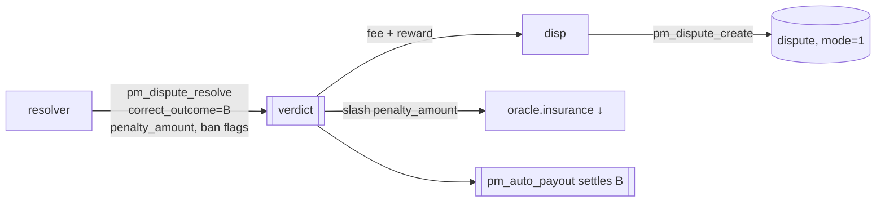

- **Отправляет:** `pm_dispute_resolve` — **auth `active` названного `dispute_resolver`** только:
  `correct_outcome`, `penalty_amount` (страховка к слешу — фиксированная сумма, **не** масштабируется
  стейком), `ban_oracle`/`ban_creator` (+ `…_until`).

| актор | отправляет | получает |
|-------|------------|----------|
| резолвер | 0 | **0** — нейтральный арбитр |

Пост-вердиктный канон идентичен комитет-режиму; различается лишь размер слеша (заданный резолвером
`penalty_amount`, без масштабирования `consensus_strength`, поскольку решает один). KYC/whitelisting
резолвера — забота **клиентского слоя**. **Проверка:** `pm_dispute_resolve_evaluator` (только названный
резолвер, `dispute_mode==1`). **Наблюдать:** `get_dispute`, `get_oracle`, **`get_creator_ban(account)`**.

### Спор принудительно завершён (анти-фриз авто-закрытие)

Спор, который так и **не решён** — оракул молчит и (в комитете) нет кворума — не может заморозить рынок
навсегда. В `auto_close_time` обработчик `pm_dispute_auto_close` принудительно его завершает: **всем
возврат**, fee диспутёра **возвращается**, неотзывчивый оракул наказывается. Победитель не выбирается.

```mermaid
flowchart LR
  disp -->|pm_dispute_create<br/>escrow fee 1000| D[(dispute, status open)]
  D -. oracle silent / no quorum .-> WAIT[auto_close_time reached]
  WAIT ==>|VIRTUAL| AC[[pm_dispute_auto_close]]
  AC -->|refund all bets| bettors
  AC -->|fee 1000 back| disp
  AC -->|insurance slash → DAO| orac
```

| актор | отправляет | получает | нетто |
|-------|------------|----------|-------|
| A / B / C | ставка | полный возврат | **0** |
| maker / LP1 | ликвидность | принципал назад | **0** (без бонуса) |
| disp | dispute_fee 1000 | **1000 назад** | **0** |
| orac | страховка −слеш → DAO | — | **− слеш** |

Это **не** «диспутёр проиграл»: возвращённая fee (нетто 0) отличается от потерянной fee (диспутёр-проигравший,
нетто −1000). Никто не зарабатывает; рынок аннулируется, чтобы снять заморозку, издержки падают на не
ответившего оракула. Та же форма аннуляции-и-возврата покрывает `pm_oracle_missed_penalty` и `pm_no_contest`.
Настройте `pm_dispute_auto_close_sec` (14 д) против `pm_dispute_vote_period_sec` (3 д), чтобы честные споры
решались раньше. **Проверка:** скан авто-закрытия в `process_pm_markets` (`refund_all_bets` +
`return_liquidity` + зачёт fee; `disputes_auto_closed++`). **Наблюдать:** `get_dispute` (статус →
авто-закрыт), `get_market`, `get_oracle`.
