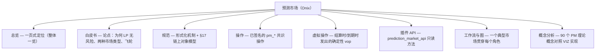

# VIZ 上的预测市场

VIZ Ledger 将预测市场作为**一等公民共识操作**（`pm_*`）运行，自 HF14 上线。全文会出现两个名称：

- **Onix** —— **协议**：链上市场引擎（CPMM 二元 + LMSR 多元、同注分彩零和结算、保证金预言机、懒惰池、可选
  杠杆、批量 / 提交-揭示下注）。
- **Forecaster** —— 对接该协议的 VIZ Ledger **瘦客户端**。它是一个无头、与平台无关的前端，让**全球用户参与链上
  预测市场**——创建市场、下注、提供流动性、做预言机、发起争议——通过直接对公共 VIZ 节点签署 `pm_*` 操作。协议
  中立；Forecaster（以及任何按其方式构建的司法辖区客户端）是接入层。

## 文档地图

## 从这里开始

| 页面 | 是什么 |
|------|-----------|
| [总览](./onix) | 一页式定位：AMM 定价的同注分彩，具备结构性无风险流动性。 |
| [白皮书](./whitepaper) | 产业论点——LP 保障、Onix Binary（CPMM）+ Onix Multi（LMSR）、预言机、懒惰池、杠杆、治理。 |
| [规范](./specification) | 形式化规范：参数、状态机、定价、结算、争议、懒惰池、杠杆，以及 **[链上对象模型](./specification)**（每个 `pm_*_object` 及其查找索引）。 |
| [操作](../protocol/operations/prediction-markets) | 21 个已签名共识操作（`pm_create_market`、`pm_place_bet`、…）。 |
| [虚拟操作](../protocol/virtual-operations) | 确定性 vop（`pm_payout`、`pm_market_accepted`、`pm_leverage_resolve`、`pm_batch_settle`、…）。 |
| [插件 API](../plugins/prediction-market-api) | `prediction_market_api` —— 对市场、下注、预言机、争议、懒惰池及中位数投票参数的只读访问。 |
| [工作流与交互图](./workflows) | 一个典型二元市场贯穿所有参与者，附正常与争议裁定的零和主账本。 |
| [概念分析（Onix 对照 90）](./concepts-analysis) | 链上实现如何映射到预测市场理论图谱——哪些已解决、固有、不需要或在路线图。 |

## 治理

所有经济参数均由代表**中位数投票**，位于 `chain_properties_pm` 结构体——见
[链参数 → 预测市场参数](../governance/chain-properties#pm-parameters)。调整费用、罚则、懒惰池、杠杆或
批量/提交-揭示时序无需硬分叉；三个实时终止开关（`pm_commit_reveal_enabled`、`pm_lazy_pool_enabled`、
`pm_leverage_enabled`）让验证者中位数无需分叉即可停用整个子系统。
