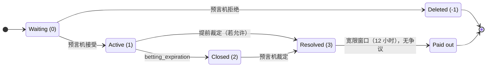

# Onix 协议规范

**版本：** 2.0（链上 / HF14）
**状态：** 正式技术规范 —— 现已实现为 VIZ DLT 上的共识操作

---

> **链上（HF14）。** 实现为 VIZ DLT 上的一等公民共识操作（`pm_*`），并在 `consensus_sim` 中验证。**所有
> 百分比均为基点（bp）：10000 = 100.00%**；所有时长为以**秒 / 区块**计的治理参数。中位数投票的参数位于
> `chain_properties_pm` 结构体（§3）；按市场字段为 `pm_create_market` 操作；所有状态位于 §17 的 chainbase
> 对象中。预言机费用采用 offer→quote（创建者上限 → 预言机在接受时冻结其报价，发出 `pm_market_accepted`）。
> 争议有两种模式 —— 委员会（`dispute_mode = 0`，默认：按质押加权的**公开** `pm_dispute_vote`，关闭前可改，
> 懒惰池质押计入）与账户（`dispute_mode = 1`：指定 `dispute_resolver`）。

## 目录

1. 定义与角色
2. 货币与精度
3. 系统参数
4. 市场状态机
5. Onix Binary：恒定乘积做市商
6. Onix Multi：LMSR 与同注分彩结算
7. 费用结构
8. 迟下注的时间惩罚
9. 流动性提供
10. 裁定与赔付
11. 撤注
12. 争议系统
13. 预言机错过裁定的惩罚
14. 预言机声誉评分
15. 持仓转让
16. 懒惰流动性池
16a. 可选杠杆
16b. 批量 / 提交-揭示下注
17. 链上对象模型

---

## 1. 定义与角色

| 角色 | 定义 |
|------|-----------|
| **市场创建者** | 支付 `pm_market_creation_fee`（`pm_create_market`）；设定问题、结果、流动性、费用上限与时序参数 |
| **预言机** | 注册（费用：`pm_oracle_registration_fee`），存入保险（最低：`pm_min_oracle_insurance`），在接受时以**基点**报出费用条款（≤ 创建者上限）+ 固定费，接受/拒绝市场，提供结果裁定 |
| **下注者** | 对结果下注；按本金与当前储备成比例获得代币 |
| **流动性提供者（LP）** | 向市场池提供资金；赚取流动性费的时间加权份额 + 惩罚池 |
| **懒惰池提供者** | 以锁仓期向懒惰流动性池存入 VIZ；池自动向市场分配并通过 `reward_per_share` 累加器分发奖励 |
| **争议裁决者** | 仅账户模式（`dispute_mode = 1`）：按市场的 `dispute_resolver` 账户仲裁。委员会模式（`dispute_mode = 0`）不使用裁决者——由 SHARES 选民投票 |
| **DAO / 委员会基金** | 链上既有的委员会基金。接收 `pm_market_creation_fee` 与额外的预言机罚款 |

---

## 2. 货币与精度

所有金额以整数存储，精度 = 1/1000（毫 VIZ）。`1000` 内部单位 = 1.000 VIZ。

时间惩罚值使用精度 = 1/1,000,000（微单位）。

---

## 3. 系统参数

### 中位数投票参数（`chain_properties_pm`）

所有经济参数由代表中位数投票（无需硬分叉即可调参），位于链上 `chain_properties_pm` 结构体。**所有百分比
为基点（bp，10000 = 100.00%）；时长以秒或区块计。** 确切默认值与范围见
[链参数](../governance/chain-properties#pm-parameters)；权威来源是结构体本身。

| 分组 | 参数 |
|---|---|
| 注册与下限 | `pm_oracle_registration_fee`、`pm_min_oracle_insurance`、`pm_market_creation_fee`、`pm_min_liquidity`、`pm_max_outcomes`、`pm_max_market_duration` |
| 费用与罚则（bp） | `pm_max_oracle_fee_percent`、`pm_oracle_penalty_percent`、`pm_no_contest_penalty_percent`、`pm_default_time_penalty_percent`、`pm_max_time_penalty` |
| 争议 | `pm_dispute_fee`、`pm_dispute_grace_sec`、`pm_oracle_dispute_response_sec`、`pm_dispute_vote_period_sec`、`pm_dispute_auto_close_sec`、`pm_dispute_approve_min_percent`（bp）、`pm_dispute_reward_multiplier`（bp） |
| 懒惰池 | `pm_lazy_pool_enabled`、`pm_lazy_alloc_percent`、`pm_lazy_max_total_alloc_percent`、`pm_lazy_recall_step_percent`、`pm_lazy_lock_sec`、`pm_lazy_emergency_penalty_percent` |
| 杠杆 | `pm_leverage_enabled`、`pm_leverage_fund_percent`、`pm_leverage_max_per_position_bp`、`pm_leverage_max_position_ratio_percent`、`pm_leverage_min_market_liquidity`、`pm_leverage_safety_margin_percent`、`pm_leverage_max_slippage_percent`、`pm_leverage_m_factor_percent`、`pm_leverage_pool_profit_percent`、`pm_leverage_expiration_buffer_sec`、`pm_conversion_profit_cost_percent` |
| 批量 / 提交-揭示 | `pm_commit_reveal_enabled`、`pm_batch_epoch_blocks`、`pm_reveal_window_blocks`、`pm_commit_no_reveal_penalty_percent`（bp）、`pm_min_batch_bet` |
| 处理 | `pm_processing_cap_per_block` |

`pm_market_creation_fee` 与额外预言机罚款的接收方是链上既有的委员会/DAO 基金，而非 PM 专用账户。

### 按市场参数（`pm_create_market` 操作）

由创建者在创建时设定；预言机费用字段为预言机在接受时据以报价的**上限**（offer→quote）。完整字段参考：
[预测市场操作](../protocol/operations/prediction-markets)。

| 字段 | 描述 |
|---|---|
| `oracle`、`market_type`（0 二元 / 1 多元）、`outcomes`、`url` | 市场定义 |
| `oracle_fee_percent`、`oracle_fixed_fee` | 预言机费用**上限**（bp + 固定）；预言机在接受时冻结其报价 ≤ 此（且 ≤ 中位 `pm_max_oracle_fee_percent`） |
| `creator_fee_percent`、`liquidity_fee_percent` | 创建者与 LP 费用（输家池的 bp） |
| `liquidity`、`lmsr_b` | 种子流动性；`lmsr_b` 用于多元市场 |
| `betting_expiration`、`result_expiration` | 计时器 |
| `time_penalty_type`、`time_penalty_value`、`penalty_curve_type` | 迟下注惩罚形状 |
| `allow_early_resolution`、`allow_cancellation` | 开关 |
| `allow_batch`、`allow_instant_bet` | 下注模式（二元） |
| `endogeneity_tier` | 1 经济数据 / 2 体育 / 3 政治（展示/风险提示） |
| `dispute_mode`（0 委员会 / 1 账户）、`dispute_resolver` | 争议路由 |
| `dispute_penalty_percent` | 争议成立时的预言机罚则策略（bp，带符号） |
| `metadata` | 自由格式客户端 JSON（共识不透明；链下解析） |

---

## 4. 市场状态机

### 状态

| Status | 名称 | 描述 |
|--------|------|-------------|
| -1 | Deleted | 预言机拒绝；流动性返还创建者 |
| 0 | Waiting | 等待预言机审阅 |
| 1 | Active | 接受下注至 `betting_expiration` |
| 2 | Closed | 下注结束，等待预言机裁定 |
| 3 | Resolved | 结果确定，赔付已计算 |

### 赔付状态

| payout_status | 名称 | 描述 |
|---------------|------|-------------|
| 0 | Not calculated | 裁定前 |
| 1 | Calculated | 赔付待处理（宽限期活跃） |
| 2 | Paid | 全部赔付已处理 |
| 3 | Disputed | 已提交争议，赔付冻结 |

### 转移



**前置条件：**

| 转移 | 前置条件 |
|-----------|---------------|
| 0 → 1 | 预言机保险 ≥ `min_oracle_insurance`；预言机接受 |
| 0 → 1（自预言机） | 创建者 = 预言机；保险检查；创建时自动批准 |
| 0 → -1 | 预言机拒绝；流动性返还创建者 |
| 1 → 3 | 预言机提交带结果的裁定（0、1，或 -1 表示 no-contest）；`allow_early_resolution=1` 或 `time ≥ betting_expiration` |
| 2 → 3 | 预言机提交裁定；`time ≤ result_expiration` |
| 3 → paid | 宽限期内无争议；定时任务处理赔付 |

### 市场创建流程

1. 从创建者扣除 `market_creation_fee` → DAO 基金（不可退）
2. 在市场上记录来自预言机资料的 `oracle_fixed_fee`
3. 从创建者余额锁定 `liquidity`
4. 初始化储备：`reserve_a = floor(liquidity/2)`，`reserve_b = liquidity − reserve_a`
5. 计算 `k = reserve_a × reserve_b`
6. 若自预言机：经保险检查自动批准为 status=1
7. 若外部预言机：进入 status=0

### 预言机接受流程

当预言机接受（status 0 → 1）时：

1. 从创建者余额向预言机余额转移 `oracle_fixed_fee`（自预言机则跳过）
2. 递增预言机 `markets_accepted` 计数
3. 更新预言机 `last_active_time`
4. 触发懒惰池自动分配（若池有自由余额）

### 审计轨迹

每个改变状态的动作都是一个共识操作或虚拟操作，永久记录在区块日志中并可通过 `account_history` 查询。下注、
撤注、流动性添加/提取、接受/拒绝、裁定、争议、争议裁决、赔付与罚款都作为 `pm_*` 操作/虚拟操作出现，并附带它
们所触及的市场储备。

---

## 5. Onix Binary：恒定乘积做市商

### 不变量

```
k = reserve_a × reserve_b
```

`k` 仅在流动性添加/提取操作时改变。

### 下注（A 侧）

```
new_reserve_b = reserve_b + amount
new_reserve_a = floor(k / new_reserve_b)
tokens_received = reserve_a − new_reserve_a
price = amount × 1,000,000 / tokens_received
```

B 侧对称（交换 a/b）。

### 滑点保护

`place-bet` 上的可选 `min_tokens` 参数。若 `tokens_received < min_tokens`，交易被拒。

### 市场初始化

```
reserve_a = floor(liquidity / 2)
reserve_b = liquidity − reserve_a
k = reserve_a × reserve_b
```

最低初始流动性：100,000 mVIZ（100 VIZ）。

### 权重（代币）语义

- `weight` = 下注者获得的结果代币数量（由 CPMM 在下注时设定）
- `weight` 是**相对索取权**，而非以 VIZ 计价的赔付。结算为**同注分彩**（与 Onix Multi 相同）：赢家取回本金
  外加按权重的输家池比例份额。
- 若下注 A 侧且结果 A 获胜：`payout = bet_amount + (weight / total_winning_weight) × winners_pool − time_penalty_on_profit`
- 若结果 A 落败：payout = 0（本金没入赢家池）

CPMM 是**定价引擎**（概率 + 权重分配）；它不再门控赔付。这使两种市场类型共享一个结算模型：*AMM 分配权重
（二元用 CPMM，多元用 LMSR）；输家按权重比例资助赢家。*

### 价格显示

```
implied_probability_A = reserve_b / (reserve_a + reserve_b) × 100%
implied_probability_B = reserve_a / (reserve_a + reserve_b) × 100%
```

### LP 本金保障（证明）

在同注分彩结算下，保障精确且不依赖曲线几何：

```
Money OUT = L (LP principal) + Σ(winning bet_amount) + winners_pool + fees
          = L + winning_bets + (losers_sum − fees) + fees
          = L + winning_bets + losing_bets = L + all_bets = Money IN
```

无论权重如何，总赔付以 `losers_sum` 为上限，故 LP 本金 `L` 无条件返还，赢家完全由输家资助。（旧的 AM-GM 界
`reserve_a + reserve_b ≥ L` 不再用于偿付能力；它仍是定价曲线的属性。）

---

## 6. Onix Multi：LMSR 与同注分彩结算

### 价格函数（softmax）

对 N 个结果，数量参数 q_1, ..., q_N，流动性参数 b：

```
price(i) = exp(q_i / b) / Σ_j exp(q_j / b)
```

**不变量：** `Σ_i price(i) = 1`（按 softmax 定义）。

### 成本函数

```
C(q) = b × ln(Σ_j exp(q_j / b))
```

在结果 i 上买入 Δ 代币的成本：

```
cost = C(q + Δ·e_i) − C(q)
     = b × [ln(Σ_j exp(q'_j / b)) − ln(Σ_j exp(q_j / b))]
where q'_i = q_i + Δ, all other q'_j = q_j
```

数值稳定性（log-sum-exp 技巧）：

```
ln(Σ exp(x_j)) = max(x) + ln(Σ exp(x_j − max(x)))
```

### 流动性参数

```
b = S / ln(N)
```

其中 S = LP 补贴存款，N = 结果数。

### 结算（裁定时）

```
1. Oracle declares winning outcome
2. losers_sum = Σ bet_amount for all non-winning bets
3. oracle_fee  = floor(losers_sum × oracle_fee_percent / 10000)
4. creator_fee = floor(losers_sum × creator_fee_percent / 10000)
5. liq_fee     = floor(losers_sum × liquidity_fee_percent / 10000)
6. winners_pool = losers_sum − oracle_fee − creator_fee − liq_fee
7. For each winning bettor:
   payout = bet_amount + (their_tokens / total_winning_tokens × winners_pool) − time_penalty
8. LP subsidy returned unconditionally
9. LP earns time-weighted share of liq_fee
```

### LP 本金保障（证明）

1. LP 存入 S VIZ 作补贴。这设定 b = S / ln(N)。
2. 下注期间，用户支付 VIZ → 取得代币。VIZ 累积为下注池。
3. 裁定时：输家没收 100% → `losers_sum`。赢家由 `losers_sum` 支付（非补贴）。
4. LP 补贴 S **无条件**返还 —— 它在架构上与赔付流分离。

### 边界情形

| 情形 | 结果 |
|----------|---------|
| 全部下注于获胜结果 | `losers_sum=0`、`winners_pool=0`。每个下注者取回 `bet_amount`。LP 补贴返还。 |
| 无人下注于获胜结果 | `losers_sum=total_bets`。未分配的 `winners_pool` → LP 奖励。 |
| 零成交量市场 | LP 补贴返还。无手续费、无赔付。 |
| 单一下注者获胜 | 下注者获得 `bet_amount + winners_pool`。LP 补贴返还。 |

### 操作

| 操作 | 描述 |
|-----------|-------------|
| `pm_create_market_multi { oracle, outcomes, liquidity, fees, ... }` | 创建 N 结果市场 |
| `pm_place_bet_multi { market, outcome_index, amount, min_tokens }` | 为某结果买入代币 |
| `pm_cancel_bet_multi { bet_id, min_return }` | 通过反向 LMSR 卖回代币 |
| `pm_add_liquidity_multi { market, amount }` | 增加 LP 补贴（提升 b） |
| `pm_withdraw_liquidity_multi { liquidity_id }` | 提取 LP 补贴（强制最低下限） |
| `pm_resolve_multi { market, winning_outcome }` | 预言机宣布赢家，触发结算 |

二元市场（N=2）使用 Onix Binary（CPMM）。LMSR 仅用于 N > 2。

---

## 7. 费用结构

### 裁定时费用计算

所有百分比费用在裁定时从**输家侧总成交量**计算：

```
losers_sum = Σ bet_amount for all losing bets

oracle_fee   = floor(losers_sum × oracle_fee_percent / 10000)
creator_fee  = floor(losers_sum × creator_fee_percent / 10000)
liquidity_fee = floor(losers_sum × liquidity_fee_percent / 10000)
winners_pool = losers_sum − oracle_fee − creator_fee − liquidity_fee
```

下注时不从下注扣费。完整下注额进入 CPMM/LMSR 储备。

### 预言机固定费

每个市场一次性费用。由预言机在资料中设定。市场接受时由创建者付给预言机。自预言机市场完全跳过（不发生余额操
作）。

### 费用追踪字段

- `oracle_fee_earned` —— 裁定时不使用；费用从 losers_sum 计算
- `liquidity_fee_earned` —— 已付给早退 LP 的累计 LP 费；裁定时：`LP fee pool = max(0, floor(losers_sum × liquidity_fee_percent / 10000) − liquidity_fee_earned) + penalty_pool`
- 每笔下注的 `oracle_fee` 与 `liquidity_fee` 记录用于审计；不在市场上累加

### 取整

所有计算使用 `floor()`。未分配的尘额（< 1 mVIZ）在最终赔付时送入 DAO 基金。

---

## 8. 迟下注的时间惩罚

### 惩罚窗口

| 类型 | 窗口计算 |
|------|-------------------|
| Fixed（type=0） | 到期前 `penalty_window = time_penalty_value` 秒 |
| Percentage（type=1） | `penalty_window = time_penalty_value / 100 × (betting_expiration − market_creation_time)` |

### 惩罚计算

```
time_to_expiration = betting_expiration − current_time

if time_to_expiration < penalty_window:
    ratio = 1 − (time_to_expiration / penalty_window)

    if penalty_curve_type == 1:    // quadratic
        penalty_ratio = ratio × ratio
    else:                          // linear
        penalty_ratio = ratio

    time_penalty = floor(penalty_ratio × max_time_penalty)
else:
    time_penalty = 0
```

### 赔付时应用（仅作用于利润）

```
profit = floor(winners_pool × weight / total_winning_weight)   // parimutuel share of losers' pool
penalty_deduction = floor(profit × time_penalty / 1,000,000)
net_payout = bet_amount + profit − penalty_deduction
```

**不变量：** `net_payout ≥ bet_amount` —— 惩罚仅作用于利润份额，故赢家始终至少取回本金。（Onix Binary 与
Onix Multi 相同。）

---

## 9. 流动性提供

### 添加流动性

```
add_a = amount × reserve_a / (reserve_a + reserve_b)
add_b = amount − add_a
new_reserve_a = reserve_a + add_a
new_reserve_b = reserve_b + add_b
new_k = new_reserve_a × new_reserve_b
```

存款时记录 `sec_to_expiration = betting_expiration − current_time`。

### 时间加权费用分配（裁定时）

```
fee_pool = remaining_liquidity_fee + total_penalty_pool

weight_i = amount_i × max(1, sec_to_expiration_i)
total_weight = Σ weight_i
fee_share_i = floor(fee_pool × weight_i / total_weight)
lp_payout_i = principal_i + fee_share_i
```

每笔存款为独立持仓。同一用户的多笔存款分别追踪。

### 提前提取

**前置条件：** market status=1，`time < betting_expiration`，`resulting liquidity_sum ≥ 100,000 mVIZ`。

```
// Fractional withdrawal
fraction = withdraw_amount / lp_amount
withdraw_weight_a = floor(weight_a × fraction)
withdraw_weight_b = floor(weight_b × fraction)

// Reverse reserves
new_reserve_a = reserve_a − withdraw_weight_a
new_reserve_b = reserve_b − withdraw_weight_b
new_k = new_reserve_a × new_reserve_b

// Time-ratio discount
time_served = current_time − lp_deposit_time
market_duration = betting_expiration − market_creation_time
time_ratio = min(1, time_served / market_duration)

// Fee share (conservative: min of both sides)
fee_from_a = floor(a_bets_sum × liquidity_fee_percent / 10000)
fee_from_b = floor(b_bets_sum × liquidity_fee_percent / 10000)
estimated_pool = min(fee_from_a, fee_from_b) − already_paid_to_early_lps
lp_tw = withdraw_amount × max(1, sec_to_expiration)
total_tw = Σ (active LP time-weights)
raw_fee_share = floor(estimated_pool × lp_tw / total_tw)
fee_share = floor(raw_fee_share × time_ratio)

returned = withdraw_amount + fee_share
```

**到期后锁定：** 当 `time ≥ betting_expiration` 时禁止 LP 提取。所有 LP 持仓锁定至裁定。

### 提前提取的本金安全

提取减去原始 `weight_a` 与 `weight_b`（而非当前储备的比例份额）。若 `reserve_a < weight_a` 或
`reserve_b < weight_b`，提取被**阻止**。

### 创建者作为首位 LP

市场创建者自动成为首位 LP。其 `sec_to_expiration` 等于完整市场时长，给予最大时间权重。

---

## 10. 裁定与赔付

### 赔付优先顺序

| 优先级 | 类型 | 接收方 | 金额 |
|----------|------|-----------|--------|
| 1 | Oracle fee (2) | 预言机 | `floor(losers_sum × oracle_fee_percent / 10000)` |
| 1.5 | Creator fee (7) | 创建者 | `floor(losers_sum × creator_fee_percent / 10000)` |
| 2 | Creator LP (1) | 创建者 | `principal + time-weighted fee share` |
| 3 | LP return (1) | LP | `principal + time-weighted fee share` |
| 4 | Winner bets (0) | 赢家 | `bet_amount + floor(winners_pool × weight / total_winning_weight) − penalty_deduction`（同注分彩） |
| 5 | Dispute refund (5) | 争议参与者 | （若适用） |
| 6 | Oracle penalty bonus (6) | 全部参与者 | （若预言机被罚） |

### 输家侧

赔付 = 0。本金并入储备池。

### 零成交量市场

LP 取回全部本金。预言机取得固定费（若有）。所有费用累加器保持为 0。

---

## 11. 撤注

### 前置条件

| 条件 | 检查 |
|-----------|-------|
| 下注活跃 | `bet.status == 0` |
| 用户拥有该下注 | `bet.user == current_user.id` |
| 市场活跃 | `market.status == 1` |
| 下注开放 | `current_time < market.betting_expiration` |
| 允许撤注 | `market.allow_cancellation == 1` |

### 反向 CPMM 机制

对 A 侧下注（side=0）：

```
new_reserve_a = reserve_a + tokens
new_reserve_b = floor(k / new_reserve_a)
amount_returned = reserve_b − new_reserve_b
if amount_returned <= 0: amount_returned = 0
```

B 侧对称。

### 滑点保护

可选 `min_return` 参数。若 `amount_returned < min_return`，交易被拒。

### 状态变更（原子）

1. 下注状态 → 1（已撤），记录 `returned_amount`
2. 更新市场储备
3. 市场下注合计按原下注额递减
4. 用户余额增加 `amount_returned`，`bets_balance` 减少
5. 历史记录（type=4）
6. 带前/后储备的 market log 记录

---

## 12. 争议系统

### 提交前置条件

- 提交者在该市场下过注
- 在裁定后 `pm_dispute_grace_sec` 之内
- 按模式路由：**委员会**（`dispute_mode = 0`）—— 无需裁决者账户，SHARES 选民通过 `pm_dispute_vote` 投票（公开、可改至 `voting_end_time`、权重 = `effective_vesting_shares` + 懒惰池质押→shares），由 `pm_dispute_finalize` 定时任务计票；**账户**（`dispute_mode = 1`）—— 市场指定的 `dispute_resolver` 作出 `pm_dispute_resolve`
- 市场无未结争议
- 提交者支付 `pm_dispute_fee`

### 预言机响应

须在 `pm_oracle_dispute_response_sec` 内。错过则从保险自动罚没 `pm_dispute_fee`，并记录在预言机对象上。

### 争议生命周期

```
Resolution (T=0) → Grace period (T to T+12h) → Dispute filed (T≤12h)
  → Oracle response (12h window) → Resolver decision (up to 14 days)
  → After verdict: recalculate or unfreeze → Auto-payout after new grace period
  → Auto-close fallback (T+14 days): full refund + oracle penalty
```

### 争议成立（预言机有误 —— 翻转）

对提出者的奖励是罚没额中切出的一份；**罚没的其余部分资助获胜下注者**（经 `forfeit_pool`），而非裁决者、也非
DAO。**委员会投票者与账户模式裁决者均不获报酬。**

```
reward_target = floor(dispute_fee × pm_dispute_reward_multiplier / 10000)   // bp; 30000 = ×3
bonus         = max(0, reward_target − dispute_fee), 以罚没额为上限

1. Disputer ← dispute_fee（托管退回）+ bonus     // bonus 取自被罚没的保险
2. forfeit_pool += (slash − bonus)              // → 赢家，结算时经 winners_pool
```

罚没大小：委员会模式将预言机的 `dispute_penalty_percent` 按 `consensus_strength` 缩放；账户模式取裁决者的
`penalty_amount`（均以剩余保险为上限）。

### 争议被驳回（预言机正确 —— 维持）

```
Disputer 将全部 dispute_fee → 预言机（100%，补偿）。   // 无 50/50 裁决者/DAO 拆分
```

### 重算流程（预言机有误）

1. 校验罚款（以 reward_pool 之后的剩余保险为上限）
2. 支付提出争议者奖励
3. 支付裁决者奖励
4. 罚没预言机保险
5. 应用封禁（若请求）
6. 删除所有现存未支付的 payouts
7. 翻转获胜结果（A↔B）
8. 以修正后的结果从头重生成赔付
9. 记录审计轨迹

### 委员会权力

| 参数 | 类型 | 描述 |
|-----------|------|-------------|
| `penalty_amount` | mVIZ | 额外保险罚没（0 至剩余）→ DAO 基金 |
| `ban_oracle` | 0/1 | 封禁预言机 |
| `ban_oracle_until` | unix ts / 0 | 0=永久，>0=到期 |
| `ban_creator` | 0/1 | 封禁创建者 |
| `ban_creator_until` | unix ts / 0 | 0=永久，>0=到期 |

### 自动关闭（14 天回退）

| 动作 | 描述 |
|--------|-------------|
| 原告 | 退回争议费 |
| 预言机 | 从保险罚没 `dispute_fee` |
| 下注 | 全部退款（原始金额） |
| LP | 全部退款（仅本金） |
| 罚款分配 | 罚没额按比例分配给所有参与者 |
| 争议状态 | 置为 3（自动关闭） |

### No-Contest 声明

预言机以 `market_id` 与 `reason` 调用 `oracle-no-contest`。

1. 所有下注 → 待退款赔付（全额原始金额）
2. 所有 LP 持仓 → 待退款赔付（仅本金）
3. 罚款：从保险扣 `dispute_fee` 的 `oracle_no_contest_penalty_percent`%
4. 罚款按比例分配给参与者
5. 市场：`resolved_outcome = -1`，`payout_status = 1`
6. 宽限期开始（可争议）

### 3 结果裁定（No-Contest 争议）

裁决者从以下选其一：
- `correct_outcome = 0` —— A 胜（重算赔付）
- `correct_outcome = 1` —— B 胜（重算赔付）
- `correct_outcome = -1` —— 确认 no-contest（保留退款赔付）

若预言机有误：待退款赔付被删除，替换为正确的赢家赔付。适用标准争议罚则。

---

## 13. 预言机错过裁定的惩罚

若预言机未在 `result_expiration` 前裁定：

```
penalty_amount = floor(oracle_insurance × oracle_penalty_percent / 100)
```

### 分配

```
stakes[user_id] += bet_amount       (for each active bet)
stakes[user_id] += liquidity_amount (for each active LP position)
total_stakes = Σ stakes[user_id]

bonus_i = floor(penalty_amount × stakes[user_id] / total_stakes)
```

每个参与者获得：全额退款（本金）+ 比例奖励。

市场终结：status=3，payout_status=2。

---

## 14. 预言机声誉评分

### 原始指标（每个预言机 14 个计数器）

| 指标 | 类型 | 来源 |
|--------|------|--------|
| `markets_accepted` | counter | oracle-accept-market |
| `markets_resolved` | counter | resolve-market |
| `markets_no_contest` | counter | oracle-no-contest |
| `markets_missed` | counter | cron（错过截止） |
| `disputes_received` | counter | create-dispute |
| `disputes_lost` | counter | resolve-dispute (status=1) |
| `disputes_won` | counter | resolve-dispute (status=2) |
| `disputes_auto_closed` | counter | cron（14 天自动关闭） |
| `dispute_responses_missed` | counter | cron（12h 响应截止） |
| `total_volume_resolved` | mVIZ | resolve-market（bets_sum 之和） |
| `total_insurance_slashed` | mVIZ | 所有罚款事件 |
| `avg_resolution_time` | seconds | resolve-market |
| `bans_received` | counter | resolve-dispute |
| `active_since` | timestamp | register-oracle |
| `last_active_time` | timestamp | accept/resolve/no-contest |

### 派生比率

分母：`total_outcomes = markets_resolved + markets_no_contest + markets_missed`

| 比率 | 公式 |
|------|---------|
| `resolution_rate` | `markets_resolved / total_outcomes` |
| `dispute_loss_rate` | `disputes_lost / disputes_received` |
| `no_contest_rate` | `markets_no_contest / total_outcomes` |
| `deadline_miss_rate` | `markets_missed / total_outcomes` |
| `dispute_response_rate` | `1 − (dispute_responses_missed / disputes_received)` |

### 可靠性分数（0–100）

```
reliability_score = clamp(0, 100,
    BASE_SCORE
    − W_DISPUTE_LOSS   × dispute_loss_rate    × 100
    − W_NO_CONTEST     × excess_no_contest    × 100
    − W_DEADLINE_MISS   × deadline_miss_rate   × 100
    − W_NO_RESPONSE     × (1 − dispute_response_rate) × 100
    + W_VOLUME_BONUS    × volume_tier
    + W_EXPERIENCE      × experience_tier × freshness_multiplier
    − W_BAN_PENALTY     × bans_received
)
```

其中 `excess_no_contest = max(0, no_contest_rate − 0.10)`。

### 默认权重

| 权重 | 值 |
|--------|-------|
| BASE_SCORE | 50 |
| W_DISPUTE_LOSS | 0.40 |
| W_NO_CONTEST | 0.10 |
| W_DEADLINE_MISS | 0.20 |
| W_NO_RESPONSE | 0.15 |
| W_VOLUME_BONUS | 0–25（分层：≥10K→+5、≥100K→+10、≥500K→+15、≥1M→+20、≥5M→+25） |
| W_EXPERIENCE | 0–25（分层：≥7d→+5、≥30d→+10、≥90d→+15、≥180d→+20、≥365d→+25） |
| W_BAN_PENALTY | 每次封禁 15 |

### 新鲜度衰减

| 距上次活跃天数 | 乘数 |
|----------------------|-----------|
| ≤ 30 | 1.00 |
| 31–90 | 0.75 |
| 91–180 | 0.50 |
| > 180 | 0.25 |

### 综合信任分数

```
trust_score = reliability_score × risk_factor
```

| 风险分（保险/下注） | risk_factor |
|---------------------------|-------------|
| ≥ 3.0× | 1.00 |
| ≥ 2.0× | 0.95 |
| ≥ 1.0× | 0.85 |
| < 1.0× | 0.70 |

### 新预言机检测

`total_outcomes < 5` → `is_new = true`。UI 中独立徽章。

分数在读取时经 `compute_oracle_reliability_score()` 计算，不存储。

---

## 15. 持仓转让

### 操作

```
pm_transfer_position { bet_id, to_user, amount, memo }
```

- 将一笔下注的全部或部分代币转给另一账户
- 转出的代币保留原市场与结果
- 赔付在裁定时归当前持有者
- 无滑点、无市场冲击 —— 纯粹的记录重新分配
- 对 Onix Binary 与 Onix Multi 持仓均适用

### Memo 隐私模型

| 模式 | 格式 | 可见性 |
|------|--------|------------|
| 明文 | 不以 `#` 开头的字符串 | 链上公开 |
| 加密 | 以 `#` 开头的字符串 | 私密 —— 仅发送方与接收方可解密 |

加密：使用 VIZ 账户 memo 密钥的 ECIES 共享密钥 `ECDH(sender_memo_private, recipient_memo_public)`（标准
Graphene 模型）。客户端加解密。

---

## 16. 懒惰流动性池

### 参数

| 中位数投票参数 | 作用 |
|---------|-------------|
| `pm_lazy_pool_enabled` | 池 kill-switch |
| `pm_lazy_alloc_percent` | 每个市场分配的自由余额份额（bp） |
| `pm_lazy_max_total_alloc_percent` | 活跃市场上池占比的上限（bp） |
| `pm_lazy_recall_step_percent` | 闲置市场的渐进式召回步长（bp） |
| `pm_lazy_lock_sec` | 存款锁定期（秒） |
| `pm_lazy_emergency_penalty_percent` | 紧急提取对锁定利润的罚则（bp） |
| `pm_min_liquidity` | 每个市场的最低分配（亦为市场种子下限） |

### 存款

- 首位存款者：`shares = amount`
- 后续：`new_shares = amount × total_shares / free_balance`
- 锁定计时器：`unlock_time = now + pm_lazy_lock_sec`
- 计算份额前先结算奖励：`pending += shares × (pool.rps − user.snapshot) / PRECISION`

### 自动分配

在市场激活（status → 1）时：

```
alloc_amount = free_balance × allocation_percent / 100
× (1 − active_market_penalty_pct / 100) ^ oracle_active_market_count
× (1 − fault_penalty_pct / 100) ^ oracle_active_fault_stamps
```

检查：`alloc_amount ≥ min_market_allocation`，`allocated + alloc_amount ≤ total × max_total_allocation / 100`。

Pool LP 以 `user=0` 插入。在时间加权费用分配中等同参与。

### 奖励分配（懒惰记账）

在带池 LP 利润的市场裁定时：

```
profit = lp_return − allocation_amount
if profit > 0 AND total_shares > 0:
    pool.reward_per_share += profit × PRECISION / total_shares
```

用户奖励（读取时计算）：

```
live_reward = pending_rewards + shares × (pool.rps − user.snapshot) / PRECISION
```

### 计划提取

从合并的已解锁记录（全部或部分）：

```
1. Run unlock consolidation
2. Settle rewards: pending += shares × (rps − snapshot) / PRECISION
3. Share value = shares_to_burn × free_balance / total_shares
4. Reward portion = pending_rewards × withdraw_percent / 100
5. Total payout = share value + reward portion
```

### 紧急提取

全部存款（锁定 + 未锁定）：

```
1. Settle rewards
2. total_value = shares × free_balance / total_shares + pending_rewards
3. profit = total_value − principal_deposited
4. if profit > 0: penalty = profit × (locked_shares / total_shares) × emergency_penalty / 100
5. Penalty → pool reward_per_share
6. User receives: total_value − penalty
```

### 机会成本保护

> **治理 vs 硬编码。** 仅召回**步长**由中位数投票——`pm_lazy_recall_step_percent`。其余为**硬编码**，更改需
> 硬分叉：**10 步**划分（`window/10`、`check_step ≥ 10`）、闲置判定（自上次检查起*无新下注*即为闲置——
> `bets_sum ≤ bets_sum_at_check`），以及**每活跃市场 5% 惩罚**（`alloc × 95/100`）。故障印记的罚则与到期窗口
> 同为硬编码。

**A. 渐进式召回：** 市场时长分为 **10 个固定步**。每步若自上次检查起**无新下注**，则向池召回当前分配的
`pm_lazy_recall_step_percent`（bp，治理）。

**B. 活跃市场惩罚：** `factor = (1 − 5%) ^ active_market_count`——硬编码，同一预言机每个并发活跃市场递归减 5%。

**C. 故障印记：** 在不良市场结果（no-contest、错过截止、零成交量、败诉、无响应、自动关闭）时，预言机获得一个
在固定洁净运营窗口后自动到期的故障印记；每个活跃印记进一步降低其分配。（罚则大小与到期窗口为硬编码。）

---

## 16a. 可选杠杆（懒惰池提供资金）

自 HF14 上线；可选，由中位数 kill-switch `pm_leverage_enabled`（默认关）治理。

- **开仓**（`pm_leverage_open`）—— 下注者提交抵押；懒惰池从 `free_balance` **借出**保证金（受
  `leverage_fund_used` 限制；开仓时对照 `pm_leverage_fund_percent`、`…_max_per_position_bp`、
  `…_max_position_ratio_percent`、`…_min_market_liquidity` 检查）。不增发代币 —— 从系统视角看持仓足额
  抵押。杠杆开仓**不**创建 `pm_bet`；曲线权重持有在 `pm_leverage_position_object` 上。
- **清算** —— 按**下注前储备**执行，故池回收 `min(cancel_value, obligation) ≥ loan`：对向下注级联
  （`pm_place_bet`）与结算强平始终全额回收（贷款 + 利息 → 池）；**唯一**有界的坏账路径是同侧
  `pm_cancel_bet`（情形 B）。级联**不**受 `pm_leverage_enabled` 门控（该标志仅阻止新开仓），故关闭杠杆永
  不剥夺已开持仓的保护。
- **虚拟操作** —— `pm_leverage_resolve`（结算时强平，带结果 + 杠杆）、`pm_leverage_liquidate`（盘中，
  `reason` 0 对向 / 1 撤注）。
- **治理权重** —— 懒惰池存款人保留其在 PM 争议与 DAO 委员会的投票权重（池 NAV → vesting-shares，经
  `get_vesting_share_price`，HF14 门控）。

API：`get_account_leverage_positions`、`get_market_leverage_positions`、`get_lazy_pool`。

## 16b. 批量 / 提交-揭示下注（抗 MEV）

自 HF14 起对**二元**市场上线（多元在 LMSR 批量落地前强制 `allow_instant_bet`）；按市场可选（`allow_batch`
/ `allow_instant_bet`），中位数 kill-switch `pm_commit_reveal_enabled`。

- `pm_place_bet` 带 `mode = 1` 将一笔**批量**下注入队；`pm_commit_bet`（承诺哈希 + 托管）→
  `pm_reveal_bet` 运行**提交-揭示**流程。未揭示的承诺通过 `pm_commit_forfeit` 没收
  `pm_commit_no_reveal_penalty_percent`（bp）。
- 在每个纪元边界（`pm_batch_epoch_blocks`，揭示窗口 `pm_reveal_window_blocks`）入队下注由 `pm_batch_settle`
  定时任务以**统一价格**结算 —— 只有净残量推动 AMM，故批内排序无优势，且 `Σ reserve ≥ L` 不变量得以保持。

## 17. 链上对象模型

所有状态都存于在 HF14 注册为核心索引的 **chainbase 对象**中 —— 不存在 SQL 数据库。字段级定义位于操作/对象头文件中，并可通过 [`prediction_market_api` 插件](../plugins/prediction-market-api)
只读查询。原型保存在 `users` 表上的声誉计数器现为 `pm_oracle_object` 的字段。

| 对象（索引） | 保存 | 按何查找 |
|---|---|---|
| `pm_oracle_object` | 预言机注册、保险、14 个声誉计数器、故障印记、封禁 | owner |
| `pm_market_object` | 市场配置、CPMM 储备（`reserve_a/b`、`k`）、`*_fee_percent`（bp）、`status` / `payout_status`、计时器、`dispute_mode`、`a_bets_sum` / `b_bets_sum` | id / creator / oracle / result_expiration |
| `pm_outcome_object` | 每结果的 LMSR `q`、`bets_sum`、`bets_count`（多元市场） | market + outcome |
| `pm_bet_object` | 一笔下注 —— account、`side` / `outcome_index`、`amount`、曲线 `weight`、`time_penalty`、`status`、`mode` | market / account |
| `pm_liquidity_object` | 一个 LP 持仓 —— 本金、存款时间、时间权重；`provider` 为空 ⇒ 懒惰池 LP | market |
| `pm_commit_object` | 提交-揭示的承诺哈希 + 托管（批量 / 提交-揭示） | market / account |
| `pm_dispute_object` | 一个争议 —— disputer、`proposed_outcome`、费用托管、计时器、`status`、`dispute_mode` | market |
| `pm_dispute_vote_object` | 一张委员会选票 —— voter、`vote_outcome`、`vote_percent`（关闭前可改） | market + voter |
| `pm_lazy_pool_object` | 单例池 —— `free_balance` / `allocated_balance` / `earned_balance`、`reward_per_share`、`leverage_fund_used`、`total_shares` | 单例（id 0） |
| `pm_lazy_deposit_object` | 一位存款人 —— shares、奖励快照、解锁时间 | account |
| `pm_lazy_allocation_object` | 池对某市场的静默 LP 分配 + 渐进式召回状态（`bets_sum_at_check`、`check_step`、`recalled_amount`） | market |
| `pm_leverage_position_object` | 一个已开杠杆持仓 —— collateral、loan、obligation、曲线权重、`status` | account / market + status |
| `pm_creator_ban_object` | 被封禁的创建者 —— `banned_until`、`ban_count` | ban account |

声誉指标在读取时计算（`compute_oracle_reliability_score()` —— §14），不存储。所有百分比字段均为基点
（`*_percent`，bp）。懒惰池的按市场分配与渐进式召回状态位于 `pm_lazy_allocation_object`；预言机故障印记与声誉计数器位于 `pm_oracle_object`。

**仅插件（非共识）：** `pm_market_meta_object` —— 链下解析的市场元数据（类别 / 标签 / 受禁司法辖区），用于
发现与辖区过滤；由 [`prediction_market_api`](../plugins/prediction-market-api) 插件从每个市场不透明的
`metadata` 字符串构建，从不参与共识。

这些对象的完整字段定义见[预测市场操作](../protocol/operations/prediction-markets)。
