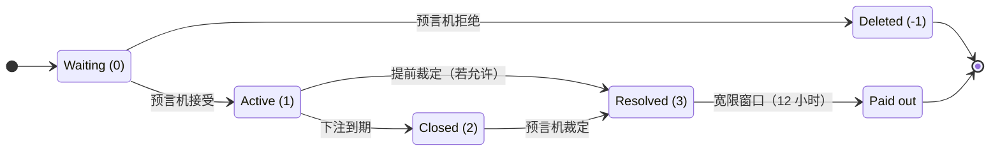
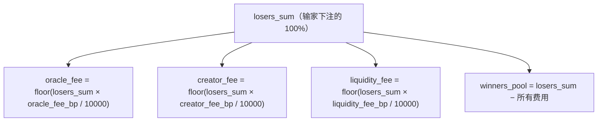

# Onix 协议：VIZ DLT 上具备 LP 保障的预测市场

**产业白皮书**

*Anatoly Piskunov (On1x)*
*版本 2.0 —— 2026 年 6 月（链上 / HF14）*

---

> **链上状态（HF14）。** 本文最初针对中心化原型撰写。协议现已作为 VIZ DLT 上的**一等公民共识操作
> （`pm_*`）**运行，并在 `consensus_sim` 中验证。自 HF14 起上线：两种市场类型（CPMM 二元 + LMSR 多元）、
> 同注分彩零和结算、**懒惰池**、可选**杠杆**子系统、可选**批量 / 提交-揭示下注**（二元）、保证金预言机，
> 以及双模式争议系统（委员会 / 账户）。所有百分比参数均为**基点（bp）：10000 = 100.00%**（原型使用千分比
> permille）。下文在链上设计与原型文本不同之处均有标注。

## 摘要

预测市场将分散的信息聚合为价格，其概率估计持续优于民调、专家组和统计模型。然而采用仍受一个结构性问题制约：
**流动性提供者会亏钱。**

Uniswap v3 的 LP 承受无常损失。LMSR 做市商面临全部补贴的风险。CLOB 做市商遭遇逆向选择。每一种现有模型都要求
资本提供者以不确定的收益换取下行风险——数据显示大多数人亏损。

**Onix 协议**彻底消除 LP 风险。这是一种预测市场架构，其中 LP 本金由**结算机制本身结构性地保障**——不是靠
保险，不是靠对冲。赢家只从输家被没收的本金中获得赔付。LP 资金提供市场深度，但从不用于结算下注。

本文描述 Onix 协议的两种市场类型——**Onix Binary**（恒定乘积做市商）与 **Onix Multi**（LMSR 定价 +
同注分彩结算）——以及市场架构、预言机与争议解决系统、懒惰流动性池、可选杠杆、治理模型，及其作为共识级操作在
VIZ DLT 上的实现。

---

## 1. 问题：预测市场中的 LP 风险

每个预测市场都需要流动性。没有它，价格便毫无意义——一笔使市场移动 20% 的下注暴露的是下注者的资金，而非群体
的智慧。根本问题是：**谁提供这份流动性，他们承担什么风险？**

### 1.1 当前格局

| 平台 | LP 模型 | LP 风险 | 收益来源 |
|----------|----------|---------|-------------|
| **Uniswap v3** | 集中流动性 AMM | 无常损失（常 >5% 年化；>50% 的 v3 LP 跑不赢买入持有） | 交易手续费 |
| **Aave / Compound** | 借贷池 | 智能合约风险、清算级联 | 借款人利息 |
| **Curve** | Stableswap AMM | 锚定资产低 IL、智能合约风险 | 手续费 + CRV 增发 |
| **Standard LMSR** | 做市商补贴 | 损失高达 `b × ln(N)`——全部补贴 | 买卖价差 |
| **Polymarket (CLOB)** | 主动做市 | 库存风险、逆向选择 | 买卖价差 |
| **Kalshi** | 无 LP 概念 | 不适用（交易所模型） | 不适用 |

格局清晰：为预测市场提供流动性要么需要主动管理技能（CLOB），要么容忍资本损失（LMSR），要么接受无常损失
（AMM）。这些都不适合零售参与者。

### 1.2 为何重要

预测市场在深而具流动性时表现最佳。深度市场产生准确价格、吸引知情交易者，并产生使预测市场成为公共品的信息价
值。但深度需要资本，资本需要风险补偿。

结果是先有鸡还是先有蛋的问题：
- 浅市场 → 高滑点 → 差体验 → 少下注者 → 低手续费 → 无 LP 激励 → 浅市场

打破此循环需从等式的 LP 一侧移除风险。若提供流动性是无风险的，进入门槛降为零，飞轮便可开始转动。

---

## 2. Onix 协议

### 2.1 设计原则

Onix 协议建立在三条架构不变量之上：

1. **LP 本金结构性安全。** 这不是风险缓释策略——而是赔付架构的属性。LP 资金与下注结算取自物理上分离的池。

2. **输家资助赢家。** 所有赔付（赢家利润、预言机费、创建者费、LP 费）只取自输家被没收的本金。手续费在裁定时
   计算为 `floor(losers_sum × fee_bp / 10000)`（bp：10000 = 100.00%），从不在下注时扣除。

3. **双市场类型，单一保障。** 二元市场（Onix Binary）与多元市场（Onix Multi）使用不同定价公式，但共享同一
   结算模型与同一 LP 保障。

### 2.2 Onix Binary（CPMM + 同注分彩结算）

Onix Binary 使用恒定乘积做市商公式——与 Uniswap 相同的 `x * y = k` 不变量——作为二元结果的**定价引擎**，
配合**同注分彩结算**（输家按权重比例资助赢家），与 Onix Multi 相同的结算模型。

**机制：**

市场维护两个储备 `reserve_a` 与 `reserve_b`，乘积恒为 `k`：

```
k = reserve_a × reserve_b
```

当用户对结果 A 下注 `amount`（实现中 side 0 → `reserve_a`）时，本金进入该侧储备，代币从**对侧**储备取出：

```
new_reserve_a = reserve_a + amount
new_reserve_b = floor(k / new_reserve_a)
tokens_received = reserve_b − new_reserve_b
```

`tokens_received`（称为 `weight`）是用户对赢家池的**相对索取权**（若结果 A 获胜；结算为同注分彩——见下，
与 Onix Multi 相同）。被下注的一侧其隐含概率上升（A 上的钱越多 → `reserve_a` 增长 → `P(A)` 增长）：

```
P(A) = reserve_a / (reserve_a + reserve_b)
P(B) = reserve_b / (reserve_a + reserve_b)
```

**结算与 LP 安全性证明（同注分彩）：**

裁定时，赢家取回本金，外加按权重的输家池比例份额（与 Onix Multi 相同）：

```
winners_pool = losers_sum − fees
payout = bet_amount + (weight / total_winning_weight) × winners_pool − time_penalty_on_profit
```

LP 本金 `L` 无条件返还，保障精确：

```
Money OUT = L + winning_bets + winners_pool + fees = L + winning_bets + losing_bets = L + all_bets = Money IN
```

无论权重如何，总赔付以 `losers_sum` 为上限，故 LP 资金从不用于结算下注。CPMM 是**定价引擎**（概率 +
权重）；它不门控赔付。（AM-GM 关系 `reserve_a + reserve_b ≥ 2√k = L` 对定价曲线仍成立，但不再用于偿付能力。）

**示例：**

```
Setup: 200 VIZ liquidity → reserve_a = 100, reserve_b = 100, k = 10,000
Fees (bp): oracle 50 (0.5%), creator 50 (0.5%), liquidity 100 (1%)

Alice bets 50 VIZ on A → receives weight 33.33 (price moves from 50% to 69%)
Bob bets 80 VIZ on B   → receives weight 81.82

Resolution: A wins
  Losers (Bob): 80 VIZ forfeited → losers_sum = 80
  oracle_fee   = floor(80 × 50/10000)  = 0.4 VIZ
  creator_fee  = floor(80 × 50/10000)  = 0.4 VIZ
  liq_fee      = floor(80 × 100/10000) = 0.8 VIZ
  winners_pool = 80 − 1.6 = 78.4 VIZ

  Alice (only winner, weight 33.33 of 33.33):
    payout = 50 (stake) + 78.4 × (33.33/33.33) = 128.4 VIZ (minus any time penalty on profit)
  LP return: 200 VIZ principal + share of 0.8 VIZ fee pool
```

### 2.3 Onix Multi（LMSR + 同注分彩结算）

Onix Multi 是协议针对 3–10 个结果市场的创新。它结合 Hanson 的对数市场评分规则（LMSR，2003）做实时定价，
与同注分彩结算来保障 LP 安全。

**定价（LMSR softmax）：**

对结果为 {1, 2, ..., N} 的市场，每个结果有数量参数 `q_i`：

```
price(i) = exp(q_i / b) / Σ_j exp(q_j / b)
```

这是 softmax 函数——价格按构造总是恰好相加为 1.0。无需任何套利机制或 split/merge 操作。

在结果 i 上买入 Δ 代币的成本：

```
C(q) = b × ln(Σ_j exp(q_j / b))

cost = C(q + Δ·e_i) − C(q)
```

参数 `b` 控制价格敏感度（b 越高，每笔下注的价格冲击越小）。它由 LP 补贴提供资金：`b = S / ln(N)`，其中
S 为总补贴。

**创新——同注分彩结算：**

在**标准 LMSR** 中，做市商是所有下注的对手方。若群体正确预测结果，做市商损失高达 `b × ln(N)`——可能是全部
补贴。这正是 LMSR 在企业预测市场（Microsoft、Inkling，由运营方吸收损失）之外采用有限的原因。

**Onix Multi 改变了赔付来源。** 裁定时：

```
1. Oracle declares the winning outcome
2. Losers forfeit 100% → losers_sum
3. Fees deducted from losers_sum (bp; 10000 = 100.00%):
     oracle_fee  = floor(losers_sum × oracle_fee_bp / 10000)
     creator_fee = floor(losers_sum × creator_fee_bp / 10000)
     liq_fee     = floor(losers_sum × liquidity_fee_bp / 10000)
     winners_pool = losers_sum − fees
4. Winners receive:
     payout = bet_amount + (tokens / total_winning_tokens × winners_pool) − time_penalty
5. LP subsidy returned unconditionally
```

赢家由输家支付，而非 LP。补贴在架构上与结算流分离。

**LP 本金保障证明：**

1. LP 存入 `S` VIZ 作为补贴，用于提供市场深度。
2. 下注期间，用户支付 VIZ → 取得结果代币。VIZ 累积为下注池。
3. 裁定时，输家被没收的本金资助赢家赔付与手续费。补贴 `S` 从未进入赔付池。
4. 无论结果如何，补贴无条件返还给 LP。

**对比：**

| 维度 | Standard LMSR | Onix Multi |
|-----------|---------------|------------|
| LP 角色 | 所有下注的对手方 | 深度存款（非对手方） |
| LP 最大损失 | `b × ln(N)`（全部补贴） | **零** |
| 赢家赔付 | 1 代币 = 1 单位货币 | 代币 = 对输家池的比例索取权 |
| 需要 CTF split/merge？ | 是（强制价格之和 = 1） | 否（softmax 保证） |

**示例（3 结果选举）：**

```
Setup: b = 1000, outcomes = [A, B, C], subsidy = 1000 VIZ
Initial: price(A) = price(B) = price(C) = 33.3%

Alice bets 50 VIZ on A → ~47 tokens (price: 33% → ~38%)
Bob bets 100 VIZ on B   → ~88 tokens
Carol bets 30 VIZ on C  → ~29 tokens

Resolution: A wins
  Losers: Bob (100) + Carol (30) = 130 VIZ
  Fees (200 bp = 2% total): 2.6 VIZ
  winners_pool = 127.4 VIZ

  Alice: 50 + (47/47 × 127.4) = 177.4 VIZ
  LP: 1000 VIZ returned in full + share of liquidity fees
```

### 2.4 边界情形

| 情形 | 结果 |
|----------|---------|
| 全部下注于赢家 | `losers_sum = 0` → 每个下注者恰好取回其下注额。LP 补贴返还。零和。 |
| 无人下注于赢家 | 整个输家池未分配 → LP 奖励。LP 利润最大化。 |
| 零成交量市场 | LP 补贴全额返还。无手续费、无赔付。 |
| 单一下注者获胜 | 该下注者获得 `bet_amount + winners_pool`。LP 补贴返还。 |

---

## 3. 市场架构

### 3.1 市场生命周期



市场由创建者创建，经预言机（质押保险）审阅并接受，开放下注，以某一结果裁定，并在争议宽限期后赔付。

### 3.2 费用模型（仅从输家提取）

Onix 协议的一个鲜明特征是**下注时不扣任何手续费**。完整下注额进入市场储备。手续费仅在裁定时计算，且只取自输
家被没收的本金：



这提供了结构性保障：手续费与赢家赔付取自完全分离的资金来源。费用提取永不与对赢家的义务竞争。

**预言机费用条款在接受时冻结（offer→quote）。** 创建者公布预言机可收取的**上限**（bp 计的
`oracle_fee_percent` 上限 + `oracle_fixed_fee` 上限）；预言机接受时报出其实际条款（≤ 创建者上限且 ≤ 中位
治理上限 `pm_max_oracle_fee_percent`），冻结到市场上并发出 `pm_market_accepted` 虚拟操作。自预言机在创建时
冻结其条款。**预言机固定费**（每个市场）从输家池余额支付（从不增发）。**市场创建费**进入 DAO 基金作为反垃圾
保护。

### 3.3 时间加权 LP 分配

LP 手续费份额按 `amount × max(1, seconds_to_expiration)` 比例分配：

```
weight_i = amount_i × max(1, sec_to_expiration_i)
fee_share_i = floor(total_fee_pool × weight_i / Σ weight_j)
```

早期 LP 每单位资本的收益远高于后期 LP。在 48 小时市场中，第 1 小时存入的 LP 每 VIZ 收益约为第 47 小时存入者
的 ~2400 倍。

每笔存款作为独立持仓追踪——同一用户的多笔存款分别加权与支付。无论市场结果如何，LP 本金始终全额返还。

### 3.4 迟下注的时间惩罚

为抑制临近到期的下注（其不确定性风险更小），对临近到期下注施加可配置的时间惩罚：

```
if time_to_expiration < penalty_window:
    ratio = 1 − (time_to_expiration / penalty_window)
    penalty_ratio = ratio²           // quadratic (default)
    time_penalty = floor(penalty_ratio × max_penalty)
```

惩罚**仅作用于利润**，永不作用于本金。获胜下注者始终至少取回其原始本金。二次曲线在惩罚窗口早期平缓、后期陡
峭，奖励「稍迟」而非「极迟」。

### 3.5 持仓转让

持仓可通过原生协议操作在账户间转让：

```
pm_transfer_position { bet_id, to_user, amount, memo }
```

无滑点、无市场冲击——纯粹的记录重新分配。`memo` 字段支持明文与加密两种模式（通过 VIZ 账户 memo 密钥的
ECIES），可实现 P2P 交易、OTC 交易与私密备注。

这是 Conditional Tokens Framework（Polymarket/Gnosis）中唯一带来真实用户价值的可组合性特性。CTF
split/merge 在架构上不必要——Onix 定价公式按构造保证价格一致性。

---

## 4. 预言机与争议解决

### 4.1 保证金预言机模型

Onix 协议中的预言机默认不被信任——它们是**有保证金的**。每个预言机必须：

- 以一次性费用注册（默认 10 VIZ）
- 存入保险（最低 5,000 VIZ）
- 显式接受市场（每次接受都质押其保险）
- 以结果及支撑证据（decision URL）裁定市场

保险保证金创造问责：误裁、错过截止或败诉的预言机其保险会被罚没。为使经济安全模型成立，保证金必须超过预言机潜
在的操纵利润。

预言机收入有两个来源：
1. **固定费**（每个市场）——补偿质押保险与提供裁定
2. **百分比费**（裁定时取自输家池）——随市场成交量扩展

### 4.2 争议仲裁

任何下注者可在宽限期内支付争议费以质疑裁定。争议期间所有赔付冻结。

裁决以两种**按市场选择**的模式之一进行，于创建时选定：

- **委员会模式（`dispute_mode = 0`，默认）**——*全体 SHARES 选民*通过**按质押加权投票**
  （`pm_dispute_vote`）决定，由 `pm_dispute_finalize` 定时任务在 `voting_end_time` 确定性地计票。这是
  **公开听证**：实时计票可查询，投票**不**隐藏于 commit-reveal 之后（一项刻意且永久的选择——DAO 尽可能
  透明地裁决争议）。由于听证期间会浮现新证据，**投票可修改**至关闭（重复投票覆盖先前的）。投票者权重为其
  `effective_vesting_shares` **加上其转换为 vesting-shares 的懒惰池质押**，因此把 VIZ 存入池中的 DAO
  成员保留其治理权重。
- **账户模式（`dispute_mode = 1`）**——单一指定的 `dispute_resolver`（建议多签）作出裁决
  （`pm_dispute_resolve`）。

任一模式下的裁决逻辑：

**若预言机有误（翻转）：**
- 应用正确结果并重算赔付。
- 提出争议者取回其费用，**外加从被罚没保险中切出的奖励**，大小为
  `dispute_fee × pm_dispute_reward_multiplier`（bp；如 30000 = ×3），以罚没额为上限。
- **罚没的余额加入赢家池**（经 `forfeit_pool`）——归获胜下注者，**而非**裁决者或 DAO。委员会投票者与账户
  模式裁决者**均不获奖励**（委员会投票是无偿的治理职责）。
- 预言机保险被罚没（委员会模式按共识强度缩放，账户模式按裁决者的 `penalty_amount`），并可附加封禁。

**若预言机正确（维持）：**
- 提出争议者**将全部争议费没收给预言机**（对恶意挑战的补偿）。
- 原赔付不变继续。

**防拒裁：** 若裁决者 14 天内不作为，争议自动关闭：所有下注与 LP 退款，预言机受罚，提出争议者的费用退回。这
保证资金永不被无限期冻结。

### 4.3 预言机声誉评分

协议为每个预言机追踪 14 项链上指标并计算可靠性分数（0–100）：

```
reliability_score = clamp(0, 100,
    50 (base)
    − 0.40 × dispute_loss_rate × 100
    − 0.10 × excess_no_contest × 100
    − 0.20 × deadline_miss_rate × 100
    − 0.15 × (1 − dispute_response_rate) × 100
    + volume_bonus (0–25)
    + experience_bonus × freshness_multiplier (0–25)
    − 15 × bans_received
)
```

关键设计选择：
- **比率而非计数**——100 次中败 1 次（1%）优于 2 次中败 1 次（50%）
- **从 50 中性起步**——新预言机须赢得声誉，而非从 100 起步
- **新鲜度衰减**——不活跃的预言机随时间失去经验加分
- **成交量分层**——高成交量预言机因经过验证的记录获得加分

可靠性分数与风险因子（保险与下注量之比）结合，产生**综合信任分数**——展示给用户的主要指标。

### 4.4 No-Contest 与 3 结果裁定

无法核实结果的预言机可自愿宣布 **no-contest**，以较低罚则触发退款（从保险扣除 50% 争议费——远比败诉便宜）。
这形成激励梯度：

| 情形 | 预言机成本 | 封禁风险 |
|----------|------------|----------|
| 自愿 no-contest | 500 VIZ | 无 |
| 败诉 | 1,000+ VIZ + 额外罚款 | 永久或临时 |
| 错过截止 | 250 VIZ（自动罚款） | 无（但损害声誉） |

若用户认为预言机滥用 no-contest，可对其提出争议。裁决者随后从**三个**可能的正确结果中选择：A 胜、B 胜，或
确认 no-contest。这阻止预言机用 no-contest 来逃避向获胜下注者赔付。

---

## 5. 懒惰流动性池

### 5.1 资本部署问题

个体 LP 提供需要主动选择市场。多数用户不会手动评估并存入特定市场。结果：多数市场仅以创建者的初始流动性启动，
产生浅订单簿与高滑点。

### 5.2 池到市场的自动分配

懒惰流动性池通过接受存款并在每个新市场激活时**自动分配**池自由余额的一个百分比来解决此问题：

```
alloc_amount = free_balance × allocation_percent / 100
```

分配按当前自由余额（非原始总额）计算，形成几何衰减——池永不被完全耗尽：

```
After 50 markets (2% allocation each): ~357 VIZ free from original 1,000
After 100 markets: ~133 VIZ still free
```

最大总分配上限（默认 70%）提供额外安全。

### 5.3 奖励分配（一个共享累加器）

问题：当市场带池利润裁定时，该利润须按份额比例分给**所有**当前存款人——但在每个市场上遍历每位存款人将是
O(N) 且无界。池用**一个全局累计值** `reward_per_share`（「rps」）避免这一点：

```
// When a market resolves with pool LP profit, the per-share value of the pool rises once:
pool.reward_per_share += profit × PRECISION / total_shares

// A depositor's earnings = their shares × how much rps has risen since they last touched the pool:
live_reward = pending + shares × (pool.reward_per_share − user.snapshot) / PRECISION
```

通俗地说：每位存款人「拥有」每次 `reward_per_share` 上升中的一份，其奖励 =
`份额 × (当前 rps − 上次存取时记录的 rps)`。存款人自己的记录**仅在其行动时**（存入/提取）才被触及；在此之前
其权益在全局数字中静默累积。因此向成千上万存款人分配利润是 **O(1)**（一次加法），且在领取前不付出任何资金。
这是出自
[SushiSwap MasterChef 合约](https://github.com/sushiswap/masterchef/blob/master/contracts/MasterChef.sol)
（及 Compound 的 cToken 指数）的著名累加器模式；`PRECISION`（1e9）保持整数除法精确。

### 5.4 机会成本保护

池向每个市场自动分配，形成一个攻击面：恶意预言机可创建长期零成交量市场以锁定池资金。三种机制应对：

**渐进式提前召回：** 市场时长分为 10 步。每步若下注量低于阈值（分配的 1%），则将当前分配的 10% 召回池中。
完全闲置的 30 天市场会失去约 60% 的分配。

**活跃市场惩罚：** 同一预言机每多一个活跃市场，其分配减少 5%（递归）。拥有 10 个活跃市场的预言机每个市场仅获
约 60% 的基础分配，激励质量而非数量。

**故障惩罚印记：** 不良结果（错过截止、败诉、零成交量裁定）产生惩罚印记，进一步降低未来分配。印记在 10 天干
净运营后自动到期。

### 5.5 可选杠杆（由懒惰池提供资金）

懒惰池**从一个 `free_balance` 承担两种角色**：静默的市场 LP 分配*以及*为**可选杠杆**子系统提供资金。下注者
可开立杠杆持仓（`pm_leverage_open`），其保证金为**来自池的贷款**——不增发代币，从系统视角看持仓始终足额抵
押。会击垮 CLOB 清算引擎的二元「跳空风险」通过**按下注前储备清算**处理：对向下注或结算强平回收
`min(cancel_value, obligation) ≥ loan`，故池取回其贷款外加利息；唯一有界的坏账路径是同侧
`pm_cancel_bet`。中位数 kill-switch（`pm_leverage_enabled`，默认关）阻止*新*开仓，但保护性清算级联刻意
**不**受其门控——关闭杠杆永不剥夺已开持仓的保护。池在 LP 收益之外赚取杠杆利息，按相同的 MasterChef 方式记账。
池贷款的结算发出 `pm_leverage_resolve` / `pm_leverage_liquidate`。

---

## 6. 治理

### 6.1 代表投票的链参数

VIZ 使用委托权益证明（DPoS）共识，由当选代表（验证人）通过中位数投票机制治理链参数：

1. 每位代表公布所有参数的偏好值
2. 网络计算所有活跃代表投票的**中位数**
3. 中位数移动时参数自动改变——无需硬分叉、无需部署

所有预测市场参数（费用、罚则、保险要求、争议窗口、懒惰池设置、杠杆旋钮、批量/提交-揭示时序）均由代表投票。所
有百分比参数均以**基点（bp），10000 = 100.00%**：

| 示例 | 治理 |
|----------|-----------|
| `pm_dispute_fee`、`pm_max_oracle_fee_percent`（bp） | 代表中位数投票 |
| `pm_dispute_grace_sec`、`pm_dispute_vote_period_sec` | 代表中位数投票 |
| `pm_dispute_approve_min_percent`、`pm_dispute_reward_multiplier`（bp） | 代表中位数投票 |
| `pm_lazy_*` 分配/召回、`pm_leverage_*`（enabled、fund %、max position） | 代表中位数投票 |
| `pm_commit_reveal_enabled`、`pm_batch_epoch_blocks`、`pm_reveal_window_blocks` | 代表中位数投票 |

硬分叉仅用于结构性变更（新操作类型、公式改变），而非经济调参。Kill-switch（`pm_leverage_enabled`、
`pm_commit_reveal_enabled`）让治理可通过中位数投票停用整个子系统而无需分叉。

### 6.2 司法辖区客户端模型

VIZ DLT 是基础设施，而非运营方——类似于比特币是账本而非货币传输方。协议中立且无需许可。法律义务附着于**客户
端应用**，而非共识算法。

任何司法辖区都可在 VIZ DLT 上构建合规客户端：

| 客户端组件 | 实现 |
|-----------------|---------------|
| 预先批准的预言机 | 客户端持有许可、经 KYC 验证的预言机白名单 |
| 预先批准的裁决者 | 政府批准的争议解决机构 |
| KYC/AML | 客户端层身份验证 |
| 费用路由为税收 | `dao_fund_account_id` → 国库账户 |
| 市场限制 | 客户端按允许类别过滤 |
| 下注限额 | 客户端强制的人均上限 |

相同的协议操作（`pm_place_bet`、`pm_resolve`、`pm_dispute`）对无许可与受监管客户端运行一致。差异完全在客
户端层。

---

## 7. 竞争格局

### 7.1 平台对比

| 维度 | Onix (Forecaster) | Polymarket | Kalshi | Standard LMSR |
|-----------|-------------------|------------|--------|---------------|
| **定价** | CPMM（二元）/ LMSR softmax（多元） | CLOB | CLOB | LMSR |
| **LP 风险** | **零**（结构性保障） | 库存风险 | 不适用 | 高达 `b × ln(N)` |
| **LP 知识门槛** | 低（存入即赚） | 高（管理订单） | 不适用 | 中 |
| **费用模型** | 裁定时输家池的 % | 买卖价差 | 交易所费用（1-7%） | 价差 |
| **预言机** | 每市场保证金 + 委员会争议 | UMA 乐观预言机 | Kalshi（CFTC 监管） | 运营方 |
| **迟下注惩罚** | 二次、可配置 | 无 | 无 | 无 |
| **持仓转让** | 原生协议操作 + 加密 memo | CTF（ERC-1155） | 无 | 无 |
| **治理** | 代表投票参数 | 团队多签 | CFTC 流程 | 运营方 |
| **基础设施** | VIZ DLT（共识级） | Polygon（智能合约） | 专有服务器 | 各异 |

### 7.2 为何不需要 CTF Split/Merge

Polymarket 使用 Gnosis Conditional Tokens Framework（CTF），其持仓为可拆分与合并的 ERC-1155 代币以强制价
格一致性（价格之和 = $1）。

在 Onix 协议下，此机制在架构上不必要：

- **Onix Binary（CPMM）：** `price(A) + price(B) = reserve_b/(reserve_a+reserve_b) + reserve_a/(reserve_a+reserve_b) = 1` —— 按定义
- **Onix Multi（LMSR softmax）：** `Σ price(i) = Σ exp(q_i/b) / Σ exp(q_j/b) = 1` —— 按 softmax 定义

无需套利机制。价格一致性是公式的数学属性，而非外部强制层。

### 7.3 飞轮

```
Risk-free LP → lower barrier for retail LPs
  → more liquidity deposited
    → deeper markets, less slippage
      → better UX for bettors
        → more volume
          → more fees for LPs
            → attracts even more LPs
```

「无无常损失的被动收益」是 Uniswap、Balancer 与 Curve 无法提供的价值主张。对加密原生受众而言，这是一个引人
注目的叙事：通过为预测市场提供流动性赚取收益，本金零风险。

---

## 8. VIZ DLT：从原型到协议

### 8.1 当前状态

协议起步为带中心化后端的 Telegram WebApp（所有市场逻辑在服务端）——一个有已知限制的可用原型：除 Telegram
账户外无女巫抵抗、无抗审查、无可组合性。**该迁移现已完成：** 完整市场逻辑作为 **VIZ DLT 上经共识验证的
`pm_*` 操作**运行（HF14），在 `consensus_sim` 中端到端验证。本节其余部分描述这一现已实现的链上架构。

### 8.2 迁移架构

VIZ DLT 是一种分布式账本技术，约 3 秒出块、DPoS 共识、命名账户（Graphene 风格），且无通用智能合约。预测市
场操作实现为**一等公民、经共识验证的操作**——非智能合约，非 `custom_json` 负载。

| 层 | 示例 | 经共识验证？ |
|-------|---------|---------------------|
| **协议操作** | `pm_create_market`、`pm_oracle_accept_market`、`pm_place_bet`、`pm_commit_bet`/`pm_reveal_bet`、`pm_resolve_market`、`pm_dispute_create`/`pm_dispute_vote`/`pm_dispute_resolve`、`pm_lazy_deposit`/`pm_lazy_withdraw`、`pm_leverage_open`/`pm_leverage_close`/`pm_leverage_convert` | 是——每个节点验证 |
| **虚拟操作** | `pm_payout`（每下注者）、`pm_auto_payout`、`pm_market_accepted`、`pm_dispute_finalize`、`pm_dispute_auto_close`、`pm_oracle_missed_penalty`、`pm_lazy_recall`、`pm_batch_settle`、`pm_commit_forfeit`、`pm_leverage_resolve`/`pm_leverage_liquidate` | 是——确定性，在出块时生成 |
| **metadata / custom_json** | 争议评论、市场描述、UI 元数据 | 否——仅展示/索引 |

每个金融动作（下注、添加流动性、裁定市场、扣押保险）都由每个验证人验证。无效操作在入块前被拒。无 Solidity、
无 gas 估算、无字节码部署。

前端是**完全无头的 Web 客户端**——无后端服务器、无数据库、无会话。私钥存于浏览器（加密），交易本地签名并广播
到公共 VIZ 节点。不依赖 Telegram；核心应用与平台无关。

### 8.3 自原型以来已交付，及剩余路线图

**已链上交付（HF14）：**

| 特性 | 状态 |
|---------|--------|
| 提交-揭示 + 批量下注（二元、可选、中位数 kill-switch） | ✅ 上线 |
| 可选杠杆（懒惰池提供资金、下注前储备清算） | ✅ 上线 |
| 懒惰池（自动分配、渐进式召回、MasterChef 记账） | ✅ 上线 |
| 每下注者 / 杠杆结算虚拟操作 + 插件 API | ✅ 上线 |
| 懒惰池质押作为治理权重（PM 争议 + DAO 提案） | ✅ 上线 |

**剩余路线图：**

| 优先级 | 特性 | 影响 |
|----------|---------|--------|
| 高 | 共享流动性池（类别级 AMM） | 在架构层面解决流动性碎片化 |
| 高 | 自动数据预言机（外生数据源） | 消除客观市场的操纵 |
| 中 | 分层争议窗口（小市场 vs 大市场） | 更好的 UX 校准 |
| 中 | LMSR 批量结算（将批量/提交-揭示扩展到多元） | 多元市场目前强制即时下注 |
| — | **争议**的提交-揭示投票 | **刻意拒绝**——争议保持公开听证（见 §4.2） |

---

## 9. Onix 不主张什么

对取舍与局限的诚实披露：

- **LP 利润不被保证。** 若某市场零输家下注，则无手续费可分配。LP 取回本金但无收益。

- **存在平台风险。** 漏洞、攻击与治理攻击独立于做市商模型。LP 保障是结构性的（赔付架构），并非保险（无外部担保
  基金）。

- **Onix Multi 代币并非固定面值工具。** 在标准 LMSR 中，1 个获胜代币 = 1 单位货币。在 Onix Multi 中，代币是
  对输家池的比例索取权。若所有下注者都选中赢家，则人人保本。

- **LP 收益取决于成交量，而非深度。** 补贴 100,000 VIZ 的市场与补贴 1,000 VIZ 的市场，若成交量与费率相同，
  赚取相同的绝对手续费。补贴提供深度，而非收益。

- **DPoS 治理有已知取舍。** 验证人少于 PoW/PoS、代表集中风险、按代币加权投票。这些是 DPoS 模型固有的（EOS、
  Hive、Tron 共有），非 VIZ 特有。

- **VIZ 代币流动性目前较低。** 经济保障（保险保证金、争议费）随代币价格扩展。协议假设效用随时间驱动需求——这
  是每个协议原生代币项目所下的同一注。

---

## 10. 结论

Onix 协议针对预测市场采用的根本障碍：LP 风险。通过在二元（CPMM）与多元（LMSR + 同注分彩）市场中结构性地将
LP 资金与下注结算分离，Onix 使流动性提供变为无风险且对零售参与者可及。

关键创新：

1. **LP 本金保障** 作为架构不变量，而非保险
2. **输家资助赢家** 结算，消除手续费与赢家赔付的竞争
3. **LMSR 定价 + 同注分彩结算**（Onix Multi）——将经验证的价格发现与 LP 安全结合
4. **时间加权 LP 分配**，奖励早期资本投入
5. **二次时间惩罚** 作用于利润（永不本金），用于迟下注
6. **懒惰流动性池**，具自动分配、渐进式召回与 MasterChef 记账——同时为可选**杠杆**子系统提供资金（池提供保
   证金、下注前储备清算、除有界 cancel-bet 路径外无坏账）
7. **保证金预言机模型**，具声誉评分、offer→quote 费用冻结与双模式争议系统——委员会争议为**公开听证**，投票
   可修改且按懒惰池加权
8. **可选抗 MEV**——批量 / 提交-揭示下注（二元），带中位数 kill-switch
9. **共识级实现** 于 VIZ DLT——无智能合约、无 gas、无外部 keeper；严格**零和**（协议从不增发代币）

赌注很简单：若无风险 LP 吸引资本、资本创造深度、深度改善价格、价格吸引下注者，那么 Onix 协议便解决了预测市场
的流动性问题。协议机制可数学验证。经济假设将由市场检验。

---

## 11. 作者与披露

### 作者

**Anatoly Piskunov**（On1x）—— 俄罗斯 IT 创新者、Web3/DLT 开发者、VIZ 区块链的创建者。其工作横跨分布式账
本技术、去中心化社交协议与数字社区的经济模型。

主要贡献包括：VIZ 区块链（Fair DPoS、社会资本原语）、Onix 协议（具 LP 保障的预测市场）、Voice 协议（抗审查
消息）以及关于区块链经济学与 Web3 架构的大量出版物。

完整出版物与项目列表：[https://on1x.com](https://on1x.com)

### 披露

Forecaster 与 Onix 协议的作者同时是 VIZ DLT 的创建者。迁移路线图提议将平台迁至作者设计并构建的区块链。

这一点已预先披露。这也是常态：Polymarket 依赖 Polygon Labs 的基础设施，Kalshi 运行在自有服务器上，Augur
设计了其运行所依赖的 REP 代币。每个平台都为自身基础设施辩护。问题不在于作者是否有利益——他们总有——而在于技
术主张是否可证伪。本文中的每一条公式、证明与机制都可数学验证，且代码库开源。

---

## 12. 参考文献

1. Hanson, R. (2003). *Combinatorial Information Market Design.* Information Systems Frontiers, 5(1), 107–119. —— 对数市场评分规则（LMSR）。

2. Adams, H., Zinsmeister, N., Robinson, D. (2020). *Uniswap v2 Core.* —— 恒定乘积做市商（`x * y = k`）。

3. Adams, H., et al. (2021). *Uniswap v3 Core.* —— 集中流动性与无常损失分析。

4. Gnosis. *Conditional Tokens Framework (CTF) Documentation.* https://docs.gnosis.io/conditionaltokens/ —— ERC-1155 预测市场持仓。

5. UMA Protocol. *Optimistic Oracle Documentation.* —— Polymarket 使用的争议升级机制。

6. Leshner, R., Hayes, G. (2019). *Compound: The Money Market Protocol.* —— cToken 累加器模式（reward_per_share 的基础）。

7. SushiSwap. *MasterChef Contract.* —— 奖励分配的懒惰记账模式。

8. Piskunov, A. (2019). *VIZ blockchain system: technical description.* —— VIZ DLT 架构、DPoS 共识、命名账户。

9. Piskunov, A. (2019). *What is Fair DPoS.* —— 委托权益证明中的治理创新。

10. Piskunov, A. (2023). *VIZ as a Digital Representative Self-Governing State.* —— 区块链系统作为数字政体的框架。
