# 工作流与交互图

一个**典型场景**贯穿每个参与者。每个角色发送特定的**已签名操作**，被特定的**虚拟操作**触及，并以两种结果的
**代币 发送 / 接收** 表收尾：

- **正常裁定** —— 预言机裁定，宽限期过去，`pm_auto_payout` 结算。无争议。
- **争议裁定** —— 预言机裁定 **A**，争议**翻转为 B**，随后进行结算。

所有金额为抽象 **VIZ**。所有百分比为 **bp**（10000 = 100.00%）。结算严格**零和**——从不增发代币，
`current_supply` 不变：

```
Σ winner_payout + oracle_take + creator_take + lp_bonus + LP_principal
        == Σ all bet amounts + LP_principal + forfeit_pool   (+ insurance slash, 争议中)
```

## 典型市场 **M**（binary CPMM，A vs B）

| 项 | 值 |
|------|-------|
| 引擎 | binary CPMM（`x·y=k`），`weight = tokens_out` |
| 种子流动性（marketmaker） | **2000** → 储备 A=1000 / B=1000 |
| `oracle_fee_percent`（预言机报价） | **1000**（10%） |
| `creator_fee_percent` | **500**（5%） |
| `liquidity_fee_percent` | **500**（5%） |
| `oracle_fixed_fee`（预言机报价） | **10** |
| `dispute_penalty_percent` | **+10000**（罚没至多 100% 保险 ×consensus） |

示例链参数：`pm_market_creation_fee` 5、`pm_oracle_registration_fee` 10、`pm_min_oracle_insurance` 5000、
`pm_dispute_fee` 1000、`pm_dispute_reward_multiplier` 30000（**3×**）、`pm_no_contest_penalty_percent`
5000、`pm_oracle_penalty_percent` 500、`pm_lazy_emergency_penalty_percent` 5000、
`pm_leverage_pool_profit_percent` **R = 10%**、`pm_lazy_alloc_percent` 2000（20%）。

### 角色表

| 角色 | 职责 | 质押 / 动作 |
|-------|------|----------------|
| **maker** | 创建者 + 首位 LP | 种子 2000 流动性 |
| **orac** | 外部预言机 | 保险 5000；报价 10% + 固定 10 |
| **LP1** | 市场内流动性提供者 | 增加 1000 |
| **A** | 下注者 —— 赢家 | 100 于 **A**，早期；权重 100 |
| **C** | 下注者 —— 迟到赢家 | T+85% 时 100 于 **A**；权重 100；时间惩罚 **50%** |
| **B** | 下注者 —— 输家 | 200 于 **B**；权重 200 |
| **D** | 杠杆 **×10** 赢家 | collateral 10 + loan 90（市场 **L**） |
| **E** | 杠杆 **×5** 被清算 | collateral 20 + loan 80（市场 **L**） |
| **LZ1** | 懒惰池存款人 | 存入 1000 |
| **disp** | 争议提出者 | 托管争议费 1000 |

> 曲线权重（100 / 100 / 200）显式写出以便同注分彩的算术可读；真实 CPMM 随储备移动会给出略少的权重。

## 交互图

**市场生命周期。**

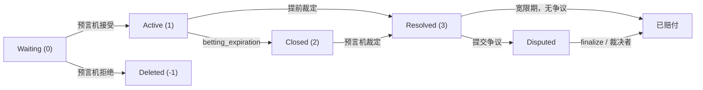

**结算 —— 正常裁定（A 获胜）。** 输家资助赢家；LP 本金不变（零和）。

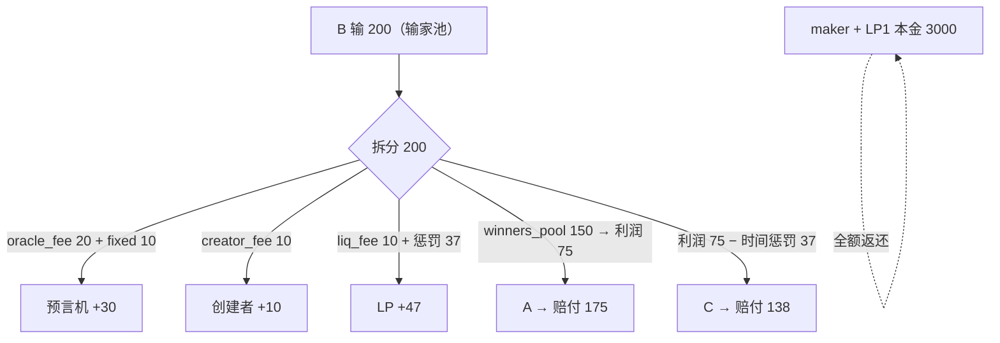

**争议 —— 预言机裁 A，翻转为 B。** 惩罚是保险罚没（独立资金）。

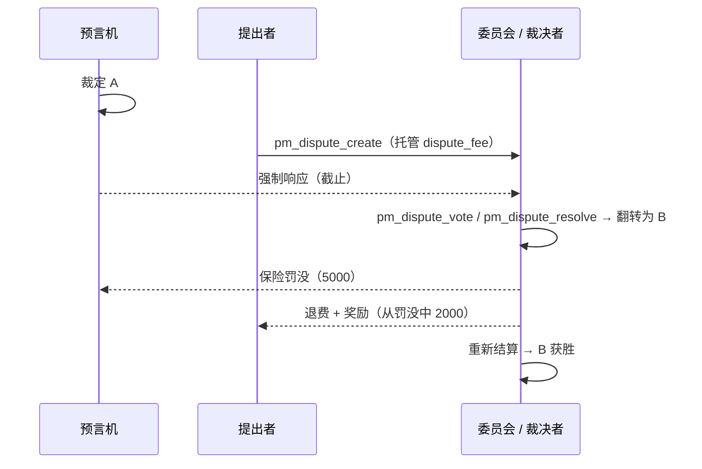

## 主账本 —— 正常裁定（A 获胜）

`losers_sum = 200`（B）。从输家池扣费：
`oracle_fee = 200×10% = 20`、`creator_fee = 200×5% = 10`、`liq_fee = 200×5% = 10`、`oracle_fixed = 10`。
`winners_pool = 200 − 20 − 10 − 10 − 10 = 150`。`Σ 获胜权重 = 200`（A 100 + C 100）。

- **A**：利润 `150×100/200 = 75`，惩罚 0 → **赔付 175**。
- **C**：利润 75，时间惩罚 `75×50% = 37`（→ LP）→ **赔付 138**。
- **LP 奖励** = `liq_fee 10 + 惩罚 37 = 47`，按在市场中的时间拆分：**maker ~31 / LP1 ~16**。
- **oracle_take** = `oracle_fee 20 + fixed 10 = 30`。**creator_take** = `creator_fee 10`。

| 角色 | 发送 | 接收 | 净额（本市场） |
|-------|-------|----------|-------------------|
| maker | 2000 流动性 + 5 创建费 | 2000 本金 + 10 创建者费 + 31 LP 奖励 | **+36** |
| orac | （10 注册费，5000 保险锁定） | 30 oracle-take | **+30** |
| LP1 | 1000 流动性 | 1000 本金 + 16 LP 奖励 | **+16** |
| A | 100 | 175 | **+75** |
| C | 100 | 138 | **+38** |
| B | 200 | 0 | **−200** |

**零和：** in `= 下注 400 + LP 本金 3000 = 3400`；out `= 175+138+0 + 30 + 10 + 47 + 3000 = 3400`。✔
5 创建费 + 10 注册费进入 **DAO 基金**（不属于市场池）。

## 主账本 —— 争议裁定（预言机裁 A → 翻转为 B）

`disp` 托管 `dispute_fee 1000`。裁决翻转为 **B**；预言机被罚没。
当 `dispute_penalty_percent = 10000` 且共识强度 **100%**：`slash = 5000×100%×100% = 5000`。
奖励切分：`reward_target = fee×3 = 3000` → `bonus = 3000 − 1000 = 2000`（≤ slash）。提出者获得
`fee 1000 + bonus 2000 = 3000`。余额 `slash − bonus = 3000 → forfeit_pool`。

现在 **B 获胜**。`losers_sum = 200`（A 100 + C 100）。费用 20/10/10 + fixed 10。
`winners_pool = 200 − 50 + forfeit 3000 = 3150`。`Σ 获胜权重 = 200`（B）。
- **B**：利润 `3150×200/200 = 3150` → **赔付 3350**。
- **oracle_take** 仍为 `30`（即使翻转，*市场*费用仍按冻结配置支付——惩罚是**保险罚没**，独立资金）。
  **creator_take** 10。**LP 奖励** = liq 10。

| 角色 | 发送 | 接收 | 净额（本市场） |
|-------|-------|----------|-------------------|
| maker | 2000 + 5 | 2000 本金 + 10 创建者费 + ~6 LP 奖励 | **+11** |
| orac | 保险 −**5000** 罚没 | 30 oracle-take | **−4970** |
| LP1 | 1000 | 1000 本金 + ~4 LP 奖励 | **+4** |
| A | 100 | 0 | **−100** |
| C | 100 | 0 | **−100** |
| B | 200 | 3350 | **+3150** |
| disp | 1000 争议费 | 3000（退费 + 2000 奖励） | **+2000** |

**零和：** in `= 下注 400 + LP 本金 3000 + dispute_fee 1000 + 罚没 5000 = 9400`；
out `= B 3350 + 预言机 30 + 创建者 10 + lp_bonus 10 + LP 本金 3000 + 提出者 3000 = 9400`。✔
罚没 5000 拆为提出者奖励 2000 + forfeit 3000（→ 经赢家池归 B）。

## 实现状态（已与代码核对）

**常规操作 —— 全部 21 个**存在于 `operation` variant（`operations.hpp`），在 `pm_evaluator.cpp` 校验 + 求值：
`pm_oracle_register`、`pm_oracle_update`、`pm_create_market`、`pm_oracle_accept_market`、`pm_place_bet`、
`pm_commit_bet`、`pm_reveal_bet`、`pm_cancel_bet`、`pm_add_liquidity`、`pm_withdraw_liquidity`、
`pm_resolve_market`、`pm_no_contest`、`pm_dispute_create`、`pm_dispute_vote`、`pm_dispute_resolve`、
`pm_transfer_position`、`pm_lazy_deposit`、`pm_lazy_withdraw`、`pm_leverage_open`、`pm_leverage_close`、
`pm_leverage_convert`。✔

**虚拟操作** —— 由 `database::process_pm_markets()` / 求值器发出：

| 虚拟操作 | 触发？ | 触发点（代码） |
|------------|--------|----------------|
| `pm_market_accepted` | ✔ | `pm_oracle_accept_market` **以及**自预言机 `pm_create_market` |
| `pm_payout` | ✔ | 结算时**每笔活跃下注**——携带 `account`、`market_id`、`bet_id`、`side`/`outcome_index`、`amount`（本金）、`payout`（**输则 0**） |
| `pm_auto_payout` | ✔ | 结算时**每个市场一次**——汇总标记（`bets_sum`），与逐笔 `pm_payout` 并列 |
| `pm_commit_forfeit` | ✔ | 超过 `reveal_deadline` 未揭示的承诺 |
| `pm_dispute_finalize` | ✔ | 委员会 `voting_end_time` |
| `pm_dispute_auto_close` | ✔ | `auto_close_time`（防冻结） |
| `pm_oracle_missed_penalty` | ✔ | 预言机错过 `result_expiration` |
| `pm_lazy_recall` | ✔ | 闲置分配的渐进式召回步 |
| `pm_batch_settle` | ✔ | 纪元边界 |
| `pm_leverage_liquidate` | ✔ | 盘中清算：reason **0** 对向下注、**1** 撤注（`cascade_liquidate`） |
| `pm_leverage_resolve` | ✔ | 杠杆头寸的**结算**：携带 `market_id`、`outcome_index`、`won`、`pool_received`/`bettor_received`、`leverage`（= `total_bet/collateral`） |

读取方法见[插件 API](../plugins/prediction-market-api)
（`get_account_leverage_positions`、`get_market_leverage_positions`、`get_creator_ban`、`get_dispute_votes`、…）；
逐下注者结果（`pm_payout`）与杠杆结算（`pm_leverage_resolve`）亦见于 `account_history`。

## 典型场景中的角色

每个参与者都被贯穿市场 **M**（及杠杆子市场 **L**）来追踪：其交互图、它发送的**签名**操作、触及它的**虚拟**
操作、两种结果的**发送 / 接收**账本，以及代码核对指引。每个按角色的账本都是上述两份主账本的切片。

### 做市商（创建者 + 首个 LP）

做市商创建市场 M，注入 **2000** 流动性（成为首个 `pm_liquidity_object`），并提出预言机的**报价上限**。它
**不**裁定（那是预言机的事）。

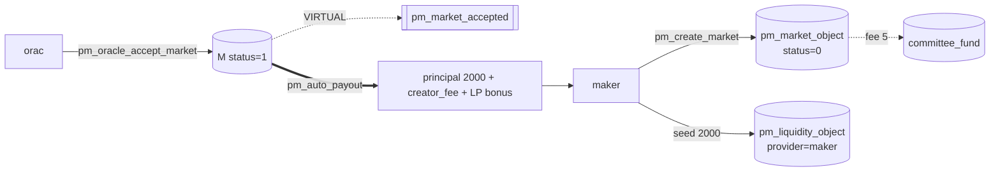

- **发送：** `pm_create_market`（将 `oracle_fee_percent`/`oracle_fixed_fee` 设为**报价上限**，加上自身的
  `creator_fee_percent` 5% 与 `liquidity_fee_percent` 5%；支付 `pm_market_creation_fee` 5 → DAO，锁定
  `liquidity` 2000）；可选 `pm_add_liquidity` / `pm_withdraw_liquidity`（本金安全，从 `betting_expiration`
  到裁定锁定）。
- **被触及：** `pm_market_accepted`（预言机接受，或自预言机在创建时）；`pm_auto_payout`（返还 LP 本金 +
  按时间加权的 LP 奖励份额）。

| 结果 | 发送 | 接收 | 净额 |
|------|------|------|------|
| 正常（A） | 2000 流动性 + 5 创建费（→DAO） | 2000 本金 + **creator_fee 10** + **LP 奖励 ~31** | **+36** |
| 争议（→B） | 2000 + 5 | 2000 本金 + creator_fee 10 + LP 奖励 ~6 | **+11** |

翻转时创建费仍从冻结的市场配置**照付**——争议惩罚的是**预言机**（保证金罚没），而非做市商。LP 本金无条件返还。

- **自预言机：** `oracle == creator` → 创建即生效，`pm_market_accepted` 带 `self_oracle=true`，做市商另外
  赚取 `oracle_take`。
- **核对：** `pm_create_market_evaluator`；LP 经 `settle_liquidity`；`committee_fund += pm_market_creation_fee`。
  **观察：** `get_market`、`list_markets_by_creator`、`get_market_liquidity`（`earned_fee`）、`get_market_meta`。

### 预言机（注册 → 接受-报价 → 裁定）

外部预言机 **orac** 质押保证金，在接受时**报价**其费用（≤ 做市商报价且 ≤ `pm_max_oracle_fee_percent`）并裁定。
其市场费从输家池支付；保证金仅在错过截止或争议败诉时承压。

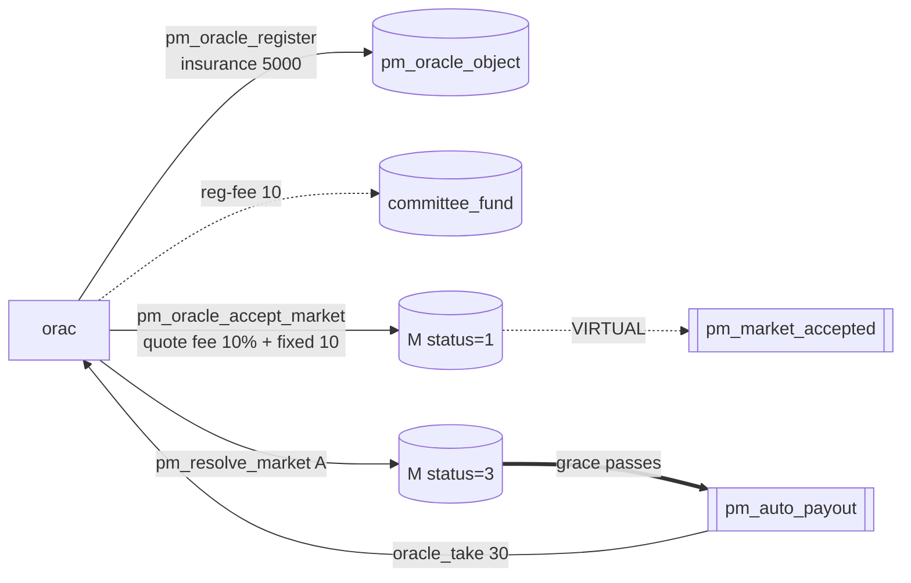

- **发送：** `pm_oracle_register`（锁定保证金 5000，支付 reg-fee 10 → DAO，设定建议价目表）；
  `pm_oracle_accept_market`（**报价** fee 10% + fixed 10，各 ≤ 创建者报价且 ≤ 中位上限；冻结到 M）；
  `pm_resolve_market`（设 `winning_outcome`，开启宽限）；可选 `pm_oracle_update` / `pm_no_contest`。常驻价目表
  亦可在创建时自动接受市场使其上线——见预言机操作文档。
- **被触及：** `pm_market_accepted`；`pm_auto_payout`（计入 `oracle_take`）；`pm_oracle_missed_penalty`
  （从未裁定 → 罚没 `pm_oracle_penalty_percent` 保证金 → DAO，全额退还下注）。

| 结果 | 发送 | 接收 | 净额 |
|------|------|------|------|
| 正常（A） | 保证金 5000（锁定）+ reg-fee 10（→DAO） | **oracle_take 30** = fee 20 + fixed 10 | **+30** |
| 争议（→B） | 保证金 −**5000 罚没** | oracle_take 30 | **−4970** |

即便翻转，预言机仍保留小额**市场费**（冻结配置）；惩罚是**保证金罚没**，拆分为争议者奖励与赢家 `forfeit_pool`。
报价**低于**报价允许（价格=声誉）；**高于**则拒绝。

- **核对：** `pm_oracle_register_evaluator`、`pm_oracle_accept_market_evaluator`（≤ 报价、≤ 上限、冻结）、
  `process_pm_markets` 错过截止扫描。**观察：** `get_oracle`、`list_oracles`、`get_market`（冻结条款）。

### 预言机 —— 争议中被维持（争议胜方）

预言机裁定 **A**；争议者挑战但裁决**维持** A。预言机保留市场费**并**收取被没收的 `dispute_fee`；保证金不动，
`disputes_won++`。

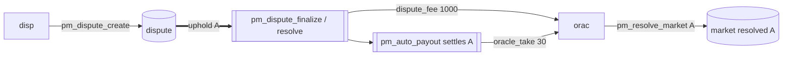

| 结果 | 发送 | 接收 | 净额 |
|------|------|------|------|
| 争议，维持 | 保证金 5000（**不**罚没） | oracle_take 30 + **dispute_fee 1000** | **+1030** |
| 正常（无争议） | 保证金 5000（锁定） | oracle_take 30 | **+30** |

挑战反噬争议者并**支付给预言机**。善意市场（`dispute_penalty_percent < 0`）甚至能在改变结果时给预言机费用
奖励——承认诚实错误。**核对：** `pm_dispute_finalize` / `pm_dispute_resolve` 的 uphold 分支。**观察：**
`get_oracle`（`disputes_won`）、`get_dispute`。

### 预言机 —— 被翻转 + 罚没（争议败方）

预言机裁定 **A**；争议**翻转为 B**，保证金被**罚没**。它仍收取微小的冻结市场费（费用与惩罚是两笔钱），但损失
大部分保证金与声誉。

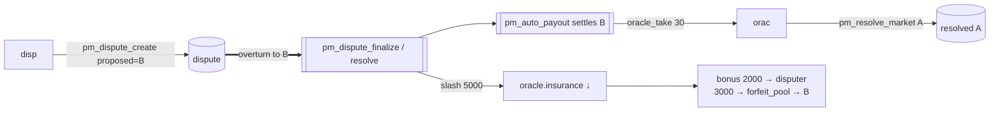

`slash = 保证金 5000 × dispute_penalty_percent (100%) × consensus_strength (100%) = 5000`，是**再分配**而非
销毁：`bonus 2000 →` 争议者，`3000 → forfeit_pool →` 新赢家（B）。净 **−4970** 对比无争议的 **+30**。罚没随
**共识强度**（`winning_rshares / max_rshares`）缩放；`dispute_penalty_percent < 0`（善意）→ **无**罚没。被
罚没的预言机往往也被**封禁**（下一角色）。**核对：** `pm_dispute_finalize` / `pm_dispute_resolve` 的 overturn
分支；费用仍取自 `mkt.oracle_fee_percent`。**观察：** `get_oracle`（`total_insurance_slashed`、`banned_until`）、
`get_dispute`。

### 被封禁的预言机（及被封禁的创建者）

封禁是**状态**，非转账：`pm_oracle_object.banned_until`（创建者则是 `pm_creator_ban_object`）阻止该角色承接
**新**市场直到时间戳过去。它通常伴随翻转罚没，但本身不移动代币。

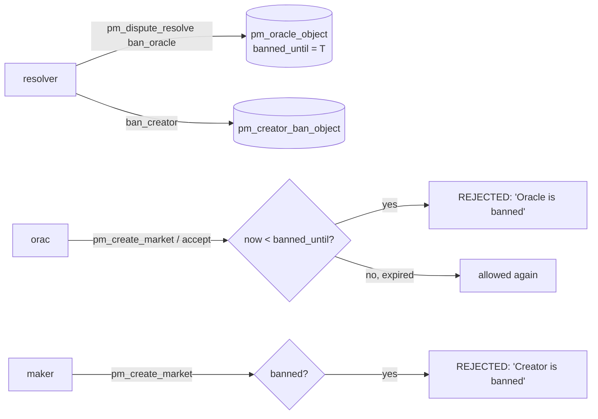

- **谁设定：** 账户模式 → `pm_dispute_resolve`（`ban_oracle`/`ban_creator` + `…_until`）；委员会模式 →
  `pm_dispute_finalize` 在翻转时按共识缩放封禁。`banned_until = time_point_sec::maximum()` ⇒ **永久**。
- **代币：** 封禁本身为 **0**（纯状态）；伴随的罚没是上面的翻转情形。保证金仍锁定，封禁解除且无活跃市场后可退。
- 封禁在快照中存续并按账户为键——重新注册无法抹除。**核对：** `pm_create_market_evaluator`（`"Oracle is
  banned"` / `"Creator is banned"`）。**观察：** `get_oracle`（`banned_until`、`bans_received`）、
  **`get_creator_ban(account)`**。

### 下注者 A —— 早期赢家

**A** **早期在 A 侧下注 100**（无时间惩罚），M 裁定为 A 时获胜。赔付 = 本金 + 按权重比例的赢家池份额。

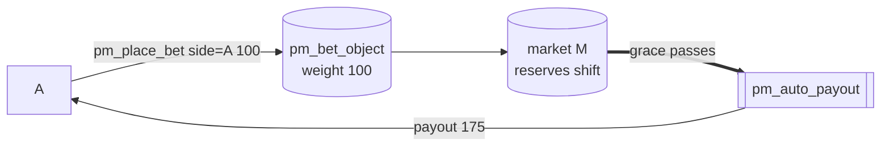

| 结果 | 发送 | 接收 | 净额 |
|------|------|------|------|
| 正常（A） | 100 | **175** | **+75** |
| 争议（→B） | 100 | **0** | **−100** |

`profit = winners_pool 150 × weight 100 / Σweight 200 = 75`；无惩罚 → 赔付 `100 + 75`。翻转使 A 成为**输**侧。
赢利**仅**来自输家下注（+ forfeit 池），绝不来自增发。**发送：** `pm_place_bet`（`side=0`，instant）；可选
`pm_transfer_position` / `pm_cancel_bet`。**核对：** `pm_place_bet_evaluator`、`settle_market`。**观察：**
`get_account_positions`（`expected_payout`）、`get_market_weight_sums`；已实现的 `pm_payout` 见 `account_history`。

### 下注者 B —— 输家

**B** **在 B 侧下注 200**。M 裁定为 **A** 时，B 的下注资助赢家，B 一无所获。在争议路径中 B 成为赢家。

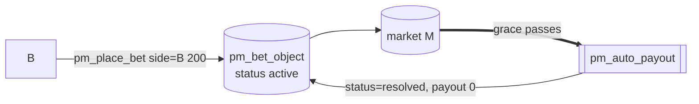

| 结果 | 发送 | 接收 | 净额 |
|------|------|------|------|
| 正常（A） | 200 | **0** | **−200** |
| 争议（→B） | 200 | **3350** | **+3150** |

B 的 200 **就是** `losers_sum`（支付 40 费用 + 150 赢家池 + LP 奖励）——同注分彩的「输家资助赢家」规则。翻转时
B 获胜，预言机 forfeit 3000 注入 B 池（`payout = 200 + 3150`）。输的下注仍由 `pm_payout` 以 **payout=0** 记录。
**核对：** `settle_market` 输家分支。**观察：** `get_account_positions`、`get_market_bets`、`get_dispute`。

### 下注者 C —— 迟到赢家（时间惩罚）

**C** **在 A 侧下注 100** 但**迟**（下注窗口 T+85%），故**时间惩罚**仅扣其*利润*（非本金）。权重与 A 相同但
所得更少；被扣部分流向 LP。

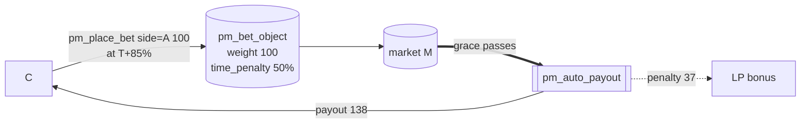

| 结果 | 发送 | 接收 | 净额 |
|------|------|------|------|
| 正常（A） | 100 | **138** | **+38** |
| 争议（→B） | 100 | **0** | **−100** |

`profit = 75`；`penalty = 75 × 50% = 37`（→ LP）；`payout = 100 + 75 − 37 = 138`——同权重下比 A 的 +75 少
**−37**。节点在下注时按市场惩罚曲线（`time_penalty_type/value`、`penalty_curve_type`）盖上 `time_penalty`。它
遏制最后一秒抢狙并补贴流动性，而非协议。**核对：** `pm_place_bet_evaluator`（曲线求值）、`compute_settlement`。
**观察：** `get_account_positions`（`time_penalty`）、`get_market_bets`。

### 下注者 D —— 杠杆 ×10 赢家

**D** 开 **×10** 仓：**10 抵押 + 90 贷款**（来自懒惰池）= 在 A 侧 **100**，于隔离杠杆市场 **L**
（`pm_leverage_enabled=true`，`R = 10%`）。A 获胜时，D 在偿还贷款 + 利息后保留全部 100 的上行。
`pool_profit = loan 90 × R 10% = 9`；`obligation = 90 × 1.10 = 99`。

```mermaid
flowchart LR
  D -->|pm_leverage_open<br/>collateral 10 + loan 90| POS[(pm_leverage_position<br/>total_bet 100, obligation 99)]
  POOL[(lazy pool)] -.loan 90.-> POS
  POS --> L[(market L, side A)]
  L ==>|settle: force_close at cancel_value| VR[[pm_leverage_resolve won=true, leverage=10]]
  VR -->|min(cv,obligation) 99| POOL
  VR -->|cv 200 − 99 = 101| D
```

| 结果 | 发送 | 接收 | 净额 |
|------|------|------|------|
| 正常（A） | 抵押 **10** | cancel_value 200 − obligation 99 = **101** | **+91** |
| 争议（→B） | 抵押 10 | 0 | **−10** |

盈利仓按其 `cancel_value` 平仓；池收回 `obligation 99`（贷款 90 + **9 利息**），D 在自有 10 上保留余下 →
**+91**（池 **+9**）。杠杆按清算结算，**绝不**经 `pm_auto_payout`。零和（L）：in `10 + 90 + 100 = 200`；out
`101 + 99 = 200`。**发送：** `pm_leverage_open`；可选 `pm_leverage_close`（仅当 `cv ≥ obligation`）/
`pm_leverage_convert`。**被触及：** `pm_leverage_resolve`（结算强制平仓，`reason=expiration`）。**核对：**
`force_close_positions` → `liquidate_position(reason=2)`。**观察：** **`get_account_leverage_positions`** /
**`get_market_leverage_positions`**、`get_lazy_pool`。

### 下注者 E —— 杠杆 ×5 被清算

**E** 开 **×5** 仓：**20 抵押 + 80 贷款** = 在 B 侧 **100**（市场 **L**，`R = 10%`）。裁定前一笔**对向下注**将
曲线推向不利于 B；**级联清算**强制平仓。**E 失去抵押，但池始终被补足。** `obligation = 80 × 1.10 = 88`。

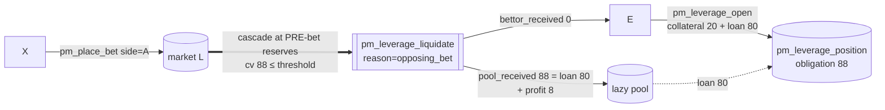

E 在裁定**之前**被清算，故最终 A/B 结果（是否争议）不改变它：

| 角色 | 发送 | 接收 | 净额 |
|------|------|------|------|
| **E** | 抵押 **20** | **0** | **−20** |
| **池** | 贷款 80 | **88**（贷款 80 + R% 8） | **+8** |

对向下注清算在**下注前**储备执行，此时 `cancel_value ≥ loan`，故 `pool_received = min(cv, obligation)` 至少返
还贷款——池**绝不**亏损。

> **唯一可能为负的路径**是同侧 **`pm_cancel_bet`（Case B）**：取消会撤回一笔*先前的大额*同侧下注（超过单笔滑点
> 上限），为对取消者公平，它**先**按其提交价执行——故级联可能落到 `cancel_value < loan`：
> `shortfall = obligation − cancel_value`，`lazy_pool.free_balance −= shortfall`。此**坏账**是**有界的**
> （`≤ cancel_value_before × SL%`）且**罕见**（池在其余所有仓位上的 R% 足以抵消）。由
> `leverage_cancel_bet_cascade_bad_debt` 测试覆盖。

池保护是结构性的（`max_per_position`、`max_position_ratio`、`safety_margin`、滑点上限、`expiration_buffer`）。
`pm_leverage_enabled=false` **仅**阻止**新**开仓——清算级联**不**受该标志门控，故治理永远无法在途中剥夺池的保护
（`leverage_disabled_keeps_liquidation_protection`）。**核对：** `pm_place_bet` → `cascade_liquidate(reason=0)`；
`pm_cancel_bet` → `cascade_liquidate(reason=1)`；`liquidate_position`。**观察：**
**`get_account_leverage_positions`**（`status=1`、`pool_received`、`bettor_received`）、`get_lazy_pool`。

### 市场内流动性提供者（LP1）

**LP1** 向活跃 M 添加 **1000** 流动性（在做市商种子之后）。本金**始终**返还；之上赚取**按时间加权**的 LP 奖励
份额（流动性费 + 时间惩罚 + 零头）。与懒惰池提供者不同，后者一次存入并被自动分配到多个市场。

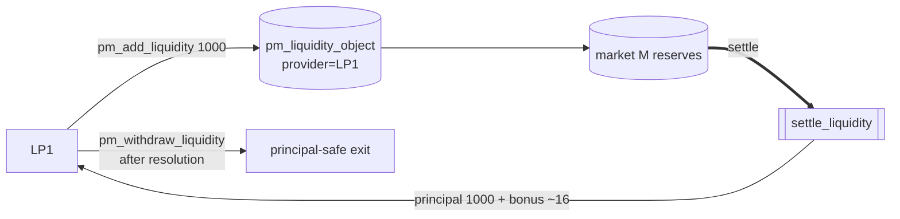

| 结果 | 发送 | 接收 | 净额 |
|------|------|------|------|
| 正常（A） | 1000 | **1000 本金 + ~16 奖励** | **+16** |
| 争议（→B） | 1000 | 1000 本金 + ~4 奖励 | **+4** |

LP 奖励池 = `liq_fee 10 + 时间惩罚 37 = 47`，按 `本金 × 在场秒数` 分配（早期做市商 ~31，较晚的 LP1 ~16）。
**本金保证**是架构性的——种子在任何赢家获付之前返还；LP 只会放弃奖励，绝不损失本金。提取从
`betting_expiration` 到裁定锁定。**核对：** `pm_add_liquidity_evaluator`（记录 `deposit_time`）、
`settle_liquidity` → `distribute_lp`。**观察：** `get_market_liquidity`（`earned_fee`）、`get_market_weight_sums`。

### 懒惰流动性池（系统对象）

**单例** `pm_lazy_pool_object`——不是账户。存款人一次性注资；池**自动分配**一片给每个已接受市场作为静默 LP
（`pm_liquidity_object`，`provider` 为空）、**资助杠杆贷款**并**回收**闲置分配。它赚取 LP 收益 + 杠杆利息，按
MasterChef 方式记账（一个全局 `reward_per_share`，O(1)——见白皮书）。字段：`total_shares`、`free_balance`、
`allocated_balance`、`earned_balance`、`reward_per_share`、`leverage_fund_used`。

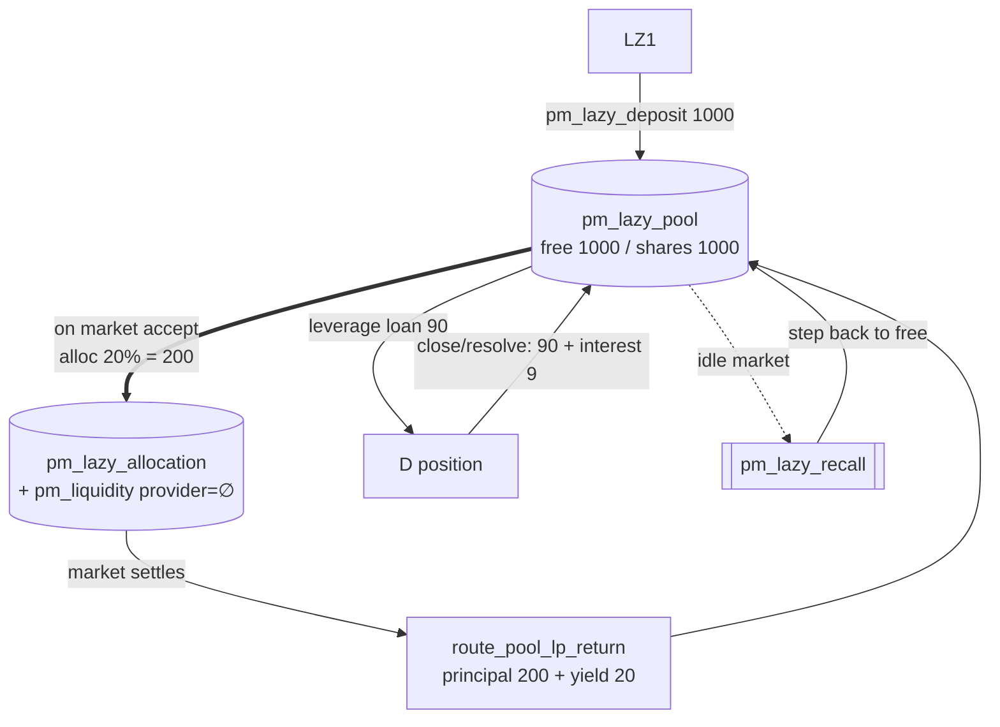

| 池资金流 | 效果 |
|----------|------|
| `pm_lazy_deposit` | `free_balance += amount`，铸造 shares |
| 自动分配（接受时） | `free → allocated`（静默 LP） |
| 市场结算 | `route_pool_lp_return`：本金 + 收益 → `free`；收益 → `earned` 与 `reward_per_share` |
| 杠杆开仓（D/E） | `free −= loan`，`leverage_fund_used += loan` |
| 杠杆平仓 / 结算 / 对向下注清算 | `min(cv, obligation) → free`；`cv ≥ loan` ⇒ **绝不亏损** |
| cancel-bet 清算（仅 Case B） | 回收 `cv`，**可能 < loan** → 有界**坏账** |
| `pm_lazy_recall`（闲置市场） | 闲置分配的一个 10% 步 → `free` |
| `pm_lazy_withdraw` | 销毁 shares → 本金 + pending；紧急惩罚留在池中 |

在典型场景中池净赚 **+37 earned**（市场 M 收益 +20，杠杆 D 利息 +9，杠杆 E 对向下注回收 +8）。作为市场 LP 其
本金无条件返还；只有*奖励*收益随争议变化。

> 池从单一 `free_balance` **同时**承担两种角色：市场 LP 分配（`maybe_allocate_lazy`）与杠杆贷款
> （`leverage_fund_used` 限制后者）。所有杠杆参数都在 **`pm_leverage_open` 时**对当前中位值检查，故此后属性波动
> 只影响*新*开仓，绝不影响已放出的贷款。

池中 VIZ 为**流动**而非 vested → **无**验证人调度或 committee-request 权重。**例外（HF14）：** 对 **PM 委员会
争议**，存款人的池权益**被计入**——经 `get_vesting_share_price()` 转为 vesting-shares 并加入其 `pm_dispute_vote`
权重（见下文委员会裁决者）。**核对：** `apply_hardfork(CHAIN_HARDFORK_14)`（单例）、`maybe_allocate_lazy`、
`route_pool_lp_return`。**观察：** `get_lazy_pool`。

### 懒惰池中的流动性提供者（LZ1）

**LZ1** 一次性向池存入 **1000**，任其在市场 + 杠杆贷款间分散。它赚取池聚合收益的份额（`reward_per_share`），而
非任一市场的结果。两种退出：**计划**（锁定后）与**紧急**（锁定前，对*利润*罚一笔）。

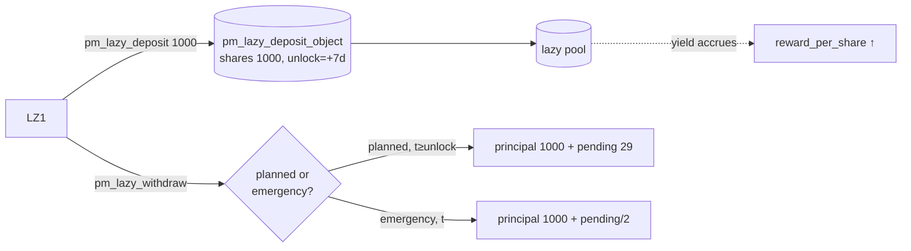

| 退出 | 发送 | 接收 | 净额 |
|------|------|------|------|
| 计划（锁定后） | 1000 存款 | **1000 本金 + ~29 pending** | **+29** |
| 紧急（锁定前） | 1000 存款 | 1000 本金 + (29 − **罚 14**) | **+15** |

`pending = shares × reward_per_share / 1e9`；`penalty = pending × pm_lazy_emergency_penalty_percent 50%`，
它**留在池中**（加到其余人的 `reward_per_share`）。本金永不受罚。**无**按市场操作——分配/回收/杠杆皆自动。池权益
在 **PM 委员会争议**中也计入（vesting-shares 转换）。**核对：** `pm_lazy_deposit_evaluator`、
`pm_lazy_withdraw_evaluator`（紧急分支）。**观察：** `get_lazy_deposit`（`shares`、`principal`、
`pending_rewards`、`unlock_time`）、`get_lazy_pool`。

### 争议者 —— 平反（预言机被翻转）

**disp** 认为预言机的 **A** 有误，提交提议 **B** 的争议，托管 `pm_dispute_fee 1000`，裁决**翻转为 B**。disp 取回
费用**外加**一笔来自预言机被罚没保证金的奖励。

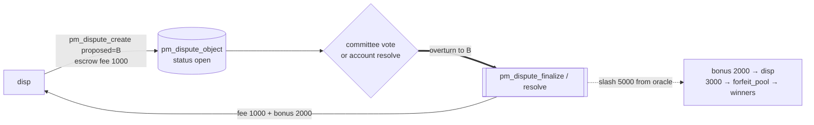

| 结果 | 发送 | 接收 | 净额 |
|------|------|------|------|
| 争议，翻转（「胜」） | dispute_fee **1000** | fee 1000 退回 + **bonus 2000** | **+2000** |

`reward_target = fee × pm_dispute_reward_multiplier (3×) = 3000` → `bonus = 3000 − 1000 = 2000`，**以实际罚没
为上限**；余下（3000）→ `forfeit_pool` → 新赢家。disp 冒险 1000，最终 **+2000**。（委员会模式：disp **不**为自己
投票——由 SHARES 选民投。）**核对：** `pm_dispute_create_evaluator`、`pm_dispute_finalize`/`pm_dispute_resolve`
的 overturn 分支。**观察：** `get_dispute`、`get_dispute_votes`。

### 争议者 —— 没收费用（预言机被维持）

**disp** 争议预言机的 **A**，但裁决**维持预言机**。托管费用**没收给预言机**作为补偿，市场按原裁定结算（A 胜）。

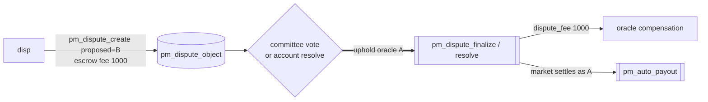

| 结果 | 发送 | 接收 | 净额 |
|------|------|------|------|
| 争议，维持（「负」） | dispute_fee **1000** | **0** | **−1000** |

费用是争议者的利益绑定：错误/轻率的争议向预言机付费。这种不对称（错则失费、对则赢数倍）保持渠道诚实。一个始终
**未决**的争议（预言机沉默 / 无法定人数）被强制关闭并**退还**费用（净 0）——见下文争议自动关闭，与按实质败诉不同。
**核对：** `pm_dispute_finalize`/`pm_dispute_resolve` 的 uphold 分支。**观察：** `get_dispute`、`get_oracle`
（获得费用，`disputes_won++`）。

### 裁决者 —— 委员会（按权益加权，dispute_mode = 0）

*整个 SHARES 选民*以**按权益加权投票**裁决；无单一裁决者账户。裁决在 `voting_end_time` 由 `pm_dispute_finalize`
确定性计票。

**投票权重** = 实时 **`effective_vesting_shares`**（`vesting − delegated + received`）**加上转为 vesting-shares
的懒惰池权益**，因为许多 DAO 成员把 VIZ 停在池里（在那里它是流动的）：

```
pool_claim_viz = pool_NAV × deposit.shares / pool.total_shares
pool_weight    = pool_claim_viz × get_vesting_share_price()
voter_weight   = effective_vesting_shares + pool_weight
```

参与法定人数分母同样是 `total_vesting_shares + (pool_NAV → vesting-shares)`。7 天存款锁防止存款-投票-提取博弈。

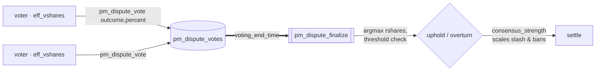

- **发送（投票者）：** `pm_dispute_vote` —— **auth `regular`**。`vote_outcome = -1` 维持，否则提议正确结果；
  `vote_percent ∈ [-10000, 10000]`。投票者在投票开放期间可**任意次修改**选票——重复投票**覆盖**先前的（最新者
  胜，无「Already voted」）。
- **无 commit-reveal —— 刻意，且不会改变。** 委员会争议是**公开听证**：实时计票可见（`get_dispute_votes`），票
  不隐藏。DAO 的价值在于尽可能真实透明地裁决争议；投票中会浮现新论据，投票者*被期望*更新；且投票者**不因**与多数
  一致而**获酬**，故 commit-reveal 通常的反羊群（选美博弈）理由在此不适用。

| 角色 | 发送 | 接收 |
|------|------|------|
| 每位投票者 | 0 | **0** —— 投票是治理职责，非有偿行为 |

投票者从不收代币；影响力是纯权益权重。经济流向按上文争议主账本归于争议者、预言机与下注者。小众市场可能不达门槛 →
落入下文争议自动关闭。**核对：** `pm_dispute_vote_evaluator`（在 `by_market_voter` 上 modify-or-create）；
`pm_dispute_finalize`（`lazy_vote_weight`、`get_vesting_share_price`、法定人数、argmax、`consensus_strength`）。
**观察：** `get_dispute_votes`（实时计票 + finalize 投影：`quorum_percent_bp`、`expected_uphold`、
`expected_outcome`、`expected_consensus_strength_bp`）。测试：`committee_dispute_lazy_pool_voting_weight`、
`committee_dispute_flips_outcome`。

### 裁决者 —— 单账户（中心化，dispute_mode = 1）

市场指名一个 `dispute_resolver` 账户（如监管多签）独自裁决——**无权益权重、无 DAO 投票**。在创建时设定，须与
`oracle` 和 `creator` 都不同（防自裁）。操作集与委员会模式相同；只是*由谁裁决*不同。

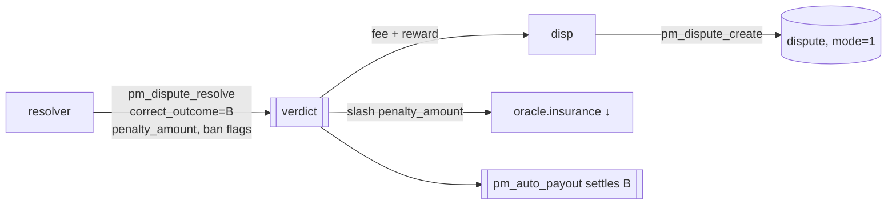

- **发送：** `pm_dispute_resolve` —— **仅指名 `dispute_resolver` 的 `active` auth**：`correct_outcome`、
  `penalty_amount`（待罚没保证金——固定额，**不**按权益缩放）、`ban_oracle`/`ban_creator`（+ `…_until`）。

| 角色 | 发送 | 接收 |
|------|------|------|
| 裁决者 | 0 | **0** —— 中立仲裁者 |

裁决后的规范与委员会模式相同；只是罚没规模不同（裁决者设定的 `penalty_amount`，无 `consensus_strength` 缩放，
因只有一个决策者）。裁决者的 KYC/白名单是**客户端层**事务。**核对：** `pm_dispute_resolve_evaluator`（仅指名裁
决者，`dispute_mode==1`）。**观察：** `get_dispute`、`get_oracle`、**`get_creator_ban(account)`**。

### 争议被强制结束（防冻结自动关闭）

一个始终**未决**的争议——预言机沉默且（委员会）无法定人数——不能永远冻结市场。在 `auto_close_time`，
`pm_dispute_auto_close` 处理器强制结束它：**全员退款**，争议者费用**退还**，无响应的预言机受罚。不选赢家。

```mermaid
flowchart LR
  disp -->|pm_dispute_create<br/>escrow fee 1000| D[(dispute, status open)]
  D -. oracle silent / no quorum .-> WAIT[auto_close_time reached]
  WAIT ==>|VIRTUAL| AC[[pm_dispute_auto_close]]
  AC -->|refund all bets| bettors
  AC -->|fee 1000 back| disp
  AC -->|insurance slash → DAO| orac
```

| 角色 | 发送 | 接收 | 净额 |
|------|------|------|------|
| A / B / C | 下注 | 全额退款 | **0** |
| maker / LP1 | 流动性 | 本金退回 | **0**（无奖励） |
| disp | dispute_fee 1000 | **退回 1000** | **0** |
| orac | 保证金 −罚没 → DAO | — | **− 罚没** |

这**不是**「争议者输了」：退回的费用（净 0）不同于被没收的费用（争议者输家，净 −1000）。无人获利；市场作废以打破
冻结，代价落在未响应的预言机上。同样的作废-退款形态也覆盖 `pm_oracle_missed_penalty` 与 `pm_no_contest`。调校
`pm_dispute_auto_close_sec`（14 天）对 `pm_dispute_vote_period_sec`（3 天），使诚实争议先行解决。**核对：**
`process_pm_markets` 自动关闭扫描（`refund_all_bets` + `return_liquidity` + 费用计入；`disputes_auto_closed++`）。
**观察：** `get_dispute`（状态 → 自动关闭）、`get_market`、`get_oracle`。
