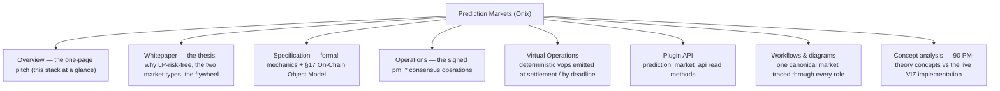

# Prediction Markets on VIZ

VIZ Ledger runs prediction markets as **first-class consensus operations** (`pm_*`), live since HF14.
Two names you will see throughout:

- **Onix** — the **protocol**: the on-chain market engine (CPMM binary + LMSR multi, parimutuel
  zero-sum settlement, bonded oracles, lazy pool, opt-in leverage, batch / commit-reveal betting).
- **Forecaster** — the **thin client** to that protocol on VIZ Ledger. It is a headless, platform-
  independent front-end that lets **people anywhere in the world participate in the on-chain
  prediction market** — create markets, bet, provide liquidity, oracle, and dispute — by signing
  `pm_*` operations directly against public VIZ nodes. The protocol is neutral; Forecaster (and any
  jurisdictional client built like it) is the access layer.

## Documentation map

## Start here

| Page | What it is |
|------|-----------|
| [Guides (по ролям и фичам)](./guides/) | Пояснительные статьи для участников: беттер, создатель рынка, оракул, LP, плечевой трейдер — простым языком. |
| [Overview](./onix) | One-page positioning: AMM-priced parimutuel with structurally risk-free liquidity. |
| [Whitepaper](./whitepaper) | The industry thesis — LP guarantee, Onix Binary (CPMM) + Onix Multi (LMSR), oracles, lazy pool, leverage, governance. |
| [Specification](./specification) | Formal spec: parameters, state machine, pricing, settlement, disputes, lazy pool, leverage, and the **[On-Chain Object Model](./specification#17-on-chain-object-model)** (every `pm_*_object` and its lookup index). |
| [Operations](../protocol/operations/prediction-markets) | The 21 signed consensus operations (`pm_create_market`, `pm_place_bet`, …). |
| [Virtual Operations](../protocol/virtual-operations) | Deterministic virtual ops (`pm_payout`, `pm_market_accepted`, `pm_leverage_resolve`, `pm_batch_settle`, …). |
| [Plugin API](../plugins/prediction-market-api) | `prediction_market_api` — read-only access to markets, bets, oracles, disputes, the lazy pool, and the median-voted parameters. |
| [Workflows & interaction diagrams](./workflows) | One canonical binary market traced through every participant, with the zero-sum master ledger for normal and disputed resolution. |
| [Concept analysis (Onix vs 90 concepts)](./concepts-analysis) | How the on-chain implementation maps onto the prediction-market theory atlas — what's solved, inherent, not needed, or roadmap. |
| [Parlay & system bets (design spec)](./parlay-spec) | Draft consensus primitive: all-or-nothing accumulators priced off the live curves, lazy-pool counterparty, «M of N» systems. Post-mainnet roadmap. |

## Governance

All economic parameters are delegate **median-voted** and live in the `chain_properties_pm` struct —
see [Chain Properties → Prediction-market parameters](../governance/chain-properties#pm-parameters).
There is no hard fork to tune fees, penalties, lazy-pool, leverage, or batch/commit-reveal timing;
three live kill-switches (`pm_commit_reveal_enabled`, `pm_lazy_pool_enabled`, `pm_leverage_enabled`)
let the validator median disable a whole subsystem without a fork.
