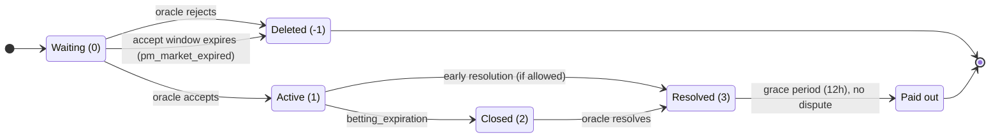

# Onix Protocol Specification

**Version:** 2.0 (on-chain / HF14)
**Status:** Formal technical specification — now realized as consensus operations on VIZ DLT

---

> **On-chain (HF14).** Implemented as first-class consensus operations (`pm_*`) on VIZ DLT and verified in
> `consensus_sim`. **All percentages are basis points (bp): 10000 = 100.00%**; all durations are
> governance parameters in **seconds / blocks**. Median-voted parameters live in the `chain_properties_pm`
> struct (§3); per-market fields are the `pm_create_market` operation; all state is in the chainbase
> objects of §17. Oracle fees use offer→quote (creator ceiling → oracle freezes its quote at accept,
> emitting `pm_market_accepted`). Disputes have two modes — committee (`dispute_mode = 0`, default:
> stake-weighted **public** `pm_dispute_vote`, revisable until close, Lazy-Pool stake counts) and account
> (`dispute_mode = 1`: a named `dispute_resolver`).

## Table of Contents

1. [Definitions and Roles](#1-definitions-and-roles)
2. [Currency and Precision](#2-currency-and-precision)
3. [System Parameters](#3-system-parameters)
4. [Market State Machine](#4-market-state-machine)
5. [Onix Binary: Constant Product Market Maker](#5-onix-binary-constant-product-market-maker)
6. [Onix Multi: LMSR with Parimutuel Settlement](#6-onix-multi-lmsr-with-parimutuel-settlement)
7. [Fee Structure](#7-fee-structure)
8. [Time Penalty for Late Bets](#8-time-penalty-for-late-bets)
9. [Liquidity Provision](#9-liquidity-provision)
10. [Resolution and Payout](#10-resolution-and-payout)
11. [Bet Cancellation](#11-bet-cancellation)
12. [Dispute System](#12-dispute-system)
13. [Oracle Penalty for Missed Resolution](#13-oracle-penalty-for-missed-resolution)
14. [Oracle Reputation Scoring](#14-oracle-reputation-scoring)
15. [Position Transfers](#15-position-transfers)
16. [Lazy Liquidity Pool](#16-lazy-liquidity-pool)
16a. [Opt-In Leverage](#16a-opt-in-leverage-lazy-pool-funded)
16b. [Batch / Commit-Reveal Betting](#16b-batch-commit-reveal-betting-anti-mev)
17. [On-Chain Object Model](#17-on-chain-object-model)

---

## 1. Definitions and Roles

| Role | Definition |
|------|-----------|
| **Market Creator** | Pays `pm_market_creation_fee` (`pm_create_market`); sets the question, outcomes, liquidity, fee ceilings, and timing parameters |
| **Oracle** | Registers (fee: `pm_oracle_registration_fee`), deposits insurance (min: `pm_min_oracle_insurance`), quotes its fee terms in **basis points** (≤ creator ceiling) + fixed fee at acceptance, accepts/rejects markets, provides outcome decisions |
| **Bettor** | Places bets on outcomes; receives tokens proportional to stake and current reserves |
| **Liquidity Provider (LP)** | Supplies capital to market pools; earns time-weighted share of liquidity fees + penalty pool |
| **Lazy Pool Provider** | Deposits VIZ into the Lazy Liquidity Pool with a lock period; pool auto-allocates to markets and distributes rewards via `reward_per_share` accumulator |
| **Dispute Resolver** | Account mode only (`dispute_mode = 1`): the per-market `dispute_resolver` account arbitrates. Committee mode (`dispute_mode = 0`) uses no resolver — the SHARES electorate votes |
| **DAO / committee fund** | The chain's existing committee fund. Receives `pm_market_creation_fee` and extra oracle penalties |

---

## 2. Currency and Precision

All amounts are stored as integers with precision = 1/1000 (milli-VIZ). `1000` internal units = 1.000 VIZ.

Time penalty values use precision = 1/1,000,000 (micro-units).

---

## 3. System Parameters

### Median-voted parameters (`chain_properties_pm`)

All economic parameters are delegate median-voted (no hard fork to tune) and live in the on-chain
`chain_properties_pm` struct. Each delegate publishes its preferred values through the standard
**`versioned_chain_properties_update_operation`** (op ID 46) — `chain_properties_pm` is the current
(v5, HF14) version of that versioned struct — and the network applies the **per-field median** of the
active delegates. The two risk-coverage knobs (`pm_listing_min_coverage_percent`,
`pm_betting_min_coverage_percent`) are part of this same v5 struct and are tuned exactly the same way.
**All percentages are basis points (bp, 10000 = 100.00%); durations are seconds or blocks** — except the
two coverage knobs, which are percent-of-volume (100 = 1.0×). Exact defaults and ranges are in
[Chain Properties](../governance/chain-properties#pm-parameters); the authoritative source is the struct itself.

| Group | Parameters |
|---|---|
| Registration & floors | `pm_oracle_registration_fee`, `pm_min_oracle_insurance`, `pm_market_creation_fee`, `pm_min_liquidity`, `pm_max_outcomes`, `pm_max_market_duration` |
| Fees & penalties (bp) | `pm_max_oracle_fee_percent`, `pm_oracle_penalty_percent`, `pm_no_contest_penalty_percent`, `pm_default_time_penalty_percent`, `pm_max_time_penalty` |
| Acceptance window | `pm_oracle_accept_window_sec` (default 3600 = 1h; pending markets not accepted/rejected within this are voided by the cron — seed refunded, creation fee kept) |
| Risk / coverage (% of volume) | `pm_listing_min_coverage_percent` (250 = 2.5×; markets covered below this are hidden from the default catalog, shown via `show_risky`), `pm_betting_min_coverage_percent` (150 = 1.5×; advisory client risk-confirm threshold, `≤` the listing one, not enforced on-chain) |
| Disputes | `pm_dispute_fee`, `pm_dispute_grace_sec`, `pm_oracle_dispute_response_sec`, `pm_dispute_vote_period_sec`, `pm_dispute_auto_close_sec`, `pm_dispute_approve_min_percent` (bp), `pm_dispute_reward_multiplier` (bp) |
| Lazy pool | `pm_lazy_pool_enabled`, `pm_lazy_alloc_percent`, `pm_lazy_max_total_alloc_percent`, `pm_lazy_recall_step_percent`, `pm_lazy_lock_sec`, `pm_lazy_emergency_penalty_percent`, `pm_lazy_min_liquidity_fee_percent` (default 200 = 2%; pool skips markets whose `liquidity_fee_percent` is below this reward floor) |
| Leverage | `pm_leverage_enabled`, `pm_leverage_fund_percent`, `pm_leverage_max_per_position_bp`, `pm_leverage_max_position_ratio_percent`, `pm_leverage_min_market_liquidity`, `pm_leverage_safety_margin_percent`, `pm_leverage_max_slippage_percent`, `pm_leverage_m_factor_percent`, `pm_leverage_pool_profit_percent`, `pm_leverage_expiration_buffer_sec`, `pm_conversion_profit_cost_percent` |
| Batch / commit-reveal | `pm_commit_reveal_enabled`, `pm_batch_epoch_blocks`, `pm_reveal_window_blocks`, `pm_commit_no_reveal_penalty_percent` (bp), `pm_min_batch_bet` |
| Processing | `pm_processing_cap_per_block` |

The recipient of `pm_market_creation_fee` and extra oracle penalties is the chain's existing committee/DAO
fund — not a PM-specific account.

### Per-market parameters (`pm_create_market` operation)

Set by the creator at creation; the oracle fee fields are a **ceiling** the oracle quotes against at
acceptance (offer→quote). Full field reference: [Prediction Market operations](../protocol/operations/prediction-markets).

| Field | Description |
|---|---|
| `oracle`, `market_type` (0 binary / 1 multi), `outcomes`, `url` | market definition |
| `oracle_fee_percent`, `oracle_fixed_fee` | oracle fee **ceiling** (bp + fixed); the oracle freezes its quote ≤ this (and ≤ median `pm_max_oracle_fee_percent`) at accept |
| `creator_fee_percent`, `liquidity_fee_percent` | creator & LP fees (bp of the losers' pool) |
| `liquidity`, `lmsr_b` | seed liquidity; `lmsr_b` for multi markets |
| `betting_expiration`, `result_expiration` | timers |
| `time_penalty_type`, `time_penalty_value`, `penalty_curve_type` | late-bet penalty shape |
| `allow_early_resolution`, `allow_cancellation` | toggles |
| `allow_batch`, `allow_instant_bet` | betting modes (binary) |
| `endogeneity_tier` | 1 econ-data / 2 sports / 3 political (display/risk hint) |
| `dispute_mode` (0 committee / 1 account), `dispute_resolver` | dispute routing |
| `dispute_penalty_percent` | oracle penalty policy on a successful dispute (bp, signed) |
| `metadata` | free-form client JSON (consensus-opaque; parsed off-chain) |

---

## 4. Market State Machine

### States

| Status | Name | Description |
|--------|------|-------------|
| -1 | Deleted | Oracle rejected, **or** the acceptance window (`pm_oracle_accept_window_sec`) expired; seed liquidity returned to creator (creation fee kept) |
| 0 | Waiting | Awaiting oracle review |
| 1 | Active | Accepting bets until `betting_expiration` |
| 2 | Closed | Betting ended, awaiting oracle resolution |
| 3 | Resolved | Outcome determined, payouts calculated |

### Payout States

| payout_status | Name | Description |
|---------------|------|-------------|
| 0 | Not calculated | Pre-resolution |
| 1 | Calculated | Payouts pending (grace period active) |
| 2 | Paid | All payouts processed |
| 3 | Disputed | Dispute filed, payouts frozen |

### Transitions



**Preconditions:**

| Transition | Preconditions |
|-----------|---------------|
| 0 → 1 | Oracle has insurance ≥ `min_oracle_insurance`; oracle accepts |
| 0 → 1 (self-oracle) | Creator = oracle; insurance check; auto-approves at creation |
| 0 → -1 | Oracle rejects; seed liquidity returned to creator |
| 0 → -1 (expiry) | `now ≥ created_time + pm_oracle_accept_window_sec` with no oracle action; cron voids the market, refunds the seed (creation fee kept), emits `pm_market_expired` |
| 1 → 3 | Oracle submits resolution with outcome (0, 1, or -1 for no-contest); `allow_early_resolution=1` or `time ≥ betting_expiration` |
| 2 → 3 | Oracle submits resolution; `time ≤ result_expiration` |
| 3 → paid | Grace period passed with no dispute; cron processes payouts |

### Market Creation Flow

1. Deduct `market_creation_fee` from creator → DAO fund (non-refundable)
2. Record `oracle_fixed_fee` from oracle profile on market
3. Lock `liquidity` from creator balance
4. Initialize reserves: `reserve_a = floor(liquidity/2)`, `reserve_b = liquidity − reserve_a`
5. Compute `k = reserve_a × reserve_b`
6. If self-oracle: auto-approve to status=1 with insurance check
7. If external oracle: enter status=0 and set `accept_deadline = created_time + pm_oracle_accept_window_sec`

### Oracle Acceptance Flow

A pending market must be resolved by its oracle within the acceptance window
(`pm_oracle_accept_window_sec`, default 1h). Three outcomes:

- **Accept** (status 0 → 1): (1) transfer `oracle_fixed_fee` from creator to oracle (skipped if
  self-oracle); (2) increment oracle `markets_accepted`; (3) update `last_active_time`; (4) trigger
  Lazy Pool auto-allocation (if the pool has free balance **and** the market's `liquidity_fee_percent
  ≥ pm_lazy_min_liquidity_fee_percent`).
- **Reject** (status 0 → -1): seed liquidity refunded to creator; no vop.
- **Expiry** (status 0 → -1): if neither happens by `accept_deadline`, the per-block cron voids the
  market, refunds the seed liquidity (**not** the creation fee), and emits `pm_market_expired`.

### Audit Trail

Every state-changing action is a consensus operation or virtual operation, permanently recorded in the block log and queryable via `account_history`. Bets, cancels, liquidity add/withdraw, accept/reject, resolution, dispute, dispute-resolve, payout, and penalty all appear as `pm_*` operations/virtual-operations, alongside the market reserves they touched.

---

## 5. Onix Binary: Constant Product Market Maker

### Invariant

```
k = reserve_a × reserve_b
```

`k` changes only on liquidity add/withdraw operations.

### Bet Placement (side A)

```
new_reserve_b = reserve_b + amount
new_reserve_a = floor(k / new_reserve_b)
tokens_received = reserve_a − new_reserve_a
price = amount × 1,000,000 / tokens_received
```

Symmetric for side B (swap a/b).

### Slippage Protection

Optional `min_tokens` parameter on `place-bet`. If `tokens_received < min_tokens`, transaction rejected.

### Market Initialization

```
reserve_a = floor(liquidity / 2)
reserve_b = liquidity − reserve_a
k = reserve_a × reserve_b
```

Minimum initial liquidity: 100,000 mVIZ (100 VIZ).

### Weight (Token) Semantics

- `weight` = number of outcome tokens received by bettor (set by the CPMM at bet time)
- `weight` is a **relative claim**, not a VIZ-denominated payout. Settlement is **parimutuel** (identical to Onix Multi): winners receive their stake back plus a proportional share of the losers' pool, by weight.
- If bet on side A and outcome A wins: `payout = bet_amount + (weight / total_winning_weight) × winners_pool − time_penalty_on_profit`
- If outcome A loses: payout = 0 (stake forfeited into the winners' pool)

CPMM is the **pricing engine** (probability + weight assignment); it no longer gates payout. This makes the two market types share one settlement model: *the AMM assigns weights (CPMM for binary, LMSR for multi); losers fund winners pro-rata by weight.*

### Price Display

```
implied_probability_A = reserve_b / (reserve_a + reserve_b) × 100%
implied_probability_B = reserve_a / (reserve_a + reserve_b) × 100%
```

### LP Principal Guarantee (Proof)

Under parimutuel settlement the guarantee is exact and does not rely on the curve geometry:

```
Money OUT = L (LP principal) + Σ(winning bet_amount) + winners_pool + fees
          = L + winning_bets + (losers_sum − fees) + fees
          = L + winning_bets + losing_bets = L + all_bets = Money IN
```

Total payout is capped at `losers_sum` regardless of weights, so LP principal `L` is returned unconditionally and winners are funded entirely by losers. (The legacy AM-GM bound `reserve_a + reserve_b ≥ L` is no longer needed for solvency; it remains a property of the pricing curve.)

---

## 6. Onix Multi: LMSR with Parimutuel Settlement

### Price Function (Softmax)

For N outcomes with quantity parameters q_1, ..., q_N and liquidity parameter b:

```
price(i) = exp(q_i / b) / Σ_j exp(q_j / b)
```

**Invariant:** `Σ_i price(i) = 1` (by definition of softmax).

### Cost Function

```
C(q) = b × ln(Σ_j exp(q_j / b))
```

Cost to buy Δ tokens on outcome i:

```
cost = C(q + Δ·e_i) − C(q)
     = b × [ln(Σ_j exp(q'_j / b)) − ln(Σ_j exp(q_j / b))]
where q'_i = q_i + Δ, all other q'_j = q_j
```

Numerical stability (log-sum-exp trick):

```
ln(Σ exp(x_j)) = max(x) + ln(Σ exp(x_j − max(x)))
```

### Liquidity Parameter

```
b = S / ln(N)
```

where S = LP subsidy deposit, N = number of outcomes.

### Settlement (at resolution)

```
1. Oracle declares winning outcome
2. losers_sum = Σ bet_amount for all non-winning bets
3. oracle_fee  = floor(losers_sum × oracle_fee_percent / 10000)
4. creator_fee = floor(losers_sum × creator_fee_percent / 10000)
5. liq_fee     = floor(losers_sum × liquidity_fee_percent / 10000)
6. winners_pool = losers_sum − oracle_fee − creator_fee − liq_fee
7. For each winning bettor:
   payout = bet_amount + (their_tokens / total_winning_tokens × winners_pool) − time_penalty
8. LP subsidy returned unconditionally
9. LP earns time-weighted share of liq_fee
```

### LP Principal Guarantee (Proof)

1. LP deposits S VIZ as subsidy. This sets b = S / ln(N).
2. During betting, users pay VIZ → receive tokens. VIZ accumulates as betting pool.
3. At resolution: losers forfeit 100% → `losers_sum`. Winners paid from `losers_sum` (not from subsidy).
4. LP subsidy S returned **unconditionally** — it is architecturally separate from the payout flow.

### Edge Cases

| Scenario | Outcome |
|----------|---------|
| All bets on winning outcome | `losers_sum=0`, `winners_pool=0`. Every bettor gets back `bet_amount`. LP subsidy returned. |
| No bets on winning outcome | `losers_sum=total_bets`. Undistributed `winners_pool` → LP bonus. |
| Zero-volume market | LP subsidy returned. No fees, no payouts. |
| Single bettor wins | Bettor receives `bet_amount + winners_pool`. LP subsidy returned. |

### Operations

| Operation | Description |
|-----------|-------------|
| `pm_create_market_multi { oracle, outcomes, liquidity, fees, ... }` | Create N-outcome market |
| `pm_place_bet_multi { market, outcome_index, amount, min_tokens }` | Buy tokens for outcome |
| `pm_cancel_bet_multi { bet_id, min_return }` | Sell tokens back via reverse LMSR |
| `pm_add_liquidity_multi { market, amount }` | Add LP subsidy (increases b) |
| `pm_withdraw_liquidity_multi { liquidity_id }` | Withdraw LP subsidy (min floor enforced) |
| `pm_resolve_multi { market, winning_outcome }` | Oracle declares winner, triggers settlement |

Binary markets (N=2) use Onix Binary (CPMM). LMSR used only for N > 2.

---

## 7. Fee Structure

### Resolution-Time Fee Computation

All percentage fees computed at resolution from **losing side's total volume**:

```
losers_sum = Σ bet_amount for all losing bets

oracle_fee   = floor(losers_sum × oracle_fee_percent / 10000)
creator_fee  = floor(losers_sum × creator_fee_percent / 10000)
liquidity_fee = floor(losers_sum × liquidity_fee_percent / 10000)
winners_pool = losers_sum − oracle_fee − creator_fee − liquidity_fee
```

Fees are NOT deducted from bets at placement time. Full bet amount enters CPMM/LMSR reserves.

### Oracle Fixed Fee

One-time fee per market. Set by oracle on profile. Paid by creator to oracle at market acceptance. Skipped entirely for self-oracle markets (no balance operation occurs).

### Fee Tracking Fields

- `oracle_fee_earned` — not used at resolution; fee computed from losers_sum
- `liquidity_fee_earned` — cumulative LP fees already paid to early-withdrawn LPs; at resolution: `LP fee pool = max(0, floor(losers_sum × liquidity_fee_percent / 10000) − liquidity_fee_earned) + penalty_pool`
- Per-bet `oracle_fee` and `liquidity_fee` recorded for audit; not accumulated on market

### Rounding

All calculations use `floor()`. Undistributed dust (< 1 mVIZ) sent to DAO fund during final payout.

---

## 8. Time Penalty for Late Bets

### Penalty Window

| Type | Window Calculation |
|------|-------------------|
| Fixed (type=0) | `penalty_window = time_penalty_value` seconds before expiration |
| Percentage (type=1) | `penalty_window = time_penalty_value / 100 × (betting_expiration − market_creation_time)` |

### Penalty Calculation

```
time_to_expiration = betting_expiration − current_time

if time_to_expiration < penalty_window:
    ratio = 1 − (time_to_expiration / penalty_window)

    if penalty_curve_type == 1:    // quadratic
        penalty_ratio = ratio × ratio
    else:                          // linear
        penalty_ratio = ratio

    time_penalty = floor(penalty_ratio × max_time_penalty)
else:
    time_penalty = 0
```

### Application at Payout (Profit-Only)

```
profit = floor(winners_pool × weight / total_winning_weight)   // parimutuel share of losers' pool
penalty_deduction = floor(profit × time_penalty / 1,000,000)
net_payout = bet_amount + profit − penalty_deduction
```

**Invariant:** `net_payout ≥ bet_amount` — the penalty applies only to the profit share, so winners always receive at least their principal. (Identical for Onix Binary and Onix Multi.)

### Risk-Time Source

`time_penalty` is computed once, when the bet is created, from the moment the market exposure was
actually taken — not from later mechanics:

| Path | `risk_time` used |
|------|------------------|
| Instant / direct batch bet (`pm_place_bet`) | placement time |
| Commit–reveal (`pm_reveal_bet`) | the **commit** time (blind), so revealing late within the window is not penalised |
| Converted leverage position (`pm_leverage_convert`) | the leverage **open** time (opens are gated ≥24 h before expiry) |
| Transferred position (`pm_transfer_position`) | **inherited** from the source bet |

A market with `time_penalty_value = 0` (the default) has no window — the penalty is always 0 and the
mechanism is dormant until a creator opts in. Open-ended markets (no `betting_expiration`) never apply it.

---

## 9. Liquidity Provision

### Adding Liquidity

```
// Price-neutral: scale both reserves by (L + amount) / L, where L = liquidity_sum
// BEFORE the deposit. The reserve ratio (the odds) is unchanged — only depth grows,
// linearly with capital (k scales by ((L+amount)/L)²). A first deposit into an empty
// curve (L = 0) seeds a balanced 50/50 split, as at market genesis.
factor        = (liquidity_sum + amount) / liquidity_sum
new_reserve_a = floor(reserve_a × factor)
new_reserve_b = floor(reserve_b × factor)
new_k         = new_reserve_a × new_reserve_b
```

Records `sec_to_expiration = betting_expiration − current_time` at deposit time.

### Time-Weighted Fee Distribution (at resolution)

```
fee_pool = remaining_liquidity_fee + total_penalty_pool

weight_i = amount_i × max(1, sec_to_expiration_i)
total_weight = Σ weight_i
fee_share_i = floor(fee_pool × weight_i / total_weight)
lp_payout_i = principal_i + fee_share_i
```

Each deposit is an independent position. Multiple deposits by the same user are tracked separately.

### Early Withdrawal

**Preconditions:** market live (`status < 2`) and betting still open (`time < betting_expiration`, or an open-ended market with no deadline); `resulting liquidity_sum ≥ pm_min_liquidity`. Once betting closes the position is locked until resolution (see below).

```
// Price-neutral: shrink both reserves by (L − withdraw_amount) / L, where L =
// liquidity_sum BEFORE the withdrawal. Mirror of the proportional add — the reserve
// ratio (the odds) is unchanged, depth falls with capital, and an add→withdraw
// round-trip of the same amount leaves the curve untouched.
factor        = (liquidity_sum − withdraw_amount) / liquidity_sum
new_reserve_a = floor(reserve_a × factor)
new_reserve_b = floor(reserve_b × factor)
new_k         = new_reserve_a × new_reserve_b

// Time-ratio discount
time_served = current_time − lp_deposit_time
market_duration = betting_expiration − market_creation_time
time_ratio = min(1, time_served / market_duration)

// Fee share (conservative: min of both sides)
fee_from_a = floor(a_bets_sum × liquidity_fee_percent / 10000)
fee_from_b = floor(b_bets_sum × liquidity_fee_percent / 10000)
estimated_pool = min(fee_from_a, fee_from_b) − already_paid_to_early_lps
lp_tw = withdraw_amount × max(1, sec_to_expiration)
total_tw = Σ (active LP time-weights)
raw_fee_share = floor(estimated_pool × lp_tw / total_tw)
fee_share = floor(raw_fee_share × time_ratio)

returned = withdraw_amount + fee_share
```

**Post-expiration lock:** LP withdrawal blocked when `time ≥ betting_expiration`. All LP positions locked until resolution.

### Principal Safety on Early Withdrawal

Withdrawal subtracts original `weight_a` and `weight_b` (not proportional share of current reserves). If `reserve_a < weight_a` or `reserve_b < weight_b`, withdrawal is **blocked**.

### Creator as First LP

Market creator is automatically the first LP. Their `sec_to_expiration` equals the full market duration, giving maximum time-weight.

---

## 10. Resolution and Payout

### Payout Priority Order

| Priority | Type | Recipient | Amount |
|----------|------|-----------|--------|
| 1 | Oracle fee (2) | Oracle | `floor(losers_sum × oracle_fee_percent / 10000)` |
| 1.5 | Creator fee (7) | Creator | `floor(losers_sum × creator_fee_percent / 10000)` |
| 2 | Creator LP (1) | Creator | `principal + time-weighted fee share` |
| 3 | LP return (1) | LPs | `principal + time-weighted fee share` |
| 4 | Winner bets (0) | Winners | `bet_amount + floor(winners_pool × weight / total_winning_weight) − penalty_deduction` (parimutuel) |
| 5 | Dispute refund (5) | Dispute participants | (if applicable) |
| 6 | Oracle penalty bonus (6) | All participants | (if oracle penalized) |

### Losing Side

Payout = 0. Stakes absorbed into reserve pool.

### Zero-Volume Markets

LPs receive full principal. Oracle receives fixed fee (if any). All fee accumulators remain 0.

---

## 11. Bet Cancellation

### Preconditions

| Condition | Check |
|-----------|-------|
| Bet is active | `bet.status == 0` |
| User owns bet | `bet.user == current_user.id` |
| Market active | `market.status == 1` |
| Betting open | `current_time < market.betting_expiration` |
| Cancellation allowed | `market.allow_cancellation == 1` |

### Reverse CPMM Mechanics

For bet on side A (side=0):

```
new_reserve_a = reserve_a + tokens
new_reserve_b = floor(k / new_reserve_a)
amount_returned = reserve_b − new_reserve_b
if amount_returned <= 0: amount_returned = 0
```

Symmetric for side B.

### Slippage Protection

Optional `min_return` parameter. If `amount_returned < min_return`, transaction rejected.

### State Changes (atomic)

1. Bet status → 1 (cancelled), `returned_amount` recorded
2. Market reserves updated
3. Market bet sums decremented by original bet amount
4. User balance increased by `amount_returned`, `bets_balance` decreased
5. History entry (type=4) logged
6. Market log entry with before/after reserves

---

## 12. Dispute System

### Filing Preconditions

- Filer has placed a bet on the market
- Within `pm_dispute_grace_sec` after resolution
- Routing by mode: **committee** (`dispute_mode = 0`) — no resolver account needed, the SHARES electorate votes via `pm_dispute_vote` (public, revisable until `voting_end_time`, weight = `effective_vesting_shares` + Lazy-Pool stake→shares), tallied by the `pm_dispute_finalize` cron; **account** (`dispute_mode = 1`) — the market's named `dispute_resolver` issues `pm_dispute_resolve`
- No open dispute on market
- Filer pays `pm_dispute_fee`

### Oracle Response

Mandatory within `pm_oracle_dispute_response_sec`. If missed, `pm_dispute_fee` is auto-slashed from insurance and recorded on the oracle object.

The oracle posts its rebuttal with **`pm_dispute_oracle_respond`** (op ID 98). Because a dispute is an open public hearing, the text is stored **on the dispute object** (`oracle_response` + `oracle_response_time`, readable via `get_dispute`) so every committee voter or account resolver can weigh it before deciding. Only the market's oracle may respond, only while the dispute is open and `now ≤ oracle_response_deadline`; re-posting overwrites the previous response.

### Dispute Lifecycle

```
Resolution (T=0) → Grace period (T to T+12h) → Dispute filed (T≤12h)
  → Oracle response (12h window) → Resolver decision (up to 14 days)
  → After verdict: recalculate or unfreeze → Auto-payout after new grace period
  → Auto-close fallback (T+14 days): full refund + oracle penalty
```

### Dispute Upheld (Oracle Wrong — overturned)

The disputer's reward is a carve-out of the slash; the **rest of the slash funds the winning bettors**
(via `forfeit_pool`), not a resolver and not the DAO. **Neither the committee voters nor the account-mode
resolver are paid** — voting/resolving is an unpaid duty.

```
reward_target = floor(dispute_fee × pm_dispute_reward_multiplier / 10000)   // bp; 30000 = ×3
bonus         = max(0, reward_target − dispute_fee), capped at the slash

1. Disputer ← dispute_fee (escrow returned) + bonus     // bonus drawn from the slashed insurance
2. forfeit_pool += (slash − bonus)                      // → winners, through winners_pool at settlement
```

Slash size: committee mode scales the oracle's `dispute_penalty_percent` by `consensus_strength`; account
mode uses the resolver's `penalty_amount` (both capped at the remaining insurance).

### Dispute Rejected (Oracle Right — upheld)

```
Disputer forfeits the whole dispute_fee → oracle (100%, compensation).   // no resolver/DAO split
```

### Recalculation Process (Oracle Wrong)

1. Validate penalty (capped at remaining insurance)
2. Disputer reward (fee + bonus) paid; slash remainder → `forfeit_pool` (winners)
3. Oracle insurance slashed
5. Bans applied (if requested)
6. Delete all existing non-paid payouts
7. Flip winning outcome (A↔B)
8. Regenerate payouts from scratch with corrected outcome
9. Audit trail recorded

### Resolver Powers — bans are a compliance/regulator feature (account mode only)

The sanctions below are fields of the **account-mode** `pm_dispute_resolve` (op ID 80), issued by the
market's named `dispute_resolver`. When that resolver is a **regulator or a licensed arbitrator**, this is
how it enforces off-chain rules: in a single verdict it can slash insurance **and bar both the oracle and
the market creator** from the platform, temporarily or permanently. **Committee/DAO mode
(`dispute_mode = 0`) has no ban power by design** — a public hearing only slashes insurance (scaled by
consensus strength) and adjusts reputation via `pm_dispute_finalize`; it never bans.

| Parameter | Type | Description |
|-----------|------|-------------|
| `penalty_amount` | mVIZ | Additional insurance slash (0 to remaining) → DAO fund |
| `ban_oracle` | 0/1 | Ban oracle |
| `ban_oracle_until` | unix ts / 0 | 0=permanent, >0=expires |
| `ban_creator` | 0/1 | Ban creator |
| `ban_creator_until` | unix ts / 0 | 0=permanent, >0=expires |

A ban records the issuing `resolver` in the target's `banned_by`. **Lifting a ban:** the same resolver
may lift it **early** with **`pm_unban`** (op ID 99, `unban_oracle` / `unban_creator`); otherwise it simply
lapses at `banned_until`, at which point the per-block cron clears it and emits the **`pm_ban_expired`**
virtual op (ID 100) so history/indexers observe the lift.

### Auto-Close (14-day fallback)

| Action | Description |
|--------|-------------|
| Plaintiff | Dispute fee refunded |
| Oracle | `dispute_fee` slashed from insurance |
| Bets | All refunded (original amounts) |
| LPs | All refunded (principal only) |
| Penalty distribution | Slashed amount distributed proportionally to all participants |
| Dispute status | Set to 3 (auto-closed) |

### No-Contest Declaration

Oracle calls `oracle-no-contest` with `market_id` and `reason`.

1. All bets → pending refund payouts (full original amount)
2. All LP positions → pending refund payouts (principal only)
3. Penalty: `oracle_no_contest_penalty_percent`% of `dispute_fee` from insurance
4. Penalty distributed proportionally to participants
5. Market: `resolved_outcome = -1`, `payout_status = 1`
6. Grace period starts (disputable)

### 3-Outcome Resolution (No-Contest Dispute)

Resolver chooses one of:
- `correct_outcome = 0` — A wins (recalculate payouts)
- `correct_outcome = 1` — B wins (recalculate payouts)
- `correct_outcome = -1` — Confirm no-contest (keep refund payouts)

If oracle wrong: pending refund payouts deleted, replaced with correct winner payouts. Standard dispute penalties apply.

---

## 13. Oracle Penalty for Missed Resolution

If oracle fails to resolve by `result_expiration`:

```
penalty_amount = floor(oracle_insurance × oracle_penalty_percent / 100)
```

### Distribution

```
stakes[user_id] += bet_amount       (for each active bet)
stakes[user_id] += liquidity_amount (for each active LP position)
total_stakes = Σ stakes[user_id]

bonus_i = floor(penalty_amount × stakes[user_id] / total_stakes)
```

Each participant receives: full refund (principal) + proportional bonus.

Market finalized: status=3, payout_status=2.

---

## 14. Oracle Reputation Scoring

### Raw Metrics (14 counters per oracle)

| Metric | Type | Source |
|--------|------|--------|
| `markets_accepted` | counter | oracle-accept-market |
| `markets_resolved` | counter | resolve-market |
| `markets_no_contest` | counter | oracle-no-contest |
| `markets_missed` | counter | cron (missed deadline) |
| `disputes_received` | counter | create-dispute |
| `disputes_lost` | counter | resolve-dispute (status=1) |
| `disputes_won` | counter | resolve-dispute (status=2) |
| `disputes_auto_closed` | counter | cron (14-day auto-close) |
| `dispute_responses_missed` | counter | cron (12h response deadline) |
| `total_volume_resolved` | mVIZ | resolve-market (sum of bets_sum) |
| `total_insurance_slashed` | mVIZ | all penalty events |
| `avg_resolution_time` | seconds | resolve-market |
| `bans_received` | counter | resolve-dispute |
| `active_since` | timestamp | register-oracle |
| `last_active_time` | timestamp | accept/resolve/no-contest |

### Derived Rates

Denominator: `total_outcomes = markets_resolved + markets_no_contest + markets_missed`

| Rate | Formula |
|------|---------|
| `resolution_rate` | `markets_resolved / total_outcomes` |
| `dispute_loss_rate` | `disputes_lost / disputes_received` |
| `no_contest_rate` | `markets_no_contest / total_outcomes` |
| `deadline_miss_rate` | `markets_missed / total_outcomes` |
| `dispute_response_rate` | `1 − (dispute_responses_missed / disputes_received)` |

### Reliability Score (0–100)

```
reliability_score = clamp(0, 100,
    BASE_SCORE
    − W_DISPUTE_LOSS   × dispute_loss_rate    × 100
    − W_NO_CONTEST     × excess_no_contest    × 100
    − W_DEADLINE_MISS   × deadline_miss_rate   × 100
    − W_NO_RESPONSE     × (1 − dispute_response_rate) × 100
    + W_VOLUME_BONUS    × volume_tier
    + W_EXPERIENCE      × experience_tier × freshness_multiplier
    − W_BAN_PENALTY     × bans_received
)
```

Where `excess_no_contest = max(0, no_contest_rate − 0.10)`.

### Weight Defaults

| Weight | Value |
|--------|-------|
| BASE_SCORE | 50 |
| W_DISPUTE_LOSS | 0.40 |
| W_NO_CONTEST | 0.10 |
| W_DEADLINE_MISS | 0.20 |
| W_NO_RESPONSE | 0.15 |
| W_VOLUME_BONUS | 0–25 (tiered: ≥10K→+5, ≥100K→+10, ≥500K→+15, ≥1M→+20, ≥5M→+25) |
| W_EXPERIENCE | 0–25 (tiered: ≥7d→+5, ≥30d→+10, ≥90d→+15, ≥180d→+20, ≥365d→+25) |
| W_BAN_PENALTY | 15 per ban |

### Freshness Decay

| Days since last active | Multiplier |
|----------------------|-----------|
| ≤ 30 | 1.00 |
| 31–90 | 0.75 |
| 91–180 | 0.50 |
| > 180 | 0.25 |

### Composite Trust Score

```
trust_score = reliability_score × risk_factor
```

| Risk score (insurance/bets) | risk_factor |
|---------------------------|-------------|
| ≥ 3.0× | 1.00 |
| ≥ 2.0× | 0.95 |
| ≥ 1.0× | 0.85 |
| < 1.0× | 0.70 |

### New Oracle Detection

`total_outcomes < 5` → `is_new = true`. Distinct badge in UI.

Score computed on read via `compute_oracle_reliability_score()`, not stored.

---

## 15. Position Transfers

### Operation

```
pm_transfer_position { bet_id, to_user, amount, memo }
```

- Transfer all or part of a bet's tokens to another account
- Transferred tokens retain original market and outcome
- Payout goes to current holder at resolution
- No slippage, no market impact — pure record reassignment
- Works for both Onix Binary and Onix Multi positions

### Memo Privacy Model

| Mode | Format | Visibility |
|------|--------|------------|
| Plaintext | String not starting with `#` | Public on-chain |
| Encrypted | String starting with `#` | Private — only sender and recipient can decrypt |

Encryption: ECIES shared-secret `ECDH(sender_memo_private, recipient_memo_public)` using VIZ account memo keys (standard Graphene model). Client-side encryption/decryption.

---

## 16. Lazy Liquidity Pool

### Parameters

| Median-voted parameter | Role |
|---------|-------------|
| `pm_lazy_pool_enabled` | pool kill-switch |
| `pm_lazy_alloc_percent` | share of free balance allocated per market (bp) |
| `pm_lazy_max_total_alloc_percent` | cap on the pool fraction across active markets (bp) |
| `pm_lazy_recall_step_percent` | graduated-recall step on idle markets (bp) |
| `pm_lazy_lock_sec` | deposit lock period (seconds) |
| `pm_lazy_emergency_penalty_percent` | penalty on locked profit for emergency withdrawal (bp) |
| `pm_lazy_min_liquidity_fee_percent` | minimum market `liquidity_fee_percent` (bp) for the pool to allocate; below it the market gets no pool liquidity (reward floor) |
| `pm_min_liquidity` | minimum allocation per market (also the market seed floor) |

### Deposit

- First depositor: `shares = amount`
- Subsequent: `new_shares = amount × total_shares / free_balance`
- Lock timer: `unlock_time = now + pm_lazy_lock_sec`
- Reward settlement before share calculation: `pending += shares × (pool.rps − user.snapshot) / PRECISION`

### Auto-Allocation

On market activation (status → 1):

```
alloc_amount = free_balance × allocation_percent / 100
× (1 − active_market_penalty_pct / 100) ^ oracle_active_market_count
× (1 − fault_penalty_pct / 100) ^ oracle_active_fault_stamps
```

Reward-floor gate (checked first): if the market's `liquidity_fee_percent <
pm_lazy_min_liquidity_fee_percent`, the pool allocates **nothing** — it only subsidizes markets whose
LP fee pays it enough. The creator's own seed remains the sole liquidity.

Checks: `alloc_amount ≥ min_market_allocation`, `allocated + alloc_amount ≤ total × max_total_allocation / 100`.

Pool LP inserted with `user=0`. Participates identically in time-weighted fee distribution.

### Reward Distribution (Lazy Accounting)

On market resolution with pool LP profit:

```
profit = lp_return − allocation_amount
if profit > 0 AND total_shares > 0:
    pool.reward_per_share += profit × PRECISION / total_shares
```

User reward (computed on read):

```
live_reward = pending_rewards + shares × (pool.rps − user.snapshot) / PRECISION
```

### Planned Withdrawal

From consolidated unlocked record (full or partial):

```
1. Run unlock consolidation
2. Settle rewards: pending += shares × (rps − snapshot) / PRECISION
3. Share value = shares_to_burn × free_balance / total_shares
4. Reward portion = pending_rewards × withdraw_percent / 100
5. Total payout = share value + reward portion
```

### Emergency Withdrawal

All deposits (locked + unlocked):

```
1. Settle rewards
2. total_value = shares × free_balance / total_shares + pending_rewards
3. profit = total_value − principal_deposited
4. if profit > 0: penalty = profit × (locked_shares / total_shares) × emergency_penalty / 100
5. Penalty → pool reward_per_share
6. User receives: total_value − penalty
```

### Opportunity-Cost Protection

> **Governance vs. fixed.** Only the recall **step size** is median-voted — `pm_lazy_recall_step_percent`
> (how much is pulled per idle step). The rest is **hardcoded** and needs a hardfork to change: the
> **10-step** division (`window/10`, `check_step ≥ 10`), the idle test (a step is idle when *no new bets*
> arrived since the last check — `bets_sum ≤ bets_sum_at_check`), and the **5% per-active-market penalty**
> (`alloc × 95/100`). The fault-stamp penalty and its expiry window are likewise hardcoded.

**A. Graduated Recall:** Market duration divided into **10 fixed steps**. At each step, if **no new bets** arrived since the last check, recall `pm_lazy_recall_step_percent` (bp, governance) of the current allocation back to the pool.

**B. Active Market Penalty:** `factor = (1 − 5% ) ^ active_market_count` — a hardcoded recursive 5% reduction per concurrent active market from the same oracle.

**C. Fault Stamps:** On bad market outcomes (no-contest, missed deadline, zero volume, dispute loss, no response, auto-close), the oracle gets a fault stamp that auto-expires after a fixed clean-operation window; each active stamp further reduces its allocation. (Penalty size + expiry are hardcoded.)

---

## 16a. Opt-In Leverage (Lazy-Pool-Funded)

Live since HF14; opt-in, governed by median kill-switch `pm_leverage_enabled` (default off).

- **Open** (`pm_leverage_open`) — a bettor posts collateral; the Lazy Pool **loans** the margin from
  `free_balance` (capped by `leverage_fund_used`; checked against `pm_leverage_fund_percent`,
  `…_max_per_position_bp`, `…_max_position_ratio_percent`, `…_min_market_liquidity` at open time). No
  token emission — the position is fully collateralized from the system's view. A leveraged open does
  **not** create a `pm_bet`; the curve weight is held on the `pm_leverage_position_object`.
- **Liquidation** — runs against **pre-bet reserves** so the pool recovers `min(cancel_value,
  obligation) ≥ loan`: opposing-bet cascade (`pm_place_bet`) and settlement force-close are always
  full-recovery (loan + interest → pool); the **only** bounded bad-debt path is a same-side
  `pm_cancel_bet` (Case B). The cascade is **not** gated by `pm_leverage_enabled` (the flag blocks only
  new opens), so disabling leverage never strips protection from open positions.
- **Exit residual → `forfeit_pool`** — on close/liquidate the holder is paid the floored
  `cancel_value`; the sub-mVIZ remainder `curve_residual = total_bet − cancel_value` is **dust of the
  pool's own curve assets**, so it is routed to the market's `forfeit_pool` (accrues to the remaining
  bettors at settlement), not the DAO fund. This keeps `pool + bettor + residual = total_bet` exact on
  every exit (fix `6b002c14`; the general final-payout dust rule above still sends to the DAO fund).
- **Close timing (does NOT wait for the oracle)** — a leveraged position is a bet on the market
  *price* (crowd sentiment), settled at its `cancel_value`; it is independent of the resolved
  outcome. So `process_pm_markets` **force-closes it the moment new betting is impossible**: at
  `betting_expiration` for fixed-deadline markets (i.e. *before* the oracle resolves), or at
  resolve/void (`status >= 3`) for open-ended markets (`betting_expiration == 0`). The holder never
  bleeds funding, and can never be funding-liquidated, during the post-betting resolve + dispute
  window. `settle_market` / `return_liquidity` still force-close as an idempotent backstop.
- **Virtual ops** — `pm_leverage_resolve` (force-close at settlement, with outcome + leverage),
  `pm_leverage_liquidate` (mid-market, `reason` 0 opposing / 1 cancel).
- **Governance weight** — Lazy-Pool depositors keep their PM-dispute and DAO-committee vote weight
  (pool NAV → vesting-shares via `get_vesting_share_price`, HF14-gated).

API: `get_account_leverage_positions`, `get_market_leverage_positions`, `get_lazy_pool`.

## 16b. Batch / Commit-Reveal Betting (anti-MEV)

Live since HF14 for **binary** markets (multi forces `allow_instant_bet` until LMSR batch lands);
opt-in per market (`allow_batch` / `allow_instant_bet`), median kill-switch `pm_commit_reveal_enabled`.

- `pm_place_bet` with `mode = 1` queues a **batch** bet; `pm_commit_bet` (commitment hash + escrow) →
  `pm_reveal_bet` runs the **commit-reveal** flow. Unrevealed commitments forfeit
  `pm_commit_no_reveal_penalty_percent` (bp) via `pm_commit_forfeit`.
- At each epoch boundary (`pm_batch_epoch_blocks`, reveal window `pm_reveal_window_blocks`) queued bets
  settle at a **uniform price** via the `pm_batch_settle` cron — only the net residual moves the AMM, so
  intra-batch ordering carries no advantage and the `Σ reserve ≥ L` invariant is preserved.

## 17. On-Chain Object Model

All state lives in **chainbase objects** registered as core indexes at HF14 — there is no SQL database. Field-level definitions live in the operation/object headers and
are queryable read-only via the [`prediction_market_api` plugin](../plugins/prediction-market-api). The
reputation counters the prototype kept on a `users` table are now fields on `pm_oracle_object`.

| Object (index) | Holds | Looked up by |
|---|---|---|
| `pm_oracle_object` | oracle registration, insurance, the 14 reputation counters, fault stamps, ban (`banned_until` + `banned_by`) | owner |
| `pm_market_object` | market config, CPMM reserves (`reserve_a/b`, `k`), `*_fee_percent` (bp), `status` / `payout_status`, timers, `dispute_mode`, `a_bets_sum` / `b_bets_sum`, oracle resolution statement (`decision_url` / `decision_reason`) | id / creator / oracle / result_expiration |
| `pm_outcome_object` | per-outcome LMSR `q`, `bets_sum`, `bets_count` (multi markets) | market + outcome |
| `pm_bet_object` | a bet — account, `side` / `outcome_index`, `amount`, curve `weight`, `time_penalty`, `status`, `mode` | market / account |
| `pm_liquidity_object` | an LP position — principal, deposit time, time-weight; `provider` empty ⇒ lazy-pool LP | market |
| `pm_commit_object` | a commit-reveal commitment hash + escrow (batch / commit-reveal) | market / account |
| `pm_dispute_object` | a dispute — disputer, `proposed_outcome`, fee escrow, timers, `status`, `dispute_mode`, oracle rebuttal (`oracle_response` / `oracle_response_time`) | market |
| `pm_dispute_vote_object` | one committee ballot — voter, `vote_outcome`, `vote_percent` (revisable until close) | market + voter |
| `pm_lazy_pool_object` | the singleton pool — `free_balance` / `allocated_balance` / `earned_balance`, `reward_per_share`, `leverage_fund_used`, `total_shares` | singleton (id 0) |
| `pm_lazy_deposit_object` | a depositor — shares, reward snapshot, unlock time | account |
| `pm_lazy_allocation_object` | the pool's silent LP allocation to one market + graduated-recall state (`bets_sum_at_check`, `check_step`, `recalled_amount`) | market |
| `pm_leverage_position_object` | an open leveraged position — collateral, loan, obligation, curve weight, `status` | account / market + status |
| `pm_creator_ban_object` | a banned creator — `banned_until`, `ban_count`, `banned_by` | ban account |

Reputation metrics are computed on read (`compute_oracle_reliability_score()` — §14), not stored. All
percentage fields are basis points (`*_percent`, bp). Lazy-pool per-market allocations and
graduated-recall state live on `pm_lazy_allocation_object`; oracle fault stamps and reputation counters
live on `pm_oracle_object`.

**Plugin-only (non-consensus):** `pm_market_meta_object` — off-chain-parsed market metadata
(category / tags / banned jurisdictions) for discovery and jurisdiction filtering; it is built by the
[`prediction_market_api`](../plugins/prediction-market-api) plugin from each market's opaque `metadata`
string and never participates in consensus.

See [Prediction Market operations](../protocol/operations/prediction-markets) for the full field
definitions of these objects.
