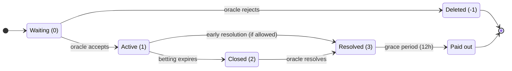
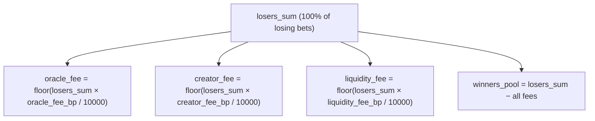

# Onix Protocol: LP-Guaranteed Prediction Markets on VIZ DLT

**An Industry Whitepaper**

*Anatoly Piskunov (On1x)*
*Version 2.0 — June 2026 (on-chain / HF14)*

---

> **On-chain status (HF14).** This paper was first written against the centralized prototype. The
> protocol now runs as **first-class consensus operations (`pm_*`) on VIZ DLT**, verified in
> `consensus_sim`. Live since HF14: both market types (CPMM binary + LMSR multi), the parimutuel
> zero-sum settlement, the **Lazy Pool**, an opt-in **leverage** subsystem, opt-in **batch /
> commit-reveal betting** (binary), bonded oracles, and a two-mode dispute system (committee /
> account). All percentage parameters are **basis points (bp): 10000 = 100.00%** (the prototype used
> permille). Sections below are annotated where the live design differs from the original prototype text.

## Abstract

Prediction markets aggregate dispersed information into prices, producing probability estimates that consistently outperform polls, expert panels, and statistical models. Yet adoption remains constrained by a single structural problem: **liquidity providers lose money.**

Uniswap v3 LPs suffer impermanent loss. LMSR market makers risk their entire subsidy. CLOB market makers face adverse selection. Every existing model asks capital providers to accept downside risk in exchange for uncertain yield — and the data shows most of them lose.

The **Onix Protocol** eliminates LP risk entirely. It is a prediction market architecture where LP principal is **structurally guaranteed** — not by insurance, not by hedging, but by the payout mechanics themselves. Winners are paid exclusively from losers' forfeited stakes. LP capital provides market depth but is never used to settle bets.

This paper describes the Onix Protocol's two market types — **Onix Binary** (Constant Product Market Maker) and **Onix Multi** (LMSR pricing with parimutuel settlement) — along with the market architecture, oracle and dispute resolution system, lazy liquidity pool, opt-in leverage, governance model, and its implementation on VIZ DLT as consensus-level operations.

---

## 1. The Problem: LP Risk in Prediction Markets

Every prediction market needs liquidity. Without it, prices are meaningless — a bet that moves the market by 20% reveals the bettor's capital, not the crowd's wisdom. The fundamental question is: **who provides that liquidity, and what do they risk?**

### 1.1 The Current Landscape

| Platform | LP Model | LP Risk | Yield Source |
|----------|----------|---------|-------------|
| **Uniswap v3** | Concentrated AMM | Impermanent loss (often >5% annualized; >50% of v3 LPs underperform buy-and-hold) | Trading fees |
| **Aave / Compound** | Lending pool | Smart contract risk, liquidation cascades | Borrower interest |
| **Curve** | Stableswap AMM | Low IL for pegged assets, smart contract risk | Fees + CRV emissions |
| **Standard LMSR** | Market maker subsidy | Loss up to `b × ln(N)` — the entire subsidy | Bid-ask spread |
| **Polymarket (CLOB)** | Active market making | Inventory risk, adverse selection | Bid-ask spread |
| **Kalshi** | No LP concept | N/A (exchange model) | N/A |

The pattern is clear: providing liquidity to prediction markets requires either active management skill (CLOB), tolerance for capital loss (LMSR), or acceptance of impermanent loss (AMM). None of these are suitable for retail participants.

### 1.2 Why This Matters

Prediction markets work best when they are deep and liquid. Deep markets produce accurate prices, attract informed traders, and generate the information value that makes prediction markets useful as a public good. But depth requires capital, and capital requires compensation for risk.

The result is a chicken-and-egg problem:
- Thin markets → high slippage → poor UX → few bettors → low fees → no LP incentive → thin markets

Breaking this cycle requires removing the risk from the LP side of the equation. If providing liquidity is risk-free, the barrier to entry drops to zero, and the flywheel can start spinning.

---

## 2. The Onix Protocol

### 2.1 Design Principles

The Onix Protocol is built on three architectural invariants:

1. **LP principal is structurally safe.** This is not a risk-mitigation strategy — it is a property of the payout architecture. LP capital and bet settlement draw from physically separate pools.

2. **Losers fund winners.** All payouts (winner profits, oracle fees, creator fees, LP fees) are sourced exclusively from losers' forfeited stakes. Fees are computed at resolution as `floor(losers_sum × fee_bp / 10000)` (bp: 10000 = 100.00%), never deducted at bet time.

3. **Dual market types, single guarantee.** Binary markets (Onix Binary) and multi-outcome markets (Onix Multi) use different pricing formulas but share the same settlement model and the same LP guarantee.

### 2.2 Onix Binary (CPMM + Parimutuel Settlement)

Onix Binary uses the Constant Product Market Maker formula — the same `x * y = k` invariant used by Uniswap — as the **pricing engine** for binary outcomes, with **parimutuel settlement** (losers fund winners pro-rata by weight), the same settlement model as Onix Multi.

**Mechanics:**

A market maintains two reserves, `reserve_a` and `reserve_b`, with constant product `k`:

```
k = reserve_a × reserve_b
```

When a user bets `amount` on outcome A (in the implementation, side 0 → `reserve_a`), the stake enters
that side's reserve and tokens are drawn from the **opposing** reserve:

```
new_reserve_a = reserve_a + amount
new_reserve_b = floor(k / new_reserve_a)
tokens_received = reserve_b − new_reserve_b
```

The `tokens_received` (called `weight`) is the user's **relative claim** on the winners' pool if outcome A wins (settlement is parimutuel — see below, identical to Onix Multi). Implied probability rises for the side that is bet (more money on A → `reserve_a` grows → `P(A)` grows):

```
P(A) = reserve_a / (reserve_a + reserve_b)
P(B) = reserve_b / (reserve_a + reserve_b)
```

**Settlement and proof of LP safety (parimutuel):**

At resolution, winners receive their stake back plus a proportional share of the losers' pool, by weight (identical to Onix Multi):

```
winners_pool = losers_sum − fees
payout = bet_amount + (weight / total_winning_weight) × winners_pool − time_penalty_on_profit
```

LP principal `L` is returned unconditionally, and the guarantee is exact:

```
Money OUT = L + winning_bets + winners_pool + fees = L + winning_bets + losing_bets = L + all_bets = Money IN
```

Total payout is capped at `losers_sum` regardless of weights, so LP capital is never used to settle bets. The CPMM is the **pricing engine** (probability + weight); it does not gate payout. (The AM-GM relation `reserve_a + reserve_b ≥ 2√k = L` still holds for the pricing curve but is no longer relied upon for solvency.)

**Worked example:**

```
Setup: 200 VIZ liquidity → reserve_a = 100, reserve_b = 100, k = 10,000
Fees (bp): oracle 50 (0.5%), creator 50 (0.5%), liquidity 100 (1%)

Alice bets 50 VIZ on A → receives weight 33.33 (price moves from 50% to 69%)
Bob bets 80 VIZ on B   → receives weight 81.82

Resolution: A wins
  Losers (Bob): 80 VIZ forfeited → losers_sum = 80
  oracle_fee   = floor(80 × 50/10000)  = 0.4 VIZ
  creator_fee  = floor(80 × 50/10000)  = 0.4 VIZ
  liq_fee      = floor(80 × 100/10000) = 0.8 VIZ
  winners_pool = 80 − 1.6 = 78.4 VIZ

  Alice (only winner, weight 33.33 of 33.33):
    payout = 50 (stake) + 78.4 × (33.33/33.33) = 128.4 VIZ (minus any time penalty on profit)
  LP return: 200 VIZ principal + share of 0.8 VIZ fee pool
```

### 2.3 Onix Multi (LMSR + Parimutuel Settlement)

Onix Multi is the protocol's innovation for markets with 3–10 outcomes. It combines Hanson's Logarithmic Market Scoring Rule (LMSR, 2003) for real-time pricing with parimutuel settlement for LP safety.

**Pricing (LMSR softmax):**

For a market with outcomes {1, 2, ..., N}, each with quantity parameter `q_i`:

```
price(i) = exp(q_i / b) / Σ_j exp(q_j / b)
```

This is the softmax function — prices always sum to exactly 1.0 by construction. No arbitrage mechanism or split/merge operation is needed.

The cost to buy Δ tokens on outcome i:

```
C(q) = b × ln(Σ_j exp(q_j / b))

cost = C(q + Δ·e_i) − C(q)
```

The parameter `b` controls price sensitivity (higher b = less price impact per bet). It is funded by the LP subsidy: `b = S / ln(N)` where S is the total subsidy.

**The innovation — parimutuel settlement:**

In **standard LMSR**, the market maker is the counterparty to all bets. If the crowd correctly predicts the outcome, the market maker loses up to `b × ln(N)` — potentially the entire subsidy. This is why LMSR has seen limited adoption outside corporate prediction markets (Microsoft, Inkling) where the operator absorbs the loss.

**Onix Multi changes the payout source.** At resolution:

```
1. Oracle declares the winning outcome
2. Losers forfeit 100% → losers_sum
3. Fees deducted from losers_sum (bp; 10000 = 100.00%):
     oracle_fee  = floor(losers_sum × oracle_fee_bp / 10000)
     creator_fee = floor(losers_sum × creator_fee_bp / 10000)
     liq_fee     = floor(losers_sum × liquidity_fee_bp / 10000)
     winners_pool = losers_sum − fees
4. Winners receive:
     payout = bet_amount + (tokens / total_winning_tokens × winners_pool) − time_penalty
5. LP subsidy returned unconditionally
```

Winners are paid by losers, not by the LP. The subsidy is architecturally separate from the settlement flow.

**Proof of LP principal guarantee:**

1. The LP deposits `S` VIZ as subsidy, which funds market depth.
2. During betting, users pay VIZ → receive outcome tokens. The VIZ accumulates as the betting pool.
3. At resolution, losers' forfeited stakes fund winner payouts and fees. The subsidy `S` was never in the payout pool.
4. The subsidy is returned to the LP unconditionally, regardless of outcome.

**Comparison:**

| Dimension | Standard LMSR | Onix Multi |
|-----------|---------------|------------|
| LP role | Counterparty to all bets | Depth deposit (not counterparty) |
| LP max loss | `b × ln(N)` (entire subsidy) | **Zero** |
| Winner payout | 1 token = 1 unit of currency | Token = proportional claim on losers' pool |
| CTF split/merge needed? | Yes (enforce price sum = 1) | No (softmax guarantees it) |

**Worked example (3-outcome election):**

```
Setup: b = 1000, outcomes = [A, B, C], subsidy = 1000 VIZ
Initial: price(A) = price(B) = price(C) = 33.3%

Alice bets 50 VIZ on A → ~47 tokens (price: 33% → ~38%)
Bob bets 100 VIZ on B   → ~88 tokens
Carol bets 30 VIZ on C  → ~29 tokens

Resolution: A wins
  Losers: Bob (100) + Carol (30) = 130 VIZ
  Fees (200 bp = 2% total): 2.6 VIZ
  winners_pool = 127.4 VIZ

  Alice: 50 + (47/47 × 127.4) = 177.4 VIZ
  LP: 1000 VIZ returned in full + share of liquidity fees
```

### 2.4 Edge Cases

| Scenario | Outcome |
|----------|---------|
| All bets on the winner | `losers_sum = 0` → every bettor gets back exactly their bet amount. LP subsidy returned. Zero-sum. |
| No bets on the winner | Entire losers' pool is undistributed → LP bonus. LP profits maximally. |
| Zero-volume market | LP subsidy returned in full. No fees, no payouts. |
| Single bettor wins | That bettor receives `bet_amount + winners_pool`. LP subsidy returned. |

---

## 3. Market Architecture

### 3.1 Market Lifecycle



Markets are created by a market creator, reviewed and accepted by an oracle (who stakes insurance), open for betting, resolved with an outcome, and paid out after a dispute grace period.

### 3.2 Fee Model (Losers-Only Fee Extraction)

A distinctive feature of the Onix Protocol is that **no fees are deducted at bet time**. The full bet amount enters the market reserves. Fees are computed only at resolution, exclusively from the losing side's forfeited stakes:



This provides a structural guarantee: fees and winner payouts draw from completely separate funding sources. Fee extraction can never compete with winner obligations.

**Oracle fee terms are frozen at acceptance (offer→quote).** The creator publishes a *maximum* the oracle may charge (`oracle_fee_percent` ceiling in bp + `oracle_fixed_fee` ceiling); when the oracle accepts it quotes its actual terms (≤ the creator's ceiling and ≤ the median governance cap `pm_max_oracle_fee_percent`), which are frozen onto the market and a `pm_market_accepted` virtual op is emitted. A self-oracle freezes its terms at creation. The **oracle fixed fee** (per-market) is paid from the losers' pool remainder (never minted). A **market creation fee** goes to the DAO fund as anti-spam protection.

### 3.3 Time-Weighted LP Distribution

LP fee shares are distributed proportionally to `amount × max(1, seconds_to_expiration)`:

```
weight_i = amount_i × max(1, sec_to_expiration_i)
fee_share_i = floor(total_fee_pool × weight_i / Σ weight_j)
```

Early LPs earn dramatically more per unit of capital than late LPs. In a 48-hour market, an LP who deposits at hour 1 earns ~2,400x more per VIZ than one who deposits at hour 47.

Each deposit is tracked as an independent position — multiple deposits by the same user are weighted and paid separately. LP principal is always returned in full, regardless of market outcome.

### 3.4 Time Penalty for Late Bets

To discourage last-minute betting (which carries less uncertainty risk), a configurable time penalty applies to bets placed near expiration:

```
if time_to_expiration < penalty_window:
    ratio = 1 − (time_to_expiration / penalty_window)
    penalty_ratio = ratio²           // quadratic (default)
    time_penalty = floor(penalty_ratio × max_penalty)
```

The penalty applies **only to profit**, never principal. A winning bettor always receives at least their original stake. The quadratic curve is gentle early in the penalty window and steep late, rewarding "somewhat late" over "extremely late."

### 3.5 Position Transfers

Positions are transferable between accounts via a native protocol operation:

```
pm_transfer_position { bet_id, to_user, amount, memo }
```

No slippage, no market impact — pure record reassignment. The `memo` field supports both plaintext and encrypted modes (ECIES via VIZ account memo keys), enabling P2P deals, OTC trading, and private annotations.

This is the only composability feature from the Conditional Tokens Framework (Polymarket/Gnosis) that provides real user value. CTF split/merge is architecturally unnecessary — Onix pricing formulas guarantee price coherence by construction.

---

## 4. Oracle and Dispute Resolution

### 4.1 Bonded Oracle Model

Oracles in the Onix Protocol are not trusted by default — they are **bonded**. Each oracle must:

- Register with a one-time fee (default 10 VIZ)
- Deposit insurance (minimum 5,000 VIZ)
- Accept markets explicitly (staking their insurance on each acceptance)
- Resolve markets with an outcome and supporting evidence (decision URL)

The insurance bond creates accountability: oracles who misresolve, miss deadlines, or lose disputes have their insurance slashed. The bond must exceed the oracle's potential manipulation profit for the economic security model to hold.

Oracle revenue comes from two sources:
1. **Fixed fee** (per market) — compensates for staking insurance and providing resolution
2. **Percentage fee** (from losers' pool at resolution) — scales with market volume

### 4.2 Dispute Arbitration

Any bettor can challenge a resolution within a grace period by paying a dispute fee. During disputes, all payouts are frozen.

Resolution runs in one of **two per-market modes**, chosen at creation:

- **Committee mode (`dispute_mode = 0`, default)** — the *whole SHARES electorate* decides by
  **stake-weighted vote** (`pm_dispute_vote`), tallied deterministically by the `pm_dispute_finalize`
  cron at `voting_end_time`. It is an **open public hearing**: the live tally is queryable and votes are
  **not** hidden behind commit-reveal (a deliberate, permanent choice — the DAO resolves disputes as
  transparently as possible). Because new evidence surfaces during the hearing, **a ballot is revisable**
  until close (a repeat vote overwrites the prior one). A voter's weight is its `effective_vesting_shares`
  **plus its Lazy-Pool stake converted to vesting-shares**, so DAO members who park VIZ in the pool keep
  their governance weight.
- **Account mode (`dispute_mode = 1`)** — a single named `dispute_resolver` (recommended multisig)
  issues the verdict (`pm_dispute_resolve`).

The verdict logic in either mode:

**If the oracle was wrong (overturned):**
- The correct outcome is applied and payouts recalculated.
- The disputer gets their fee back **plus a reward carve-out** drawn from the slashed insurance, sized as `dispute_fee × pm_dispute_reward_multiplier` (bp; e.g. 30000 = ×3), capped by the slash.
- **The remainder of the slash is added to the winners' pool** (via `forfeit_pool`) — it goes to the winning bettors, **not** to a resolver or the DAO. Neither the committee voters nor the account-mode resolver receive any reward (committee voting is an unpaid governance duty).
- The oracle's insurance is slashed (scaled by consensus strength in committee mode, or by the resolver's `penalty_amount` in account mode), with optional ban.

**If the oracle was right (upheld):**
- The disputer **forfeits the whole dispute fee to the oracle** (compensation for the bad-faith challenge).
- Original payouts proceed unchanged.

**Denial-of-resolution prevention:** If the resolver fails to act within 14 days, disputes auto-close: all bets and LP are refunded, the oracle is penalized, and the disputer's fee is returned. This guarantees funds are never frozen indefinitely.

### 4.3 Oracle Reputation Scoring

The protocol tracks 14 on-chain metrics per oracle and computes a reliability score (0–100):

```
reliability_score = clamp(0, 100,
    50 (base)
    − 0.40 × dispute_loss_rate × 100
    − 0.10 × excess_no_contest × 100
    − 0.20 × deadline_miss_rate × 100
    − 0.15 × (1 − dispute_response_rate) × 100
    + volume_bonus (0–25)
    + experience_bonus × freshness_multiplier (0–25)
    − 15 × bans_received
)
```

Key design choices:
- **Rates, not counts** — 1 dispute lost out of 100 (1%) scores better than 1 out of 2 (50%)
- **Neutral start at 50** — new oracles must earn reputation, not start at 100
- **Freshness decay** — inactive oracles lose their experience bonus over time
- **Volume tiers** — high-volume oracles receive bonus points for proven track record

The reliability score combines with a risk factor (insurance-to-bets ratio) to produce a **composite trust score** — the primary metric shown to users.

### 4.4 No-Contest and 3-Outcome Resolution

An oracle who cannot verify an outcome can voluntarily declare **no-contest**, triggering refunds at a reduced penalty (50% of dispute fee from insurance — much cheaper than losing a dispute). This creates an incentive gradient:

| Scenario | Oracle Cost | Ban Risk |
|----------|------------|----------|
| Voluntary no-contest | 500 VIZ | None |
| Dispute loss | 1,000+ VIZ + extra penalty | Permanent or temporary |
| Missed deadline | 250 VIZ (auto-penalty) | None (but reputation damage) |

If users believe the oracle abused no-contest, they can dispute it. The resolver then chooses from **three** possible correct outcomes: A wins, B wins, or confirm no-contest. This prevents oracles from using no-contest to avoid paying out winning bettors.

---

## 5. Lazy Liquidity Pool

### 5.1 The Capital Deployment Problem

Individual LP provision requires active market selection. Most users won't manually evaluate and deposit into specific markets. The result: most markets launch with only the creator's initial liquidity, producing thin order books and high slippage.

### 5.2 Automated Pool-to-Market Allocation

The Lazy Liquidity Pool solves this by accepting deposits and **automatically allocating** a percentage of the pool's free balance to every new market when it activates:

```
alloc_amount = free_balance × allocation_percent / 100
```

Allocations are computed from the current free balance (not the original total), creating geometric decay — the pool can never be fully depleted:

```
After 50 markets (2% allocation each): ~357 VIZ free from original 1,000
After 100 markets: ~133 VIZ still free
```

A maximum total allocation cap (default 70%) provides additional safety.

### 5.3 Reward Distribution (one shared accumulator)

The problem: when a market resolves with pool profit, that profit must be split among **all** current
depositors in proportion to their shares — but iterating every depositor on every market would be O(N)
and unbounded. The pool avoids that with **one global running total**, `reward_per_share` ("rps"):

```
// When a market resolves with pool LP profit, the per-share value of the pool rises once:
pool.reward_per_share += profit × PRECISION / total_shares

// A depositor's earnings = their shares × how much rps has risen since they last touched the pool:
live_reward = pending + shares × (pool.reward_per_share − user.snapshot) / PRECISION
```

In plain terms: every depositor "owns" a slice of each rise in `reward_per_share`, and their reward is
just `shares × (current rps − the rps recorded when they last deposited/withdrew)`. A depositor's own
record is touched **only when they act** (deposit or withdraw); until then their entitlement accrues
silently in the global number. So distributing profit to thousands of depositors is **O(1)** — a single
addition — and no funds are paid until claimed. This is the well-known accumulator pattern from
[SushiSwap's MasterChef contract](https://github.com/sushiswap/masterchef/blob/master/contracts/MasterChef.sol)
(and Compound's cToken index) — `PRECISION` (1e9) keeps the integer division exact.

### 5.4 Opportunity-Cost Protection

The pool auto-allocates to every market, creating an attack vector: a malicious oracle could create long-duration zero-volume markets to lock pool capital. Three mechanisms address this:

**Graduated Early Recall:** The market's duration is divided into 10 steps. At each step, if betting volume is below a threshold (1% of allocation), 10% of the current allocation is recalled to the pool. A completely idle 30-day market loses ~60% of its allocation.

**Active Market Penalty:** Each additional active market from the same oracle reduces that oracle's allocation by 5% (recursive). An oracle with 10 active markets receives ~60% of the base allocation per market, incentivizing quality over quantity.

**Fault Penalty Stamps:** Bad outcomes (missed deadlines, disputes lost, zero-volume resolutions) generate penalty stamps that further reduce future allocations. Stamps auto-expire after 10 days of clean operation.

### 5.5 Opt-In Leverage (Lazy-Pool-Funded)

The Lazy Pool serves **two roles from one `free_balance`**: silent market-LP allocations *and* funding for
an **opt-in leverage** subsystem. A bettor can open a leveraged position (`pm_leverage_open`) where margin
is a **loan from the pool** — no token emission, the position stays fully collateralized from the system's
view. The binary "jump risk" that breaks CLOB liquidation engines is handled by **liquidating against
pre-bet reserves**: an opposing-bet or settlement force-close recovers `min(cancel_value, obligation) ≥
loan`, so the pool gets its loan plus interest back; the only bounded bad-debt path is a same-side
`pm_cancel_bet`. A median kill-switch (`pm_leverage_enabled`, default off) blocks *new* opens, but the
protective liquidation cascade is deliberately **not** gated by it — toggling leverage off never strips
protection from open positions. The pool earns leverage interest in addition to LP yield, accounted via the same shared `reward_per_share` accumulator as in §5.3. Settlement of pool loans emits `pm_leverage_resolve` / `pm_leverage_liquidate`.

---

## 6. Governance

### 6.1 Delegate-Voted Chain Parameters

VIZ uses Delegated Proof of Stake (DPoS) consensus where elected delegates (validators) govern chain parameters through a median-vote mechanism:

1. Each delegate publishes preferred values for all parameters
2. The network computes the **median** of all active delegates' votes
3. Parameters change automatically when the median shifts — no hard fork, no deployment

All prediction-market parameters (fees, penalties, insurance requirements, dispute windows, lazy-pool
settings, leverage knobs, batch/commit-reveal timing) are delegate-voted. All percentage parameters are
in **basis points (bp), 10000 = 100.00%**:

| Examples | Governance |
|----------|-----------|
| `pm_dispute_fee`, `pm_max_oracle_fee_percent` (bp) | Delegate median vote |
| `pm_dispute_grace_sec`, `pm_dispute_vote_period_sec` | Delegate median vote |
| `pm_dispute_approve_min_percent`, `pm_dispute_reward_multiplier` (bp) | Delegate median vote |
| `pm_lazy_*` allocation/recall, `pm_leverage_*` (enabled, fund %, max position) | Delegate median vote |
| `pm_commit_reveal_enabled`, `pm_batch_epoch_blocks`, `pm_reveal_window_blocks` | Delegate median vote |

Hard forks are only needed for structural changes (new operation types, formula changes), not for economic tuning. Kill-switches (`pm_leverage_enabled`, `pm_commit_reveal_enabled`) let governance disable a whole subsystem by median vote without a fork.

### 6.2 Jurisdictional Client Model

VIZ DLT is infrastructure, not an operator — analogous to how Bitcoin is a ledger, not a money transmitter. The protocol is neutral and permissionless. Legal obligations attach to **client applications**, not to the consensus algorithm.

Any jurisdiction can build a compliant client on VIZ DLT:

| Client Component | Implementation |
|-----------------|---------------|
| Pre-approved oracles | Client whitelist of licensed, KYC-verified oracles |
| Pre-approved resolvers | Government-approved dispute resolution bodies |
| KYC/AML | Client-level identity verification |
| Fee routing as tax revenue | `dao_fund_account_id` → state treasury account |
| Market restrictions | Client filters by allowed categories |
| Betting limits | Client-enforced per-user caps |

The same protocol operations (`pm_place_bet`, `pm_resolve`, `pm_dispute`) work identically for permissionless and regulated clients. The difference is entirely at the client layer.

---

## 7. Competitive Landscape

### 7.1 Platform Comparison

| Dimension | Onix (Forecaster) | Polymarket | Kalshi | Standard LMSR |
|-----------|-------------------|------------|--------|---------------|
| **Pricing** | CPMM (binary) / LMSR softmax (multi) | CLOB | CLOB | LMSR |
| **LP Risk** | **Zero** (structural guarantee) | Inventory risk | N/A | Up to `b × ln(N)` |
| **LP Knowledge** | Low (deposit and earn) | High (manage orders) | N/A | Medium |
| **Fee Model** | % of losers' pool at resolution | Bid-ask spread | Exchange fees (1-7%) | Spread |
| **Oracle** | Per-market bonded + committee dispute | UMA Optimistic Oracle | Kalshi (CFTC-regulated) | Operator |
| **Late Bet Penalty** | Quadratic, configurable | None | None | None |
| **Position Transfer** | Native protocol operation + encrypted memo | CTF (ERC-1155) | None | None |
| **Governance** | Delegate-voted parameters | Team multisig | CFTC process | Operator |
| **Infrastructure** | VIZ DLT (consensus-level) | Polygon (smart contracts) | Proprietary servers | Various |

### 7.2 Why CTF Split/Merge Is Unnecessary

Polymarket uses the Gnosis Conditional Tokens Framework (CTF) where positions are ERC-1155 tokens that can be split and merged to enforce price coherence (prices sum to $1).

Under the Onix Protocol, this mechanism is architecturally unnecessary:

- **Onix Binary (CPMM):** `price(A) + price(B) = reserve_b/(reserve_a+reserve_b) + reserve_a/(reserve_a+reserve_b) = 1` — by definition
- **Onix Multi (LMSR softmax):** `Σ price(i) = Σ exp(q_i/b) / Σ exp(q_j/b) = 1` — by definition of softmax

No arbitrage mechanism needed. Price coherence is a mathematical property of the formulas, not an external enforcement layer.

### 7.3 The Flywheel

```
Risk-free LP → lower barrier for retail LPs
  → more liquidity deposited
    → deeper markets, less slippage
      → better UX for bettors
        → more volume
          → more fees for LPs
            → attracts even more LPs
```

"Passive yield without impermanent loss" is the value proposition that Uniswap, Balancer, and Curve cannot offer. For the crypto-native audience, this is a compelling narrative: earn yield by providing liquidity to prediction markets, with zero risk to principal.

---

## 8. VIZ DLT: From Prototype to Protocol

### 8.1 Current State

The protocol began as a Telegram WebApp with a centralized backend (all market logic server-side) — a working prototype with known limits: no sybil resistance beyond Telegram accounts, no censorship resistance, no composability. **That migration is now done:** the full market logic runs **on VIZ DLT as consensus-validated `pm_*` operations** (HF14), exercised end-to-end in `consensus_sim`. The remainder of this section describes that on-chain architecture, now realized.

### 8.2 Migration Architecture

VIZ DLT is a Distributed Ledger Technology with ~3-second block times, DPoS consensus, named accounts (Graphene-style), and no general-purpose smart contracts. Prediction market operations will be implemented as **first-class consensus-validated operations** — not smart contracts, not `custom_json` payloads.

| Layer | Examples | Consensus-Validated? |
|-------|---------|---------------------|
| **Protocol operations** | `pm_create_market`, `pm_oracle_accept_market`, `pm_place_bet`, `pm_commit_bet`/`pm_reveal_bet`, `pm_resolve_market`, `pm_dispute_create`/`pm_dispute_vote`/`pm_dispute_resolve`, `pm_lazy_deposit`/`pm_lazy_withdraw`, `pm_leverage_open`/`pm_leverage_close`/`pm_leverage_convert` | Yes — every node validates |
| **Virtual operations** | `pm_payout` (per bettor), `pm_auto_payout`, `pm_market_accepted`, `pm_dispute_finalize`, `pm_dispute_auto_close`, `pm_oracle_missed_penalty`, `pm_lazy_recall`, `pm_batch_settle`, `pm_commit_forfeit`, `pm_leverage_resolve`/`pm_leverage_liquidate` | Yes — deterministic, generated at block time |
| **metadata / custom_json** | Dispute comments, market descriptions, UI metadata | No — display/indexing only |

Every financial action (placing bets, adding liquidity, resolving markets, seizing insurance) is validated by every validator. Invalid operations are rejected before block inclusion. No Solidity, no gas estimation, no bytecode deployment.

The frontend is a **fully headless web client** — no backend server, no database, no sessions. Private keys stored in the browser (encrypted), transactions signed locally and broadcast to public VIZ nodes. No Telegram dependency; the core app is platform-independent.

### 8.3 Delivered Since the Prototype, and Remaining Roadmap

**Delivered on-chain (HF14):**

| Feature | Status |
|---------|--------|
| Commit-reveal + batch betting (binary, opt-in, median kill-switch) | ✅ Live |
| Opt-in leverage (Lazy-Pool-funded, pre-bet-reserve liquidation) | ✅ Live |
| Lazy Pool (auto-allocation, graduated recall, MasterChef accounting) | ✅ Live |
| Per-bettor / leverage settlement virtual ops + plugin API | ✅ Live |
| Lazy-pool stake as governance weight (PM disputes + DAO requests) | ✅ Live |

**Remaining roadmap:**

| Priority | Feature | Impact |
|----------|---------|--------|
| High | Shared liquidity pools (category-level AMMs) | Solves liquidity fragmentation at the architecture level |
| High | Automated data oracles (exogenous feeds) | Eliminates manipulation for objective markets |
| Medium | Tiered dispute windows (small vs large markets) | Better UX calibration |
| Medium | LMSR batch settlement (extend batch/commit-reveal to multi) | Multi markets currently force instant betting |
| — | Commit-reveal **dispute** voting | **Deliberately rejected** — disputes stay public hearings (see §4.2) |

---

## 9. What Onix Does NOT Claim

Honest disclosure of tradeoffs and limitations:

- **LP profit is not guaranteed.** If a market has zero losing bets, there are no fees to distribute. LP gets principal back but earns nothing.

- **Platform risk exists.** Bugs, exploits, and governance attacks are separate from the market maker model. The LP guarantee is structural (payout architecture), not insured (no external guarantee fund).

- **Onix Multi tokens are not fixed-value instruments.** In standard LMSR, 1 winning token = 1 unit of currency. In Onix Multi, tokens are proportional claims on the losers' pool. If all bettors pick the winner, everyone breaks even.

- **LP yield depends on volume, not depth.** A market with 100,000 VIZ subsidy and one with 1,000 VIZ subsidy earn the same absolute fee if both have identical betting volume and fee rates. The subsidy provides depth, not yield.

- **DPoS governance has known tradeoffs.** Fewer validators than PoW/PoS, delegate concentration risks, token-weighted voting. These are inherent to the DPoS model (shared by EOS, Hive, Tron), not VIZ-specific.

- **VIZ token liquidity is currently low.** Economic guarantees (insurance bonds, dispute fees) scale with token price. The protocol assumes that utility drives demand over time — the same bet every protocol-native token project makes.

---

## 10. Conclusion

The Onix Protocol addresses the fundamental barrier to prediction market adoption: LP risk. By structurally separating LP capital from bet settlement — in both binary (CPMM) and multi-outcome (LMSR + parimutuel) markets — Onix makes liquidity provision risk-free and accessible to retail participants.

The key innovations:

1. **LP principal guarantee** as an architectural invariant, not insurance
2. **Losers-fund-winners** settlement eliminating fee competition with winner payouts
3. **LMSR pricing with parimutuel settlement** (Onix Multi) — combining proven price discovery with LP safety
4. **Time-weighted LP distribution** rewarding early capital commitment
5. **Quadratic time penalty** on profit (never principal) for late bets
6. **Lazy Liquidity Pool** with automated allocation, graduated recall, and MasterChef accounting — also funding the opt-in **leverage** subsystem (pool-funded margin, pre-bet-reserve liquidation, never bad debt outside a bounded cancel-bet path)
7. **Bonded oracle model** with reputation scoring, offer→quote fee freezing, and a two-mode dispute system — committee disputes are **public hearings** with revisable, lazy-pool-weighted votes
8. **Opt-in anti-MEV** — batch / commit-reveal betting (binary) with a median kill-switch
9. **Consensus-level implementation** on VIZ DLT — no smart contracts, no gas, no external keepers; strictly **zero-sum** (the protocol never mints a token)

The bet is straightforward: if zero-risk LP attracts capital, capital creates depth, depth improves prices, and prices attract bettors, then the Onix Protocol solves the prediction market liquidity problem. The protocol mechanics are mathematically verifiable. The economic hypothesis will be tested by the market.

---

## 11. Author and Disclosure

### Author

**Anatoly Piskunov** (On1x) — Russian IT innovator, Web3/DLT developer, and creator of the VIZ blockchain. His work spans distributed ledger technology, decentralized social protocols, and economic models for digital communities.

Key contributions include: VIZ Blockchain (Fair DPoS, social capital primitives), the Onix Protocol (LP-guaranteed prediction markets), Voice Protocol (censorship-resistant messaging), and extensive publications on blockchain economics and Web3 architecture.

Full list of publications and projects: [https://on1x.com](https://on1x.com)

### Disclosure

The author of Forecaster and the Onix Protocol is also the creator of VIZ DLT. The migration roadmap proposes moving the platform to a blockchain the author designed and built.

This is disclosed upfront. It is also the norm: Polymarket depends on Polygon Labs' infrastructure, Kalshi runs on its own servers, Augur designed the REP token it runs on. Every platform argues for its own infrastructure. The question is not whether the author has an interest — they always do — but whether the technical claims are falsifiable. Every formula, proof, and mechanism in this paper is mathematically verifiable and the codebase is open-source.

---

## 12. References

1. Hanson, R. (2003). *Combinatorial Information Market Design.* Information Systems Frontiers, 5(1), 107–119. — The Logarithmic Market Scoring Rule (LMSR).

2. Adams, H., Zinsmeister, N., Robinson, D. (2020). *Uniswap v2 Core.* — Constant Product Market Maker (`x * y = k`).

3. Adams, H., et al. (2021). *Uniswap v3 Core.* — Concentrated liquidity and impermanent loss analysis.

4. Gnosis. *Conditional Tokens Framework (CTF) Documentation.* https://docs.gnosis.io/conditionaltokens/ — ERC-1155 prediction market positions.

5. UMA Protocol. *Optimistic Oracle Documentation.* — Dispute escalation mechanism used by Polymarket.

6. Leshner, R., Hayes, G. (2019). *Compound: The Money Market Protocol.* — cToken accumulator pattern (basis for reward_per_share).

7. SushiSwap. *MasterChef Contract.* — Lazy accounting pattern for reward distribution.

8. Piskunov, A. (2019). *VIZ blockchain system: technical description.* — VIZ DLT architecture, DPoS consensus, named accounts.

9. Piskunov, A. (2019). *What is Fair DPoS.* — Governance innovation in delegated proof of stake.

10. Piskunov, A. (2023). *VIZ as a Digital Representative Self-Governing State.* — Framework for blockchain systems as digital polities.
