# Workflows & interaction diagrams

One **canonical scenario** traced through every participant. Each role sends specific **signed
operations**, is touched by specific **virtual operations**, and ends with a **tokens sent / received**
table for two outcomes:

- **Normal resolve** — oracle resolves, grace passes, `pm_auto_payout` settles. No dispute.
- **Disputed resolve** — oracle resolves **A**, a dispute **overturns to B**, then settlement runs.

All amounts are abstract **VIZ** units. All percents are **bp** (10000 = 100.00%). Settlement is strictly
**zero-sum** — no tokens are ever minted; `current_supply` is untouched:

```
Σ winner_payout + oracle_take + creator_take + lp_bonus + LP_principal
        == Σ all bet amounts + LP_principal + forfeit_pool   (+ insurance slash, in a dispute)
```

## Canonical market **M** (binary CPMM, A vs B)

| Item | Value |
|------|-------|
| Engine | binary CPMM (`x·y=k`), `weight = tokens_out` |
| Seed liquidity (marketmaker) | **2000** → reserves A=1000 / B=1000 |
| `oracle_fee_percent` (oracle quote) | **1000** (10%) |
| `creator_fee_percent` | **500** (5%) |
| `liquidity_fee_percent` | **500** (5%) |
| `oracle_fixed_fee` (oracle quote) | **10** |
| `dispute_penalty_percent` | **+10000** (slash up to 100% of insurance ×consensus) |

Illustrative chain props: `pm_market_creation_fee` 5, `pm_oracle_registration_fee` 10,
`pm_min_oracle_insurance` 5000, `pm_dispute_fee` 1000, `pm_dispute_reward_multiplier` 30000 (**3×**),
`pm_no_contest_penalty_percent` 5000 (50% of dispute fee), `pm_oracle_penalty_percent` 500 (5% of
insurance on a missed deadline), `pm_lazy_emergency_penalty_percent` 5000 (50% of profit),
`pm_leverage_pool_profit_percent` **R = 10%**, `pm_lazy_alloc_percent` 2000 (20%).

### Roster

| Actor | Role | Stake / action |
|-------|------|----------------|
| **maker** | creator + first LP | seeds 2000 liquidity |
| **orac** | external oracle | insurance 5000; quotes fee 10% + fixed 10 |
| **LP1** | in-market liquidity provider | adds 1000 liquidity |
| **A** | bettor — winner | 100 on **A**, early; weight 100 |
| **C** | bettor — late winner | 100 on **A** at T+85%; weight 100; time-penalty **50%** |
| **B** | bettor — loser | 200 on **B**; weight 200 |
| **D** | leverage **×10** winner | collateral 10 + loan 90 (market **L**) |
| **E** | leverage **×5** liquidated | collateral 20 + loan 80 (market **L**) |
| **LZ1** | lazy-pool depositor | deposits 1000 |
| **disp** | disputer | escrows dispute fee 1000 |

> Curve weights (100 / 100 / 200) are written explicitly to keep the parimutuel arithmetic readable;
> a real CPMM hands out slightly less weight as reserves shift.

## Interaction diagrams

**Market lifecycle.**

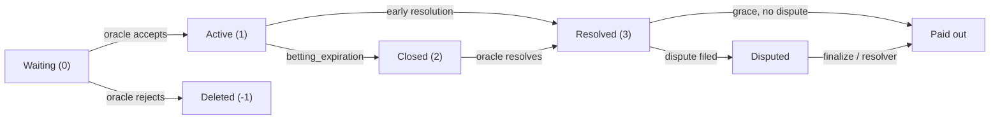

**Settlement — NORMAL resolve (A wins).** Losers fund winners; LP principal is untouched (zero-sum).

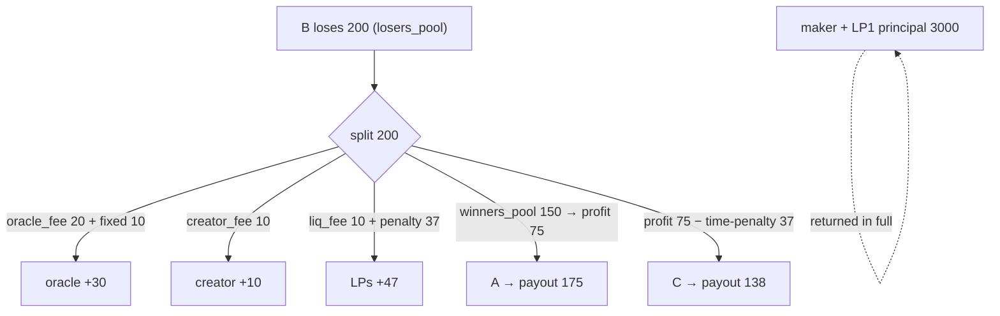

**Dispute — oracle said A, overturned to B.** The punishment is the insurance slash (separate money).

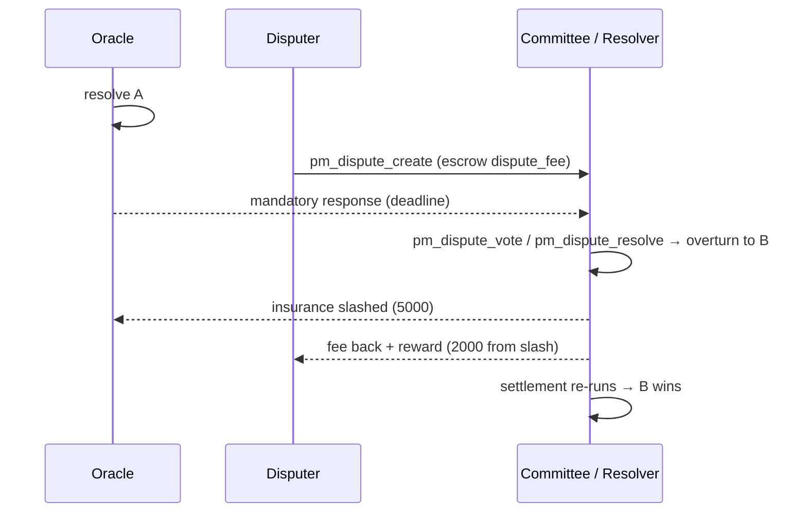

## Master ledger — NORMAL resolve (A wins)

`losers_sum = 200` (B). Fees off the losers' pool:
`oracle_fee = 200×10% = 20`, `creator_fee = 200×5% = 10`, `liq_fee = 200×5% = 10`, `oracle_fixed = 10`.
`winners_pool = 200 − 20 − 10 − 10 − 10 = 150`. `Σ winning weight = 200` (A 100 + C 100).

- **A**: profit `150×100/200 = 75`, penalty 0 → **payout 175**.
- **C**: profit 75, time-penalty `75×50% = 37` (→ LP) → **payout 138**.
- **LP bonus** = `liq_fee 10 + penalties 37 = 47`, split by time in market: **maker ~31 / LP1 ~16**.
- **oracle_take** = `oracle_fee 20 + fixed 10 = 30`. **creator_take** = `creator_fee 10`.

| Actor | sends | receives | net (this market) |
|-------|-------|----------|-------------------|
| maker | 2000 liquidity + 5 creation-fee | 2000 principal + 10 creator-fee + 31 LP-bonus | **+36** |
| orac | (10 reg-fee, 5000 insurance locked) | 30 oracle-take | **+30** |
| LP1 | 1000 liquidity | 1000 principal + 16 LP-bonus | **+16** |
| A | 100 | 175 | **+75** |
| C | 100 | 138 | **+38** |
| B | 200 | 0 | **−200** |

**Zero-sum:** in `= bets 400 + LP principal 3000 = 3400`; out `= 175+138+0 + 30 + 10 + 47 + 3000 = 3400`. ✔
The 5 creation-fee + 10 reg-fee leave to the **DAO fund** (not part of the market pool).

## Master ledger — DISPUTED resolve (oracle said A → overturned to B)

`disp` escrows `dispute_fee 1000`. The verdict overturns to **B**; the oracle is slashed.
With `dispute_penalty_percent = 10000` and consensus strength **100%**: `slash = 5000×100%×100% = 5000`.
Reward carve-out: `reward_target = fee×3 = 3000` → `bonus = 3000 − 1000 = 2000` (≤ slash). Disputer gets
`fee 1000 + bonus 2000 = 3000`. Remainder `slash − bonus = 3000 → forfeit_pool`.

Now **B wins**. `losers_sum = 200` (A 100 + C 100). Fees 20/10/10 + fixed 10.
`winners_pool = 200 − 50 + forfeit 3000 = 3150`. `Σ winning weight = 200` (B).
- **B**: profit `3150×200/200 = 3150` → **payout 3350**.
- **oracle_take** still `30` (the *market* fee is paid from the frozen config even when overturned — the
  punishment is the **insurance slash**, separate money). **creator_take** 10. **LP bonus** = liq 10.

| Actor | sends | receives | net (this market) |
|-------|-------|----------|-------------------|
| maker | 2000 + 5 | 2000 principal + 10 creator-fee + ~6 LP-bonus | **+11** |
| orac | insurance −**5000** slashed | 30 oracle-take | **−4970** |
| LP1 | 1000 | 1000 principal + ~4 LP-bonus | **+4** |
| A | 100 | 0 | **−100** |
| C | 100 | 0 | **−100** |
| B | 200 | 3350 | **+3150** |
| disp | 1000 dispute-fee | 3000 (fee back + 2000 reward) | **+2000** |

**Zero-sum:** in `= bets 400 + LP principal 3000 + dispute_fee 1000 + insurance slash 5000 = 9400`;
out `= B 3350 + oracle 30 + creator 10 + lp_bonus 10 + LP principal 3000 + disputer 3000 = 9400`. ✔
The slash 5000 splits into disputer bonus 2000 + forfeit 3000 (→ B via the winners' pool).

## Implementation status (verified against the code)

**Regular operations — all 21 present** in the `operation` variant (`operations.hpp`), validated +
evaluated in `pm_evaluator.cpp`:
`pm_oracle_register`, `pm_oracle_update`, `pm_create_market`, `pm_oracle_accept_market`, `pm_place_bet`,
`pm_commit_bet`, `pm_reveal_bet`, `pm_cancel_bet`, `pm_add_liquidity`, `pm_withdraw_liquidity`,
`pm_resolve_market`, `pm_no_contest`, `pm_dispute_create`, `pm_dispute_vote`, `pm_dispute_resolve`,
`pm_transfer_position`, `pm_lazy_deposit`, `pm_lazy_withdraw`, `pm_leverage_open`, `pm_leverage_close`,
`pm_leverage_convert`. ✔

**Virtual operations** — emitted by `database::process_pm_markets()` / the evaluators:

| Virtual op | Fires? | Trigger (code) |
|------------|--------|----------------|
| `pm_market_accepted` | ✔ | on `pm_oracle_accept_market` (accept) **and** self-oracle `pm_create_market` |
| `pm_payout` | ✔ | **per active bet** at settle — carries `account`, `market_id`, `bet_id`, `side`/`outcome_index`, `amount` (stake), `payout` (**0 on a loss**) |
| `pm_auto_payout` | ✔ | **once per market** at settle — a summary marker (`bets_sum`) alongside the per-bet `pm_payout`s |
| `pm_commit_forfeit` | ✔ | unrevealed commit past `reveal_deadline` |
| `pm_dispute_finalize` | ✔ | committee `voting_end_time` |
| `pm_dispute_auto_close` | ✔ | `auto_close_time` (anti-freeze) |
| `pm_oracle_missed_penalty` | ✔ | oracle missed `result_expiration` |
| `pm_lazy_recall` | ✔ | idle-allocation graduated recall step |
| `pm_batch_settle` | ✔ | epoch boundary |
| `pm_leverage_liquidate` | ✔ | mid-market liquidation: reason **0** opposing-bet, **1** cancel-bet (`cascade_liquidate`) |
| `pm_leverage_resolve` | ✔ | **settlement** of a leveraged position: carries `market_id`, `outcome_index`, `won` (solvent ⇒ positive), `pool_received`/`bettor_received`, and `leverage` (= `total_bet/collateral`) |

> A leveraged position is force-closed at its `cancel_value` **as soon as new betting is impossible** —
> at `betting_expiration` (fixed-deadline markets, *before* the oracle resolves) or at resolve/void
> (open-ended markets). It is a price/sentiment bet, so it does **not** wait for the outcome: the pool
> takes `min(cv, obligation)`, the bettor gets the rest. **`pm_leverage_resolve`** marks that close
> (positive if `cv ≥ obligation`, else collateral lost); **`pm_leverage_liquidate`** is only for the
> *mid-market* opposing-bet / cancel-bet cascades. `settle_market` still force-closes as an idempotent backstop.

See the [Plugin API](../plugins/prediction-market-api) for the read methods that surface each of these
(`get_account_leverage_positions`, `get_market_leverage_positions`, `get_creator_ban`, `get_dispute_votes`, …);
per-bettor results (`pm_payout`) and leverage settlements (`pm_leverage_resolve`) also appear in
`account_history`.

## Roles in the canonical scenario

Every participant traced through market **M** (and the leverage sub-market **L**): its interaction
diagram, the **signed** operations it sends, the **virtual** operations that touch it, a
**tokens sent / received** ledger for both outcomes, and a code-verification pointer. Each per-actor
ledger is a slice of the two [master ledgers](#master-ledger--normal-resolve-a-wins) above.

### Market maker (creator + first LP)

The maker creates market M, seeds the **2000** liquidity (becoming the first `pm_liquidity_object`), and
proposes the oracle's **offer ceiling**. It does **not** resolve (that's the oracle).

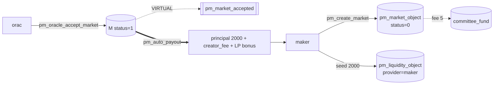

- **Sends:** `pm_create_market` (sets the `oracle_fee_percent`/`oracle_fixed_fee` **offer ceiling** plus
  its own `creator_fee_percent` 5% and `liquidity_fee_percent` 5%; pays `pm_market_creation_fee` 5 → DAO,
  locks `liquidity` 2000); optional `pm_add_liquidity` / `pm_withdraw_liquidity` (principal-safe, locked
  from `betting_expiration` to resolution).
- **Touched by:** `pm_market_accepted` (oracle accepts, or self-oracle at creation); `pm_auto_payout`
  (returns LP principal + time-weighted LP-bonus share).

| outcome | sends | receives | net |
|---------|-------|----------|-----|
| normal (A) | 2000 liquidity + 5 creation-fee (→DAO) | 2000 principal + **creator_fee 10** + **LP-bonus ~31** | **+36** |
| disputed (→B) | 2000 + 5 | 2000 principal + creator_fee 10 + LP-bonus ~6 | **+11** |

The creator fee is **still paid** from the frozen market config on an overturn — the dispute punishes the
**oracle** (insurance slash), not the maker. LP principal is returned unconditionally.

- **Self-oracle variant:** `oracle == creator` → active at creation, `pm_market_accepted` fires with
  `self_oracle=true`, and the maker also earns the `oracle_take`.
- **Verify:** `pm_create_market_evaluator`; LP via `settle_liquidity`; `committee_fund += pm_market_creation_fee`.
  **Observe:** `get_market`, `list_markets_by_creator`, `get_market_liquidity` (`earned_fee`), `get_market_meta`.

### Oracle (register → accept/quote → resolve)

External oracle **orac** bonds insurance, **quotes** its fee at accept (≤ the maker's offer and ≤
`pm_max_oracle_fee_percent`), and resolves. Its market fee is paid from the losers' pool; its bond is at
risk only on a missed deadline or a lost dispute.

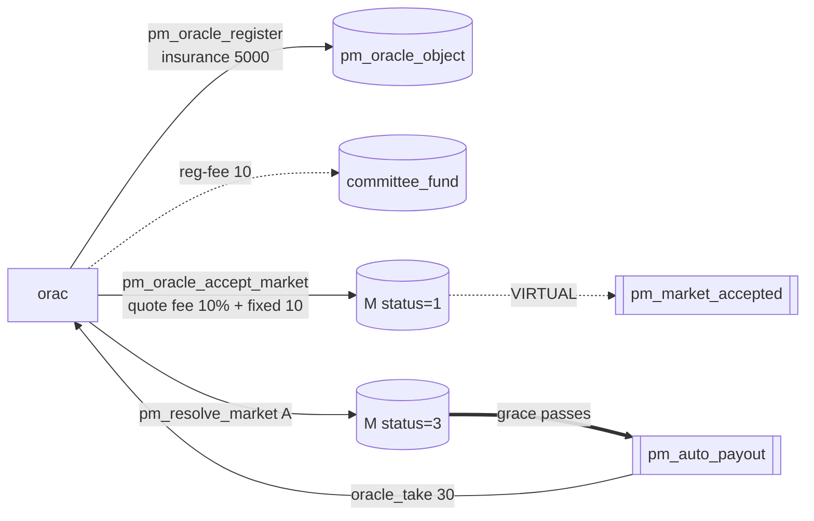

- **Sends:** `pm_oracle_register` (locks insurance 5000, pays reg-fee 10 → DAO, sets advisory list-price);
  `pm_oracle_accept_market` (**quotes** fee 10% + fixed 10, each ≤ the creator's offer and ≤ the median
  cap; freezes them onto M); `pm_resolve_market` (sets `winning_outcome`, opens the grace window);
  optional `pm_oracle_update` / `pm_no_contest`. The standing list-price can also pre-authorise markets to
  go live at creation via **auto-accept** — see the oracle ops doc.
- **Touched by:** `pm_market_accepted`; `pm_auto_payout` (credits `oracle_take`);
  `pm_oracle_missed_penalty` (never resolves → slashes `pm_oracle_penalty_percent` of insurance → DAO,
  refunds all bets).

| outcome | sends | receives | net |
|---------|-------|----------|-----|
| normal (A) | insurance 5000 (locked) + reg-fee 10 (→DAO) | **oracle_take 30** = fee 20 + fixed 10 | **+30** |
| disputed (→B) | insurance −**5000 slashed** | oracle_take 30 | **−4970** |

Even when overturned the oracle keeps the small **market fee** (frozen config); the punishment is the
**insurance slash**, split into the disputer's reward and the winners' `forfeit_pool`. Quoting **below**
the offer is allowed (price = reputation); quoting **above** is rejected.

- **Verify:** `pm_oracle_register_evaluator`, `pm_oracle_accept_market_evaluator` (≤ offer, ≤ cap, freeze),
  `process_pm_markets` missed-deadline scan. **Observe:** `get_oracle` (insurance, counters, reliability
  score), `list_oracles`, `get_market` (frozen terms).

### Oracle — upheld in a dispute (dispute winner)

The oracle resolved **A**; a disputer challenged it but the verdict **upholds** A. The oracle keeps its
market fee **and** collects the forfeited `dispute_fee`; insurance untouched, `disputes_won++`.

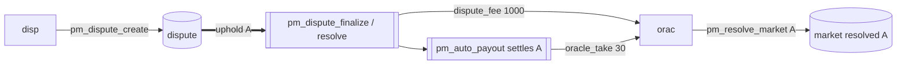

| outcome | sends | receives | net |
|---------|-------|----------|-----|
| disputed, upheld | insurance 5000 (**not** slashed) | oracle_take 30 + **dispute_fee 1000** | **+1030** |
| normal (no dispute) | insurance 5000 (locked) | oracle_take 30 | **+30** |

The challenge backfires and **pays the oracle**. A *good-faith* market (`dispute_penalty_percent < 0`)
can even hand the oracle a fee bonus when the outcome is changed — recognising an honest mistake.
**Verify:** uphold branch of `pm_dispute_finalize` / `pm_dispute_resolve`. **Observe:** `get_oracle`
(`disputes_won`, higher score), `get_dispute`.

### Oracle — overturned + slashed (dispute loser)

The oracle resolved **A**; the dispute **overturns to B** and insurance is **slashed**. It still collects
the tiny frozen market fee (fee and punishment are separate money) but loses a large slice of bond and
reputation.

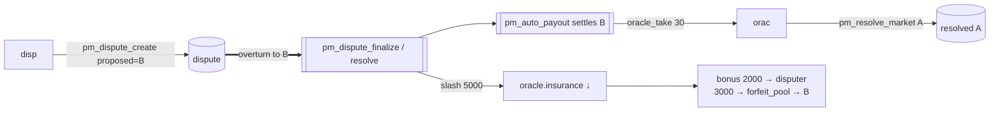

`slash = insurance 5000 × dispute_penalty_percent (100%) × consensus_strength (100%) = 5000`,
**redistributed** not burned: `bonus 2000 →` disputer, `3000 → forfeit_pool →` the new winners (B). Net
**−4970** vs **+30** undisputed. Slash scales with **consensus strength** (`winning_rshares /
max_rshares`); `dispute_penalty_percent < 0` (good-faith) → **no** slash. A slashed oracle is often
**banned** too (next role). **Verify:** overturn branch of `pm_dispute_finalize` / `pm_dispute_resolve`;
fee still from `mkt.oracle_fee_percent`. **Observe:** `get_oracle` (`total_insurance_slashed`,
`banned_until`), `get_dispute`.

### Banned oracle (and banned creator)

A ban is a **status**, not a transfer: `pm_oracle_object.banned_until` (and, for creators, a
`pm_creator_ban_object`) blocks the actor from **new** markets until the timestamp passes. It usually
rides along with an overturn slash, but moves no tokens by itself.

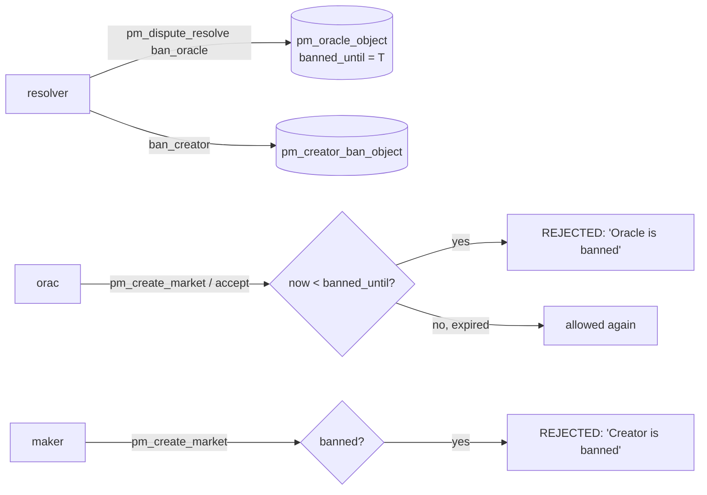

- **Who sets it:** account mode → `pm_dispute_resolve` (`ban_oracle`/`ban_creator` + `…_until`); committee
  mode → `pm_dispute_finalize` scales a ban by consensus on overturn. `banned_until =
  time_point_sec::maximum()` ⇒ **permanent**.
- **Tokens:** the ban itself is **0** (pure status); the accompanying slash is the overturn case above.
  Insurance stays locked, refundable after the ban lifts and no active markets remain.
- Bans survive snapshots and are keyed by account — re-registration cannot wipe one. **Verify:**
  `pm_create_market_evaluator` (`"Oracle is banned"` / `"Creator is banned"`). **Observe:** `get_oracle`
  (`banned_until`, `bans_received`), **`get_creator_ban(account)`**.

### Bettor A — early winner

**A** stakes **100 on side A early** (no time penalty) and wins when M resolves to A. Payout = stake +
weight-proportional share of the winners' pool.

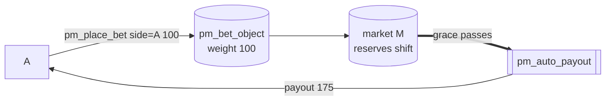

| outcome | sends | receives | net |
|---------|-------|----------|-----|
| normal (A) | 100 | **175** | **+75** |
| disputed (→B) | 100 | **0** | **−100** |

`profit = winners_pool 150 × weight 100 / Σweight 200 = 75`; no penalty → payout `100 + 75`. An overturn
makes A the **losing** side. Winnings come **only** from losers' stakes (+ forfeit pool), never emission.
**Sends:** `pm_place_bet` (`side=0`, instant); optional `pm_transfer_position` / `pm_cancel_bet`.
**Verify:** `pm_place_bet_evaluator`, `settle_market`. **Observe:** `get_account_positions`
(`expected_payout`), `get_market_weight_sums`; realized `pm_payout` in `account_history`.

### Bettor B — loser

**B** stakes **200 on side B**. When M resolves to **A**, B's stake funds the winners and B gets nothing.
In the disputed path B becomes the winner.

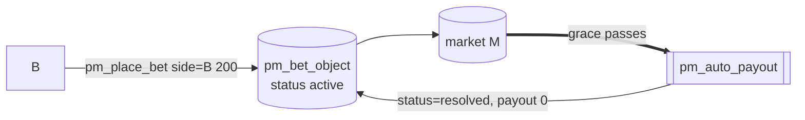

| outcome | sends | receives | net |
|---------|-------|----------|-----|
| normal (A) | 200 | **0** | **−200** |
| disputed (→B) | 200 | **3350** | **+3150** |

B's 200 **is** the `losers_sum` (pays the 40 fees + 150 winners' pool + LP bonus) — the parimutuel
"losers fund winners" rule. On overturn B wins and the oracle's forfeit 3000 is injected into B's pool
(`payout = 200 + 3150`). A losing bet is still recorded by a `pm_payout` with **payout=0**. **Verify:**
`settle_market` loser branch. **Observe:** `get_account_positions`, `get_market_bets`, `get_dispute`.

### Bettor C — late winner (time penalty)

**C** stakes **100 on side A** but **late** (T+85% of the betting window), so a **time penalty** docks
its *profit only* (not principal). Same weight as A, but earns less; the docked amount flows to the LPs.

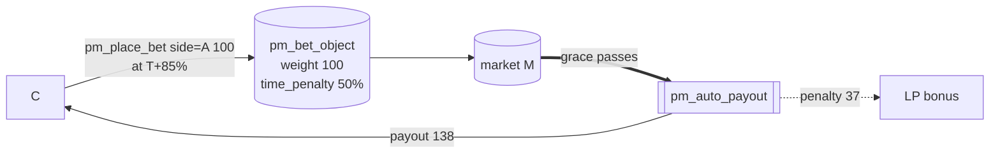

| outcome | sends | receives | net |
|---------|-------|----------|-----|
| normal (A) | 100 | **138** | **+38** |
| disputed (→B) | 100 | **0** | **−100** |

`profit = 75`; `penalty = 75 × 50% = 37` (→ LPs); `payout = 100 + 75 − 37 = 138` — **−37** vs A's +75 for
the same weight. The node stamps `time_penalty` at placement from the market's penalty curve
(`time_penalty_type/value`, `penalty_curve_type`). It discourages last-second sniping and subsidises
liquidity, not the protocol. **Verify:** `pm_place_bet_evaluator` (curve eval), `compute_settlement`.
**Observe:** `get_account_positions` (`time_penalty`), `get_market_bets`.

### Bettor D — leverage ×10 winner

**D** opens a **×10** position: **10 collateral + 90 loan** from the [lazy pool](#the-lazy-liquidity-pool-system-object)
= **100** on side A, in isolated leverage market **L** (`pm_leverage_enabled=true`, `R = 10%`). When A
wins, D keeps the upside on the full 100 after repaying loan + interest.
`pool_profit = loan 90 × R 10% = 9`; `obligation = 90 × 1.10 = 99`.

```mermaid
flowchart LR
  D -->|pm_leverage_open<br/>collateral 10 + loan 90| POS[(pm_leverage_position<br/>total_bet 100, obligation 99)]
  POOL[(lazy pool)] -.loan 90.-> POS
  POS --> L[(market L, side A)]
  L ==>|settle: force_close at cancel_value| VR[[pm_leverage_resolve won=true, leverage=10]]
  VR -->|min(cv,obligation) 99| POOL
  VR -->|cv 200 − 99 = 101| D
```

| outcome | sends | receives | net |
|---------|-------|----------|-----|
| normal (A) | collateral **10** | cancel_value 200 − obligation 99 = **101** | **+91** |
| disputed (→B) | collateral 10 | 0 | **−10** |

A profitable position closes at its `cancel_value`; the pool reclaims `obligation 99` (loan 90 + **9
interest**), D keeps the rest on just 10 of its own → **+91** (pool **+9**). Leverage settles by
liquidation, **never** via `pm_auto_payout`. Zero-sum (L): in `10 + 90 + 100 = 200`; out `101 + 99 =
200`. **Sends:** `pm_leverage_open`; optional `pm_leverage_close` (only if `cv ≥ obligation`) /
`pm_leverage_convert`. **Touched by:** `pm_leverage_resolve` (settlement force-close,
`reason=expiration`). **Verify:** `force_close_positions` → `liquidate_position(reason=2)`. **Observe:**
**`get_account_leverage_positions`** / **`get_market_leverage_positions`**, `get_lazy_pool`.

### Bettor E — leverage ×5 liquidated

**E** opens a **×5** position: **20 collateral + 80 loan** = **100** on side B (market **L**, `R = 10%`).
Before resolution an **opposing bet** moves the curve against B; the **cascade liquidation** force-closes
it. **E loses its collateral, but the pool is always made whole.** `obligation = 80 × 1.10 = 88`.

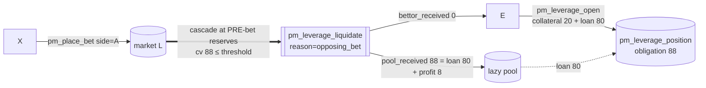

E is liquidated **before** resolution, so the final A/B result (disputed or not) doesn't change it:

| actor | sends | receives | net |
|-------|-------|----------|-----|
| **E** | collateral **20** | **0** | **−20** |
| **pool** | loan 80 | **88** (loan 80 + R% 8) | **+8** |

Opposing-bet liquidations run at **pre-bet** reserves where `cancel_value ≥ loan`, so `pool_received =
min(cv, obligation)` returns at least the loan — the pool **never** loses.

> **The only path that can go negative** is a same-side **`pm_cancel_bet` (Case B)**: a cancel reverses a
> *prior, large* same-side bet (beyond the per-bet slippage cap) and, for fairness to the cancel-bettor,
> executes **first** at their submitted price — so the cascade can land `cancel_value < loan`:
> `shortfall = obligation − cancel_value`, `lazy_pool.free_balance −= shortfall`. This **bad debt** is
> **bounded** (`≤ cancel_value_before × SL%`) and **rare** (the pool's R% on every other position offsets
> it). Covered by `leverage_cancel_bet_cascade_bad_debt`.

Pool protection is structural (`max_per_position`, `max_position_ratio`, `safety_margin`, the slippage
cap, the `expiration_buffer`). `pm_leverage_enabled=false` blocks **new** opens only — the liquidation
cascade is **not** gated by the flag, so governance can never strip the pool's protection mid-flight
(`leverage_disabled_keeps_liquidation_protection`). **Verify:** `pm_place_bet` →
`cascade_liquidate(reason=0)`; `pm_cancel_bet` → `cascade_liquidate(reason=1)`; `liquidate_position`.
**Observe:** **`get_account_leverage_positions`** (`status=1`, `pool_received`, `bettor_received`),
`get_lazy_pool`.

### Liquidity provider in the market (LP1)

**LP1** adds **1000** liquidity to active M (after the maker's seed). Principal is **always** returned;
on top it earns a **time-weighted** slice of the LP bonus (liquidity fee + time penalties + dust).
Distinct from a [lazy-pool provider](#liquidity-provider-in-the-lazy-pool-lz1), who deposits once and is
auto-allocated across many markets.

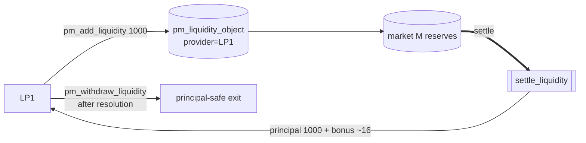

| outcome | sends | receives | net |
|---------|-------|----------|-----|
| normal (A) | 1000 | **1000 principal + ~16 bonus** | **+16** |
| disputed (→B) | 1000 | 1000 principal + ~4 bonus | **+4** |

LP bonus pool = `liq_fee 10 + time-penalties 37 = 47`, split by `principal × seconds-in-market` (earlier
maker ~31, later LP1 ~16). The **principal guarantee** is architectural — the seed is returned before any
winner is paid; an LP can only forgo bonus, never lose principal. Withdrawing is locked from
`betting_expiration` until resolution. **Verify:** `pm_add_liquidity_evaluator` (records `deposit_time`),
`settle_liquidity` → `distribute_lp`. **Observe:** `get_market_liquidity` (`earned_fee`),
`get_market_weight_sums`.

### The Lazy Liquidity Pool (system object)

A **singleton** `pm_lazy_pool_object` — not an account. Depositors fund it once; the pool
**auto-allocates** a slice to each accepted market as a silent LP (`pm_liquidity_object` with empty
`provider`), **funds leverage loans**, and **recalls** idle allocations. It earns LP yield + leverage
interest, accounted MasterChef-style (one global `reward_per_share`, O(1) — see the whitepaper).
Fields: `total_shares`, `free_balance`, `allocated_balance`, `earned_balance`, `reward_per_share`,
`leverage_fund_used`.

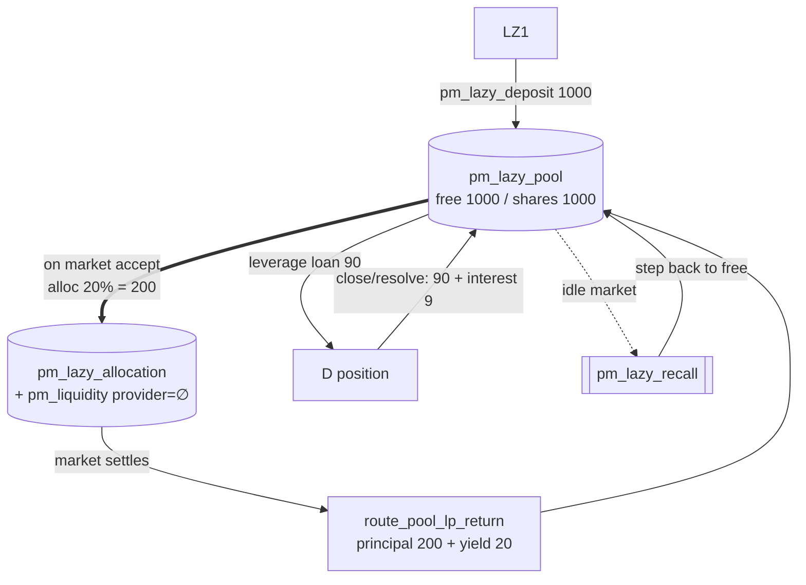

| pool money flow | effect |
|-----------------|--------|
| `pm_lazy_deposit` | `free_balance += amount`, mint shares |
| auto allocation (on accept) | `free → allocated` (silent LP) |
| market settles | `route_pool_lp_return`: principal + yield → `free`; yield → `earned` & `reward_per_share` |
| leverage open (D/E) | `free −= loan`, `leverage_fund_used += loan` |
| leverage close / resolve / opposing-bet liquidation | `min(cv, obligation) → free`; `cv ≥ loan` ⇒ **never a loss** |
| cancel-bet liquidation (Case B only) | recovers `cv` which **may be < loan** → bounded **bad debt** |
| `pm_lazy_recall` (idle market) | one 10% step of an idle allocation → `free` |
| `pm_lazy_withdraw` | burn shares → principal + pending; emergency penalty stays in pool |

Over the canonical scenario the pool nets **+37 earned** (market M yield +20, leverage D interest +9,
leverage E opposing-bet recovery +8). As a market LP its principal is returned unconditionally; only the
*bonus* yield varies with a dispute.

> The pool serves **both** roles from a single `free_balance`: market-LP allocations
> (`maybe_allocate_lazy`) and leverage loans (`leverage_fund_used` caps the latter). All leverage knobs
> are checked **at `pm_leverage_open` time** against the current median, so later property swings only
> affect *new* opens, never loans already out.

VIZ in the pool is **liquid**, not vested → **no** validator-scheduling or committee-request weight.
**Exception (HF14):** for **PM committee disputes** a depositor's pool stake **is** counted — converted
to vesting-shares via `get_vesting_share_price()` and added to their `pm_dispute_vote` weight (see
[committee resolver](#resolver--committee-stake-weighted-dispute_mode--0)). **Verify:**
`apply_hardfork(CHAIN_HARDFORK_14)` (singleton), `maybe_allocate_lazy`, `route_pool_lp_return`.
**Observe:** `get_lazy_pool`.

### Liquidity provider in the lazy pool (LZ1)

**LZ1** deposits **1000** into the pool **once** and lets it spread across markets + leverage loans. It
earns a share of the pool's aggregate yield (`reward_per_share`), not any single market's outcome. Two
exits: **planned** (after the lock) and **emergency** (before the lock, with a penalty on *profit*).

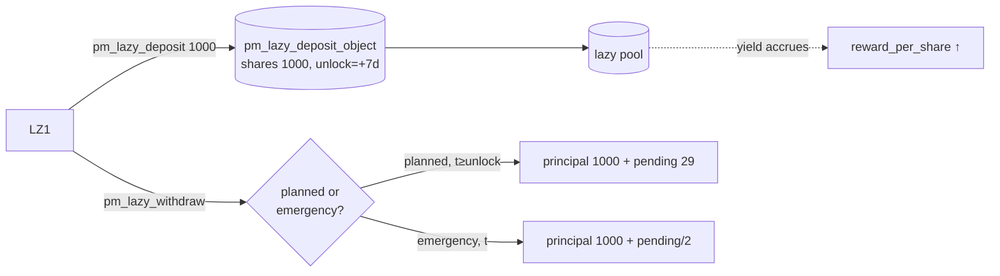

| exit | sends | receives | net |
|------|-------|----------|-----|
| planned (after unlock) | 1000 deposit | **1000 principal + ~29 pending** | **+29** |
| emergency (before unlock) | 1000 deposit | 1000 principal + (29 − **penalty 14**) | **+15** |

`pending = shares × reward_per_share / 1e9`; `penalty = pending × pm_lazy_emergency_penalty_percent 50%`,
which **stays in the pool** (added to `reward_per_share` for the rest). Principal is never penalised.
There is **no per-market action** — allocation/recall/leverage are automatic. Pool stake also counts in
**PM committee disputes** (vesting-share conversion). **Verify:** `pm_lazy_deposit_evaluator`,
`pm_lazy_withdraw_evaluator` (emergency branch). **Observe:** `get_lazy_deposit` (`shares`, `principal`,
`pending_rewards`, `unlock_time`), `get_lazy_pool`.

### Disputer — vindicated (oracle overturned)

**disp** thinks the oracle's **A** is wrong, files a dispute proposing **B**, escrows `pm_dispute_fee
1000`, and the verdict **overturns to B**. disp gets its fee back **plus** a reward carved from the
oracle's slashed insurance.

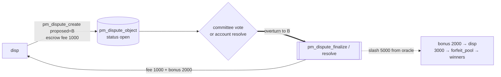

| outcome | sends | receives | net |
|---------|-------|----------|-----|
| disputed, overturned (the "win") | dispute_fee **1000** | fee 1000 back + **bonus 2000** | **+2000** |

`reward_target = fee × pm_dispute_reward_multiplier (3×) = 3000` → `bonus = 3000 − 1000 = 2000`, **capped
at the actual slash**; the remainder (3000) → `forfeit_pool` → the new winners. disp risked 1000, walks
away **+2000**. (Committee mode: disp does **not** vote on its own — the SHARES electorate does.)
**Verify:** `pm_dispute_create_evaluator`, overturn branch of `pm_dispute_finalize`/`pm_dispute_resolve`.
**Observe:** `get_dispute`, `get_dispute_votes`.

### Disputer — fee forfeited (oracle upheld)

**disp** disputes the oracle's **A** but the verdict **upholds the oracle**. The escrowed fee is
**forfeited to the oracle** as compensation, and the market settles as originally resolved (A wins).

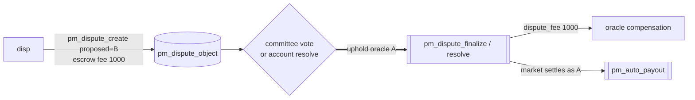

| outcome | sends | receives | net |
|---------|-------|----------|-----|
| disputed, upheld (the "loss") | dispute_fee **1000** | **0** | **−1000** |

The fee is the disputer's skin-in-the-game: a wrong/frivolous dispute pays the oracle. This asymmetry
(lose the fee if wrong, win a multiple if right) keeps the channel honest. A dispute that is never
**decided** (oracle silent / no quorum) is force-closed and the fee **returned** (net 0) — see
[dispute auto-close](#dispute-forced-to-end-anti-freeze-auto-close), which is different from losing on
the merits. **Verify:** uphold branch of `pm_dispute_finalize`/`pm_dispute_resolve`. **Observe:**
`get_dispute`, `get_oracle` (gains the fee, `disputes_won++`).

### Resolver — committee (stake-weighted, dispute_mode = 0)

The *whole SHARES electorate* decides by **stake-weighted vote**; no single resolver account. The verdict
is tallied deterministically by `pm_dispute_finalize` at `voting_end_time`.

**Voting weight** = live **`effective_vesting_shares`** (`vesting − delegated + received`) **plus
lazy-pool stake converted to vesting-shares**, since many DAO members park VIZ in the pool (where it is
liquid):

```
pool_claim_viz = pool_NAV × deposit.shares / pool.total_shares
pool_weight    = pool_claim_viz × get_vesting_share_price()
voter_weight   = effective_vesting_shares + pool_weight
```

The participation quorum denominator is likewise `total_vesting_shares + (pool_NAV → vesting-shares)`. The
7-day deposit lock prevents deposit-vote-withdraw gaming.

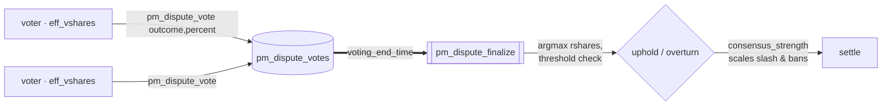

- **Sends (voters):** `pm_dispute_vote` — **auth `regular`**. `vote_outcome = -1` upholds, else proposes
  the correct outcome; `vote_percent ∈ [-10000, 10000]`. A voter may **revise** their ballot any number
  of times while voting is open — a repeat vote **overwrites** the prior (latest wins, no "Already voted").
- **No commit-reveal — deliberate, will NOT change.** A committee dispute is an **open public hearing**:
  the running tally is visible (`get_dispute_votes`) and votes are not hidden. The DAO's value
  proposition is resolving disputes as truthfully and transparently as possible; new evidence surfaces
  during voting and voters are *expected* to update; and voters are **not paid** for matching the
  majority, so the usual anti-herding (beauty-contest) rationale for commit-reveal does not apply.

| actor | sends | receives |
|-------|-------|----------|
| each voter | 0 | **0** — voting is a governance duty, not a paid action |

Voters never receive tokens; influence is pure stake weight. Economic flows land on the disputer, oracle,
and bettors per the [disputed master ledger](#master-ledger--disputed-resolve-oracle-said-a--overturned-to-b).
Niche markets may fail the threshold → fall through to
[dispute auto-close](#dispute-forced-to-end-anti-freeze-auto-close). **Verify:** `pm_dispute_vote_evaluator`
(modify-or-create on `by_market_voter`); `pm_dispute_finalize` (`lazy_vote_weight`, `get_vesting_share_price`,
quorum, argmax, `consensus_strength`). **Observe:** `get_dispute_votes` (live tally + finalize projection:
`quorum_percent_bp`, `expected_uphold`, `expected_outcome`, `expected_consensus_strength_bp`). Tests:
`committee_dispute_lazy_pool_voting_weight`, `committee_dispute_flips_outcome`.

### Resolver — single account (centralized, dispute_mode = 1)

The market names one `dispute_resolver` account (e.g. a regulator multisig) that decides alone — **no
stake weight, no DAO vote**. Set at creation, it must differ from both `oracle` and `creator` (anti
self-judging). Same op set as committee mode; only *who decides* differs.

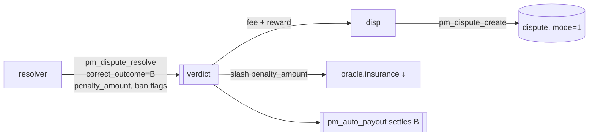

- **Sends:** `pm_dispute_resolve` — **auth `active` of the named `dispute_resolver`** only:
  `correct_outcome`, `penalty_amount` (insurance to slash — a fixed amount, **not** stake-scaled),
  `ban_oracle`/`ban_creator` (+ `…_until`).

| actor | sends | receives |
|-------|-------|----------|
| resolver | 0 | **0** — a neutral arbiter |

The post-verdict canon is identical to committee mode; only the slash size differs (resolver-set
`penalty_amount`, no `consensus_strength` scaling, since there is a single decider). KYC/whitelisting of
the resolver is a **client-layer** concern. **Verify:** `pm_dispute_resolve_evaluator` (only the named
resolver, `dispute_mode==1`). **Observe:** `get_dispute`, `get_oracle`, **`get_creator_ban(account)`**.

### Dispute forced to end (anti-freeze auto-close)

A dispute that is **never decided** — oracle silent and (committee) no quorum — cannot freeze the market
forever. At `auto_close_time` the `pm_dispute_auto_close` processor force-ends it: **everyone is
refunded**, the disputer's fee is **returned**, and the unresponsive oracle is penalised. No winner is
picked.

```mermaid
flowchart LR
  disp -->|pm_dispute_create<br/>escrow fee 1000| D[(dispute, status open)]
  D -. oracle silent / no quorum .-> WAIT[auto_close_time reached]
  WAIT ==>|VIRTUAL| AC[[pm_dispute_auto_close]]
  AC -->|refund all bets| bettors
  AC -->|fee 1000 back| disp
  AC -->|insurance slash → DAO| orac
```

| actor | sends | receives | net |
|-------|-------|----------|-----|
| A / B / C | bet | full refund | **0** |
| maker / LP1 | liquidity | principal back | **0** (no bonus) |
| disp | dispute_fee 1000 | **1000 back** | **0** |
| orac | insurance −slash → DAO | — | **− slash** |

This is **not** "the disputer lost": a returned fee (net 0) differs from a forfeited fee
([disputer-loser](#disputer--fee-forfeited-oracle-upheld), net −1000). Nobody profits; the market is
voided to break the freeze, the cost falls on the oracle that didn't respond. The same void-and-refund
shape covers `pm_oracle_missed_penalty` and `pm_no_contest`. Tune `pm_dispute_auto_close_sec` (14 d) vs
`pm_dispute_vote_period_sec` (3 d) so honest disputes resolve first. **Verify:** `process_pm_markets`
auto-close scan (`refund_all_bets` + `return_liquidity` + fee credit; `disputes_auto_closed++`).
**Observe:** `get_dispute` (status → auto-closed), `get_market`, `get_oracle`.
